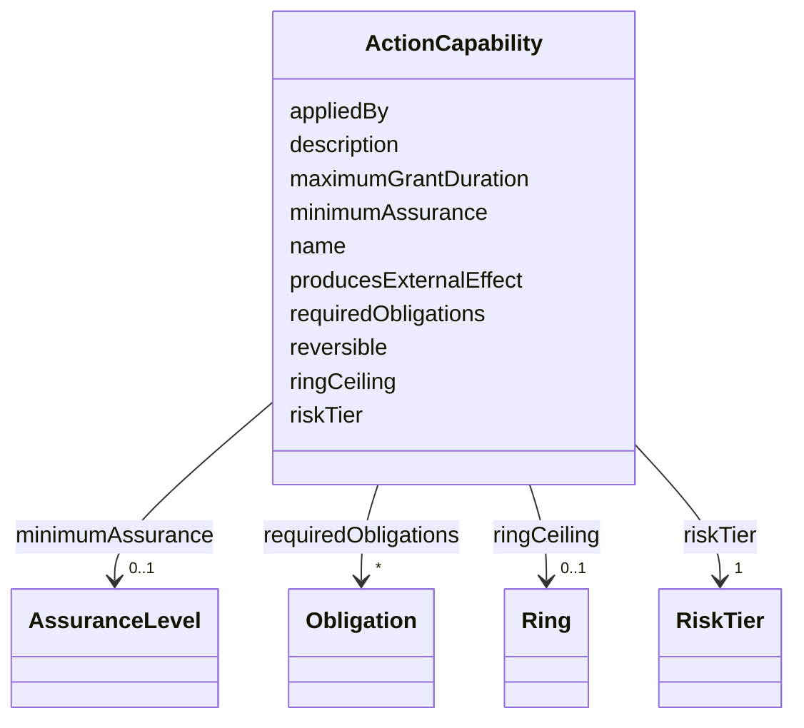

---
search:
  boost: 10.0
---

# Class: ActionCapability

<div data-search-exclude markdown="1">


URI: [jumo:ActionCapability](https://jumo.dev/schemas/jumo-v1/ActionCapability)





<!-- no inheritance hierarchy -->

## Slots

| Name | Cardinality and Range | Description | Inheritance |
| ---  | --- | --- | --- |
| [name](name.md) | 1 <br/> [CapabilityName](CapabilityName.md) |  | direct |
| [description](description.md) | 1 <br/> [String](String.md) |  | direct |
| [riskTier](riskTier.md) | 1 <br/> [RiskTier](RiskTier.md) |  | direct |
| [reversible](reversible.md) | 1 <br/> [Boolean](Boolean.md) | Whether the effect can be inspected, corrected and undone | direct |
| [producesExternalEffect](producesExternalEffect.md) | 0..1 <br/> [Boolean](Boolean.md) |  | direct |
| [maximumGrantDuration](maximumGrantDuration.md) | 0..1 <br/> [Duration](Duration.md) |  | direct |
| [requiredObligations](requiredObligations.md) | * <br/> [Obligation](Obligation.md) |  | direct |
| [minimumAssurance](minimumAssurance.md) | 0..1 <br/> [AssuranceLevel](AssuranceLevel.md) |  | direct |
| [ringCeiling](ringCeiling.md) | 0..1 <br/> [Ring](Ring.md) | Highest-blast-radius ring this capability may ever act on | direct |
| [appliedBy](appliedBy.md) | 0..1 <br/> [String](String.md) | The trusted component that applies the effect | direct |


## Usages

| used by | used in | type | used |
| ---  | --- | --- | --- |
| [ActionCapabilitySetSpec](ActionCapabilitySetSpec.md) | [capabilities](capabilities.md) | range | [ActionCapability](ActionCapability.md) |


## Identifier and Mapping Information


### Annotations

| property | value |
| --- | --- |
| jumo.state_authority | GIT |
| jumo.model_role | VALUE_OBJECT |
| jumo.audience | REALM_PRIVATE |
| jumo.sensitivity | INTERNAL |
| jumo.boundary_eligible | True |
| jumo.schema_profiles | draft-2020-12,native-json-schema,prompted-json-validated |


### Schema Source


* from schema: https://jumo.dev/schemas/jumo-v1


## Mappings

| Mapping Type | Mapped Value |
| ---  | ---  |
| self | jumo:ActionCapability |
| native | jumo:ActionCapability |


## LinkML Source

<!-- TODO: investigate https://stackoverflow.com/questions/37606292/how-to-create-tabbed-code-blocks-in-mkdocs-or-sphinx -->

### Direct

<details>
```yaml
name: ActionCapability
annotations:
  jumo.state_authority:
    tag: jumo.state_authority
    value: GIT
  jumo.model_role:
    tag: jumo.model_role
    value: VALUE_OBJECT
  jumo.audience:
    tag: jumo.audience
    value: REALM_PRIVATE
  jumo.sensitivity:
    tag: jumo.sensitivity
    value: INTERNAL
  jumo.boundary_eligible:
    tag: jumo.boundary_eligible
    value: true
  jumo.schema_profiles:
    tag: jumo.schema_profiles
    value: draft-2020-12,native-json-schema,prompted-json-validated
from_schema: https://jumo.dev/schemas/jumo-v1
attributes:
  name:
    name: name
    from_schema: https://jumo.dev/schemas/jumo-v1
    owner: ActionCapability
    domain_of:
    - Metadata
    - MethodologySource
    - SelfDescriptionFact
    - AgentCardSkill
    - PromptVariable
    - AssistedJourneySpec
    - AssistedJourneyStep
    - ActionCapability
    - McpToolDescriptor
    range: CapabilityName
    required: true
  description:
    name: description
    from_schema: https://jumo.dev/schemas/jumo-v1
    owner: ActionCapability
    domain_of:
    - PromptVariable
    - AssistedJourneySpec
    - AssistedJourneyStep
    - ActionCapability
    - MachineAdminPlaybookSpec
    - ConnectorOperation
    - McpBundleOperation
    - McpToolDescriptor
    - ConnectorIntegrationSpec
    - ApiResponseBinding
    range: string
    required: true
    pattern: ^.{10,}$
  riskTier:
    name: riskTier
    from_schema: https://jumo.dev/schemas/jumo-v1
    owner: ActionCapability
    domain_of:
    - CoordinationMechanismBinding
    - ActionCapability
    range: RiskTier
    required: true
  reversible:
    name: reversible
    description: Whether the effect can be inspected, corrected and undone. Kept alongside
      the newer EffectRecoveryKind (core.yaml) rather than replaced -- this boolean
      is the coarse policy-facing gate (irreversible needs stronger obligations);
      EffectRecoveryKind is the finer-grained recovery mechanism used where a specific
      capability's recovery path is modeled.
    from_schema: https://jumo.dev/schemas/jumo-v1
    rank: 1000
    owner: ActionCapability
    domain_of:
    - ActionCapability
    range: boolean
    required: true
  producesExternalEffect:
    name: producesExternalEffect
    from_schema: https://jumo.dev/schemas/jumo-v1
    rank: 1000
    ifabsent: 'false'
    owner: ActionCapability
    domain_of:
    - ActionCapability
    range: boolean
  maximumGrantDuration:
    name: maximumGrantDuration
    from_schema: https://jumo.dev/schemas/jumo-v1
    rank: 1000
    owner: ActionCapability
    domain_of:
    - ActionCapability
    range: Duration
  requiredObligations:
    name: requiredObligations
    from_schema: https://jumo.dev/schemas/jumo-v1
    rank: 1000
    owner: ActionCapability
    domain_of:
    - ActionCapability
    - ImprovementTarget
    - SurfaceWritePath
    range: Obligation
    multivalued: true
  minimumAssurance:
    name: minimumAssurance
    from_schema: https://jumo.dev/schemas/jumo-v1
    owner: ActionCapability
    domain_of:
    - WorkerQualityRequirement
    - PromptTemplateSpec
    - ResourceBudgetSpec
    - ActionCapability
    range: AssuranceLevel
  ringCeiling:
    name: ringCeiling
    description: Highest-blast-radius ring this capability may ever act on. Absent
      means the capability is bounded by policy and obligations alone.
    from_schema: https://jumo.dev/schemas/jumo-v1
    rank: 1000
    owner: ActionCapability
    domain_of:
    - ActionCapability
    range: Ring
  appliedBy:
    name: appliedBy
    description: The trusted component that applies the effect. Must not be the component
      that proposes it -- the prompt-injection boundary.
    from_schema: https://jumo.dev/schemas/jumo-v1
    rank: 1000
    owner: ActionCapability
    domain_of:
    - ActionCapability
    range: string

```
</details>

### Induced

<details>
```yaml
name: ActionCapability
annotations:
  jumo.state_authority:
    tag: jumo.state_authority
    value: GIT
  jumo.model_role:
    tag: jumo.model_role
    value: VALUE_OBJECT
  jumo.audience:
    tag: jumo.audience
    value: REALM_PRIVATE
  jumo.sensitivity:
    tag: jumo.sensitivity
    value: INTERNAL
  jumo.boundary_eligible:
    tag: jumo.boundary_eligible
    value: true
  jumo.schema_profiles:
    tag: jumo.schema_profiles
    value: draft-2020-12,native-json-schema,prompted-json-validated
from_schema: https://jumo.dev/schemas/jumo-v1
attributes:
  name:
    name: name
    from_schema: https://jumo.dev/schemas/jumo-v1
    owner: ActionCapability
    domain_of:
    - Metadata
    - MethodologySource
    - SelfDescriptionFact
    - AgentCardSkill
    - PromptVariable
    - AssistedJourneySpec
    - AssistedJourneyStep
    - ActionCapability
    - McpToolDescriptor
    range: CapabilityName
    required: true
  description:
    name: description
    from_schema: https://jumo.dev/schemas/jumo-v1
    owner: ActionCapability
    domain_of:
    - PromptVariable
    - AssistedJourneySpec
    - AssistedJourneyStep
    - ActionCapability
    - MachineAdminPlaybookSpec
    - ConnectorOperation
    - McpBundleOperation
    - McpToolDescriptor
    - ConnectorIntegrationSpec
    - ApiResponseBinding
    range: string
    required: true
    pattern: ^.{10,}$
  riskTier:
    name: riskTier
    from_schema: https://jumo.dev/schemas/jumo-v1
    owner: ActionCapability
    domain_of:
    - CoordinationMechanismBinding
    - ActionCapability
    range: RiskTier
    required: true
  reversible:
    name: reversible
    description: Whether the effect can be inspected, corrected and undone. Kept alongside
      the newer EffectRecoveryKind (core.yaml) rather than replaced -- this boolean
      is the coarse policy-facing gate (irreversible needs stronger obligations);
      EffectRecoveryKind is the finer-grained recovery mechanism used where a specific
      capability's recovery path is modeled.
    from_schema: https://jumo.dev/schemas/jumo-v1
    rank: 1000
    owner: ActionCapability
    domain_of:
    - ActionCapability
    range: boolean
    required: true
  producesExternalEffect:
    name: producesExternalEffect
    from_schema: https://jumo.dev/schemas/jumo-v1
    rank: 1000
    ifabsent: 'false'
    owner: ActionCapability
    domain_of:
    - ActionCapability
    range: boolean
  maximumGrantDuration:
    name: maximumGrantDuration
    from_schema: https://jumo.dev/schemas/jumo-v1
    rank: 1000
    owner: ActionCapability
    domain_of:
    - ActionCapability
    range: Duration
  requiredObligations:
    name: requiredObligations
    from_schema: https://jumo.dev/schemas/jumo-v1
    rank: 1000
    owner: ActionCapability
    domain_of:
    - ActionCapability
    - ImprovementTarget
    - SurfaceWritePath
    range: Obligation
    multivalued: true
  minimumAssurance:
    name: minimumAssurance
    from_schema: https://jumo.dev/schemas/jumo-v1
    owner: ActionCapability
    domain_of:
    - WorkerQualityRequirement
    - PromptTemplateSpec
    - ResourceBudgetSpec
    - ActionCapability
    range: AssuranceLevel
  ringCeiling:
    name: ringCeiling
    description: Highest-blast-radius ring this capability may ever act on. Absent
      means the capability is bounded by policy and obligations alone.
    from_schema: https://jumo.dev/schemas/jumo-v1
    rank: 1000
    owner: ActionCapability
    domain_of:
    - ActionCapability
    range: Ring
  appliedBy:
    name: appliedBy
    description: The trusted component that applies the effect. Must not be the component
      that proposes it -- the prompt-injection boundary.
    from_schema: https://jumo.dev/schemas/jumo-v1
    rank: 1000
    owner: ActionCapability
    domain_of:
    - ActionCapability
    range: string

```
</details></div>