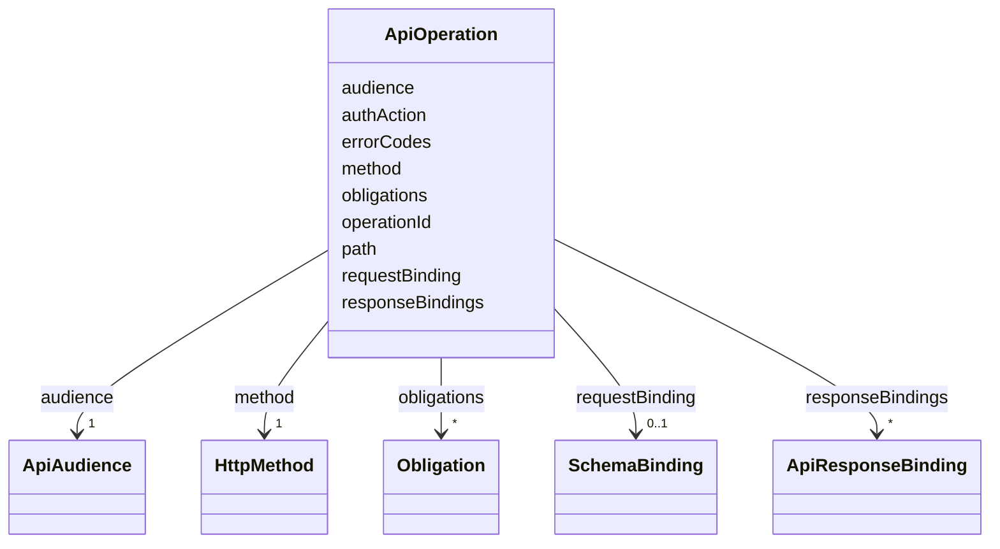

---
search:
  boost: 10.0
---

# Class: ApiOperation


_Typed operation declaration in an API surface contract._


<div data-search-exclude markdown="1">


URI: [jumo:ApiOperation](https://jumo.dev/schemas/jumo-v1/ApiOperation)





<!-- no inheritance hierarchy -->

## Slots

| Name | Cardinality and Range | Description | Inheritance |
| ---  | --- | --- | --- |
| [operationId](operationId.md) | 1 <br/> [String](String.md) |  | direct |
| [method](method.md) | 1 <br/> [HttpMethod](HttpMethod.md) |  | direct |
| [path](path.md) | 1 <br/> [String](String.md) |  | direct |
| [audience](audience.md) | 1 <br/> [ApiAudience](ApiAudience.md) |  | direct |
| [authAction](authAction.md) | 0..1 <br/> [String](String.md) |  | direct |
| [requestBinding](requestBinding.md) | 0..1 <br/> [SchemaBinding](SchemaBinding.md) |  | direct |
| [responseBindings](responseBindings.md) | * <br/> [ApiResponseBinding](ApiResponseBinding.md) |  | direct |
| [obligations](obligations.md) | * <br/> [Obligation](Obligation.md) |  | direct |
| [errorCodes](errorCodes.md) | * <br/> [String](String.md) |  | direct |


## Usages

| used by | used in | type | used |
| ---  | --- | --- | --- |
| [ApiSurfaceSpec](ApiSurfaceSpec.md) | [operations](operations.md) | range | [ApiOperation](ApiOperation.md) |


## Identifier and Mapping Information


### Annotations

| property | value |
| --- | --- |
| jumo.state_authority | GIT |
| jumo.model_role | VALUE_OBJECT |
| jumo.audience | PUBLIC_WEB |
| jumo.sensitivity | INTERNAL |
| jumo.boundary_eligible | True |
| jumo.schema_profiles | draft-2020-12,native-json-schema,prompted-json-validated |


### Schema Source


* from schema: https://jumo.dev/schemas/jumo-v1


## Mappings

| Mapping Type | Mapped Value |
| ---  | ---  |
| self | jumo:ApiOperation |
| native | jumo:ApiOperation |


## LinkML Source

<!-- TODO: investigate https://stackoverflow.com/questions/37606292/how-to-create-tabbed-code-blocks-in-mkdocs-or-sphinx -->

### Direct

<details>
```yaml
name: ApiOperation
annotations:
  jumo.state_authority:
    tag: jumo.state_authority
    value: GIT
  jumo.model_role:
    tag: jumo.model_role
    value: VALUE_OBJECT
  jumo.audience:
    tag: jumo.audience
    value: PUBLIC_WEB
  jumo.sensitivity:
    tag: jumo.sensitivity
    value: INTERNAL
  jumo.boundary_eligible:
    tag: jumo.boundary_eligible
    value: true
  jumo.schema_profiles:
    tag: jumo.schema_profiles
    value: draft-2020-12,native-json-schema,prompted-json-validated
description: Typed operation declaration in an API surface contract.
from_schema: https://jumo.dev/schemas/jumo-v1
attributes:
  operationId:
    name: operationId
    from_schema: https://jumo.dev/schemas/jumo-v1
    owner: ApiOperation
    domain_of:
    - ConnectorTestCase
    - ApiOperation
    range: string
    required: true
  method:
    name: method
    from_schema: https://jumo.dev/schemas/jumo-v1
    owner: ApiOperation
    domain_of:
    - EvidenceProfileSpec
    - ApiOperation
    range: HttpMethod
    required: true
  path:
    name: path
    from_schema: https://jumo.dev/schemas/jumo-v1
    owner: ApiOperation
    domain_of:
    - DocumentationRoot
    - PromptBody
    - ApiOperation
    - ChangeSetFile
    - ProjectionOptionCondition
    - NestedOptionsSource
    - ProjectionField
    range: string
    required: true
  audience:
    name: audience
    from_schema: https://jumo.dev/schemas/jumo-v1
    owner: ApiOperation
    domain_of:
    - DocumentFrontMatter
    - OfferingSpecBody
    - SelfDescriptionAnswer
    - Surface
    - ApiOperation
    - ApiSurfaceSpec
    range: ApiAudience
    required: true
  authAction:
    name: authAction
    from_schema: https://jumo.dev/schemas/jumo-v1
    rank: 1000
    owner: ApiOperation
    domain_of:
    - ApiOperation
    range: string
  requestBinding:
    name: requestBinding
    from_schema: https://jumo.dev/schemas/jumo-v1
    rank: 1000
    owner: ApiOperation
    domain_of:
    - ApiOperation
    range: SchemaBinding
    inlined: true
  responseBindings:
    name: responseBindings
    from_schema: https://jumo.dev/schemas/jumo-v1
    rank: 1000
    owner: ApiOperation
    domain_of:
    - ApiOperation
    range: ApiResponseBinding
    multivalued: true
    inlined: true
  obligations:
    name: obligations
    from_schema: https://jumo.dev/schemas/jumo-v1
    owner: ApiOperation
    domain_of:
    - PolicyRule
    - ApiOperation
    - PolicyInput
    range: Obligation
    multivalued: true
  errorCodes:
    name: errorCodes
    from_schema: https://jumo.dev/schemas/jumo-v1
    rank: 1000
    owner: ApiOperation
    domain_of:
    - ApiOperation
    range: string
    multivalued: true

```
</details>

### Induced

<details>
```yaml
name: ApiOperation
annotations:
  jumo.state_authority:
    tag: jumo.state_authority
    value: GIT
  jumo.model_role:
    tag: jumo.model_role
    value: VALUE_OBJECT
  jumo.audience:
    tag: jumo.audience
    value: PUBLIC_WEB
  jumo.sensitivity:
    tag: jumo.sensitivity
    value: INTERNAL
  jumo.boundary_eligible:
    tag: jumo.boundary_eligible
    value: true
  jumo.schema_profiles:
    tag: jumo.schema_profiles
    value: draft-2020-12,native-json-schema,prompted-json-validated
description: Typed operation declaration in an API surface contract.
from_schema: https://jumo.dev/schemas/jumo-v1
attributes:
  operationId:
    name: operationId
    from_schema: https://jumo.dev/schemas/jumo-v1
    owner: ApiOperation
    domain_of:
    - ConnectorTestCase
    - ApiOperation
    range: string
    required: true
  method:
    name: method
    from_schema: https://jumo.dev/schemas/jumo-v1
    owner: ApiOperation
    domain_of:
    - EvidenceProfileSpec
    - ApiOperation
    range: HttpMethod
    required: true
  path:
    name: path
    from_schema: https://jumo.dev/schemas/jumo-v1
    owner: ApiOperation
    domain_of:
    - DocumentationRoot
    - PromptBody
    - ApiOperation
    - ChangeSetFile
    - ProjectionOptionCondition
    - NestedOptionsSource
    - ProjectionField
    range: string
    required: true
  audience:
    name: audience
    from_schema: https://jumo.dev/schemas/jumo-v1
    owner: ApiOperation
    domain_of:
    - DocumentFrontMatter
    - OfferingSpecBody
    - SelfDescriptionAnswer
    - Surface
    - ApiOperation
    - ApiSurfaceSpec
    range: ApiAudience
    required: true
  authAction:
    name: authAction
    from_schema: https://jumo.dev/schemas/jumo-v1
    rank: 1000
    owner: ApiOperation
    domain_of:
    - ApiOperation
    range: string
  requestBinding:
    name: requestBinding
    from_schema: https://jumo.dev/schemas/jumo-v1
    rank: 1000
    owner: ApiOperation
    domain_of:
    - ApiOperation
    range: SchemaBinding
    inlined: true
  responseBindings:
    name: responseBindings
    from_schema: https://jumo.dev/schemas/jumo-v1
    rank: 1000
    owner: ApiOperation
    domain_of:
    - ApiOperation
    range: ApiResponseBinding
    multivalued: true
    inlined: true
  obligations:
    name: obligations
    from_schema: https://jumo.dev/schemas/jumo-v1
    owner: ApiOperation
    domain_of:
    - PolicyRule
    - ApiOperation
    - PolicyInput
    range: Obligation
    multivalued: true
  errorCodes:
    name: errorCodes
    from_schema: https://jumo.dev/schemas/jumo-v1
    rank: 1000
    owner: ApiOperation
    domain_of:
    - ApiOperation
    range: string
    multivalued: true

```
</details></div>