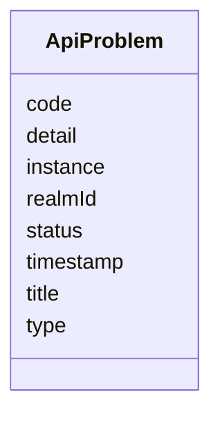

---
search:
  boost: 10.0
---

# Class: ApiProblem


_RFC 9457 compliant problem details model for API errors without unconstrained maps._


<div data-search-exclude markdown="1">


URI: [jumo:ApiProblem](https://jumo.dev/schemas/jumo-v1/ApiProblem)





<!-- no inheritance hierarchy -->

## Slots

| Name | Cardinality and Range | Description | Inheritance |
| ---  | --- | --- | --- |
| [type](type.md) | 1 <br/> [String](String.md) |  | direct |
| [title](title.md) | 1 <br/> [String](String.md) |  | direct |
| [status](status.md) | 1 <br/> [Integer](Integer.md) |  | direct |
| [detail](detail.md) | 1 <br/> [String](String.md) |  | direct |
| [instance](instance.md) | 0..1 <br/> [String](String.md) |  | direct |
| [code](code.md) | 0..1 <br/> [String](String.md) |  | direct |
| [realmId](realmId.md) | 0..1 <br/> [String](String.md) |  | direct |
| [timestamp](timestamp.md) | 0..1 <br/> [String](String.md) |  | direct |


## Identifier and Mapping Information


### Annotations

| property | value |
| --- | --- |
| jumo.state_authority | NONE |
| jumo.model_role | EVENT |
| jumo.audience | PUBLIC_WEB |
| jumo.sensitivity | PUBLIC |
| jumo.boundary_eligible | True |
| jumo.schema_profiles | draft-2020-12,native-json-schema,prompted-json-validated |


### Schema Source


* from schema: https://jumo.dev/schemas/jumo-v1


## Mappings

| Mapping Type | Mapped Value |
| ---  | ---  |
| self | jumo:ApiProblem |
| native | jumo:ApiProblem |


## LinkML Source

<!-- TODO: investigate https://stackoverflow.com/questions/37606292/how-to-create-tabbed-code-blocks-in-mkdocs-or-sphinx -->

### Direct

<details>
```yaml
name: ApiProblem
annotations:
  jumo.state_authority:
    tag: jumo.state_authority
    value: NONE
  jumo.model_role:
    tag: jumo.model_role
    value: EVENT
  jumo.audience:
    tag: jumo.audience
    value: PUBLIC_WEB
  jumo.sensitivity:
    tag: jumo.sensitivity
    value: PUBLIC
  jumo.boundary_eligible:
    tag: jumo.boundary_eligible
    value: true
  jumo.schema_profiles:
    tag: jumo.schema_profiles
    value: draft-2020-12,native-json-schema,prompted-json-validated
description: RFC 9457 compliant problem details model for API errors without unconstrained
  maps.
from_schema: https://jumo.dev/schemas/jumo-v1
attributes:
  type:
    name: type
    from_schema: https://jumo.dev/schemas/jumo-v1
    owner: ApiProblem
    domain_of:
    - KitBindingDeclaration
    - KitModule
    - AttentionItemSpec
    - FederationMessage
    - ApiProblem
    range: string
    required: true
  title:
    name: title
    from_schema: https://jumo.dev/schemas/jumo-v1
    owner: ApiProblem
    domain_of:
    - DocumentFrontMatter
    - WorkOrderSpecification
    - Control
    - ApiProblem
    range: string
    required: true
  status:
    name: status
    from_schema: https://jumo.dev/schemas/jumo-v1
    owner: ApiProblem
    domain_of:
    - DocumentFrontMatter
    - ComplianceProfileSpec
    - ControlAssessment
    - MachineHealthObservation
    - MachineEnrollmentResult
    - MachineAdminResult
    - WorkloadCommandResult
    - MachineRuntimeInstallation
    - ExecutionCellLease
    - CliInstallationObservation
    - CliInvocationResult
    - ProviderQuotaObservation
    - ProviderSessionBinding
    - WorkerInvocation
    - ConnectorSessionBinding
    - ConnectorTestResult
    - ApiProblem
    range: integer
    required: true
  detail:
    name: detail
    from_schema: https://jumo.dev/schemas/jumo-v1
    owner: ApiProblem
    domain_of:
    - EntityFacet
    - ApiProblem
    range: string
    required: true
  instance:
    name: instance
    from_schema: https://jumo.dev/schemas/jumo-v1
    rank: 1000
    owner: ApiProblem
    domain_of:
    - ApiProblem
    range: string
  code:
    name: code
    from_schema: https://jumo.dev/schemas/jumo-v1
    rank: 1000
    owner: ApiProblem
    domain_of:
    - ApiProblem
    range: string
  realmId:
    name: realmId
    from_schema: https://jumo.dev/schemas/jumo-v1
    owner: ApiProblem
    domain_of:
    - AttentionSource
    - MachineEnrollmentRequest
    - MachineEnrollmentChallenge
    - DelegatedSecretGrant
    - SessionPlan
    - ApiProblem
    - PolicyInput
    - ChangeSetProjection
    range: string
  timestamp:
    name: timestamp
    from_schema: https://jumo.dev/schemas/jumo-v1
    owner: ApiProblem
    domain_of:
    - CliInvocationEvent
    - ApiProblem
    range: string

```
</details>

### Induced

<details>
```yaml
name: ApiProblem
annotations:
  jumo.state_authority:
    tag: jumo.state_authority
    value: NONE
  jumo.model_role:
    tag: jumo.model_role
    value: EVENT
  jumo.audience:
    tag: jumo.audience
    value: PUBLIC_WEB
  jumo.sensitivity:
    tag: jumo.sensitivity
    value: PUBLIC
  jumo.boundary_eligible:
    tag: jumo.boundary_eligible
    value: true
  jumo.schema_profiles:
    tag: jumo.schema_profiles
    value: draft-2020-12,native-json-schema,prompted-json-validated
description: RFC 9457 compliant problem details model for API errors without unconstrained
  maps.
from_schema: https://jumo.dev/schemas/jumo-v1
attributes:
  type:
    name: type
    from_schema: https://jumo.dev/schemas/jumo-v1
    owner: ApiProblem
    domain_of:
    - KitBindingDeclaration
    - KitModule
    - AttentionItemSpec
    - FederationMessage
    - ApiProblem
    range: string
    required: true
  title:
    name: title
    from_schema: https://jumo.dev/schemas/jumo-v1
    owner: ApiProblem
    domain_of:
    - DocumentFrontMatter
    - WorkOrderSpecification
    - Control
    - ApiProblem
    range: string
    required: true
  status:
    name: status
    from_schema: https://jumo.dev/schemas/jumo-v1
    owner: ApiProblem
    domain_of:
    - DocumentFrontMatter
    - ComplianceProfileSpec
    - ControlAssessment
    - MachineHealthObservation
    - MachineEnrollmentResult
    - MachineAdminResult
    - WorkloadCommandResult
    - MachineRuntimeInstallation
    - ExecutionCellLease
    - CliInstallationObservation
    - CliInvocationResult
    - ProviderQuotaObservation
    - ProviderSessionBinding
    - WorkerInvocation
    - ConnectorSessionBinding
    - ConnectorTestResult
    - ApiProblem
    range: integer
    required: true
  detail:
    name: detail
    from_schema: https://jumo.dev/schemas/jumo-v1
    owner: ApiProblem
    domain_of:
    - EntityFacet
    - ApiProblem
    range: string
    required: true
  instance:
    name: instance
    from_schema: https://jumo.dev/schemas/jumo-v1
    rank: 1000
    owner: ApiProblem
    domain_of:
    - ApiProblem
    range: string
  code:
    name: code
    from_schema: https://jumo.dev/schemas/jumo-v1
    rank: 1000
    owner: ApiProblem
    domain_of:
    - ApiProblem
    range: string
  realmId:
    name: realmId
    from_schema: https://jumo.dev/schemas/jumo-v1
    owner: ApiProblem
    domain_of:
    - AttentionSource
    - MachineEnrollmentRequest
    - MachineEnrollmentChallenge
    - DelegatedSecretGrant
    - SessionPlan
    - ApiProblem
    - PolicyInput
    - ChangeSetProjection
    range: string
  timestamp:
    name: timestamp
    from_schema: https://jumo.dev/schemas/jumo-v1
    owner: ApiProblem
    domain_of:
    - CliInvocationEvent
    - ApiProblem
    range: string

```
</details></div>