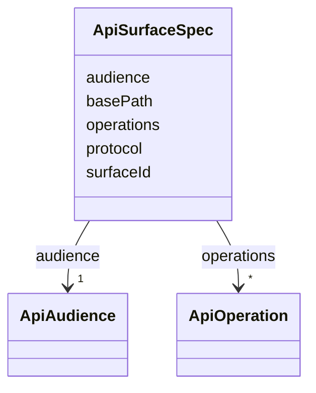

---
search:
  boost: 10.0
---

# Class: ApiSurfaceSpec


_Specification of an ApiSurface contract._


<div data-search-exclude markdown="1">


URI: [jumo:ApiSurfaceSpec](https://jumo.dev/schemas/jumo-v1/ApiSurfaceSpec)





<!-- no inheritance hierarchy -->

## Slots

| Name | Cardinality and Range | Description | Inheritance |
| ---  | --- | --- | --- |
| [surfaceId](surfaceId.md) | 1 <br/> [String](String.md) |  | direct |
| [audience](audience.md) | 1 <br/> [ApiAudience](ApiAudience.md) |  | direct |
| [basePath](basePath.md) | 1 <br/> [String](String.md) |  | direct |
| [protocol](protocol.md) | 0..1 <br/> [String](String.md) |  | direct |
| [operations](operations.md) | * <br/> [ApiOperation](ApiOperation.md) |  | direct |


## Usages

| used by | used in | type | used |
| ---  | --- | --- | --- |
| [ApiSurface](ApiSurface.md) | [spec](spec.md) | range | [ApiSurfaceSpec](ApiSurfaceSpec.md) |


## Identifier and Mapping Information


### Annotations

| property | value |
| --- | --- |
| jumo.state_authority | GIT |
| jumo.model_role | VALUE_OBJECT |
| jumo.audience | PUBLIC_WEB |
| jumo.sensitivity | INTERNAL |
| jumo.boundary_eligible | True |
| jumo.schema_profiles | draft-2020-12,native-json-schema,prompted-json-validated |


### Schema Source


* from schema: https://jumo.dev/schemas/jumo-v1


## Mappings

| Mapping Type | Mapped Value |
| ---  | ---  |
| self | jumo:ApiSurfaceSpec |
| native | jumo:ApiSurfaceSpec |


## LinkML Source

<!-- TODO: investigate https://stackoverflow.com/questions/37606292/how-to-create-tabbed-code-blocks-in-mkdocs-or-sphinx -->

### Direct

<details>
```yaml
name: ApiSurfaceSpec
annotations:
  jumo.state_authority:
    tag: jumo.state_authority
    value: GIT
  jumo.model_role:
    tag: jumo.model_role
    value: VALUE_OBJECT
  jumo.audience:
    tag: jumo.audience
    value: PUBLIC_WEB
  jumo.sensitivity:
    tag: jumo.sensitivity
    value: INTERNAL
  jumo.boundary_eligible:
    tag: jumo.boundary_eligible
    value: true
  jumo.schema_profiles:
    tag: jumo.schema_profiles
    value: draft-2020-12,native-json-schema,prompted-json-validated
description: Specification of an ApiSurface contract.
from_schema: https://jumo.dev/schemas/jumo-v1
attributes:
  surfaceId:
    name: surfaceId
    from_schema: https://jumo.dev/schemas/jumo-v1
    rank: 1000
    owner: ApiSurfaceSpec
    domain_of:
    - ApiSurfaceSpec
    range: string
    required: true
  audience:
    name: audience
    from_schema: https://jumo.dev/schemas/jumo-v1
    owner: ApiSurfaceSpec
    domain_of:
    - DocumentFrontMatter
    - OfferingSpecBody
    - SelfDescriptionAnswer
    - Surface
    - ApiOperation
    - ApiSurfaceSpec
    range: ApiAudience
    required: true
  basePath:
    name: basePath
    from_schema: https://jumo.dev/schemas/jumo-v1
    rank: 1000
    owner: ApiSurfaceSpec
    domain_of:
    - ApiSurfaceSpec
    range: string
    required: true
  protocol:
    name: protocol
    from_schema: https://jumo.dev/schemas/jumo-v1
    rank: 1000
    ifabsent: '"HTTPS"'
    owner: ApiSurfaceSpec
    domain_of:
    - ApiSurfaceSpec
    range: string
  operations:
    name: operations
    from_schema: https://jumo.dev/schemas/jumo-v1
    owner: ApiSurfaceSpec
    domain_of:
    - ConnectorDefinitionSpec
    - McpBundleSemanticProfile
    - SessionPlan
    - ApiSurfaceSpec
    range: ApiOperation
    multivalued: true
    inlined: true

```
</details>

### Induced

<details>
```yaml
name: ApiSurfaceSpec
annotations:
  jumo.state_authority:
    tag: jumo.state_authority
    value: GIT
  jumo.model_role:
    tag: jumo.model_role
    value: VALUE_OBJECT
  jumo.audience:
    tag: jumo.audience
    value: PUBLIC_WEB
  jumo.sensitivity:
    tag: jumo.sensitivity
    value: INTERNAL
  jumo.boundary_eligible:
    tag: jumo.boundary_eligible
    value: true
  jumo.schema_profiles:
    tag: jumo.schema_profiles
    value: draft-2020-12,native-json-schema,prompted-json-validated
description: Specification of an ApiSurface contract.
from_schema: https://jumo.dev/schemas/jumo-v1
attributes:
  surfaceId:
    name: surfaceId
    from_schema: https://jumo.dev/schemas/jumo-v1
    rank: 1000
    owner: ApiSurfaceSpec
    domain_of:
    - ApiSurfaceSpec
    range: string
    required: true
  audience:
    name: audience
    from_schema: https://jumo.dev/schemas/jumo-v1
    owner: ApiSurfaceSpec
    domain_of:
    - DocumentFrontMatter
    - OfferingSpecBody
    - SelfDescriptionAnswer
    - Surface
    - ApiOperation
    - ApiSurfaceSpec
    range: ApiAudience
    required: true
  basePath:
    name: basePath
    from_schema: https://jumo.dev/schemas/jumo-v1
    rank: 1000
    owner: ApiSurfaceSpec
    domain_of:
    - ApiSurfaceSpec
    range: string
    required: true
  protocol:
    name: protocol
    from_schema: https://jumo.dev/schemas/jumo-v1
    rank: 1000
    ifabsent: '"HTTPS"'
    owner: ApiSurfaceSpec
    domain_of:
    - ApiSurfaceSpec
    range: string
  operations:
    name: operations
    from_schema: https://jumo.dev/schemas/jumo-v1
    owner: ApiSurfaceSpec
    domain_of:
    - ConnectorDefinitionSpec
    - McpBundleSemanticProfile
    - SessionPlan
    - ApiSurfaceSpec
    range: ApiOperation
    multivalued: true
    inlined: true

```
</details></div>