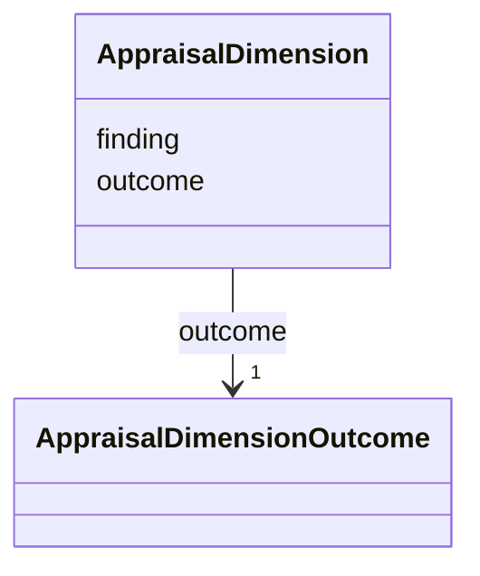

---
search:
  boost: 10.0
---

# Class: AppraisalDimension

<div data-search-exclude markdown="1">


URI: [jumo:AppraisalDimension](https://jumo.dev/schemas/jumo-v1/AppraisalDimension)





<!-- no inheritance hierarchy -->

## Slots

| Name | Cardinality and Range | Description | Inheritance |
| ---  | --- | --- | --- |
| [outcome](outcome.md) | 1 <br/> [AppraisalDimensionOutcome](AppraisalDimensionOutcome.md) |  | direct |
| [finding](finding.md) | 1 <br/> [String](String.md) |  | direct |


## Usages

| used by | used in | type | used |
| ---  | --- | --- | --- |
| [AppraisalDimensions](AppraisalDimensions.md) | [provenance](provenance.md) | range | [AppraisalDimension](AppraisalDimension.md) |
| [AppraisalDimensions](AppraisalDimensions.md) | [security](security.md) | range | [AppraisalDimension](AppraisalDimension.md) |
| [AppraisalDimensions](AppraisalDimensions.md) | [relevance](relevance.md) | range | [AppraisalDimension](AppraisalDimension.md) |
| [AppraisalDimensions](AppraisalDimensions.md) | [agentUsability](agentUsability.md) | range | [AppraisalDimension](AppraisalDimension.md) |


## Identifier and Mapping Information


### Annotations

| property | value |
| --- | --- |
| jumo.state_authority | GIT |
| jumo.model_role | VALUE_OBJECT |
| jumo.audience | REALM_PRIVATE |
| jumo.sensitivity | INTERNAL |
| jumo.boundary_eligible | True |
| jumo.schema_profiles | draft-2020-12,native-json-schema,prompted-json-validated |


### Schema Source


* from schema: https://jumo.dev/schemas/jumo-v1


## Mappings

| Mapping Type | Mapped Value |
| ---  | ---  |
| self | jumo:AppraisalDimension |
| native | jumo:AppraisalDimension |


## LinkML Source

<!-- TODO: investigate https://stackoverflow.com/questions/37606292/how-to-create-tabbed-code-blocks-in-mkdocs-or-sphinx -->

### Direct

<details>
```yaml
name: AppraisalDimension
annotations:
  jumo.state_authority:
    tag: jumo.state_authority
    value: GIT
  jumo.model_role:
    tag: jumo.model_role
    value: VALUE_OBJECT
  jumo.audience:
    tag: jumo.audience
    value: REALM_PRIVATE
  jumo.sensitivity:
    tag: jumo.sensitivity
    value: INTERNAL
  jumo.boundary_eligible:
    tag: jumo.boundary_eligible
    value: true
  jumo.schema_profiles:
    tag: jumo.schema_profiles
    value: draft-2020-12,native-json-schema,prompted-json-validated
from_schema: https://jumo.dev/schemas/jumo-v1
attributes:
  outcome:
    name: outcome
    from_schema: https://jumo.dev/schemas/jumo-v1
    owner: AppraisalDimension
    domain_of:
    - DispositionRule
    - McpCatalogAssessment
    - AppraisalDimension
    range: AppraisalDimensionOutcome
    required: true
  finding:
    name: finding
    from_schema: https://jumo.dev/schemas/jumo-v1
    owner: AppraisalDimension
    domain_of:
    - ImprovementRecommendationSpec
    - AppraisalDimension
    range: string
    required: true
    pattern: ^.{10,}$

```
</details>

### Induced

<details>
```yaml
name: AppraisalDimension
annotations:
  jumo.state_authority:
    tag: jumo.state_authority
    value: GIT
  jumo.model_role:
    tag: jumo.model_role
    value: VALUE_OBJECT
  jumo.audience:
    tag: jumo.audience
    value: REALM_PRIVATE
  jumo.sensitivity:
    tag: jumo.sensitivity
    value: INTERNAL
  jumo.boundary_eligible:
    tag: jumo.boundary_eligible
    value: true
  jumo.schema_profiles:
    tag: jumo.schema_profiles
    value: draft-2020-12,native-json-schema,prompted-json-validated
from_schema: https://jumo.dev/schemas/jumo-v1
attributes:
  outcome:
    name: outcome
    from_schema: https://jumo.dev/schemas/jumo-v1
    owner: AppraisalDimension
    domain_of:
    - DispositionRule
    - McpCatalogAssessment
    - AppraisalDimension
    range: AppraisalDimensionOutcome
    required: true
  finding:
    name: finding
    from_schema: https://jumo.dev/schemas/jumo-v1
    owner: AppraisalDimension
    domain_of:
    - ImprovementRecommendationSpec
    - AppraisalDimension
    range: string
    required: true
    pattern: ^.{10,}$

```
</details></div>