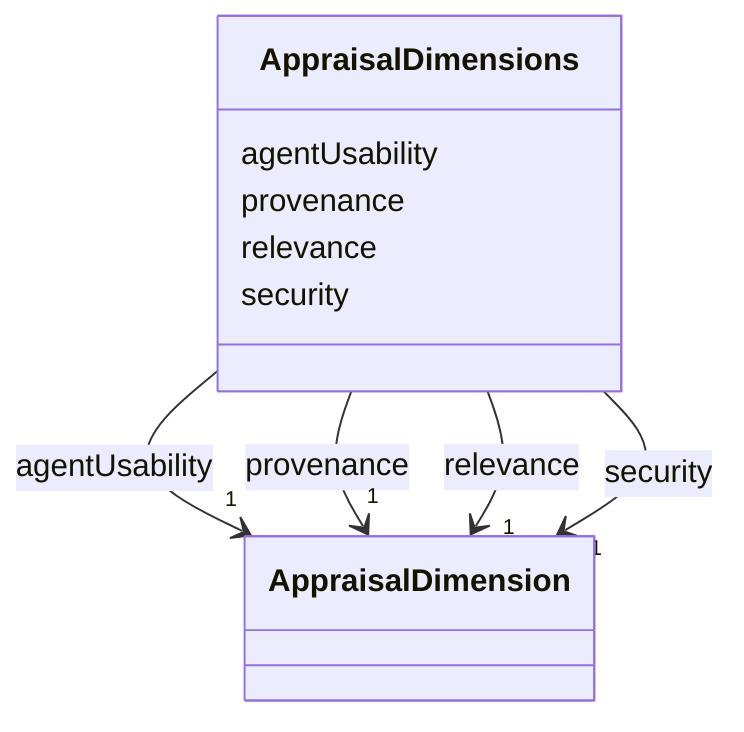

---
search:
  boost: 10.0
---

# Class: AppraisalDimensions


_Four questions asked of every submission, separate because they fail independently: a perfectly signed artifact can be unusable by an agent, and a well-described tool can have no business in this Realm._


<div data-search-exclude markdown="1">


URI: [jumo:AppraisalDimensions](https://jumo.dev/schemas/jumo-v1/AppraisalDimensions)





<!-- no inheritance hierarchy -->

## Slots

| Name | Cardinality and Range | Description | Inheritance |
| ---  | --- | --- | --- |
| [provenance](provenance.md) | 1 <br/> [AppraisalDimension](AppraisalDimension.md) | Signature, digest, SBOM, licence and publisher | direct |
| [security](security.md) | 1 <br/> [AppraisalDimension](AppraisalDimension.md) | Blast radius per operation, network egress, secret material held, and untrust... | direct |
| [relevance](relevance.md) | 1 <br/> [AppraisalDimension](AppraisalDimension.md) | Whether each exposed operation maps to a capability this Realm already declar... | direct |
| [agentUsability](agentUsability.md) | 1 <br/> [AppraisalDimension](AppraisalDimension.md) | Whether an agent can use it without guessing | direct |


## Usages

| used by | used in | type | used |
| ---  | --- | --- | --- |
| [ConnectorAppraisalSpec](ConnectorAppraisalSpec.md) | [dimensions](dimensions.md) | range | [AppraisalDimensions](AppraisalDimensions.md) |


## Identifier and Mapping Information


### Annotations

| property | value |
| --- | --- |
| jumo.state_authority | GIT |
| jumo.model_role | VALUE_OBJECT |
| jumo.audience | REALM_PRIVATE |
| jumo.sensitivity | INTERNAL |
| jumo.boundary_eligible | True |
| jumo.schema_profiles | draft-2020-12,native-json-schema,prompted-json-validated |


### Schema Source


* from schema: https://jumo.dev/schemas/jumo-v1


## Mappings

| Mapping Type | Mapped Value |
| ---  | ---  |
| self | jumo:AppraisalDimensions |
| native | jumo:AppraisalDimensions |


## LinkML Source

<!-- TODO: investigate https://stackoverflow.com/questions/37606292/how-to-create-tabbed-code-blocks-in-mkdocs-or-sphinx -->

### Direct

<details>
```yaml
name: AppraisalDimensions
annotations:
  jumo.state_authority:
    tag: jumo.state_authority
    value: GIT
  jumo.model_role:
    tag: jumo.model_role
    value: VALUE_OBJECT
  jumo.audience:
    tag: jumo.audience
    value: REALM_PRIVATE
  jumo.sensitivity:
    tag: jumo.sensitivity
    value: INTERNAL
  jumo.boundary_eligible:
    tag: jumo.boundary_eligible
    value: true
  jumo.schema_profiles:
    tag: jumo.schema_profiles
    value: draft-2020-12,native-json-schema,prompted-json-validated
description: 'Four questions asked of every submission, separate because they fail
  independently: a perfectly signed artifact can be unusable by an agent, and a well-described
  tool can have no business in this Realm.'
from_schema: https://jumo.dev/schemas/jumo-v1
attributes:
  provenance:
    name: provenance
    description: Signature, digest, SBOM, licence and publisher.
    from_schema: https://jumo.dev/schemas/jumo-v1
    owner: AppraisalDimensions
    domain_of:
    - ProviderQuotaObservation
    - AppraisalDimensions
    range: AppraisalDimension
    required: true
    inlined: true
  security:
    name: security
    description: Blast radius per operation, network egress, secret material held,
      and untrusted output.
    from_schema: https://jumo.dev/schemas/jumo-v1
    rank: 1000
    owner: AppraisalDimensions
    domain_of:
    - AppraisalDimensions
    range: AppraisalDimension
    required: true
    inlined: true
  relevance:
    name: relevance
    description: Whether each exposed operation maps to a capability this Realm already
      declares.
    from_schema: https://jumo.dev/schemas/jumo-v1
    rank: 1000
    owner: AppraisalDimensions
    domain_of:
    - AppraisalDimensions
    range: AppraisalDimension
    required: true
    inlined: true
  agentUsability:
    name: agentUsability
    description: Whether an agent can use it without guessing.
    from_schema: https://jumo.dev/schemas/jumo-v1
    rank: 1000
    owner: AppraisalDimensions
    domain_of:
    - AppraisalDimensions
    range: AppraisalDimension
    required: true
    inlined: true

```
</details>

### Induced

<details>
```yaml
name: AppraisalDimensions
annotations:
  jumo.state_authority:
    tag: jumo.state_authority
    value: GIT
  jumo.model_role:
    tag: jumo.model_role
    value: VALUE_OBJECT
  jumo.audience:
    tag: jumo.audience
    value: REALM_PRIVATE
  jumo.sensitivity:
    tag: jumo.sensitivity
    value: INTERNAL
  jumo.boundary_eligible:
    tag: jumo.boundary_eligible
    value: true
  jumo.schema_profiles:
    tag: jumo.schema_profiles
    value: draft-2020-12,native-json-schema,prompted-json-validated
description: 'Four questions asked of every submission, separate because they fail
  independently: a perfectly signed artifact can be unusable by an agent, and a well-described
  tool can have no business in this Realm.'
from_schema: https://jumo.dev/schemas/jumo-v1
attributes:
  provenance:
    name: provenance
    description: Signature, digest, SBOM, licence and publisher.
    from_schema: https://jumo.dev/schemas/jumo-v1
    owner: AppraisalDimensions
    domain_of:
    - ProviderQuotaObservation
    - AppraisalDimensions
    range: AppraisalDimension
    required: true
    inlined: true
  security:
    name: security
    description: Blast radius per operation, network egress, secret material held,
      and untrusted output.
    from_schema: https://jumo.dev/schemas/jumo-v1
    rank: 1000
    owner: AppraisalDimensions
    domain_of:
    - AppraisalDimensions
    range: AppraisalDimension
    required: true
    inlined: true
  relevance:
    name: relevance
    description: Whether each exposed operation maps to a capability this Realm already
      declares.
    from_schema: https://jumo.dev/schemas/jumo-v1
    rank: 1000
    owner: AppraisalDimensions
    domain_of:
    - AppraisalDimensions
    range: AppraisalDimension
    required: true
    inlined: true
  agentUsability:
    name: agentUsability
    description: Whether an agent can use it without guessing.
    from_schema: https://jumo.dev/schemas/jumo-v1
    rank: 1000
    owner: AppraisalDimensions
    domain_of:
    - AppraisalDimensions
    range: AppraisalDimension
    required: true
    inlined: true

```
</details></div>