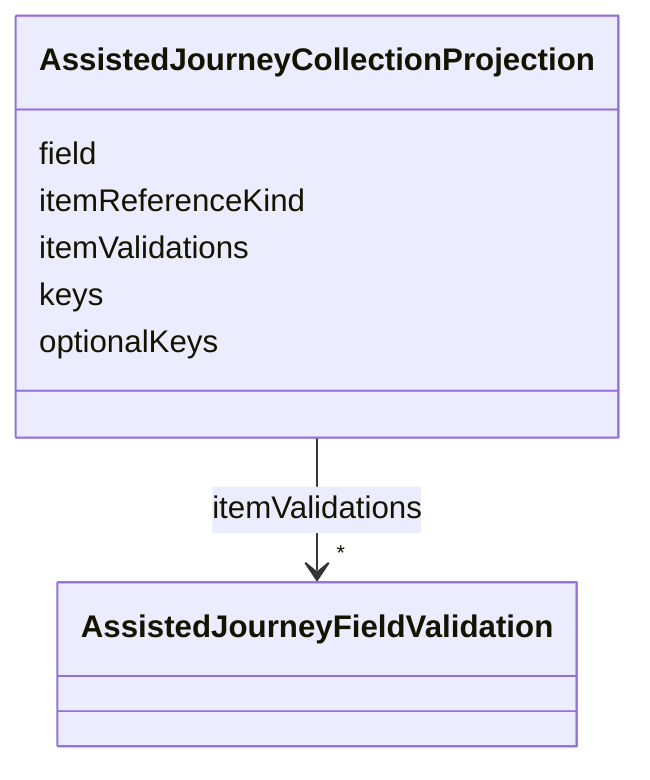

---
search:
  boost: 10.0
---

# Class: AssistedJourneyCollectionProjection

<div data-search-exclude markdown="1">


URI: [jumo:AssistedJourneyCollectionProjection](https://jumo.dev/schemas/jumo-v1/AssistedJourneyCollectionProjection)





<!-- no inheritance hierarchy -->

## Slots

| Name | Cardinality and Range | Description | Inheritance |
| ---  | --- | --- | --- |
| [field](field.md) | 1 <br/> [String](String.md) |  | direct |
| [keys](keys.md) | 1..* <br/> [String](String.md) | The keys each emitted item carries, in the order the document declares them | direct |
| [optionalKeys](optionalKeys.md) | * <br/> [String](String.md) | Keys carried only when the collected item supplies a non-blank value | direct |
| [itemValidations](itemValidations.md) | * <br/> [AssistedJourneyFieldValidation](AssistedJourneyFieldValidation.md) | Checks applied to each item, naming a key of the item rather than a field of ... | direct |
| [itemReferenceKind](itemReferenceKind.md) | 0..1 <br/> [String](String.md) | When the collected item is a plain reference id rather than an object (an ENT... | direct |


## Usages

| used by | used in | type | used |
| ---  | --- | --- | --- |
| [AssistedJourneyEmission](AssistedJourneyEmission.md) | [collectionProjections](collectionProjections.md) | range | [AssistedJourneyCollectionProjection](AssistedJourneyCollectionProjection.md) |


## Identifier and Mapping Information


### Annotations

| property | value |
| --- | --- |
| jumo.state_authority | GIT |
| jumo.model_role | VALUE_OBJECT |
| jumo.audience | REALM_PRIVATE |
| jumo.sensitivity | INTERNAL |
| jumo.boundary_eligible | True |
| jumo.schema_profiles | draft-2020-12,native-json-schema,prompted-json-validated |


### Schema Source


* from schema: https://jumo.dev/schemas/jumo-v1


## Mappings

| Mapping Type | Mapped Value |
| ---  | ---  |
| self | jumo:AssistedJourneyCollectionProjection |
| native | jumo:AssistedJourneyCollectionProjection |


## LinkML Source

<!-- TODO: investigate https://stackoverflow.com/questions/37606292/how-to-create-tabbed-code-blocks-in-mkdocs-or-sphinx -->

### Direct

<details>
```yaml
name: AssistedJourneyCollectionProjection
annotations:
  jumo.state_authority:
    tag: jumo.state_authority
    value: GIT
  jumo.model_role:
    tag: jumo.model_role
    value: VALUE_OBJECT
  jumo.audience:
    tag: jumo.audience
    value: REALM_PRIVATE
  jumo.sensitivity:
    tag: jumo.sensitivity
    value: INTERNAL
  jumo.boundary_eligible:
    tag: jumo.boundary_eligible
    value: true
  jumo.schema_profiles:
    tag: jumo.schema_profiles
    value: draft-2020-12,native-json-schema,prompted-json-validated
from_schema: https://jumo.dev/schemas/jumo-v1
attributes:
  field:
    name: field
    from_schema: https://jumo.dev/schemas/jumo-v1
    owner: AssistedJourneyCollectionProjection
    domain_of:
    - AssistedJourneyFieldValidation
    - AssistedJourneyFieldCondition
    - AssistedJourneyReferenceCheck
    - AssistedJourneyCollectionProjection
    - AssistedJourneyFieldDefault
    - AssistedJourneyRequiredField
    range: string
    required: true
  keys:
    name: keys
    description: The keys each emitted item carries, in the order the document declares
      them.
    from_schema: https://jumo.dev/schemas/jumo-v1
    rank: 1000
    owner: AssistedJourneyCollectionProjection
    domain_of:
    - AssistedJourneyCollectionProjection
    range: string
    required: true
    multivalued: true
  optionalKeys:
    name: optionalKeys
    description: Keys carried only when the collected item supplies a non-blank value.
    from_schema: https://jumo.dev/schemas/jumo-v1
    rank: 1000
    owner: AssistedJourneyCollectionProjection
    domain_of:
    - AssistedJourneyCollectionProjection
    range: string
    multivalued: true
  itemValidations:
    name: itemValidations
    description: Checks applied to each item, naming a key of the item rather than
      a field of the payload.
    from_schema: https://jumo.dev/schemas/jumo-v1
    rank: 1000
    owner: AssistedJourneyCollectionProjection
    domain_of:
    - AssistedJourneyCollectionProjection
    range: AssistedJourneyFieldValidation
    multivalued: true
    inlined: true
    inlined_as_list: true
  itemReferenceKind:
    name: itemReferenceKind
    description: When the collected item is a plain reference id rather than an object
      (an ENTITY_COLLECTION field submits ids), the declared contract kind it names.
      Must be a declared kind (Rego). The resolved document supplies each declared
      key not already carried by the submission itself -- keys read spec.<key>, falling
      back to metadata.name -- so the emitted item never trusts a client-submitted
      facet the contract can resolve authoritatively instead.
    from_schema: https://jumo.dev/schemas/jumo-v1
    rank: 1000
    owner: AssistedJourneyCollectionProjection
    domain_of:
    - AssistedJourneyCollectionProjection
    range: string

```
</details>

### Induced

<details>
```yaml
name: AssistedJourneyCollectionProjection
annotations:
  jumo.state_authority:
    tag: jumo.state_authority
    value: GIT
  jumo.model_role:
    tag: jumo.model_role
    value: VALUE_OBJECT
  jumo.audience:
    tag: jumo.audience
    value: REALM_PRIVATE
  jumo.sensitivity:
    tag: jumo.sensitivity
    value: INTERNAL
  jumo.boundary_eligible:
    tag: jumo.boundary_eligible
    value: true
  jumo.schema_profiles:
    tag: jumo.schema_profiles
    value: draft-2020-12,native-json-schema,prompted-json-validated
from_schema: https://jumo.dev/schemas/jumo-v1
attributes:
  field:
    name: field
    from_schema: https://jumo.dev/schemas/jumo-v1
    owner: AssistedJourneyCollectionProjection
    domain_of:
    - AssistedJourneyFieldValidation
    - AssistedJourneyFieldCondition
    - AssistedJourneyReferenceCheck
    - AssistedJourneyCollectionProjection
    - AssistedJourneyFieldDefault
    - AssistedJourneyRequiredField
    range: string
    required: true
  keys:
    name: keys
    description: The keys each emitted item carries, in the order the document declares
      them.
    from_schema: https://jumo.dev/schemas/jumo-v1
    rank: 1000
    owner: AssistedJourneyCollectionProjection
    domain_of:
    - AssistedJourneyCollectionProjection
    range: string
    required: true
    multivalued: true
  optionalKeys:
    name: optionalKeys
    description: Keys carried only when the collected item supplies a non-blank value.
    from_schema: https://jumo.dev/schemas/jumo-v1
    rank: 1000
    owner: AssistedJourneyCollectionProjection
    domain_of:
    - AssistedJourneyCollectionProjection
    range: string
    multivalued: true
  itemValidations:
    name: itemValidations
    description: Checks applied to each item, naming a key of the item rather than
      a field of the payload.
    from_schema: https://jumo.dev/schemas/jumo-v1
    rank: 1000
    owner: AssistedJourneyCollectionProjection
    domain_of:
    - AssistedJourneyCollectionProjection
    range: AssistedJourneyFieldValidation
    multivalued: true
    inlined: true
    inlined_as_list: true
  itemReferenceKind:
    name: itemReferenceKind
    description: When the collected item is a plain reference id rather than an object
      (an ENTITY_COLLECTION field submits ids), the declared contract kind it names.
      Must be a declared kind (Rego). The resolved document supplies each declared
      key not already carried by the submission itself -- keys read spec.<key>, falling
      back to metadata.name -- so the emitted item never trusts a client-submitted
      facet the contract can resolve authoritatively instead.
    from_schema: https://jumo.dev/schemas/jumo-v1
    rank: 1000
    owner: AssistedJourneyCollectionProjection
    domain_of:
    - AssistedJourneyCollectionProjection
    range: string

```
</details></div>