---
search:
  boost: 10.0
---

# Class: AssistedJourneyEmission


_The declarative replacement for a per-journey emission branch. Everything here is read by one generic renderer: nothing in it names a journey, and nothing outside it decides what a journey emits._


<div data-search-exclude markdown="1">


URI: [jumo:AssistedJourneyEmission](https://jumo.dev/schemas/jumo-v1/AssistedJourneyEmission)

```mermaid
 classDiagram
    class AssistedJourneyEmission
    click AssistedJourneyEmission href "../AssistedJourneyEmission/"
      AssistedJourneyEmission : booleanFields

      AssistedJourneyEmission : collectionProjections





        AssistedJourneyEmission --> "*" AssistedJourneyCollectionProjection : collectionProjections
        click AssistedJourneyCollectionProjection href "../AssistedJourneyCollectionProjection/"



      AssistedJourneyEmission : documentTemplateRef





        AssistedJourneyEmission --> "0..1" ContractReference : documentTemplateRef
        click ContractReference href "../ContractReference/"



      AssistedJourneyEmission : fieldConditions





        AssistedJourneyEmission --> "*" AssistedJourneyFieldCondition : fieldConditions
        click AssistedJourneyFieldCondition href "../AssistedJourneyFieldCondition/"



      AssistedJourneyEmission : fieldDefaults





        AssistedJourneyEmission --> "*" AssistedJourneyFieldDefault : fieldDefaults
        click AssistedJourneyFieldDefault href "../AssistedJourneyFieldDefault/"



      AssistedJourneyEmission : identifier





        AssistedJourneyEmission --> "1" AssistedJourneyEmittedIdentifier : identifier
        click AssistedJourneyEmittedIdentifier href "../AssistedJourneyEmittedIdentifier/"



      AssistedJourneyEmission : pathTemplate

      AssistedJourneyEmission : referenceChecks





        AssistedJourneyEmission --> "*" AssistedJourneyReferenceCheck : referenceChecks
        click AssistedJourneyReferenceCheck href "../AssistedJourneyReferenceCheck/"



      AssistedJourneyEmission : routingEligibilityCheck





        AssistedJourneyEmission --> "0..1" AssistedJourneyRoutingEligibilityCheck : routingEligibilityCheck
        click AssistedJourneyRoutingEligibilityCheck href "../AssistedJourneyRoutingEligibilityCheck/"



      AssistedJourneyEmission : targetKind

      AssistedJourneyEmission : validations





        AssistedJourneyEmission --> "*" AssistedJourneyFieldValidation : validations
        click AssistedJourneyFieldValidation href "../AssistedJourneyFieldValidation/"




```





<!-- no inheritance hierarchy -->

## Slots

| Name | Cardinality and Range | Description | Inheritance |
| ---  | --- | --- | --- |
| [targetKind](targetKind.md) | 1 <br/> [String](String.md) | The contract kind the emitted document declares | direct |
| [identifier](identifier.md) | 1 <br/> [AssistedJourneyEmittedIdentifier](AssistedJourneyEmittedIdentifier.md) |  | direct |
| [pathTemplate](pathTemplate.md) | 1 <br/> [String](String.md) | Where the document is written, with ${id} standing for the resolved identifie... | direct |
| [documentTemplateRef](documentTemplateRef.md) | 0..1 <br/> [ContractReference](ContractReference.md) | The DocumentTemplate that renders the document | direct |
| [validations](validations.md) | * <br/> [AssistedJourneyFieldValidation](AssistedJourneyFieldValidation.md) | Field-level checks the collected payload must pass before anything is written | direct |
| [referenceChecks](referenceChecks.md) | * <br/> [AssistedJourneyReferenceCheck](AssistedJourneyReferenceCheck.md) | Checks that a collected value names a contract that exists, so a journey neve... | direct |
| [fieldDefaults](fieldDefaults.md) | * <br/> [AssistedJourneyFieldDefault](AssistedJourneyFieldDefault.md) | Values used when a field was not collected, so a template needs no conditiona... | direct |
| [fieldConditions](fieldConditions.md) | * <br/> [AssistedJourneyFieldCondition](AssistedJourneyFieldCondition.md) | Fields the emitted document carries only under a declared condition | direct |
| [collectionProjections](collectionProjections.md) | * <br/> [AssistedJourneyCollectionProjection](AssistedJourneyCollectionProjection.md) | What a multivalued field contributes to the emitted document | direct |
| [routingEligibilityCheck](routingEligibilityCheck.md) | 0..1 <br/> [AssistedJourneyRoutingEligibilityCheck](AssistedJourneyRoutingEligibilityCheck.md) | Refuses a proposal that would route work to a team the project did not declar... | direct |
| [booleanFields](booleanFields.md) | * <br/> [String](String.md) | Field names whose collected "true"/"false" string is coerced to a real YAML b... | direct |


## Usages

| used by | used in | type | used |
| ---  | --- | --- | --- |
| [AssistedJourneySpec](AssistedJourneySpec.md) | [emission](emission.md) | range | [AssistedJourneyEmission](AssistedJourneyEmission.md) |
| [AssistedJourneyEmissionBundleItem](AssistedJourneyEmissionBundleItem.md) | [emission](emission.md) | range | [AssistedJourneyEmission](AssistedJourneyEmission.md) |


## Identifier and Mapping Information


### Annotations

| property | value |
| --- | --- |
| jumo.state_authority | GIT |
| jumo.model_role | VALUE_OBJECT |
| jumo.audience | REALM_PRIVATE |
| jumo.sensitivity | INTERNAL |
| jumo.boundary_eligible | True |
| jumo.schema_profiles | draft-2020-12,native-json-schema,prompted-json-validated |


### Schema Source


* from schema: https://jumo.dev/schemas/jumo-v1


## Mappings

| Mapping Type | Mapped Value |
| ---  | ---  |
| self | jumo:AssistedJourneyEmission |
| native | jumo:AssistedJourneyEmission |


## LinkML Source

<!-- TODO: investigate https://stackoverflow.com/questions/37606292/how-to-create-tabbed-code-blocks-in-mkdocs-or-sphinx -->

### Direct

<details>
```yaml
name: AssistedJourneyEmission
annotations:
  jumo.state_authority:
    tag: jumo.state_authority
    value: GIT
  jumo.model_role:
    tag: jumo.model_role
    value: VALUE_OBJECT
  jumo.audience:
    tag: jumo.audience
    value: REALM_PRIVATE
  jumo.sensitivity:
    tag: jumo.sensitivity
    value: INTERNAL
  jumo.boundary_eligible:
    tag: jumo.boundary_eligible
    value: true
  jumo.schema_profiles:
    tag: jumo.schema_profiles
    value: draft-2020-12,native-json-schema,prompted-json-validated
description: 'The declarative replacement for a per-journey emission branch. Everything
  here is read by one generic renderer: nothing in it names a journey, and nothing
  outside it decides what a journey emits.'
from_schema: https://jumo.dev/schemas/jumo-v1
attributes:
  targetKind:
    name: targetKind
    description: The contract kind the emitted document declares. Must name a declared
      kind (Rego).
    from_schema: https://jumo.dev/schemas/jumo-v1
    owner: AssistedJourneyEmission
    domain_of:
    - PromptOutput
    - AssistedJourneyEmission
    range: string
    required: true
  identifier:
    name: identifier
    from_schema: https://jumo.dev/schemas/jumo-v1
    rank: 1000
    owner: AssistedJourneyEmission
    domain_of:
    - AssistedJourneyEmission
    range: AssistedJourneyEmittedIdentifier
    required: true
    inlined: true
  pathTemplate:
    name: pathTemplate
    description: Where the document is written, with ${id} standing for the resolved
      identifier, e.g. `.jumo/teams/${id}.yml`.
    from_schema: https://jumo.dev/schemas/jumo-v1
    rank: 1000
    owner: AssistedJourneyEmission
    domain_of:
    - AssistedJourneyEmission
    range: string
    required: true
  documentTemplateRef:
    name: documentTemplateRef
    description: The DocumentTemplate that renders the document. Must resolve to a
      declared template rendering the same kind (Rego). Absent while a journey emits
      a document this vocabulary cannot yet describe -- the renderer refuses such
      an emission rather than guessing, and the journey keeps a named branch until
      a template can replace it, which is exactly what the boundary allowlist records.
    from_schema: https://jumo.dev/schemas/jumo-v1
    rank: 1000
    owner: AssistedJourneyEmission
    domain_of:
    - AssistedJourneyEmission
    range: ContractReference
    inlined: true
  validations:
    name: validations
    description: Field-level checks the collected payload must pass before anything
      is written.
    from_schema: https://jumo.dev/schemas/jumo-v1
    rank: 1000
    owner: AssistedJourneyEmission
    domain_of:
    - AssistedJourneyEmission
    range: AssistedJourneyFieldValidation
    multivalued: true
    inlined: true
    inlined_as_list: true
  referenceChecks:
    name: referenceChecks
    description: Checks that a collected value names a contract that exists, so a
      journey never proposes a document pointing at nothing.
    from_schema: https://jumo.dev/schemas/jumo-v1
    rank: 1000
    owner: AssistedJourneyEmission
    domain_of:
    - AssistedJourneyEmission
    range: AssistedJourneyReferenceCheck
    multivalued: true
    inlined: true
    inlined_as_list: true
  fieldDefaults:
    name: fieldDefaults
    description: Values used when a field was not collected, so a template needs no
      conditional of its own.
    from_schema: https://jumo.dev/schemas/jumo-v1
    rank: 1000
    owner: AssistedJourneyEmission
    domain_of:
    - AssistedJourneyEmission
    range: AssistedJourneyFieldDefault
    multivalued: true
    inlined: true
    inlined_as_list: true
  fieldConditions:
    name: fieldConditions
    description: Fields the emitted document carries only under a declared condition.
      A template drops a key whose lone placeholder resolves to nothing, so a conditional
      key needs no template conditional of its own -- the condition removes the value
      and the existing absence rule removes the key. Applied after fieldDefaults,
      so a default never resurrects a field the condition has removed.
    from_schema: https://jumo.dev/schemas/jumo-v1
    rank: 1000
    owner: AssistedJourneyEmission
    domain_of:
    - AssistedJourneyEmission
    range: AssistedJourneyFieldCondition
    multivalued: true
    inlined: true
    inlined_as_list: true
  collectionProjections:
    name: collectionProjections
    description: What a multivalued field contributes to the emitted document. A collected
      item may carry more than the contract needs, so the emitted item is a projection
      of it -- declared here rather than decided by the renderer, which is what keeps
      the emitted shape a contract fact.
    from_schema: https://jumo.dev/schemas/jumo-v1
    rank: 1000
    owner: AssistedJourneyEmission
    domain_of:
    - AssistedJourneyEmission
    range: AssistedJourneyCollectionProjection
    multivalued: true
    inlined: true
    inlined_as_list: true
  routingEligibilityCheck:
    name: routingEligibilityCheck
    description: Refuses a proposal that would route work to a team the project did
      not declare eligible. A project with no declared eligibility constrains nothing,
      as RoutingEligibility itself is additive.
    from_schema: https://jumo.dev/schemas/jumo-v1
    rank: 1000
    owner: AssistedJourneyEmission
    domain_of:
    - AssistedJourneyEmission
    range: AssistedJourneyRoutingEligibilityCheck
    inlined: true
  booleanFields:
    name: booleanFields
    description: 'Field names whose collected "true"/"false" string is coerced to
      a real YAML boolean before rendering. The platform compensates here rather than
      in the renderer: the generic step form has no boolean-aware widget yet (projection-field-options-resolution),
      so a BOOLEAN_FLAG-shaped value still arrives as free text.'
    from_schema: https://jumo.dev/schemas/jumo-v1
    rank: 1000
    owner: AssistedJourneyEmission
    domain_of:
    - AssistedJourneyEmission
    range: string
    multivalued: true

```
</details>

### Induced

<details>
```yaml
name: AssistedJourneyEmission
annotations:
  jumo.state_authority:
    tag: jumo.state_authority
    value: GIT
  jumo.model_role:
    tag: jumo.model_role
    value: VALUE_OBJECT
  jumo.audience:
    tag: jumo.audience
    value: REALM_PRIVATE
  jumo.sensitivity:
    tag: jumo.sensitivity
    value: INTERNAL
  jumo.boundary_eligible:
    tag: jumo.boundary_eligible
    value: true
  jumo.schema_profiles:
    tag: jumo.schema_profiles
    value: draft-2020-12,native-json-schema,prompted-json-validated
description: 'The declarative replacement for a per-journey emission branch. Everything
  here is read by one generic renderer: nothing in it names a journey, and nothing
  outside it decides what a journey emits.'
from_schema: https://jumo.dev/schemas/jumo-v1
attributes:
  targetKind:
    name: targetKind
    description: The contract kind the emitted document declares. Must name a declared
      kind (Rego).
    from_schema: https://jumo.dev/schemas/jumo-v1
    owner: AssistedJourneyEmission
    domain_of:
    - PromptOutput
    - AssistedJourneyEmission
    range: string
    required: true
  identifier:
    name: identifier
    from_schema: https://jumo.dev/schemas/jumo-v1
    rank: 1000
    owner: AssistedJourneyEmission
    domain_of:
    - AssistedJourneyEmission
    range: AssistedJourneyEmittedIdentifier
    required: true
    inlined: true
  pathTemplate:
    name: pathTemplate
    description: Where the document is written, with ${id} standing for the resolved
      identifier, e.g. `.jumo/teams/${id}.yml`.
    from_schema: https://jumo.dev/schemas/jumo-v1
    rank: 1000
    owner: AssistedJourneyEmission
    domain_of:
    - AssistedJourneyEmission
    range: string
    required: true
  documentTemplateRef:
    name: documentTemplateRef
    description: The DocumentTemplate that renders the document. Must resolve to a
      declared template rendering the same kind (Rego). Absent while a journey emits
      a document this vocabulary cannot yet describe -- the renderer refuses such
      an emission rather than guessing, and the journey keeps a named branch until
      a template can replace it, which is exactly what the boundary allowlist records.
    from_schema: https://jumo.dev/schemas/jumo-v1
    rank: 1000
    owner: AssistedJourneyEmission
    domain_of:
    - AssistedJourneyEmission
    range: ContractReference
    inlined: true
  validations:
    name: validations
    description: Field-level checks the collected payload must pass before anything
      is written.
    from_schema: https://jumo.dev/schemas/jumo-v1
    rank: 1000
    owner: AssistedJourneyEmission
    domain_of:
    - AssistedJourneyEmission
    range: AssistedJourneyFieldValidation
    multivalued: true
    inlined: true
    inlined_as_list: true
  referenceChecks:
    name: referenceChecks
    description: Checks that a collected value names a contract that exists, so a
      journey never proposes a document pointing at nothing.
    from_schema: https://jumo.dev/schemas/jumo-v1
    rank: 1000
    owner: AssistedJourneyEmission
    domain_of:
    - AssistedJourneyEmission
    range: AssistedJourneyReferenceCheck
    multivalued: true
    inlined: true
    inlined_as_list: true
  fieldDefaults:
    name: fieldDefaults
    description: Values used when a field was not collected, so a template needs no
      conditional of its own.
    from_schema: https://jumo.dev/schemas/jumo-v1
    rank: 1000
    owner: AssistedJourneyEmission
    domain_of:
    - AssistedJourneyEmission
    range: AssistedJourneyFieldDefault
    multivalued: true
    inlined: true
    inlined_as_list: true
  fieldConditions:
    name: fieldConditions
    description: Fields the emitted document carries only under a declared condition.
      A template drops a key whose lone placeholder resolves to nothing, so a conditional
      key needs no template conditional of its own -- the condition removes the value
      and the existing absence rule removes the key. Applied after fieldDefaults,
      so a default never resurrects a field the condition has removed.
    from_schema: https://jumo.dev/schemas/jumo-v1
    rank: 1000
    owner: AssistedJourneyEmission
    domain_of:
    - AssistedJourneyEmission
    range: AssistedJourneyFieldCondition
    multivalued: true
    inlined: true
    inlined_as_list: true
  collectionProjections:
    name: collectionProjections
    description: What a multivalued field contributes to the emitted document. A collected
      item may carry more than the contract needs, so the emitted item is a projection
      of it -- declared here rather than decided by the renderer, which is what keeps
      the emitted shape a contract fact.
    from_schema: https://jumo.dev/schemas/jumo-v1
    rank: 1000
    owner: AssistedJourneyEmission
    domain_of:
    - AssistedJourneyEmission
    range: AssistedJourneyCollectionProjection
    multivalued: true
    inlined: true
    inlined_as_list: true
  routingEligibilityCheck:
    name: routingEligibilityCheck
    description: Refuses a proposal that would route work to a team the project did
      not declare eligible. A project with no declared eligibility constrains nothing,
      as RoutingEligibility itself is additive.
    from_schema: https://jumo.dev/schemas/jumo-v1
    rank: 1000
    owner: AssistedJourneyEmission
    domain_of:
    - AssistedJourneyEmission
    range: AssistedJourneyRoutingEligibilityCheck
    inlined: true
  booleanFields:
    name: booleanFields
    description: 'Field names whose collected "true"/"false" string is coerced to
      a real YAML boolean before rendering. The platform compensates here rather than
      in the renderer: the generic step form has no boolean-aware widget yet (projection-field-options-resolution),
      so a BOOLEAN_FLAG-shaped value still arrives as free text.'
    from_schema: https://jumo.dev/schemas/jumo-v1
    rank: 1000
    owner: AssistedJourneyEmission
    domain_of:
    - AssistedJourneyEmission
    range: string
    multivalued: true

```
</details></div>