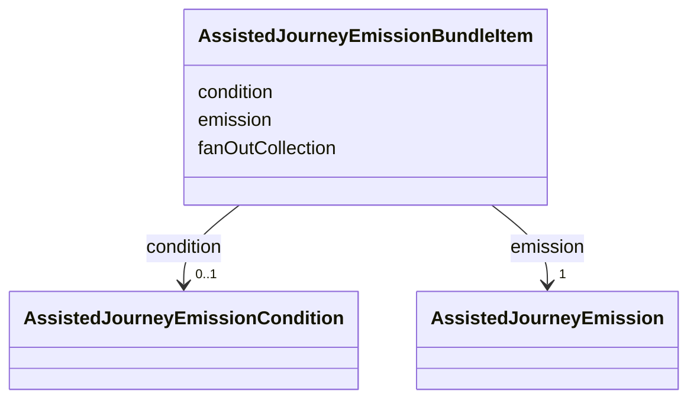

---
search:
  boost: 10.0
---

# Class: AssistedJourneyEmissionBundleItem


_One ordered document of an atomic same-repository bundle. emission reuses AssistedJourneyEmission unchanged; fanOutCollection and condition are the only bundle-specific additions._


<div data-search-exclude markdown="1">


URI: [jumo:AssistedJourneyEmissionBundleItem](https://jumo.dev/schemas/jumo-v1/AssistedJourneyEmissionBundleItem)





<!-- no inheritance hierarchy -->

## Slots

| Name | Cardinality and Range | Description | Inheritance |
| ---  | --- | --- | --- |
| [emission](emission.md) | 1 <br/> [AssistedJourneyEmission](AssistedJourneyEmission.md) |  | direct |
| [fanOutCollection](fanOutCollection.md) | 0..1 <br/> [String](String.md) | The collected multivalued field this item emits one document per item of | direct |
| [condition](condition.md) | 0..1 <br/> [AssistedJourneyEmissionCondition](AssistedJourneyEmissionCondition.md) | Skips this item, and its whole fan-out when declared, unless met | direct |


## Usages

| used by | used in | type | used |
| ---  | --- | --- | --- |
| [AssistedJourneySpec](AssistedJourneySpec.md) | [emissionBundle](emissionBundle.md) | range | [AssistedJourneyEmissionBundleItem](AssistedJourneyEmissionBundleItem.md) |


## Identifier and Mapping Information


### Annotations

| property | value |
| --- | --- |
| jumo.state_authority | GIT |
| jumo.model_role | VALUE_OBJECT |
| jumo.audience | REALM_PRIVATE |
| jumo.sensitivity | INTERNAL |
| jumo.boundary_eligible | True |
| jumo.schema_profiles | draft-2020-12,native-json-schema,prompted-json-validated |


### Schema Source


* from schema: https://jumo.dev/schemas/jumo-v1


## Mappings

| Mapping Type | Mapped Value |
| ---  | ---  |
| self | jumo:AssistedJourneyEmissionBundleItem |
| native | jumo:AssistedJourneyEmissionBundleItem |


## LinkML Source

<!-- TODO: investigate https://stackoverflow.com/questions/37606292/how-to-create-tabbed-code-blocks-in-mkdocs-or-sphinx -->

### Direct

<details>
```yaml
name: AssistedJourneyEmissionBundleItem
annotations:
  jumo.state_authority:
    tag: jumo.state_authority
    value: GIT
  jumo.model_role:
    tag: jumo.model_role
    value: VALUE_OBJECT
  jumo.audience:
    tag: jumo.audience
    value: REALM_PRIVATE
  jumo.sensitivity:
    tag: jumo.sensitivity
    value: INTERNAL
  jumo.boundary_eligible:
    tag: jumo.boundary_eligible
    value: true
  jumo.schema_profiles:
    tag: jumo.schema_profiles
    value: draft-2020-12,native-json-schema,prompted-json-validated
description: One ordered document of an atomic same-repository bundle. emission reuses
  AssistedJourneyEmission unchanged; fanOutCollection and condition are the only bundle-specific
  additions.
from_schema: https://jumo.dev/schemas/jumo-v1
attributes:
  emission:
    name: emission
    from_schema: https://jumo.dev/schemas/jumo-v1
    owner: AssistedJourneyEmissionBundleItem
    domain_of:
    - AssistedJourneySpec
    - AssistedJourneyEmissionBundleItem
    range: AssistedJourneyEmission
    required: true
    inlined: true
  fanOutCollection:
    name: fanOutCollection
    description: The collected multivalued field this item emits one document per
      item of. Identifiers, paths, validations and template values resolve in the
      current item's scope. Absent means the item emits at most once.
    from_schema: https://jumo.dev/schemas/jumo-v1
    rank: 1000
    owner: AssistedJourneyEmissionBundleItem
    domain_of:
    - AssistedJourneyEmissionBundleItem
    range: string
  condition:
    name: condition
    description: Skips this item, and its whole fan-out when declared, unless met.
    from_schema: https://jumo.dev/schemas/jumo-v1
    owner: AssistedJourneyEmissionBundleItem
    domain_of:
    - WorkOrderSpec
    - AssistedJourneyEmissionBundleItem
    range: AssistedJourneyEmissionCondition
    inlined: true

```
</details>

### Induced

<details>
```yaml
name: AssistedJourneyEmissionBundleItem
annotations:
  jumo.state_authority:
    tag: jumo.state_authority
    value: GIT
  jumo.model_role:
    tag: jumo.model_role
    value: VALUE_OBJECT
  jumo.audience:
    tag: jumo.audience
    value: REALM_PRIVATE
  jumo.sensitivity:
    tag: jumo.sensitivity
    value: INTERNAL
  jumo.boundary_eligible:
    tag: jumo.boundary_eligible
    value: true
  jumo.schema_profiles:
    tag: jumo.schema_profiles
    value: draft-2020-12,native-json-schema,prompted-json-validated
description: One ordered document of an atomic same-repository bundle. emission reuses
  AssistedJourneyEmission unchanged; fanOutCollection and condition are the only bundle-specific
  additions.
from_schema: https://jumo.dev/schemas/jumo-v1
attributes:
  emission:
    name: emission
    from_schema: https://jumo.dev/schemas/jumo-v1
    owner: AssistedJourneyEmissionBundleItem
    domain_of:
    - AssistedJourneySpec
    - AssistedJourneyEmissionBundleItem
    range: AssistedJourneyEmission
    required: true
    inlined: true
  fanOutCollection:
    name: fanOutCollection
    description: The collected multivalued field this item emits one document per
      item of. Identifiers, paths, validations and template values resolve in the
      current item's scope. Absent means the item emits at most once.
    from_schema: https://jumo.dev/schemas/jumo-v1
    rank: 1000
    owner: AssistedJourneyEmissionBundleItem
    domain_of:
    - AssistedJourneyEmissionBundleItem
    range: string
  condition:
    name: condition
    description: Skips this item, and its whole fan-out when declared, unless met.
    from_schema: https://jumo.dev/schemas/jumo-v1
    owner: AssistedJourneyEmissionBundleItem
    domain_of:
    - WorkOrderSpec
    - AssistedJourneyEmissionBundleItem
    range: AssistedJourneyEmissionCondition
    inlined: true

```
</details></div>