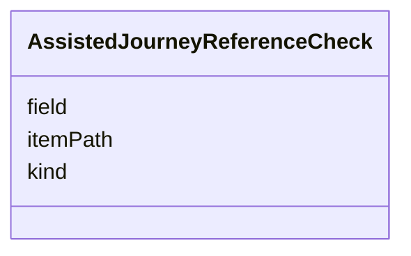

---
search:
  boost: 10.0
---

# Class: AssistedJourneyReferenceCheck

<div data-search-exclude markdown="1">


URI: [jumo:AssistedJourneyReferenceCheck](https://jumo.dev/schemas/jumo-v1/AssistedJourneyReferenceCheck)





<!-- no inheritance hierarchy -->

## Slots

| Name | Cardinality and Range | Description | Inheritance |
| ---  | --- | --- | --- |
| [field](field.md) | 1 <br/> [String](String.md) |  | direct |
| [kind](kind.md) | 1 <br/> [String](String.md) | The contract kind the value must name | direct |
| [itemPath](itemPath.md) | 0..1 <br/> [String](String.md) | For a multivalued field, the key inside each item that carries the reference | direct |


## Usages

| used by | used in | type | used |
| ---  | --- | --- | --- |
| [AssistedJourneyEmission](AssistedJourneyEmission.md) | [referenceChecks](referenceChecks.md) | range | [AssistedJourneyReferenceCheck](AssistedJourneyReferenceCheck.md) |


## Identifier and Mapping Information


### Annotations

| property | value |
| --- | --- |
| jumo.state_authority | GIT |
| jumo.model_role | VALUE_OBJECT |
| jumo.audience | REALM_PRIVATE |
| jumo.sensitivity | INTERNAL |
| jumo.boundary_eligible | True |
| jumo.schema_profiles | draft-2020-12,native-json-schema,prompted-json-validated |


### Schema Source


* from schema: https://jumo.dev/schemas/jumo-v1


## Mappings

| Mapping Type | Mapped Value |
| ---  | ---  |
| self | jumo:AssistedJourneyReferenceCheck |
| native | jumo:AssistedJourneyReferenceCheck |


## LinkML Source

<!-- TODO: investigate https://stackoverflow.com/questions/37606292/how-to-create-tabbed-code-blocks-in-mkdocs-or-sphinx -->

### Direct

<details>
```yaml
name: AssistedJourneyReferenceCheck
annotations:
  jumo.state_authority:
    tag: jumo.state_authority
    value: GIT
  jumo.model_role:
    tag: jumo.model_role
    value: VALUE_OBJECT
  jumo.audience:
    tag: jumo.audience
    value: REALM_PRIVATE
  jumo.sensitivity:
    tag: jumo.sensitivity
    value: INTERNAL
  jumo.boundary_eligible:
    tag: jumo.boundary_eligible
    value: true
  jumo.schema_profiles:
    tag: jumo.schema_profiles
    value: draft-2020-12,native-json-schema,prompted-json-validated
from_schema: https://jumo.dev/schemas/jumo-v1
attributes:
  field:
    name: field
    from_schema: https://jumo.dev/schemas/jumo-v1
    owner: AssistedJourneyReferenceCheck
    domain_of:
    - AssistedJourneyFieldValidation
    - AssistedJourneyFieldCondition
    - AssistedJourneyReferenceCheck
    - AssistedJourneyCollectionProjection
    - AssistedJourneyFieldDefault
    range: string
    required: true
  kind:
    name: kind
    description: The contract kind the value must name. Must be a declared kind (Rego).
    from_schema: https://jumo.dev/schemas/jumo-v1
    owner: AssistedJourneyReferenceCheck
    domain_of:
    - ContractReference
    - Principal
    - PrincipalIdentityBinding
    - PrincipleSet
    - Project
    - RealmTemplate
    - JumoKit
    - KitBinding
    - KitLock
    - KitReleaseCertification
    - OfferingSpec
    - RoleDefinition
    - AgentDefinition
    - RoleAssignment
    - RoleBearer
    - TeamSpec
    - CoordinationProfile
    - RoutingEligibility
    - RoleLifecyclePolicy
    - OrganizationTemplate
    - ChiefOfStaffProfile
    - AdvisorProfile
    - PersonalSpace
    - Preferences
    - SelfDescription
    - SelfDescriptionSubject
    - OrganizationSpec
    - Organization
    - OrganizationAccessBinding
    - OrganizationEnrollmentPolicy
    - OrganizationAuditRetentionPolicy
    - OrganizationRetentionHold
    - OrganizationPublicationPolicy
    - RealmPublication
    - WorkOrder
    - SolicitationContract
    - EngagementMethod
    - Practice
    - CapabilityProfile
    - WorkerRequirementProfile
    - GoldenTaskSet
    - PromptTemplate
    - ResourceBudget
    - AssistedJourney
    - JourneyVerificationSpec
    - AssistedJourneyReferenceCheck
    - DocumentTemplate
    - ActionCapabilitySet
    - PolicySet
    - ImprovementLoop
    - ImprovementRecommendation
    - AttentionItem
    - ControlCatalog
    - ComplianceProfile
    - EvidenceProfile
    - ProcessSpec
    - ProcessStep
    - ExecutionMachine
    - MachineHostDefinition
    - MachineAdminPlaybook
    - MachineRuntimeInstallation
    - CliToolDefinition
    - CliRelease
    - ProviderQuotaObservation
    - McpRegistrySource
    - McpRegistrySourceBinding
    - ConnectorDefinition
    - ConnectorAppraisal
    - McpBundle
    - RemoteMcpService
    - RemoteMcpAppraisal
    - ExecutionCell
    - SecretBinding
    - FederatedPeer
    - FederationProfile
    - ProviderAccount
    - ProviderPlatform
    - ProviderQuotaWindow
    - WorkerSubstrate
    - ConnectorIntegration
    - ConnectorPackage
    - ConnectorPackageCertification
    - OAuthClientBinding
    - InterfaceSurface
    - ThemePack
    - VocabularySet
    - ApiSurface
    - ProjectionSpec
    range: string
    required: true
  itemPath:
    name: itemPath
    description: For a multivalued field, the key inside each item that carries the
      reference.
    from_schema: https://jumo.dev/schemas/jumo-v1
    rank: 1000
    owner: AssistedJourneyReferenceCheck
    domain_of:
    - AssistedJourneyReferenceCheck
    range: string

```
</details>

### Induced

<details>
```yaml
name: AssistedJourneyReferenceCheck
annotations:
  jumo.state_authority:
    tag: jumo.state_authority
    value: GIT
  jumo.model_role:
    tag: jumo.model_role
    value: VALUE_OBJECT
  jumo.audience:
    tag: jumo.audience
    value: REALM_PRIVATE
  jumo.sensitivity:
    tag: jumo.sensitivity
    value: INTERNAL
  jumo.boundary_eligible:
    tag: jumo.boundary_eligible
    value: true
  jumo.schema_profiles:
    tag: jumo.schema_profiles
    value: draft-2020-12,native-json-schema,prompted-json-validated
from_schema: https://jumo.dev/schemas/jumo-v1
attributes:
  field:
    name: field
    from_schema: https://jumo.dev/schemas/jumo-v1
    owner: AssistedJourneyReferenceCheck
    domain_of:
    - AssistedJourneyFieldValidation
    - AssistedJourneyFieldCondition
    - AssistedJourneyReferenceCheck
    - AssistedJourneyCollectionProjection
    - AssistedJourneyFieldDefault
    range: string
    required: true
  kind:
    name: kind
    description: The contract kind the value must name. Must be a declared kind (Rego).
    from_schema: https://jumo.dev/schemas/jumo-v1
    owner: AssistedJourneyReferenceCheck
    domain_of:
    - ContractReference
    - Principal
    - PrincipalIdentityBinding
    - PrincipleSet
    - Project
    - RealmTemplate
    - JumoKit
    - KitBinding
    - KitLock
    - KitReleaseCertification
    - OfferingSpec
    - RoleDefinition
    - AgentDefinition
    - RoleAssignment
    - RoleBearer
    - TeamSpec
    - CoordinationProfile
    - RoutingEligibility
    - RoleLifecyclePolicy
    - OrganizationTemplate
    - ChiefOfStaffProfile
    - AdvisorProfile
    - PersonalSpace
    - Preferences
    - SelfDescription
    - SelfDescriptionSubject
    - OrganizationSpec
    - Organization
    - OrganizationAccessBinding
    - OrganizationEnrollmentPolicy
    - OrganizationAuditRetentionPolicy
    - OrganizationRetentionHold
    - OrganizationPublicationPolicy
    - RealmPublication
    - WorkOrder
    - SolicitationContract
    - EngagementMethod
    - Practice
    - CapabilityProfile
    - WorkerRequirementProfile
    - GoldenTaskSet
    - PromptTemplate
    - ResourceBudget
    - AssistedJourney
    - JourneyVerificationSpec
    - AssistedJourneyReferenceCheck
    - DocumentTemplate
    - ActionCapabilitySet
    - PolicySet
    - ImprovementLoop
    - ImprovementRecommendation
    - AttentionItem
    - ControlCatalog
    - ComplianceProfile
    - EvidenceProfile
    - ProcessSpec
    - ProcessStep
    - ExecutionMachine
    - MachineHostDefinition
    - MachineAdminPlaybook
    - MachineRuntimeInstallation
    - CliToolDefinition
    - CliRelease
    - ProviderQuotaObservation
    - McpRegistrySource
    - McpRegistrySourceBinding
    - ConnectorDefinition
    - ConnectorAppraisal
    - McpBundle
    - RemoteMcpService
    - RemoteMcpAppraisal
    - ExecutionCell
    - SecretBinding
    - FederatedPeer
    - FederationProfile
    - ProviderAccount
    - ProviderPlatform
    - ProviderQuotaWindow
    - WorkerSubstrate
    - ConnectorIntegration
    - ConnectorPackage
    - ConnectorPackageCertification
    - OAuthClientBinding
    - InterfaceSurface
    - ThemePack
    - VocabularySet
    - ApiSurface
    - ProjectionSpec
    range: string
    required: true
  itemPath:
    name: itemPath
    description: For a multivalued field, the key inside each item that carries the
      reference.
    from_schema: https://jumo.dev/schemas/jumo-v1
    rank: 1000
    owner: AssistedJourneyReferenceCheck
    domain_of:
    - AssistedJourneyReferenceCheck
    range: string

```
</details></div>