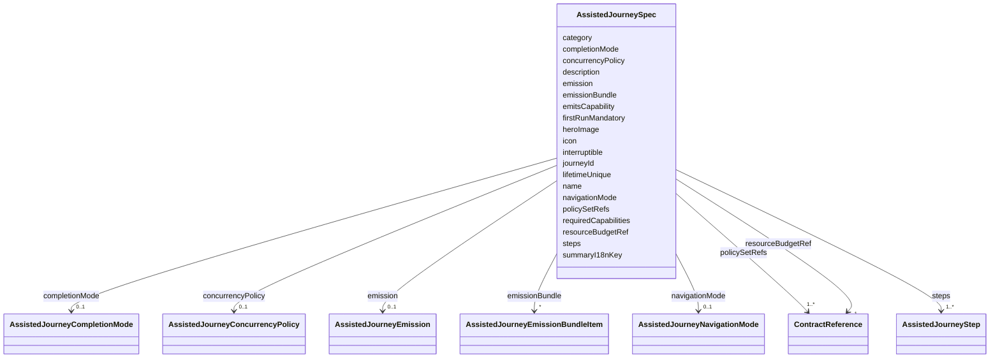

---
search:
  boost: 10.0
---

# Class: AssistedJourneySpec

<div data-search-exclude markdown="1">


URI: [jumo:AssistedJourneySpec](https://jumo.dev/schemas/jumo-v1/AssistedJourneySpec)





<!-- no inheritance hierarchy -->

## Slots

| Name | Cardinality and Range | Description | Inheritance |
| ---  | --- | --- | --- |
| [journeyId](journeyId.md) | 1 <br/> [String](String.md) |  | direct |
| [name](name.md) | 1 <br/> [String](String.md) |  | direct |
| [description](description.md) | 0..1 <br/> [String](String.md) |  | direct |
| [category](category.md) | 0..1 <br/> [String](String.md) | Catalog category for this journey | direct |
| [icon](icon.md) | 0..1 <br/> [String](String.md) | Display icon for this journey | direct |
| [interruptible](interruptible.md) | 0..1 <br/> [Boolean](Boolean.md) |  | direct |
| [concurrencyPolicy](concurrencyPolicy.md) | 0..1 <br/> [AssistedJourneyConcurrencyPolicy](AssistedJourneyConcurrencyPolicy.md) |  | direct |
| [firstRunMandatory](firstRunMandatory.md) | 0..1 <br/> [Boolean](Boolean.md) |  | direct |
| [lifetimeUnique](lifetimeUnique.md) | 0..1 <br/> [Boolean](Boolean.md) |  | direct |
| [heroImage](heroImage.md) | 0..1 <br/> [String](String.md) |  | direct |
| [resourceBudgetRef](resourceBudgetRef.md) | 1 <br/> [ContractReference](ContractReference.md) | Names the ResourceBudget whose modelCalls limit bounds the clarification-turn... | direct |
| [requiredCapabilities](requiredCapabilities.md) | 1..* <br/> [CapabilityName](CapabilityName.md) | Complete capability allowlist for this journey | direct |
| [policySetRefs](policySetRefs.md) | 1..* <br/> [ContractReference](ContractReference.md) | PolicySet contracts that govern every admission to this journey | direct |
| [emitsCapability](emitsCapability.md) | 0..1 <br/> [CapabilityName](CapabilityName.md) | The single capability a proposal journey may invoke | direct |
| [completionMode](completionMode.md) | 0..1 <br/> [AssistedJourneyCompletionMode](AssistedJourneyCompletionMode.md) |  | direct |
| [navigationMode](navigationMode.md) | 0..1 <br/> [AssistedJourneyNavigationMode](AssistedJourneyNavigationMode.md) | FREE permits navigation among dependency-ready steps; dependencies remain man... | direct |
| [emission](emission.md) | 0..1 <br/> [AssistedJourneyEmission](AssistedJourneyEmission.md) | What a PROPOSAL journey emits when its run completes: the contract kind, wher... | direct |
| [emissionBundle](emissionBundle.md) | * <br/> [AssistedJourneyEmissionBundleItem](AssistedJourneyEmissionBundleItem.md) | The atomic same-repository alternative to emission: an ordered list of docume... | direct |
| [steps](steps.md) | 1..* <br/> [AssistedJourneyStep](AssistedJourneyStep.md) |  | direct |
| [summaryI18nKey](summaryI18nKey.md) | 1 <br/> [String](String.md) | Prefix JourneySummaryStep | direct |


## Usages

| used by | used in | type | used |
| ---  | --- | --- | --- |
| [AssistedJourney](AssistedJourney.md) | [spec](spec.md) | range | [AssistedJourneySpec](AssistedJourneySpec.md) |


## Identifier and Mapping Information


### Annotations

| property | value |
| --- | --- |
| jumo.state_authority | GIT |
| jumo.model_role | VALUE_OBJECT |
| jumo.audience | REALM_PRIVATE |
| jumo.sensitivity | INTERNAL |
| jumo.boundary_eligible | True |
| jumo.schema_profiles | draft-2020-12,native-json-schema,prompted-json-validated |


### Schema Source


* from schema: https://jumo.dev/schemas/jumo-v1


## Mappings

| Mapping Type | Mapped Value |
| ---  | ---  |
| self | jumo:AssistedJourneySpec |
| native | jumo:AssistedJourneySpec |


## LinkML Source

<!-- TODO: investigate https://stackoverflow.com/questions/37606292/how-to-create-tabbed-code-blocks-in-mkdocs-or-sphinx -->

### Direct

<details>
```yaml
name: AssistedJourneySpec
annotations:
  jumo.state_authority:
    tag: jumo.state_authority
    value: GIT
  jumo.model_role:
    tag: jumo.model_role
    value: VALUE_OBJECT
  jumo.audience:
    tag: jumo.audience
    value: REALM_PRIVATE
  jumo.sensitivity:
    tag: jumo.sensitivity
    value: INTERNAL
  jumo.boundary_eligible:
    tag: jumo.boundary_eligible
    value: true
  jumo.schema_profiles:
    tag: jumo.schema_profiles
    value: draft-2020-12,native-json-schema,prompted-json-validated
from_schema: https://jumo.dev/schemas/jumo-v1
attributes:
  journeyId:
    name: journeyId
    from_schema: https://jumo.dev/schemas/jumo-v1
    rank: 1000
    owner: AssistedJourneySpec
    domain_of:
    - AssistedJourneySpec
    range: string
    required: true
    pattern: ^[a-z][a-z0-9-]*$
  name:
    name: name
    from_schema: https://jumo.dev/schemas/jumo-v1
    owner: AssistedJourneySpec
    domain_of:
    - Metadata
    - MethodologySource
    - SelfDescriptionFact
    - AgentCardSkill
    - PromptVariable
    - AssistedJourneySpec
    - AssistedJourneyStep
    - ActionCapability
    - McpToolDescriptor
    range: string
    required: true
  description:
    name: description
    from_schema: https://jumo.dev/schemas/jumo-v1
    owner: AssistedJourneySpec
    domain_of:
    - PromptVariable
    - AssistedJourneySpec
    - AssistedJourneyStep
    - ActionCapability
    - MachineAdminPlaybookSpec
    - ConnectorOperation
    - McpBundleOperation
    - McpToolDescriptor
    - PlannedOperation
    - ConnectorIntegrationSpec
    - ApiResponseBinding
    range: string
  category:
    name: category
    description: Catalog category for this journey.
    from_schema: https://jumo.dev/schemas/jumo-v1
    rank: 1000
    owner: AssistedJourneySpec
    domain_of:
    - AssistedJourneySpec
    - Control
    - ConnectorIntegrationSpec
    range: string
  icon:
    name: icon
    description: Display icon for this journey.
    from_schema: https://jumo.dev/schemas/jumo-v1
    rank: 1000
    owner: AssistedJourneySpec
    domain_of:
    - AssistedJourneySpec
    range: string
  interruptible:
    name: interruptible
    from_schema: https://jumo.dev/schemas/jumo-v1
    rank: 1000
    ifabsent: 'true'
    owner: AssistedJourneySpec
    domain_of:
    - AssistedJourneySpec
    range: boolean
  concurrencyPolicy:
    name: concurrencyPolicy
    from_schema: https://jumo.dev/schemas/jumo-v1
    rank: 1000
    owner: AssistedJourneySpec
    domain_of:
    - AssistedJourneySpec
    range: AssistedJourneyConcurrencyPolicy
  firstRunMandatory:
    name: firstRunMandatory
    from_schema: https://jumo.dev/schemas/jumo-v1
    rank: 1000
    ifabsent: 'false'
    owner: AssistedJourneySpec
    domain_of:
    - AssistedJourneySpec
    range: boolean
  lifetimeUnique:
    name: lifetimeUnique
    from_schema: https://jumo.dev/schemas/jumo-v1
    rank: 1000
    ifabsent: 'false'
    owner: AssistedJourneySpec
    domain_of:
    - AssistedJourneySpec
    range: boolean
  heroImage:
    name: heroImage
    from_schema: https://jumo.dev/schemas/jumo-v1
    rank: 1000
    owner: AssistedJourneySpec
    domain_of:
    - AssistedJourneySpec
    range: string
  resourceBudgetRef:
    name: resourceBudgetRef
    description: Names the ResourceBudget whose modelCalls limit bounds the clarification-turn
      ceiling (AC1). The journey does not declare its own ceiling.
    from_schema: https://jumo.dev/schemas/jumo-v1
    owner: AssistedJourneySpec
    domain_of:
    - WorkOrderSpec
    - EngagementMethodSpec
    - PracticeSpec
    - PromptTemplateSpec
    - AssistedJourneySpec
    - ProcessSpecBody
    range: ContractReference
    required: true
    inlined: true
  requiredCapabilities:
    name: requiredCapabilities
    description: Complete capability allowlist for this journey. The runtime journey
      authorization entrypoint checks every admitted action against it; ProjectionSpec.actions
      and emitsCapability must be subsets (Rego).
    from_schema: https://jumo.dev/schemas/jumo-v1
    rank: 1000
    owner: AssistedJourneySpec
    domain_of:
    - AssistedJourneySpec
    range: CapabilityName
    required: true
    multivalued: true
    minimum_cardinality: 1
  policySetRefs:
    name: policySetRefs
    description: PolicySet contracts that govern every admission to this journey.
      The runtime refuses the journey unless each reference is active on the addressed
      RealmTemplate.
    from_schema: https://jumo.dev/schemas/jumo-v1
    owner: AssistedJourneySpec
    domain_of:
    - RealmTemplateSpec
    - AssistedJourneySpec
    range: ContractReference
    required: true
    multivalued: true
    inlined: true
    inlined_as_list: true
    minimum_cardinality: 1
  emitsCapability:
    name: emitsCapability
    description: The single capability a proposal journey may invoke. Observation
      journeys leave this absent.
    from_schema: https://jumo.dev/schemas/jumo-v1
    rank: 1000
    owner: AssistedJourneySpec
    domain_of:
    - AssistedJourneySpec
    range: CapabilityName
  completionMode:
    name: completionMode
    from_schema: https://jumo.dev/schemas/jumo-v1
    rank: 1000
    ifabsent: PROPOSAL
    owner: AssistedJourneySpec
    domain_of:
    - AssistedJourneySpec
    range: AssistedJourneyCompletionMode
  navigationMode:
    name: navigationMode
    description: FREE permits navigation among dependency-ready steps; dependencies
      remain mandatory server-side.
    from_schema: https://jumo.dev/schemas/jumo-v1
    rank: 1000
    ifabsent: SEQUENTIAL
    owner: AssistedJourneySpec
    domain_of:
    - AssistedJourneySpec
    range: AssistedJourneyNavigationMode
  emission:
    name: emission
    description: 'What a PROPOSAL journey emits when its run completes: the contract
      kind, where it is written, the template that renders it, and the checks the
      collected fields must pass. Rego requires it of every PROPOSAL journey (canonical
      decision 15) -- without it the platform would have to recognise the journey
      by name to know what it produces, which is the dispatch this slot exists to
      remove. A journey declares emission or emissionBundle, never both (Rego).'
    from_schema: https://jumo.dev/schemas/jumo-v1
    rank: 1000
    owner: AssistedJourneySpec
    domain_of:
    - AssistedJourneySpec
    - AssistedJourneyEmissionBundleItem
    range: AssistedJourneyEmission
    inlined: true
  emissionBundle:
    name: emissionBundle
    description: 'The atomic same-repository alternative to emission: an ordered list
      of documents one run writes together, each reusing AssistedJourneyEmission unchanged
      and optionally fanning out over a collected collection field or gated by an
      equality condition. Runtime path resolution and atomic intake are a later lot;
      this vocabulary only.'
    from_schema: https://jumo.dev/schemas/jumo-v1
    rank: 1000
    owner: AssistedJourneySpec
    domain_of:
    - AssistedJourneySpec
    range: AssistedJourneyEmissionBundleItem
    multivalued: true
    inlined: true
    inlined_as_list: true
  steps:
    name: steps
    from_schema: https://jumo.dev/schemas/jumo-v1
    rank: 1000
    owner: AssistedJourneySpec
    domain_of:
    - AssistedJourneySpec
    - ProcessSpecBody
    range: AssistedJourneyStep
    required: true
    multivalued: true
    inlined: true
    inlined_as_list: true
  summaryI18nKey:
    name: summaryI18nKey
    description: 'Prefix JourneySummaryStep.vue resolves three keys from at its completion
      step: `${summaryI18nKey}Title`, `${summaryI18nKey}ConfirmLabel` and `${summaryI18nKey}SuccessMessage`.
      Lets one generic completion component describe what this journey actually produced
      instead of fixed onboarding text.'
    from_schema: https://jumo.dev/schemas/jumo-v1
    rank: 1000
    owner: AssistedJourneySpec
    domain_of:
    - AssistedJourneySpec
    range: string
    required: true
    pattern: ^[a-z][a-zA-Z0-9]*$

```
</details>

### Induced

<details>
```yaml
name: AssistedJourneySpec
annotations:
  jumo.state_authority:
    tag: jumo.state_authority
    value: GIT
  jumo.model_role:
    tag: jumo.model_role
    value: VALUE_OBJECT
  jumo.audience:
    tag: jumo.audience
    value: REALM_PRIVATE
  jumo.sensitivity:
    tag: jumo.sensitivity
    value: INTERNAL
  jumo.boundary_eligible:
    tag: jumo.boundary_eligible
    value: true
  jumo.schema_profiles:
    tag: jumo.schema_profiles
    value: draft-2020-12,native-json-schema,prompted-json-validated
from_schema: https://jumo.dev/schemas/jumo-v1
attributes:
  journeyId:
    name: journeyId
    from_schema: https://jumo.dev/schemas/jumo-v1
    rank: 1000
    owner: AssistedJourneySpec
    domain_of:
    - AssistedJourneySpec
    range: string
    required: true
    pattern: ^[a-z][a-z0-9-]*$
  name:
    name: name
    from_schema: https://jumo.dev/schemas/jumo-v1
    owner: AssistedJourneySpec
    domain_of:
    - Metadata
    - MethodologySource
    - SelfDescriptionFact
    - AgentCardSkill
    - PromptVariable
    - AssistedJourneySpec
    - AssistedJourneyStep
    - ActionCapability
    - McpToolDescriptor
    range: string
    required: true
  description:
    name: description
    from_schema: https://jumo.dev/schemas/jumo-v1
    owner: AssistedJourneySpec
    domain_of:
    - PromptVariable
    - AssistedJourneySpec
    - AssistedJourneyStep
    - ActionCapability
    - MachineAdminPlaybookSpec
    - ConnectorOperation
    - McpBundleOperation
    - McpToolDescriptor
    - PlannedOperation
    - ConnectorIntegrationSpec
    - ApiResponseBinding
    range: string
  category:
    name: category
    description: Catalog category for this journey.
    from_schema: https://jumo.dev/schemas/jumo-v1
    rank: 1000
    owner: AssistedJourneySpec
    domain_of:
    - AssistedJourneySpec
    - Control
    - ConnectorIntegrationSpec
    range: string
  icon:
    name: icon
    description: Display icon for this journey.
    from_schema: https://jumo.dev/schemas/jumo-v1
    rank: 1000
    owner: AssistedJourneySpec
    domain_of:
    - AssistedJourneySpec
    range: string
  interruptible:
    name: interruptible
    from_schema: https://jumo.dev/schemas/jumo-v1
    rank: 1000
    ifabsent: 'true'
    owner: AssistedJourneySpec
    domain_of:
    - AssistedJourneySpec
    range: boolean
  concurrencyPolicy:
    name: concurrencyPolicy
    from_schema: https://jumo.dev/schemas/jumo-v1
    rank: 1000
    owner: AssistedJourneySpec
    domain_of:
    - AssistedJourneySpec
    range: AssistedJourneyConcurrencyPolicy
  firstRunMandatory:
    name: firstRunMandatory
    from_schema: https://jumo.dev/schemas/jumo-v1
    rank: 1000
    ifabsent: 'false'
    owner: AssistedJourneySpec
    domain_of:
    - AssistedJourneySpec
    range: boolean
  lifetimeUnique:
    name: lifetimeUnique
    from_schema: https://jumo.dev/schemas/jumo-v1
    rank: 1000
    ifabsent: 'false'
    owner: AssistedJourneySpec
    domain_of:
    - AssistedJourneySpec
    range: boolean
  heroImage:
    name: heroImage
    from_schema: https://jumo.dev/schemas/jumo-v1
    rank: 1000
    owner: AssistedJourneySpec
    domain_of:
    - AssistedJourneySpec
    range: string
  resourceBudgetRef:
    name: resourceBudgetRef
    description: Names the ResourceBudget whose modelCalls limit bounds the clarification-turn
      ceiling (AC1). The journey does not declare its own ceiling.
    from_schema: https://jumo.dev/schemas/jumo-v1
    owner: AssistedJourneySpec
    domain_of:
    - WorkOrderSpec
    - EngagementMethodSpec
    - PracticeSpec
    - PromptTemplateSpec
    - AssistedJourneySpec
    - ProcessSpecBody
    range: ContractReference
    required: true
    inlined: true
  requiredCapabilities:
    name: requiredCapabilities
    description: Complete capability allowlist for this journey. The runtime journey
      authorization entrypoint checks every admitted action against it; ProjectionSpec.actions
      and emitsCapability must be subsets (Rego).
    from_schema: https://jumo.dev/schemas/jumo-v1
    rank: 1000
    owner: AssistedJourneySpec
    domain_of:
    - AssistedJourneySpec
    range: CapabilityName
    required: true
    multivalued: true
    minimum_cardinality: 1
  policySetRefs:
    name: policySetRefs
    description: PolicySet contracts that govern every admission to this journey.
      The runtime refuses the journey unless each reference is active on the addressed
      RealmTemplate.
    from_schema: https://jumo.dev/schemas/jumo-v1
    owner: AssistedJourneySpec
    domain_of:
    - RealmTemplateSpec
    - AssistedJourneySpec
    range: ContractReference
    required: true
    multivalued: true
    inlined: true
    inlined_as_list: true
    minimum_cardinality: 1
  emitsCapability:
    name: emitsCapability
    description: The single capability a proposal journey may invoke. Observation
      journeys leave this absent.
    from_schema: https://jumo.dev/schemas/jumo-v1
    rank: 1000
    owner: AssistedJourneySpec
    domain_of:
    - AssistedJourneySpec
    range: CapabilityName
  completionMode:
    name: completionMode
    from_schema: https://jumo.dev/schemas/jumo-v1
    rank: 1000
    ifabsent: PROPOSAL
    owner: AssistedJourneySpec
    domain_of:
    - AssistedJourneySpec
    range: AssistedJourneyCompletionMode
  navigationMode:
    name: navigationMode
    description: FREE permits navigation among dependency-ready steps; dependencies
      remain mandatory server-side.
    from_schema: https://jumo.dev/schemas/jumo-v1
    rank: 1000
    ifabsent: SEQUENTIAL
    owner: AssistedJourneySpec
    domain_of:
    - AssistedJourneySpec
    range: AssistedJourneyNavigationMode
  emission:
    name: emission
    description: 'What a PROPOSAL journey emits when its run completes: the contract
      kind, where it is written, the template that renders it, and the checks the
      collected fields must pass. Rego requires it of every PROPOSAL journey (canonical
      decision 15) -- without it the platform would have to recognise the journey
      by name to know what it produces, which is the dispatch this slot exists to
      remove. A journey declares emission or emissionBundle, never both (Rego).'
    from_schema: https://jumo.dev/schemas/jumo-v1
    rank: 1000
    owner: AssistedJourneySpec
    domain_of:
    - AssistedJourneySpec
    - AssistedJourneyEmissionBundleItem
    range: AssistedJourneyEmission
    inlined: true
  emissionBundle:
    name: emissionBundle
    description: 'The atomic same-repository alternative to emission: an ordered list
      of documents one run writes together, each reusing AssistedJourneyEmission unchanged
      and optionally fanning out over a collected collection field or gated by an
      equality condition. Runtime path resolution and atomic intake are a later lot;
      this vocabulary only.'
    from_schema: https://jumo.dev/schemas/jumo-v1
    rank: 1000
    owner: AssistedJourneySpec
    domain_of:
    - AssistedJourneySpec
    range: AssistedJourneyEmissionBundleItem
    multivalued: true
    inlined: true
    inlined_as_list: true
  steps:
    name: steps
    from_schema: https://jumo.dev/schemas/jumo-v1
    rank: 1000
    owner: AssistedJourneySpec
    domain_of:
    - AssistedJourneySpec
    - ProcessSpecBody
    range: AssistedJourneyStep
    required: true
    multivalued: true
    inlined: true
    inlined_as_list: true
  summaryI18nKey:
    name: summaryI18nKey
    description: 'Prefix JourneySummaryStep.vue resolves three keys from at its completion
      step: `${summaryI18nKey}Title`, `${summaryI18nKey}ConfirmLabel` and `${summaryI18nKey}SuccessMessage`.
      Lets one generic completion component describe what this journey actually produced
      instead of fixed onboarding text.'
    from_schema: https://jumo.dev/schemas/jumo-v1
    rank: 1000
    owner: AssistedJourneySpec
    domain_of:
    - AssistedJourneySpec
    range: string
    required: true
    pattern: ^[a-z][a-zA-Z0-9]*$

```
</details></div>