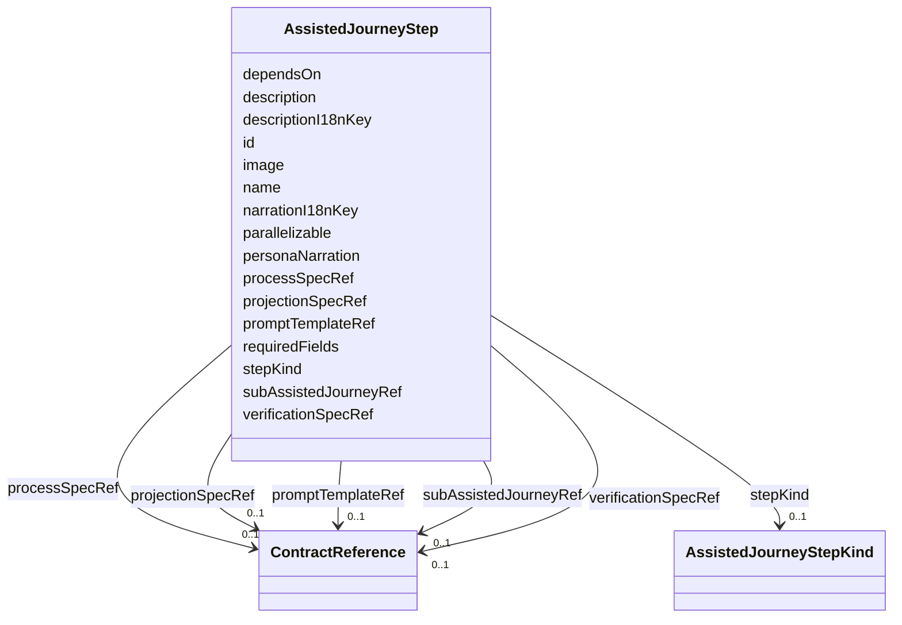

---
search:
  boost: 10.0
---

# Class: AssistedJourneyStep


_stepKind/projectionRef/processRef are additive: the model-driven rendering engine that consumes them does not exist yet, so requiredFields stays required and load-bearing -- JourneyService (control-plane) reads it server-side and apps/web/components/journey/JourneyRunner.vue reads it client-side. requiredFields is retired once every AssistedJourney step declares projectionRef/processRef and the renderer that replaces JourneyRunner.vue exists; until then both describe the same steps._


<div data-search-exclude markdown="1">


URI: [jumo:AssistedJourneyStep](https://jumo.dev/schemas/jumo-v1/AssistedJourneyStep)





<!-- no inheritance hierarchy -->

## Slots

| Name | Cardinality and Range | Description | Inheritance |
| ---  | --- | --- | --- |
| [id](id.md) | 1 <br/> [String](String.md) |  | direct |
| [name](name.md) | 1 <br/> [String](String.md) |  | direct |
| [description](description.md) | 0..1 <br/> [String](String.md) |  | direct |
| [personaNarration](personaNarration.md) | 0..1 <br/> [String](String.md) |  | direct |
| [stepKind](stepKind.md) | 0..1 <br/> [AssistedJourneyStepKind](AssistedJourneyStepKind.md) | Required from the model-driven renderer onward (Rego) | direct |
| [projectionSpecRef](projectionSpecRef.md) | 0..1 <br/> [ContractReference](ContractReference.md) | The ProjectionSpec this step renders | direct |
| [processSpecRef](processSpecRef.md) | 0..1 <br/> [ContractReference](ContractReference.md) | The ProcessSpec whose run an AWAIT step observes | direct |
| [promptTemplateRef](promptTemplateRef.md) | 0..1 <br/> [ContractReference](ContractReference.md) | The PromptTemplate this step uses when stepKind is DIALOGUE_COLLECT | direct |
| [subAssistedJourneyRef](subAssistedJourneyRef.md) | 0..1 <br/> [ContractReference](ContractReference.md) | The AssistedJourney this step delegates to when stepKind is SUB_JOURNEY | direct |
| [verificationSpecRef](verificationSpecRef.md) | 0..1 <br/> [ContractReference](ContractReference.md) | Generic real observation required before this step can advance | direct |
| [dependsOn](dependsOn.md) | * <br/> [String](String.md) | Step IDs that must be completed before this step becomes available | direct |
| [parallelizable](parallelizable.md) | 0..1 <br/> [Boolean](Boolean.md) | Marks a dependency-ready step as part of a parallelizable work group in the r... | direct |
| [image](image.md) | 0..1 <br/> [String](String.md) | Step-level hero image, overriding the journey's heroImage for this step only | direct |
| [descriptionI18nKey](descriptionI18nKey.md) | 0..1 <br/> [String](String.md) | i18n key resolving this step's user-facing description | direct |
| [narrationI18nKey](narrationI18nKey.md) | 0..1 <br/> [String](String.md) | i18n key resolving this step's personaNarration ("Nestor's voice") | direct |
| [requiredFields](requiredFields.md) | * <br/> [String](String.md) |  | direct |


## Usages

| used by | used in | type | used |
| ---  | --- | --- | --- |
| [AssistedJourneySpec](AssistedJourneySpec.md) | [steps](steps.md) | range | [AssistedJourneyStep](AssistedJourneyStep.md) |


## Identifier and Mapping Information


### Annotations

| property | value |
| --- | --- |
| jumo.state_authority | GIT |
| jumo.model_role | VALUE_OBJECT |
| jumo.audience | REALM_PRIVATE |
| jumo.sensitivity | INTERNAL |
| jumo.boundary_eligible | True |
| jumo.schema_profiles | draft-2020-12,native-json-schema,prompted-json-validated |


### Schema Source


* from schema: https://jumo.dev/schemas/jumo-v1


## Mappings

| Mapping Type | Mapped Value |
| ---  | ---  |
| self | jumo:AssistedJourneyStep |
| native | jumo:AssistedJourneyStep |


## LinkML Source

<!-- TODO: investigate https://stackoverflow.com/questions/37606292/how-to-create-tabbed-code-blocks-in-mkdocs-or-sphinx -->

### Direct

<details>
```yaml
name: AssistedJourneyStep
annotations:
  jumo.state_authority:
    tag: jumo.state_authority
    value: GIT
  jumo.model_role:
    tag: jumo.model_role
    value: VALUE_OBJECT
  jumo.audience:
    tag: jumo.audience
    value: REALM_PRIVATE
  jumo.sensitivity:
    tag: jumo.sensitivity
    value: INTERNAL
  jumo.boundary_eligible:
    tag: jumo.boundary_eligible
    value: true
  jumo.schema_profiles:
    tag: jumo.schema_profiles
    value: draft-2020-12,native-json-schema,prompted-json-validated
description: 'stepKind/projectionRef/processRef are additive: the model-driven rendering
  engine that consumes them does not exist yet, so requiredFields stays required and
  load-bearing -- JourneyService (control-plane) reads it server-side and apps/web/components/journey/JourneyRunner.vue
  reads it client-side. requiredFields is retired once every AssistedJourney step
  declares projectionRef/processRef and the renderer that replaces JourneyRunner.vue
  exists; until then both describe the same steps.'
from_schema: https://jumo.dev/schemas/jumo-v1
attributes:
  id:
    name: id
    from_schema: https://jumo.dev/schemas/jumo-v1
    owner: AssistedJourneyStep
    domain_of:
    - ContractReference
    - Metadata
    - LayerOverride
    - Principle
    - Milestone
    - RepositoryBinding
    - KitProfile
    - KitModule
    - DispositionRule
    - SelfDescriptionSubject
    - AgentCardSkill
    - AcceptanceCriterion
    - EngagementStage
    - GoldenTaskCase
    - AssistedJourneyStep
    - PolicyRule
    - AttentionDecisionOption
    - ProcessStep
    - ProcessFlow
    - ChangeProposalRef
    - ForgeProjectionRef
    - ProcessRunRef
    - ApprovalSignal
    - ExecutionCellProvisioningRef
    - ConnectorOperation
    - McpBundleOperation
    - ProviderSessionBinding
    - RoutingDecision
    - WorkerInvocation
    - EvidenceRecord
    - Surface
    - ProjectionSection
    range: string
    required: true
  name:
    name: name
    from_schema: https://jumo.dev/schemas/jumo-v1
    owner: AssistedJourneyStep
    domain_of:
    - Metadata
    - MethodologySource
    - SelfDescriptionFact
    - AgentCardSkill
    - PromptVariable
    - AssistedJourneySpec
    - AssistedJourneyStep
    - ActionCapability
    - McpToolDescriptor
    range: string
    required: true
  description:
    name: description
    from_schema: https://jumo.dev/schemas/jumo-v1
    owner: AssistedJourneyStep
    domain_of:
    - PromptVariable
    - AssistedJourneySpec
    - AssistedJourneyStep
    - ActionCapability
    - MachineAdminPlaybookSpec
    - ConnectorOperation
    - McpBundleOperation
    - McpToolDescriptor
    - PlannedOperation
    - ConnectorIntegrationSpec
    - ApiResponseBinding
    range: string
  personaNarration:
    name: personaNarration
    from_schema: https://jumo.dev/schemas/jumo-v1
    rank: 1000
    owner: AssistedJourneyStep
    domain_of:
    - AssistedJourneyStep
    range: string
  stepKind:
    name: stepKind
    description: Required from the model-driven renderer onward (Rego).
    from_schema: https://jumo.dev/schemas/jumo-v1
    rank: 1000
    owner: AssistedJourneyStep
    domain_of:
    - AssistedJourneyStep
    range: AssistedJourneyStepKind
  projectionSpecRef:
    name: projectionSpecRef
    description: The ProjectionSpec this step renders. Its `of:` class is the step
      payload type, so the shape is derived rather than declared twice. Required on
      COLLECT and CONFIRM once stepKind is set (Rego).
    from_schema: https://jumo.dev/schemas/jumo-v1
    rank: 1000
    owner: AssistedJourneyStep
    domain_of:
    - AssistedJourneyStep
    range: ContractReference
    inlined: true
  processSpecRef:
    name: processSpecRef
    description: The ProcessSpec whose run an AWAIT step observes. Required on AWAIT
      once stepKind is set (Rego).
    from_schema: https://jumo.dev/schemas/jumo-v1
    owner: AssistedJourneyStep
    domain_of:
    - PracticeSpec
    - AssistedJourneyStep
    range: ContractReference
    inlined: true
  promptTemplateRef:
    name: promptTemplateRef
    description: The PromptTemplate this step uses when stepKind is DIALOGUE_COLLECT.
    from_schema: https://jumo.dev/schemas/jumo-v1
    owner: AssistedJourneyStep
    domain_of:
    - EngagementStage
    - AssistedJourneyStep
    range: ContractReference
    inlined: true
  subAssistedJourneyRef:
    name: subAssistedJourneyRef
    description: The AssistedJourney this step delegates to when stepKind is SUB_JOURNEY.
    from_schema: https://jumo.dev/schemas/jumo-v1
    rank: 1000
    owner: AssistedJourneyStep
    domain_of:
    - AssistedJourneyStep
    range: ContractReference
    inlined: true
  verificationSpecRef:
    name: verificationSpecRef
    description: Generic real observation required before this step can advance.
    from_schema: https://jumo.dev/schemas/jumo-v1
    rank: 1000
    owner: AssistedJourneyStep
    domain_of:
    - AssistedJourneyStep
    range: ContractReference
    inlined: true
  dependsOn:
    name: dependsOn
    description: Step IDs that must be completed before this step becomes available.
    from_schema: https://jumo.dev/schemas/jumo-v1
    rank: 1000
    owner: AssistedJourneyStep
    domain_of:
    - AssistedJourneyStep
    range: string
    multivalued: true
  parallelizable:
    name: parallelizable
    description: Marks a dependency-ready step as part of a parallelizable work group
      in the renderer.
    from_schema: https://jumo.dev/schemas/jumo-v1
    rank: 1000
    ifabsent: 'false'
    owner: AssistedJourneyStep
    domain_of:
    - AssistedJourneyStep
    range: boolean
  image:
    name: image
    description: Step-level hero image, overriding the journey's heroImage for this
      step only. Falls back to AssistedJourneySpec.heroImage when absent. Not validated
      by the schema (same convention as heroImage) -- a kit-distributed asset once
      JumoKit exports binary assets (portability.yaml).
    from_schema: https://jumo.dev/schemas/jumo-v1
    rank: 1000
    owner: AssistedJourneyStep
    domain_of:
    - AssistedJourneyStep
    - WorkerSubstrateSpec
    range: string
  descriptionI18nKey:
    name: descriptionI18nKey
    description: i18n key resolving this step's user-facing description. When present,
      takes precedence over the literal description string, which remains the fallback
      for journeys that have not been translated.
    from_schema: https://jumo.dev/schemas/jumo-v1
    rank: 1000
    owner: AssistedJourneyStep
    domain_of:
    - AssistedJourneyStep
    range: string
  narrationI18nKey:
    name: narrationI18nKey
    description: i18n key resolving this step's personaNarration ("Nestor's voice").
      Same fallback convention as descriptionI18nKey.
    from_schema: https://jumo.dev/schemas/jumo-v1
    rank: 1000
    owner: AssistedJourneyStep
    domain_of:
    - AssistedJourneyStep
    range: string
  requiredFields:
    name: requiredFields
    from_schema: https://jumo.dev/schemas/jumo-v1
    rank: 1000
    owner: AssistedJourneyStep
    domain_of:
    - AssistedJourneyStep
    range: string
    multivalued: true

```
</details>

### Induced

<details>
```yaml
name: AssistedJourneyStep
annotations:
  jumo.state_authority:
    tag: jumo.state_authority
    value: GIT
  jumo.model_role:
    tag: jumo.model_role
    value: VALUE_OBJECT
  jumo.audience:
    tag: jumo.audience
    value: REALM_PRIVATE
  jumo.sensitivity:
    tag: jumo.sensitivity
    value: INTERNAL
  jumo.boundary_eligible:
    tag: jumo.boundary_eligible
    value: true
  jumo.schema_profiles:
    tag: jumo.schema_profiles
    value: draft-2020-12,native-json-schema,prompted-json-validated
description: 'stepKind/projectionRef/processRef are additive: the model-driven rendering
  engine that consumes them does not exist yet, so requiredFields stays required and
  load-bearing -- JourneyService (control-plane) reads it server-side and apps/web/components/journey/JourneyRunner.vue
  reads it client-side. requiredFields is retired once every AssistedJourney step
  declares projectionRef/processRef and the renderer that replaces JourneyRunner.vue
  exists; until then both describe the same steps.'
from_schema: https://jumo.dev/schemas/jumo-v1
attributes:
  id:
    name: id
    from_schema: https://jumo.dev/schemas/jumo-v1
    owner: AssistedJourneyStep
    domain_of:
    - ContractReference
    - Metadata
    - LayerOverride
    - Principle
    - Milestone
    - RepositoryBinding
    - KitProfile
    - KitModule
    - DispositionRule
    - SelfDescriptionSubject
    - AgentCardSkill
    - AcceptanceCriterion
    - EngagementStage
    - GoldenTaskCase
    - AssistedJourneyStep
    - PolicyRule
    - AttentionDecisionOption
    - ProcessStep
    - ProcessFlow
    - ChangeProposalRef
    - ForgeProjectionRef
    - ProcessRunRef
    - ApprovalSignal
    - ExecutionCellProvisioningRef
    - ConnectorOperation
    - McpBundleOperation
    - ProviderSessionBinding
    - RoutingDecision
    - WorkerInvocation
    - EvidenceRecord
    - Surface
    - ProjectionSection
    range: string
    required: true
  name:
    name: name
    from_schema: https://jumo.dev/schemas/jumo-v1
    owner: AssistedJourneyStep
    domain_of:
    - Metadata
    - MethodologySource
    - SelfDescriptionFact
    - AgentCardSkill
    - PromptVariable
    - AssistedJourneySpec
    - AssistedJourneyStep
    - ActionCapability
    - McpToolDescriptor
    range: string
    required: true
  description:
    name: description
    from_schema: https://jumo.dev/schemas/jumo-v1
    owner: AssistedJourneyStep
    domain_of:
    - PromptVariable
    - AssistedJourneySpec
    - AssistedJourneyStep
    - ActionCapability
    - MachineAdminPlaybookSpec
    - ConnectorOperation
    - McpBundleOperation
    - McpToolDescriptor
    - PlannedOperation
    - ConnectorIntegrationSpec
    - ApiResponseBinding
    range: string
  personaNarration:
    name: personaNarration
    from_schema: https://jumo.dev/schemas/jumo-v1
    rank: 1000
    owner: AssistedJourneyStep
    domain_of:
    - AssistedJourneyStep
    range: string
  stepKind:
    name: stepKind
    description: Required from the model-driven renderer onward (Rego).
    from_schema: https://jumo.dev/schemas/jumo-v1
    rank: 1000
    owner: AssistedJourneyStep
    domain_of:
    - AssistedJourneyStep
    range: AssistedJourneyStepKind
  projectionSpecRef:
    name: projectionSpecRef
    description: The ProjectionSpec this step renders. Its `of:` class is the step
      payload type, so the shape is derived rather than declared twice. Required on
      COLLECT and CONFIRM once stepKind is set (Rego).
    from_schema: https://jumo.dev/schemas/jumo-v1
    rank: 1000
    owner: AssistedJourneyStep
    domain_of:
    - AssistedJourneyStep
    range: ContractReference
    inlined: true
  processSpecRef:
    name: processSpecRef
    description: The ProcessSpec whose run an AWAIT step observes. Required on AWAIT
      once stepKind is set (Rego).
    from_schema: https://jumo.dev/schemas/jumo-v1
    owner: AssistedJourneyStep
    domain_of:
    - PracticeSpec
    - AssistedJourneyStep
    range: ContractReference
    inlined: true
  promptTemplateRef:
    name: promptTemplateRef
    description: The PromptTemplate this step uses when stepKind is DIALOGUE_COLLECT.
    from_schema: https://jumo.dev/schemas/jumo-v1
    owner: AssistedJourneyStep
    domain_of:
    - EngagementStage
    - AssistedJourneyStep
    range: ContractReference
    inlined: true
  subAssistedJourneyRef:
    name: subAssistedJourneyRef
    description: The AssistedJourney this step delegates to when stepKind is SUB_JOURNEY.
    from_schema: https://jumo.dev/schemas/jumo-v1
    rank: 1000
    owner: AssistedJourneyStep
    domain_of:
    - AssistedJourneyStep
    range: ContractReference
    inlined: true
  verificationSpecRef:
    name: verificationSpecRef
    description: Generic real observation required before this step can advance.
    from_schema: https://jumo.dev/schemas/jumo-v1
    rank: 1000
    owner: AssistedJourneyStep
    domain_of:
    - AssistedJourneyStep
    range: ContractReference
    inlined: true
  dependsOn:
    name: dependsOn
    description: Step IDs that must be completed before this step becomes available.
    from_schema: https://jumo.dev/schemas/jumo-v1
    rank: 1000
    owner: AssistedJourneyStep
    domain_of:
    - AssistedJourneyStep
    range: string
    multivalued: true
  parallelizable:
    name: parallelizable
    description: Marks a dependency-ready step as part of a parallelizable work group
      in the renderer.
    from_schema: https://jumo.dev/schemas/jumo-v1
    rank: 1000
    ifabsent: 'false'
    owner: AssistedJourneyStep
    domain_of:
    - AssistedJourneyStep
    range: boolean
  image:
    name: image
    description: Step-level hero image, overriding the journey's heroImage for this
      step only. Falls back to AssistedJourneySpec.heroImage when absent. Not validated
      by the schema (same convention as heroImage) -- a kit-distributed asset once
      JumoKit exports binary assets (portability.yaml).
    from_schema: https://jumo.dev/schemas/jumo-v1
    rank: 1000
    owner: AssistedJourneyStep
    domain_of:
    - AssistedJourneyStep
    - WorkerSubstrateSpec
    range: string
  descriptionI18nKey:
    name: descriptionI18nKey
    description: i18n key resolving this step's user-facing description. When present,
      takes precedence over the literal description string, which remains the fallback
      for journeys that have not been translated.
    from_schema: https://jumo.dev/schemas/jumo-v1
    rank: 1000
    owner: AssistedJourneyStep
    domain_of:
    - AssistedJourneyStep
    range: string
  narrationI18nKey:
    name: narrationI18nKey
    description: i18n key resolving this step's personaNarration ("Nestor's voice").
      Same fallback convention as descriptionI18nKey.
    from_schema: https://jumo.dev/schemas/jumo-v1
    rank: 1000
    owner: AssistedJourneyStep
    domain_of:
    - AssistedJourneyStep
    range: string
  requiredFields:
    name: requiredFields
    from_schema: https://jumo.dev/schemas/jumo-v1
    rank: 1000
    owner: AssistedJourneyStep
    domain_of:
    - AssistedJourneyStep
    range: string
    multivalued: true

```
</details></div>