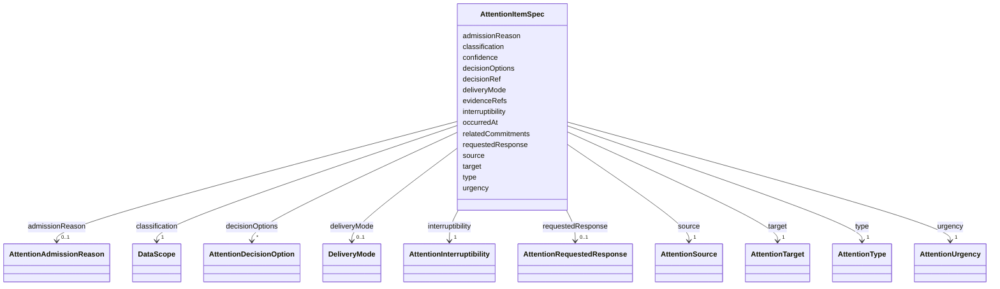

---
search:
  boost: 10.0
---

# Class: AttentionItemSpec

<div data-search-exclude markdown="1">


URI: [jumo:AttentionItemSpec](https://jumo.dev/schemas/jumo-v1/AttentionItemSpec)





<!-- no inheritance hierarchy -->

## Slots

| Name | Cardinality and Range | Description | Inheritance |
| ---  | --- | --- | --- |
| [type](type.md) | 1 <br/> [AttentionType](AttentionType.md) |  | direct |
| [source](source.md) | 1 <br/> [AttentionSource](AttentionSource.md) |  | direct |
| [target](target.md) | 1 <br/> [AttentionTarget](AttentionTarget.md) |  | direct |
| [decisionRef](decisionRef.md) | 0..1 <br/> [String](String.md) |  | direct |
| [decisionOptions](decisionOptions.md) | * <br/> [AttentionDecisionOption](AttentionDecisionOption.md) |  | direct |
| [classification](classification.md) | 1 <br/> [DataScope](DataScope.md) | Same enumeration as capability data access, retrieval and rendering (canonica... | direct |
| [urgency](urgency.md) | 1 <br/> [AttentionUrgency](AttentionUrgency.md) |  | direct |
| [interruptibility](interruptibility.md) | 1 <br/> [AttentionInterruptibility](AttentionInterruptibility.md) |  | direct |
| [requestedResponse](requestedResponse.md) | 0..1 <br/> [AttentionRequestedResponse](AttentionRequestedResponse.md) |  | direct |
| [deliveryMode](deliveryMode.md) | 0..1 <br/> [DeliveryMode](DeliveryMode.md) |  | direct |
| [confidence](confidence.md) | 0..1 <br/> [Float](Float.md) | Confidence of the interpretation behind this item, not of the outcome it repo... | direct |
| [admissionReason](admissionReason.md) | 0..1 <br/> [AttentionAdmissionReason](AttentionAdmissionReason.md) | Required on ADMISSION_REFUSED (Rego) | direct |
| [relatedCommitments](relatedCommitments.md) | * <br/> [String](String.md) |  | direct |
| [evidenceRefs](evidenceRefs.md) | * <br/> [String](String.md) |  | direct |
| [occurredAt](occurredAt.md) | 1 <br/> [Datetime](Datetime.md) |  | direct |


## Usages

| used by | used in | type | used |
| ---  | --- | --- | --- |
| [AttentionItem](AttentionItem.md) | [spec](spec.md) | range | [AttentionItemSpec](AttentionItemSpec.md) |


## Identifier and Mapping Information


### Annotations

| property | value |
| --- | --- |
| jumo.state_authority | GIT |
| jumo.model_role | VALUE_OBJECT |
| jumo.audience | REALM_PRIVATE |
| jumo.sensitivity | INTERNAL |
| jumo.boundary_eligible | True |
| jumo.schema_profiles | draft-2020-12,native-json-schema,prompted-json-validated |


### Schema Source


* from schema: https://jumo.dev/schemas/jumo-v1


## Mappings

| Mapping Type | Mapped Value |
| ---  | ---  |
| self | jumo:AttentionItemSpec |
| native | jumo:AttentionItemSpec |


## LinkML Source

<!-- TODO: investigate https://stackoverflow.com/questions/37606292/how-to-create-tabbed-code-blocks-in-mkdocs-or-sphinx -->

### Direct

<details>
```yaml
name: AttentionItemSpec
annotations:
  jumo.state_authority:
    tag: jumo.state_authority
    value: GIT
  jumo.model_role:
    tag: jumo.model_role
    value: VALUE_OBJECT
  jumo.audience:
    tag: jumo.audience
    value: REALM_PRIVATE
  jumo.sensitivity:
    tag: jumo.sensitivity
    value: INTERNAL
  jumo.boundary_eligible:
    tag: jumo.boundary_eligible
    value: true
  jumo.schema_profiles:
    tag: jumo.schema_profiles
    value: draft-2020-12,native-json-schema,prompted-json-validated
from_schema: https://jumo.dev/schemas/jumo-v1
attributes:
  type:
    name: type
    from_schema: https://jumo.dev/schemas/jumo-v1
    owner: AttentionItemSpec
    domain_of:
    - KitBindingDeclaration
    - KitModule
    - AttentionItemSpec
    - FederationMessage
    - ApiProblem
    range: AttentionType
    required: true
  source:
    name: source
    from_schema: https://jumo.dev/schemas/jumo-v1
    rank: 1000
    owner: AttentionItemSpec
    domain_of:
    - AttentionItemSpec
    - EvidenceProfileSpec
    range: AttentionSource
    required: true
    inlined: true
  target:
    name: target
    from_schema: https://jumo.dev/schemas/jumo-v1
    rank: 1000
    owner: AttentionItemSpec
    domain_of:
    - AttentionItemSpec
    - SecretInjection
    - SurfaceWritePath
    range: AttentionTarget
    required: true
    inlined: true
  decisionRef:
    name: decisionRef
    from_schema: https://jumo.dev/schemas/jumo-v1
    rank: 1000
    owner: AttentionItemSpec
    domain_of:
    - AttentionItemSpec
    range: string
    pattern: ^.{1,}$
  decisionOptions:
    name: decisionOptions
    from_schema: https://jumo.dev/schemas/jumo-v1
    rank: 1000
    owner: AttentionItemSpec
    domain_of:
    - AttentionItemSpec
    range: AttentionDecisionOption
    multivalued: true
    inlined: true
    inlined_as_list: true
  classification:
    name: classification
    description: Same enumeration as capability data access, retrieval and rendering
      (canonical decision 98).
    from_schema: https://jumo.dev/schemas/jumo-v1
    rank: 1000
    owner: AttentionItemSpec
    domain_of:
    - AttentionItemSpec
    range: DataScope
    required: true
  urgency:
    name: urgency
    from_schema: https://jumo.dev/schemas/jumo-v1
    rank: 1000
    owner: AttentionItemSpec
    domain_of:
    - AttentionItemSpec
    range: AttentionUrgency
    required: true
  interruptibility:
    name: interruptibility
    from_schema: https://jumo.dev/schemas/jumo-v1
    rank: 1000
    owner: AttentionItemSpec
    domain_of:
    - AttentionItemSpec
    range: AttentionInterruptibility
    required: true
  requestedResponse:
    name: requestedResponse
    from_schema: https://jumo.dev/schemas/jumo-v1
    rank: 1000
    owner: AttentionItemSpec
    domain_of:
    - AttentionItemSpec
    range: AttentionRequestedResponse
  deliveryMode:
    name: deliveryMode
    from_schema: https://jumo.dev/schemas/jumo-v1
    rank: 1000
    owner: AttentionItemSpec
    domain_of:
    - AttentionItemSpec
    - ConnectorCredentialRequirement
    range: DeliveryMode
  confidence:
    name: confidence
    description: Confidence of the interpretation behind this item, not of the outcome
      it reports.
    from_schema: https://jumo.dev/schemas/jumo-v1
    rank: 1000
    owner: AttentionItemSpec
    domain_of:
    - AttentionItemSpec
    - ProviderQuotaObservation
    - McpCatalogFieldCandidate
    range: float
    minimum_value: 0
    maximum_value: 1
  admissionReason:
    name: admissionReason
    description: Required on ADMISSION_REFUSED (Rego).
    from_schema: https://jumo.dev/schemas/jumo-v1
    rank: 1000
    owner: AttentionItemSpec
    domain_of:
    - AttentionItemSpec
    range: AttentionAdmissionReason
  relatedCommitments:
    name: relatedCommitments
    from_schema: https://jumo.dev/schemas/jumo-v1
    rank: 1000
    owner: AttentionItemSpec
    domain_of:
    - AttentionItemSpec
    range: string
    multivalued: true
    pattern: ^.{1,}$
  evidenceRefs:
    name: evidenceRefs
    from_schema: https://jumo.dev/schemas/jumo-v1
    owner: AttentionItemSpec
    domain_of:
    - KitReleaseCertificationSpec
    - WorkOrderSpec
    - AttentionItemSpec
    - ControlAssessment
    - ConnectorAppraisalSpec
    - RemoteMcpAppraisalSpec
    range: string
    multivalued: true
    pattern: ^.{1,}$
  occurredAt:
    name: occurredAt
    from_schema: https://jumo.dev/schemas/jumo-v1
    rank: 1000
    owner: AttentionItemSpec
    domain_of:
    - AttentionItemSpec
    range: datetime
    required: true

```
</details>

### Induced

<details>
```yaml
name: AttentionItemSpec
annotations:
  jumo.state_authority:
    tag: jumo.state_authority
    value: GIT
  jumo.model_role:
    tag: jumo.model_role
    value: VALUE_OBJECT
  jumo.audience:
    tag: jumo.audience
    value: REALM_PRIVATE
  jumo.sensitivity:
    tag: jumo.sensitivity
    value: INTERNAL
  jumo.boundary_eligible:
    tag: jumo.boundary_eligible
    value: true
  jumo.schema_profiles:
    tag: jumo.schema_profiles
    value: draft-2020-12,native-json-schema,prompted-json-validated
from_schema: https://jumo.dev/schemas/jumo-v1
attributes:
  type:
    name: type
    from_schema: https://jumo.dev/schemas/jumo-v1
    owner: AttentionItemSpec
    domain_of:
    - KitBindingDeclaration
    - KitModule
    - AttentionItemSpec
    - FederationMessage
    - ApiProblem
    range: AttentionType
    required: true
  source:
    name: source
    from_schema: https://jumo.dev/schemas/jumo-v1
    rank: 1000
    owner: AttentionItemSpec
    domain_of:
    - AttentionItemSpec
    - EvidenceProfileSpec
    range: AttentionSource
    required: true
    inlined: true
  target:
    name: target
    from_schema: https://jumo.dev/schemas/jumo-v1
    rank: 1000
    owner: AttentionItemSpec
    domain_of:
    - AttentionItemSpec
    - SecretInjection
    - SurfaceWritePath
    range: AttentionTarget
    required: true
    inlined: true
  decisionRef:
    name: decisionRef
    from_schema: https://jumo.dev/schemas/jumo-v1
    rank: 1000
    owner: AttentionItemSpec
    domain_of:
    - AttentionItemSpec
    range: string
    pattern: ^.{1,}$
  decisionOptions:
    name: decisionOptions
    from_schema: https://jumo.dev/schemas/jumo-v1
    rank: 1000
    owner: AttentionItemSpec
    domain_of:
    - AttentionItemSpec
    range: AttentionDecisionOption
    multivalued: true
    inlined: true
    inlined_as_list: true
  classification:
    name: classification
    description: Same enumeration as capability data access, retrieval and rendering
      (canonical decision 98).
    from_schema: https://jumo.dev/schemas/jumo-v1
    rank: 1000
    owner: AttentionItemSpec
    domain_of:
    - AttentionItemSpec
    range: DataScope
    required: true
  urgency:
    name: urgency
    from_schema: https://jumo.dev/schemas/jumo-v1
    rank: 1000
    owner: AttentionItemSpec
    domain_of:
    - AttentionItemSpec
    range: AttentionUrgency
    required: true
  interruptibility:
    name: interruptibility
    from_schema: https://jumo.dev/schemas/jumo-v1
    rank: 1000
    owner: AttentionItemSpec
    domain_of:
    - AttentionItemSpec
    range: AttentionInterruptibility
    required: true
  requestedResponse:
    name: requestedResponse
    from_schema: https://jumo.dev/schemas/jumo-v1
    rank: 1000
    owner: AttentionItemSpec
    domain_of:
    - AttentionItemSpec
    range: AttentionRequestedResponse
  deliveryMode:
    name: deliveryMode
    from_schema: https://jumo.dev/schemas/jumo-v1
    rank: 1000
    owner: AttentionItemSpec
    domain_of:
    - AttentionItemSpec
    - ConnectorCredentialRequirement
    range: DeliveryMode
  confidence:
    name: confidence
    description: Confidence of the interpretation behind this item, not of the outcome
      it reports.
    from_schema: https://jumo.dev/schemas/jumo-v1
    rank: 1000
    owner: AttentionItemSpec
    domain_of:
    - AttentionItemSpec
    - ProviderQuotaObservation
    - McpCatalogFieldCandidate
    range: float
    minimum_value: 0
    maximum_value: 1
  admissionReason:
    name: admissionReason
    description: Required on ADMISSION_REFUSED (Rego).
    from_schema: https://jumo.dev/schemas/jumo-v1
    rank: 1000
    owner: AttentionItemSpec
    domain_of:
    - AttentionItemSpec
    range: AttentionAdmissionReason
  relatedCommitments:
    name: relatedCommitments
    from_schema: https://jumo.dev/schemas/jumo-v1
    rank: 1000
    owner: AttentionItemSpec
    domain_of:
    - AttentionItemSpec
    range: string
    multivalued: true
    pattern: ^.{1,}$
  evidenceRefs:
    name: evidenceRefs
    from_schema: https://jumo.dev/schemas/jumo-v1
    owner: AttentionItemSpec
    domain_of:
    - KitReleaseCertificationSpec
    - WorkOrderSpec
    - AttentionItemSpec
    - ControlAssessment
    - ConnectorAppraisalSpec
    - RemoteMcpAppraisalSpec
    range: string
    multivalued: true
    pattern: ^.{1,}$
  occurredAt:
    name: occurredAt
    from_schema: https://jumo.dev/schemas/jumo-v1
    rank: 1000
    owner: AttentionItemSpec
    domain_of:
    - AttentionItemSpec
    range: datetime
    required: true

```
</details></div>