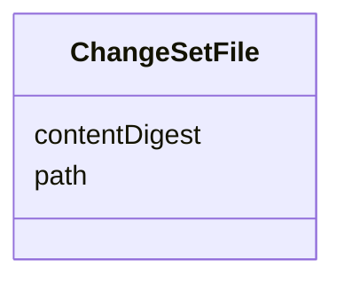

---
search:
  boost: 10.0
---

# Class: ChangeSetFile


_One ordered file within a ChangeSetProposal. Path traversal and duplicate paths within a proposal are rejected by ChangeSetProposalService, not by this shape._


<div data-search-exclude markdown="1">


URI: [jumo:ChangeSetFile](https://jumo.dev/schemas/jumo-v1/ChangeSetFile)





<!-- no inheritance hierarchy -->

## Slots

| Name | Cardinality and Range | Description | Inheritance |
| ---  | --- | --- | --- |
| [path](path.md) | 1 <br/> [String](String.md) |  | direct |
| [contentDigest](contentDigest.md) | 1 <br/> [String](String.md) |  | direct |


## Usages

| used by | used in | type | used |
| ---  | --- | --- | --- |
| [ChangeSetProposal](ChangeSetProposal.md) | [files](files.md) | range | [ChangeSetFile](ChangeSetFile.md) |


## Identifier and Mapping Information


### Annotations

| property | value |
| --- | --- |
| jumo.state_authority | POSTGRES |
| jumo.model_role | VALUE_OBJECT |
| jumo.audience | INTERNAL_WORKER |
| jumo.sensitivity | INTERNAL |
| jumo.boundary_eligible | True |
| jumo.schema_profiles | draft-2020-12,native-json-schema,prompted-json-validated |


### Schema Source


* from schema: https://jumo.dev/schemas/jumo-v1


## Mappings

| Mapping Type | Mapped Value |
| ---  | ---  |
| self | jumo:ChangeSetFile |
| native | jumo:ChangeSetFile |


## LinkML Source

<!-- TODO: investigate https://stackoverflow.com/questions/37606292/how-to-create-tabbed-code-blocks-in-mkdocs-or-sphinx -->

### Direct

<details>
```yaml
name: ChangeSetFile
annotations:
  jumo.state_authority:
    tag: jumo.state_authority
    value: POSTGRES
  jumo.model_role:
    tag: jumo.model_role
    value: VALUE_OBJECT
  jumo.audience:
    tag: jumo.audience
    value: INTERNAL_WORKER
  jumo.sensitivity:
    tag: jumo.sensitivity
    value: INTERNAL
  jumo.boundary_eligible:
    tag: jumo.boundary_eligible
    value: true
  jumo.schema_profiles:
    tag: jumo.schema_profiles
    value: draft-2020-12,native-json-schema,prompted-json-validated
description: One ordered file within a ChangeSetProposal. Path traversal and duplicate
  paths within a proposal are rejected by ChangeSetProposalService, not by this shape.
from_schema: https://jumo.dev/schemas/jumo-v1
attributes:
  path:
    name: path
    from_schema: https://jumo.dev/schemas/jumo-v1
    owner: ChangeSetFile
    domain_of:
    - DocumentationRoot
    - PromptBody
    - ApiOperation
    - ChangeSetFile
    - ProjectionOptionCondition
    - NestedOptionsSource
    - ProjectionField
    range: string
    required: true
    pattern: ^.{1,}$
  contentDigest:
    name: contentDigest
    from_schema: https://jumo.dev/schemas/jumo-v1
    rank: 1000
    owner: ChangeSetFile
    domain_of:
    - ChangeSetFile
    range: string
    required: true
    pattern: ^sha256:[0-9a-f]{64}$

```
</details>

### Induced

<details>
```yaml
name: ChangeSetFile
annotations:
  jumo.state_authority:
    tag: jumo.state_authority
    value: POSTGRES
  jumo.model_role:
    tag: jumo.model_role
    value: VALUE_OBJECT
  jumo.audience:
    tag: jumo.audience
    value: INTERNAL_WORKER
  jumo.sensitivity:
    tag: jumo.sensitivity
    value: INTERNAL
  jumo.boundary_eligible:
    tag: jumo.boundary_eligible
    value: true
  jumo.schema_profiles:
    tag: jumo.schema_profiles
    value: draft-2020-12,native-json-schema,prompted-json-validated
description: One ordered file within a ChangeSetProposal. Path traversal and duplicate
  paths within a proposal are rejected by ChangeSetProposalService, not by this shape.
from_schema: https://jumo.dev/schemas/jumo-v1
attributes:
  path:
    name: path
    from_schema: https://jumo.dev/schemas/jumo-v1
    owner: ChangeSetFile
    domain_of:
    - DocumentationRoot
    - PromptBody
    - ApiOperation
    - ChangeSetFile
    - ProjectionOptionCondition
    - NestedOptionsSource
    - ProjectionField
    range: string
    required: true
    pattern: ^.{1,}$
  contentDigest:
    name: contentDigest
    from_schema: https://jumo.dev/schemas/jumo-v1
    rank: 1000
    owner: ChangeSetFile
    domain_of:
    - ChangeSetFile
    range: string
    required: true
    pattern: ^sha256:[0-9a-f]{64}$

```
</details></div>