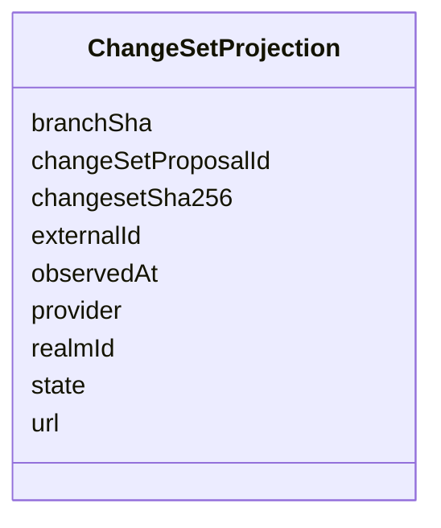

---
search:
  boost: 10.0
---

# Class: ChangeSetProjection


_Observed record of the single atomic PR ForgeApplier opened for a ChangeSetProposal (multi-repository-change-set-saga AC2/AC5). Existence is idempotency evidence -- a second saga execution against the same changeSetProposalId returns this record instead of re-opening a PR._


<div data-search-exclude markdown="1">


URI: [jumo:ChangeSetProjection](https://jumo.dev/schemas/jumo-v1/ChangeSetProjection)





<!-- no inheritance hierarchy -->

## Slots

| Name | Cardinality and Range | Description | Inheritance |
| ---  | --- | --- | --- |
| [changeSetProposalId](changeSetProposalId.md) | 1 <br/> [Identifier](Identifier.md) |  | direct |
| [realmId](realmId.md) | 1 <br/> [String](String.md) |  | direct |
| [provider](provider.md) | 1 <br/> [String](String.md) |  | direct |
| [externalId](externalId.md) | 1 <br/> [String](String.md) |  | direct |
| [url](url.md) | 1 <br/> [String](String.md) |  | direct |
| [state](state.md) | 1 <br/> [String](String.md) |  | direct |
| [branchSha](branchSha.md) | 0..1 <br/> [String](String.md) |  | direct |
| [changesetSha256](changesetSha256.md) | 0..1 <br/> [String](String.md) |  | direct |
| [observedAt](observedAt.md) | 1 <br/> [String](String.md) |  | direct |


## Identifier and Mapping Information


### Annotations

| property | value |
| --- | --- |
| jumo.state_authority | POSTGRES |
| jumo.model_role | EVENT |
| jumo.audience | INTERNAL_WORKER |
| jumo.sensitivity | INTERNAL |
| jumo.boundary_eligible | True |
| jumo.schema_profiles | draft-2020-12,native-json-schema,prompted-json-validated |


### Schema Source


* from schema: https://jumo.dev/schemas/jumo-v1


## Mappings

| Mapping Type | Mapped Value |
| ---  | ---  |
| self | jumo:ChangeSetProjection |
| native | jumo:ChangeSetProjection |


## LinkML Source

<!-- TODO: investigate https://stackoverflow.com/questions/37606292/how-to-create-tabbed-code-blocks-in-mkdocs-or-sphinx -->

### Direct

<details>
```yaml
name: ChangeSetProjection
annotations:
  jumo.state_authority:
    tag: jumo.state_authority
    value: POSTGRES
  jumo.model_role:
    tag: jumo.model_role
    value: EVENT
  jumo.audience:
    tag: jumo.audience
    value: INTERNAL_WORKER
  jumo.sensitivity:
    tag: jumo.sensitivity
    value: INTERNAL
  jumo.boundary_eligible:
    tag: jumo.boundary_eligible
    value: true
  jumo.schema_profiles:
    tag: jumo.schema_profiles
    value: draft-2020-12,native-json-schema,prompted-json-validated
description: Observed record of the single atomic PR ForgeApplier opened for a ChangeSetProposal
  (multi-repository-change-set-saga AC2/AC5). Existence is idempotency evidence --
  a second saga execution against the same changeSetProposalId returns this record
  instead of re-opening a PR.
from_schema: https://jumo.dev/schemas/jumo-v1
attributes:
  changeSetProposalId:
    name: changeSetProposalId
    from_schema: https://jumo.dev/schemas/jumo-v1
    owner: ChangeSetProjection
    domain_of:
    - ChangeSetProposal
    - ChangeSetProjection
    range: Identifier
    required: true
  realmId:
    name: realmId
    from_schema: https://jumo.dev/schemas/jumo-v1
    owner: ChangeSetProjection
    domain_of:
    - AttentionSource
    - MachineEnrollmentRequest
    - MachineEnrollmentChallenge
    - DelegatedSecretGrant
    - SessionPlan
    - ApiProblem
    - PolicyInput
    - ChangeSetProjection
    range: string
    required: true
  provider:
    name: provider
    from_schema: https://jumo.dev/schemas/jumo-v1
    owner: ChangeSetProjection
    domain_of:
    - RepositoryBinding
    - ProviderAccountSpec
    - ChangeSetProjection
    range: string
    required: true
  externalId:
    name: externalId
    from_schema: https://jumo.dev/schemas/jumo-v1
    owner: ChangeSetProjection
    domain_of:
    - McpCatalogProvenancePin
    - ChangeSetProjection
    range: string
    required: true
  url:
    name: url
    from_schema: https://jumo.dev/schemas/jumo-v1
    rank: 1000
    owner: ChangeSetProjection
    domain_of:
    - ChangeSetProjection
    range: string
    required: true
  state:
    name: state
    from_schema: https://jumo.dev/schemas/jumo-v1
    owner: ChangeSetProjection
    domain_of:
    - OfferingSpecBody
    - WorkOrderSpec
    - ImprovementRecommendationSpec
    - ChangeSetProjection
    range: string
    required: true
  branchSha:
    name: branchSha
    from_schema: https://jumo.dev/schemas/jumo-v1
    rank: 1000
    owner: ChangeSetProjection
    domain_of:
    - ChangeSetProjection
    range: string
    pattern: ^[0-9a-f]{40}$
  changesetSha256:
    name: changesetSha256
    from_schema: https://jumo.dev/schemas/jumo-v1
    rank: 1000
    owner: ChangeSetProjection
    domain_of:
    - ChangeSetProjection
    range: string
    pattern: ^[0-9a-f]{64}$
  observedAt:
    name: observedAt
    from_schema: https://jumo.dev/schemas/jumo-v1
    owner: ChangeSetProjection
    domain_of:
    - RealmEnforcement
    - MachineInventoryObservation
    - CliInstallationObservation
    - McpCatalogProvenancePin
    - McpCatalogFieldCandidate
    - RemoteMcpAppraisalSpec
    - ChangeSetProjection
    range: string
    required: true

```
</details>

### Induced

<details>
```yaml
name: ChangeSetProjection
annotations:
  jumo.state_authority:
    tag: jumo.state_authority
    value: POSTGRES
  jumo.model_role:
    tag: jumo.model_role
    value: EVENT
  jumo.audience:
    tag: jumo.audience
    value: INTERNAL_WORKER
  jumo.sensitivity:
    tag: jumo.sensitivity
    value: INTERNAL
  jumo.boundary_eligible:
    tag: jumo.boundary_eligible
    value: true
  jumo.schema_profiles:
    tag: jumo.schema_profiles
    value: draft-2020-12,native-json-schema,prompted-json-validated
description: Observed record of the single atomic PR ForgeApplier opened for a ChangeSetProposal
  (multi-repository-change-set-saga AC2/AC5). Existence is idempotency evidence --
  a second saga execution against the same changeSetProposalId returns this record
  instead of re-opening a PR.
from_schema: https://jumo.dev/schemas/jumo-v1
attributes:
  changeSetProposalId:
    name: changeSetProposalId
    from_schema: https://jumo.dev/schemas/jumo-v1
    owner: ChangeSetProjection
    domain_of:
    - ChangeSetProposal
    - ChangeSetProjection
    range: Identifier
    required: true
  realmId:
    name: realmId
    from_schema: https://jumo.dev/schemas/jumo-v1
    owner: ChangeSetProjection
    domain_of:
    - AttentionSource
    - MachineEnrollmentRequest
    - MachineEnrollmentChallenge
    - DelegatedSecretGrant
    - SessionPlan
    - ApiProblem
    - PolicyInput
    - ChangeSetProjection
    range: string
    required: true
  provider:
    name: provider
    from_schema: https://jumo.dev/schemas/jumo-v1
    owner: ChangeSetProjection
    domain_of:
    - RepositoryBinding
    - ProviderAccountSpec
    - ChangeSetProjection
    range: string
    required: true
  externalId:
    name: externalId
    from_schema: https://jumo.dev/schemas/jumo-v1
    owner: ChangeSetProjection
    domain_of:
    - McpCatalogProvenancePin
    - ChangeSetProjection
    range: string
    required: true
  url:
    name: url
    from_schema: https://jumo.dev/schemas/jumo-v1
    rank: 1000
    owner: ChangeSetProjection
    domain_of:
    - ChangeSetProjection
    range: string
    required: true
  state:
    name: state
    from_schema: https://jumo.dev/schemas/jumo-v1
    owner: ChangeSetProjection
    domain_of:
    - OfferingSpecBody
    - WorkOrderSpec
    - ImprovementRecommendationSpec
    - ChangeSetProjection
    range: string
    required: true
  branchSha:
    name: branchSha
    from_schema: https://jumo.dev/schemas/jumo-v1
    rank: 1000
    owner: ChangeSetProjection
    domain_of:
    - ChangeSetProjection
    range: string
    pattern: ^[0-9a-f]{40}$
  changesetSha256:
    name: changesetSha256
    from_schema: https://jumo.dev/schemas/jumo-v1
    rank: 1000
    owner: ChangeSetProjection
    domain_of:
    - ChangeSetProjection
    range: string
    pattern: ^[0-9a-f]{64}$
  observedAt:
    name: observedAt
    from_schema: https://jumo.dev/schemas/jumo-v1
    owner: ChangeSetProjection
    domain_of:
    - RealmEnforcement
    - MachineInventoryObservation
    - CliInstallationObservation
    - McpCatalogProvenancePin
    - McpCatalogFieldCandidate
    - RemoteMcpAppraisalSpec
    - ChangeSetProjection
    range: string
    required: true

```
</details></div>