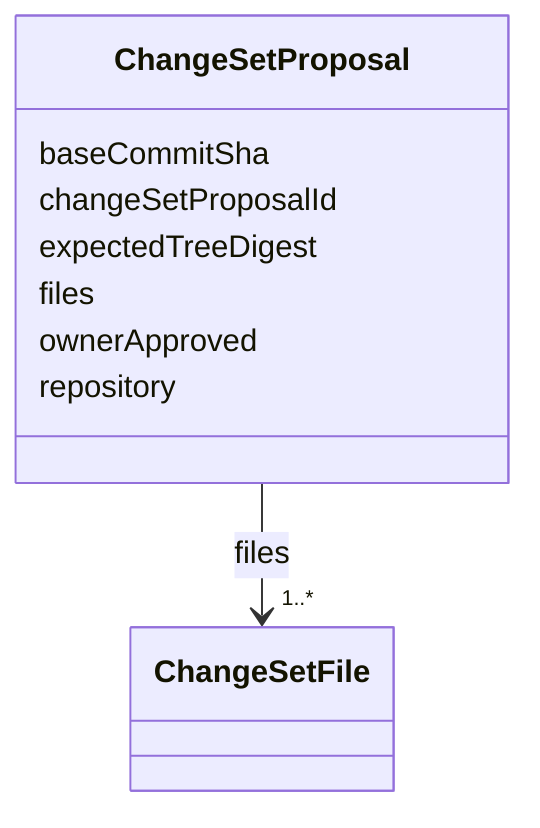

---
search:
  boost: 10.0
---

# Class: ChangeSetProposal


_Ordered multi-file changeset proposed against one repository, the unit ForgeApplier opens as one repository PR within a multi-repository saga (multi-repository-change-set-saga AC1). Owner approval and phase progression are tracked separately, not on this shape._


<div data-search-exclude markdown="1">


URI: [jumo:ChangeSetProposal](https://jumo.dev/schemas/jumo-v1/ChangeSetProposal)





<!-- no inheritance hierarchy -->

## Slots

| Name | Cardinality and Range | Description | Inheritance |
| ---  | --- | --- | --- |
| [changeSetProposalId](changeSetProposalId.md) | 1 <br/> [Identifier](Identifier.md) |  | direct |
| [repository](repository.md) | 1 <br/> [String](String.md) |  | direct |
| [baseCommitSha](baseCommitSha.md) | 1 <br/> [String](String.md) |  | direct |
| [files](files.md) | 1..* <br/> [ChangeSetFile](ChangeSetFile.md) |  | direct |
| [expectedTreeDigest](expectedTreeDigest.md) | 1 <br/> [String](String.md) |  | direct |
| [ownerApproved](ownerApproved.md) | 1 <br/> [Boolean](Boolean.md) |  | direct |


## Identifier and Mapping Information


### Annotations

| property | value |
| --- | --- |
| jumo.state_authority | POSTGRES |
| jumo.model_role | COMMAND |
| jumo.audience | INTERNAL_WORKER |
| jumo.sensitivity | INTERNAL |
| jumo.boundary_eligible | True |
| jumo.schema_profiles | draft-2020-12,native-json-schema,prompted-json-validated |


### Schema Source


* from schema: https://jumo.dev/schemas/jumo-v1


## Mappings

| Mapping Type | Mapped Value |
| ---  | ---  |
| self | jumo:ChangeSetProposal |
| native | jumo:ChangeSetProposal |


## LinkML Source

<!-- TODO: investigate https://stackoverflow.com/questions/37606292/how-to-create-tabbed-code-blocks-in-mkdocs-or-sphinx -->

### Direct

<details>
```yaml
name: ChangeSetProposal
annotations:
  jumo.state_authority:
    tag: jumo.state_authority
    value: POSTGRES
  jumo.model_role:
    tag: jumo.model_role
    value: COMMAND
  jumo.audience:
    tag: jumo.audience
    value: INTERNAL_WORKER
  jumo.sensitivity:
    tag: jumo.sensitivity
    value: INTERNAL
  jumo.boundary_eligible:
    tag: jumo.boundary_eligible
    value: true
  jumo.schema_profiles:
    tag: jumo.schema_profiles
    value: draft-2020-12,native-json-schema,prompted-json-validated
description: Ordered multi-file changeset proposed against one repository, the unit
  ForgeApplier opens as one repository PR within a multi-repository saga (multi-repository-change-set-saga
  AC1). Owner approval and phase progression are tracked separately, not on this shape.
from_schema: https://jumo.dev/schemas/jumo-v1
attributes:
  changeSetProposalId:
    name: changeSetProposalId
    from_schema: https://jumo.dev/schemas/jumo-v1
    rank: 1000
    owner: ChangeSetProposal
    domain_of:
    - ChangeSetProposal
    - ChangeSetProjection
    range: Identifier
    required: true
  repository:
    name: repository
    from_schema: https://jumo.dev/schemas/jumo-v1
    owner: ChangeSetProposal
    domain_of:
    - RepositoryBinding
    - KitReference
    - KitLockSpec
    - KitReleaseCertificationSpec
    - ChangeSetProposal
    range: string
    required: true
  baseCommitSha:
    name: baseCommitSha
    from_schema: https://jumo.dev/schemas/jumo-v1
    rank: 1000
    owner: ChangeSetProposal
    domain_of:
    - ChangeSetProposal
    range: string
    required: true
    pattern: ^[0-9a-f]{40}$
  files:
    name: files
    from_schema: https://jumo.dev/schemas/jumo-v1
    rank: 1000
    owner: ChangeSetProposal
    domain_of:
    - ChangeSetProposal
    range: ChangeSetFile
    multivalued: true
    inlined: true
    inlined_as_list: true
    minimum_cardinality: 1
  expectedTreeDigest:
    name: expectedTreeDigest
    from_schema: https://jumo.dev/schemas/jumo-v1
    rank: 1000
    owner: ChangeSetProposal
    domain_of:
    - ChangeSetProposal
    range: string
    required: true
    pattern: ^sha256:[0-9a-f]{64}$
  ownerApproved:
    name: ownerApproved
    from_schema: https://jumo.dev/schemas/jumo-v1
    rank: 1000
    owner: ChangeSetProposal
    domain_of:
    - ChangeSetProposal
    range: boolean
    required: true

```
</details>

### Induced

<details>
```yaml
name: ChangeSetProposal
annotations:
  jumo.state_authority:
    tag: jumo.state_authority
    value: POSTGRES
  jumo.model_role:
    tag: jumo.model_role
    value: COMMAND
  jumo.audience:
    tag: jumo.audience
    value: INTERNAL_WORKER
  jumo.sensitivity:
    tag: jumo.sensitivity
    value: INTERNAL
  jumo.boundary_eligible:
    tag: jumo.boundary_eligible
    value: true
  jumo.schema_profiles:
    tag: jumo.schema_profiles
    value: draft-2020-12,native-json-schema,prompted-json-validated
description: Ordered multi-file changeset proposed against one repository, the unit
  ForgeApplier opens as one repository PR within a multi-repository saga (multi-repository-change-set-saga
  AC1). Owner approval and phase progression are tracked separately, not on this shape.
from_schema: https://jumo.dev/schemas/jumo-v1
attributes:
  changeSetProposalId:
    name: changeSetProposalId
    from_schema: https://jumo.dev/schemas/jumo-v1
    rank: 1000
    owner: ChangeSetProposal
    domain_of:
    - ChangeSetProposal
    - ChangeSetProjection
    range: Identifier
    required: true
  repository:
    name: repository
    from_schema: https://jumo.dev/schemas/jumo-v1
    owner: ChangeSetProposal
    domain_of:
    - RepositoryBinding
    - KitReference
    - KitLockSpec
    - KitReleaseCertificationSpec
    - ChangeSetProposal
    range: string
    required: true
  baseCommitSha:
    name: baseCommitSha
    from_schema: https://jumo.dev/schemas/jumo-v1
    rank: 1000
    owner: ChangeSetProposal
    domain_of:
    - ChangeSetProposal
    range: string
    required: true
    pattern: ^[0-9a-f]{40}$
  files:
    name: files
    from_schema: https://jumo.dev/schemas/jumo-v1
    rank: 1000
    owner: ChangeSetProposal
    domain_of:
    - ChangeSetProposal
    range: ChangeSetFile
    multivalued: true
    inlined: true
    inlined_as_list: true
    minimum_cardinality: 1
  expectedTreeDigest:
    name: expectedTreeDigest
    from_schema: https://jumo.dev/schemas/jumo-v1
    rank: 1000
    owner: ChangeSetProposal
    domain_of:
    - ChangeSetProposal
    range: string
    required: true
    pattern: ^sha256:[0-9a-f]{64}$
  ownerApproved:
    name: ownerApproved
    from_schema: https://jumo.dev/schemas/jumo-v1
    rank: 1000
    owner: ChangeSetProposal
    domain_of:
    - ChangeSetProposal
    range: boolean
    required: true

```
</details></div>