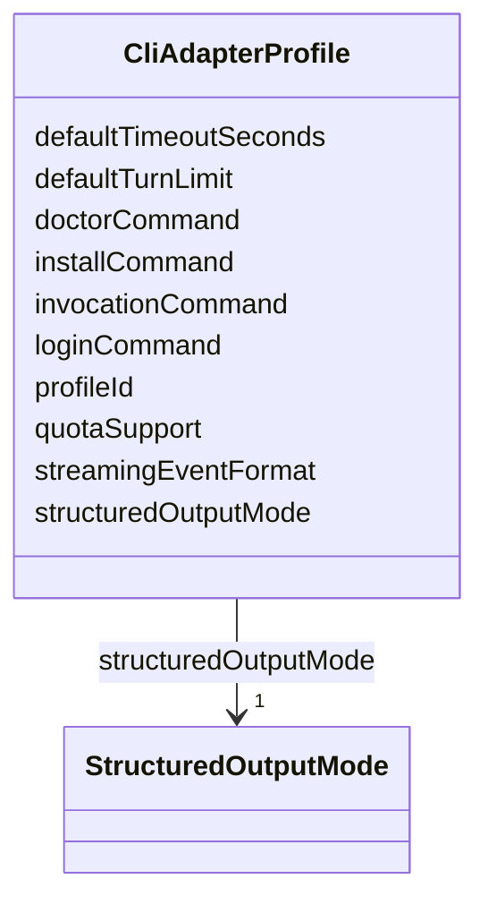

---
search:
  boost: 10.0
---

# Class: CliAdapterProfile


_Adapter execution profile and command template for a CLI worker runtime._


<div data-search-exclude markdown="1">


URI: [jumo:CliAdapterProfile](https://jumo.dev/schemas/jumo-v1/CliAdapterProfile)





<!-- no inheritance hierarchy -->

## Slots

| Name | Cardinality and Range | Description | Inheritance |
| ---  | --- | --- | --- |
| [profileId](profileId.md) | 1 <br/> [String](String.md) |  | direct |
| [structuredOutputMode](structuredOutputMode.md) | 1 <br/> [StructuredOutputMode](StructuredOutputMode.md) |  | direct |
| [streamingEventFormat](streamingEventFormat.md) | 0..1 <br/> [String](String.md) |  | direct |
| [installCommand](installCommand.md) | 0..1 <br/> [String](String.md) |  | direct |
| [doctorCommand](doctorCommand.md) | 0..1 <br/> [String](String.md) |  | direct |
| [loginCommand](loginCommand.md) | 0..1 <br/> [String](String.md) |  | direct |
| [invocationCommand](invocationCommand.md) | 0..1 <br/> [String](String.md) |  | direct |
| [quotaSupport](quotaSupport.md) | 0..1 <br/> [Boolean](Boolean.md) |  | direct |
| [defaultTurnLimit](defaultTurnLimit.md) | 0..1 <br/> [Integer](Integer.md) |  | direct |
| [defaultTimeoutSeconds](defaultTimeoutSeconds.md) | 0..1 <br/> [Integer](Integer.md) |  | direct |


## Identifier and Mapping Information


### Annotations

| property | value |
| --- | --- |
| jumo.state_authority | GIT |
| jumo.model_role | VALUE_OBJECT |
| jumo.audience | MACHINE_MTLS |
| jumo.sensitivity | PERSONAL |
| jumo.boundary_eligible | True |
| jumo.schema_profiles | draft-2020-12,native-json-schema,prompted-json-validated |


### Schema Source


* from schema: https://jumo.dev/schemas/jumo-v1


## Mappings

| Mapping Type | Mapped Value |
| ---  | ---  |
| self | jumo:CliAdapterProfile |
| native | jumo:CliAdapterProfile |


## LinkML Source

<!-- TODO: investigate https://stackoverflow.com/questions/37606292/how-to-create-tabbed-code-blocks-in-mkdocs-or-sphinx -->

### Direct

<details>
```yaml
name: CliAdapterProfile
annotations:
  jumo.state_authority:
    tag: jumo.state_authority
    value: GIT
  jumo.model_role:
    tag: jumo.model_role
    value: VALUE_OBJECT
  jumo.audience:
    tag: jumo.audience
    value: MACHINE_MTLS
  jumo.sensitivity:
    tag: jumo.sensitivity
    value: PERSONAL
  jumo.boundary_eligible:
    tag: jumo.boundary_eligible
    value: true
  jumo.schema_profiles:
    tag: jumo.schema_profiles
    value: draft-2020-12,native-json-schema,prompted-json-validated
description: Adapter execution profile and command template for a CLI worker runtime.
from_schema: https://jumo.dev/schemas/jumo-v1
attributes:
  profileId:
    name: profileId
    from_schema: https://jumo.dev/schemas/jumo-v1
    rank: 1000
    owner: CliAdapterProfile
    domain_of:
    - CliAdapterProfile
    range: string
    required: true
  structuredOutputMode:
    name: structuredOutputMode
    from_schema: https://jumo.dev/schemas/jumo-v1
    rank: 1000
    owner: CliAdapterProfile
    domain_of:
    - CliAdapterProfile
    range: StructuredOutputMode
    required: true
  streamingEventFormat:
    name: streamingEventFormat
    from_schema: https://jumo.dev/schemas/jumo-v1
    rank: 1000
    owner: CliAdapterProfile
    domain_of:
    - CliAdapterProfile
    range: string
  installCommand:
    name: installCommand
    from_schema: https://jumo.dev/schemas/jumo-v1
    rank: 1000
    owner: CliAdapterProfile
    domain_of:
    - CliAdapterProfile
    range: string
  doctorCommand:
    name: doctorCommand
    from_schema: https://jumo.dev/schemas/jumo-v1
    rank: 1000
    owner: CliAdapterProfile
    domain_of:
    - CliAdapterProfile
    range: string
  loginCommand:
    name: loginCommand
    from_schema: https://jumo.dev/schemas/jumo-v1
    rank: 1000
    owner: CliAdapterProfile
    domain_of:
    - CliAdapterProfile
    range: string
  invocationCommand:
    name: invocationCommand
    from_schema: https://jumo.dev/schemas/jumo-v1
    rank: 1000
    owner: CliAdapterProfile
    domain_of:
    - CliAdapterProfile
    range: string
  quotaSupport:
    name: quotaSupport
    from_schema: https://jumo.dev/schemas/jumo-v1
    rank: 1000
    owner: CliAdapterProfile
    domain_of:
    - CliAdapterProfile
    range: boolean
  defaultTurnLimit:
    name: defaultTurnLimit
    from_schema: https://jumo.dev/schemas/jumo-v1
    rank: 1000
    owner: CliAdapterProfile
    domain_of:
    - CliAdapterProfile
    range: integer
  defaultTimeoutSeconds:
    name: defaultTimeoutSeconds
    from_schema: https://jumo.dev/schemas/jumo-v1
    rank: 1000
    owner: CliAdapterProfile
    domain_of:
    - CliAdapterProfile
    range: integer

```
</details>

### Induced

<details>
```yaml
name: CliAdapterProfile
annotations:
  jumo.state_authority:
    tag: jumo.state_authority
    value: GIT
  jumo.model_role:
    tag: jumo.model_role
    value: VALUE_OBJECT
  jumo.audience:
    tag: jumo.audience
    value: MACHINE_MTLS
  jumo.sensitivity:
    tag: jumo.sensitivity
    value: PERSONAL
  jumo.boundary_eligible:
    tag: jumo.boundary_eligible
    value: true
  jumo.schema_profiles:
    tag: jumo.schema_profiles
    value: draft-2020-12,native-json-schema,prompted-json-validated
description: Adapter execution profile and command template for a CLI worker runtime.
from_schema: https://jumo.dev/schemas/jumo-v1
attributes:
  profileId:
    name: profileId
    from_schema: https://jumo.dev/schemas/jumo-v1
    rank: 1000
    owner: CliAdapterProfile
    domain_of:
    - CliAdapterProfile
    range: string
    required: true
  structuredOutputMode:
    name: structuredOutputMode
    from_schema: https://jumo.dev/schemas/jumo-v1
    rank: 1000
    owner: CliAdapterProfile
    domain_of:
    - CliAdapterProfile
    range: StructuredOutputMode
    required: true
  streamingEventFormat:
    name: streamingEventFormat
    from_schema: https://jumo.dev/schemas/jumo-v1
    rank: 1000
    owner: CliAdapterProfile
    domain_of:
    - CliAdapterProfile
    range: string
  installCommand:
    name: installCommand
    from_schema: https://jumo.dev/schemas/jumo-v1
    rank: 1000
    owner: CliAdapterProfile
    domain_of:
    - CliAdapterProfile
    range: string
  doctorCommand:
    name: doctorCommand
    from_schema: https://jumo.dev/schemas/jumo-v1
    rank: 1000
    owner: CliAdapterProfile
    domain_of:
    - CliAdapterProfile
    range: string
  loginCommand:
    name: loginCommand
    from_schema: https://jumo.dev/schemas/jumo-v1
    rank: 1000
    owner: CliAdapterProfile
    domain_of:
    - CliAdapterProfile
    range: string
  invocationCommand:
    name: invocationCommand
    from_schema: https://jumo.dev/schemas/jumo-v1
    rank: 1000
    owner: CliAdapterProfile
    domain_of:
    - CliAdapterProfile
    range: string
  quotaSupport:
    name: quotaSupport
    from_schema: https://jumo.dev/schemas/jumo-v1
    rank: 1000
    owner: CliAdapterProfile
    domain_of:
    - CliAdapterProfile
    range: boolean
  defaultTurnLimit:
    name: defaultTurnLimit
    from_schema: https://jumo.dev/schemas/jumo-v1
    rank: 1000
    owner: CliAdapterProfile
    domain_of:
    - CliAdapterProfile
    range: integer
  defaultTimeoutSeconds:
    name: defaultTimeoutSeconds
    from_schema: https://jumo.dev/schemas/jumo-v1
    rank: 1000
    owner: CliAdapterProfile
    domain_of:
    - CliAdapterProfile
    range: integer

```
</details></div>