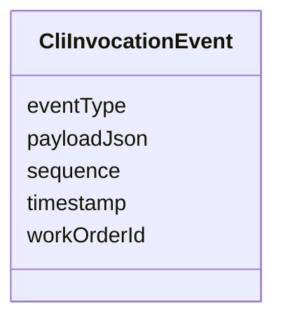

---
search:
  boost: 10.0
---

# Class: CliInvocationEvent


_Streaming event produced during an active CLI invocation._


<div data-search-exclude markdown="1">


URI: [jumo:CliInvocationEvent](https://jumo.dev/schemas/jumo-v1/CliInvocationEvent)





<!-- no inheritance hierarchy -->

## Slots

| Name | Cardinality and Range | Description | Inheritance |
| ---  | --- | --- | --- |
| [workOrderId](workOrderId.md) | 1 <br/> [Identifier](Identifier.md) |  | direct |
| [sequence](sequence.md) | 1 <br/> [Integer](Integer.md) |  | direct |
| [eventType](eventType.md) | 1 <br/> [String](String.md) |  | direct |
| [payloadJson](payloadJson.md) | 1 <br/> [String](String.md) |  | direct |
| [timestamp](timestamp.md) | 1 <br/> [String](String.md) |  | direct |


## Identifier and Mapping Information


### Annotations

| property | value |
| --- | --- |
| jumo.state_authority | GIT |
| jumo.model_role | EVENT |
| jumo.audience | MACHINE_MTLS |
| jumo.sensitivity | INTERNAL |
| jumo.boundary_eligible | True |
| jumo.schema_profiles | draft-2020-12,native-json-schema,prompted-json-validated |


### Schema Source


* from schema: https://jumo.dev/schemas/jumo-v1


## Mappings

| Mapping Type | Mapped Value |
| ---  | ---  |
| self | jumo:CliInvocationEvent |
| native | jumo:CliInvocationEvent |


## LinkML Source

<!-- TODO: investigate https://stackoverflow.com/questions/37606292/how-to-create-tabbed-code-blocks-in-mkdocs-or-sphinx -->

### Direct

<details>
```yaml
name: CliInvocationEvent
annotations:
  jumo.state_authority:
    tag: jumo.state_authority
    value: GIT
  jumo.model_role:
    tag: jumo.model_role
    value: EVENT
  jumo.audience:
    tag: jumo.audience
    value: MACHINE_MTLS
  jumo.sensitivity:
    tag: jumo.sensitivity
    value: INTERNAL
  jumo.boundary_eligible:
    tag: jumo.boundary_eligible
    value: true
  jumo.schema_profiles:
    tag: jumo.schema_profiles
    value: draft-2020-12,native-json-schema,prompted-json-validated
description: Streaming event produced during an active CLI invocation.
from_schema: https://jumo.dev/schemas/jumo-v1
attributes:
  workOrderId:
    name: workOrderId
    from_schema: https://jumo.dev/schemas/jumo-v1
    owner: CliInvocationEvent
    domain_of:
    - MachineAdminRequest
    - MachineAdminCommand
    - WorkloadCommand
    - ExecutionCellLease
    - CliInvocationRequest
    - CliInvocationEvent
    - CliInvocationResult
    range: Identifier
    required: true
  sequence:
    name: sequence
    from_schema: https://jumo.dev/schemas/jumo-v1
    rank: 1000
    owner: CliInvocationEvent
    domain_of:
    - CliInvocationEvent
    range: integer
    required: true
  eventType:
    name: eventType
    from_schema: https://jumo.dev/schemas/jumo-v1
    rank: 1000
    owner: CliInvocationEvent
    domain_of:
    - CliInvocationEvent
    range: string
    required: true
  payloadJson:
    name: payloadJson
    from_schema: https://jumo.dev/schemas/jumo-v1
    rank: 1000
    owner: CliInvocationEvent
    domain_of:
    - CliInvocationEvent
    - SchemaBoundPayload
    range: string
    required: true
  timestamp:
    name: timestamp
    from_schema: https://jumo.dev/schemas/jumo-v1
    rank: 1000
    owner: CliInvocationEvent
    domain_of:
    - CliInvocationEvent
    - ApiProblem
    range: string
    required: true

```
</details>

### Induced

<details>
```yaml
name: CliInvocationEvent
annotations:
  jumo.state_authority:
    tag: jumo.state_authority
    value: GIT
  jumo.model_role:
    tag: jumo.model_role
    value: EVENT
  jumo.audience:
    tag: jumo.audience
    value: MACHINE_MTLS
  jumo.sensitivity:
    tag: jumo.sensitivity
    value: INTERNAL
  jumo.boundary_eligible:
    tag: jumo.boundary_eligible
    value: true
  jumo.schema_profiles:
    tag: jumo.schema_profiles
    value: draft-2020-12,native-json-schema,prompted-json-validated
description: Streaming event produced during an active CLI invocation.
from_schema: https://jumo.dev/schemas/jumo-v1
attributes:
  workOrderId:
    name: workOrderId
    from_schema: https://jumo.dev/schemas/jumo-v1
    owner: CliInvocationEvent
    domain_of:
    - MachineAdminRequest
    - MachineAdminCommand
    - WorkloadCommand
    - ExecutionCellLease
    - CliInvocationRequest
    - CliInvocationEvent
    - CliInvocationResult
    range: Identifier
    required: true
  sequence:
    name: sequence
    from_schema: https://jumo.dev/schemas/jumo-v1
    rank: 1000
    owner: CliInvocationEvent
    domain_of:
    - CliInvocationEvent
    range: integer
    required: true
  eventType:
    name: eventType
    from_schema: https://jumo.dev/schemas/jumo-v1
    rank: 1000
    owner: CliInvocationEvent
    domain_of:
    - CliInvocationEvent
    range: string
    required: true
  payloadJson:
    name: payloadJson
    from_schema: https://jumo.dev/schemas/jumo-v1
    rank: 1000
    owner: CliInvocationEvent
    domain_of:
    - CliInvocationEvent
    - SchemaBoundPayload
    range: string
    required: true
  timestamp:
    name: timestamp
    from_schema: https://jumo.dev/schemas/jumo-v1
    rank: 1000
    owner: CliInvocationEvent
    domain_of:
    - CliInvocationEvent
    - ApiProblem
    range: string
    required: true

```
</details></div>