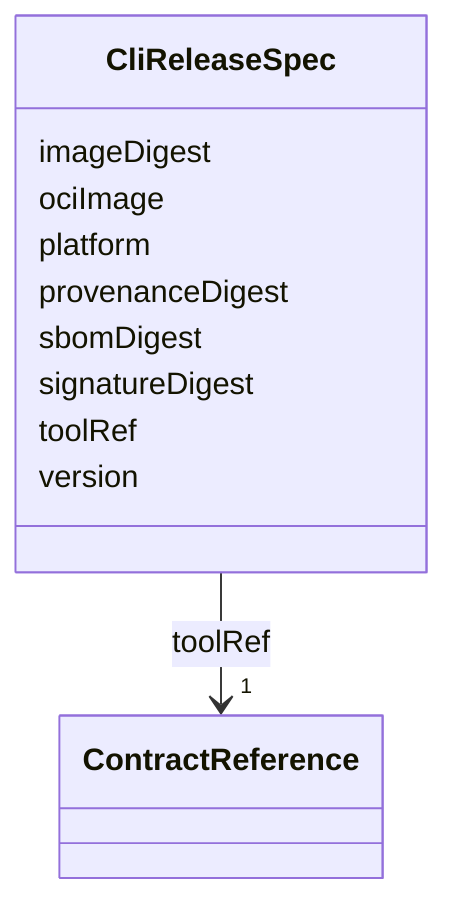

---
search:
  boost: 10.0
---

# Class: CliReleaseSpec


_Specification for a CliRelease contract._


<div data-search-exclude markdown="1">


URI: [jumo:CliReleaseSpec](https://jumo.dev/schemas/jumo-v1/CliReleaseSpec)





<!-- no inheritance hierarchy -->

## Slots

| Name | Cardinality and Range | Description | Inheritance |
| ---  | --- | --- | --- |
| [toolRef](toolRef.md) | 1 <br/> [ContractReference](ContractReference.md) |  | direct |
| [version](version.md) | 1 <br/> [String](String.md) |  | direct |
| [platform](platform.md) | 1 <br/> [String](String.md) |  | direct |
| [ociImage](ociImage.md) | 1 <br/> [String](String.md) |  | direct |
| [imageDigest](imageDigest.md) | 1 <br/> [String](String.md) |  | direct |
| [signatureDigest](signatureDigest.md) | 0..1 <br/> [String](String.md) |  | direct |
| [sbomDigest](sbomDigest.md) | 0..1 <br/> [String](String.md) |  | direct |
| [provenanceDigest](provenanceDigest.md) | 0..1 <br/> [String](String.md) |  | direct |


## Usages

| used by | used in | type | used |
| ---  | --- | --- | --- |
| [CliRelease](CliRelease.md) | [spec](spec.md) | range | [CliReleaseSpec](CliReleaseSpec.md) |


## Identifier and Mapping Information


### Annotations

| property | value |
| --- | --- |
| jumo.state_authority | OCI_REGISTRY |
| jumo.model_role | VALUE_OBJECT |
| jumo.audience | MACHINE_MTLS |
| jumo.sensitivity | INTERNAL |
| jumo.boundary_eligible | True |
| jumo.schema_profiles | draft-2020-12,native-json-schema,prompted-json-validated |


### Schema Source


* from schema: https://jumo.dev/schemas/jumo-v1


## Mappings

| Mapping Type | Mapped Value |
| ---  | ---  |
| self | jumo:CliReleaseSpec |
| native | jumo:CliReleaseSpec |


## LinkML Source

<!-- TODO: investigate https://stackoverflow.com/questions/37606292/how-to-create-tabbed-code-blocks-in-mkdocs-or-sphinx -->

### Direct

<details>
```yaml
name: CliReleaseSpec
annotations:
  jumo.state_authority:
    tag: jumo.state_authority
    value: OCI_REGISTRY
  jumo.model_role:
    tag: jumo.model_role
    value: VALUE_OBJECT
  jumo.audience:
    tag: jumo.audience
    value: MACHINE_MTLS
  jumo.sensitivity:
    tag: jumo.sensitivity
    value: INTERNAL
  jumo.boundary_eligible:
    tag: jumo.boundary_eligible
    value: true
  jumo.schema_profiles:
    tag: jumo.schema_profiles
    value: draft-2020-12,native-json-schema,prompted-json-validated
description: Specification for a CliRelease contract.
from_schema: https://jumo.dev/schemas/jumo-v1
attributes:
  toolRef:
    name: toolRef
    from_schema: https://jumo.dev/schemas/jumo-v1
    rank: 1000
    owner: CliReleaseSpec
    domain_of:
    - CliReleaseSpec
    - CliInstallationDesiredState
    - CliInstallationObservation
    - CliInvocationRequest
    - CliUsageObservation
    range: ContractReference
    required: true
    inlined: true
  version:
    name: version
    from_schema: https://jumo.dev/schemas/jumo-v1
    rank: 1000
    owner: CliReleaseSpec
    domain_of:
    - CliReleaseSpec
    - McpCatalogVersion
    - FederationProfileSpec
    - ConnectorPackageSpec
    range: string
    required: true
  platform:
    name: platform
    from_schema: https://jumo.dev/schemas/jumo-v1
    rank: 1000
    owner: CliReleaseSpec
    domain_of:
    - CliReleaseSpec
    range: string
    required: true
  ociImage:
    name: ociImage
    from_schema: https://jumo.dev/schemas/jumo-v1
    rank: 1000
    owner: CliReleaseSpec
    domain_of:
    - CliReleaseSpec
    - McpServerDescriptor
    range: string
    required: true
  imageDigest:
    name: imageDigest
    from_schema: https://jumo.dev/schemas/jumo-v1
    rank: 1000
    owner: CliReleaseSpec
    domain_of:
    - CliReleaseSpec
    - ConnectorPackageCertificationSpec
    range: string
    required: true
  signatureDigest:
    name: signatureDigest
    from_schema: https://jumo.dev/schemas/jumo-v1
    rank: 1000
    owner: CliReleaseSpec
    domain_of:
    - CliReleaseSpec
    - ConnectorPackageSpec
    - ConnectorPackageCertificationSpec
    range: string
  sbomDigest:
    name: sbomDigest
    from_schema: https://jumo.dev/schemas/jumo-v1
    rank: 1000
    owner: CliReleaseSpec
    domain_of:
    - CliReleaseSpec
    - ConnectorPackageSpec
    - ConnectorPackageCertificationSpec
    range: string
  provenanceDigest:
    name: provenanceDigest
    from_schema: https://jumo.dev/schemas/jumo-v1
    rank: 1000
    owner: CliReleaseSpec
    domain_of:
    - CliReleaseSpec
    - ConnectorPackageSpec
    - ConnectorPackageCertificationSpec
    range: string

```
</details>

### Induced

<details>
```yaml
name: CliReleaseSpec
annotations:
  jumo.state_authority:
    tag: jumo.state_authority
    value: OCI_REGISTRY
  jumo.model_role:
    tag: jumo.model_role
    value: VALUE_OBJECT
  jumo.audience:
    tag: jumo.audience
    value: MACHINE_MTLS
  jumo.sensitivity:
    tag: jumo.sensitivity
    value: INTERNAL
  jumo.boundary_eligible:
    tag: jumo.boundary_eligible
    value: true
  jumo.schema_profiles:
    tag: jumo.schema_profiles
    value: draft-2020-12,native-json-schema,prompted-json-validated
description: Specification for a CliRelease contract.
from_schema: https://jumo.dev/schemas/jumo-v1
attributes:
  toolRef:
    name: toolRef
    from_schema: https://jumo.dev/schemas/jumo-v1
    rank: 1000
    owner: CliReleaseSpec
    domain_of:
    - CliReleaseSpec
    - CliInstallationDesiredState
    - CliInstallationObservation
    - CliInvocationRequest
    - CliUsageObservation
    range: ContractReference
    required: true
    inlined: true
  version:
    name: version
    from_schema: https://jumo.dev/schemas/jumo-v1
    rank: 1000
    owner: CliReleaseSpec
    domain_of:
    - CliReleaseSpec
    - McpCatalogVersion
    - FederationProfileSpec
    - ConnectorPackageSpec
    range: string
    required: true
  platform:
    name: platform
    from_schema: https://jumo.dev/schemas/jumo-v1
    rank: 1000
    owner: CliReleaseSpec
    domain_of:
    - CliReleaseSpec
    range: string
    required: true
  ociImage:
    name: ociImage
    from_schema: https://jumo.dev/schemas/jumo-v1
    rank: 1000
    owner: CliReleaseSpec
    domain_of:
    - CliReleaseSpec
    - McpServerDescriptor
    range: string
    required: true
  imageDigest:
    name: imageDigest
    from_schema: https://jumo.dev/schemas/jumo-v1
    rank: 1000
    owner: CliReleaseSpec
    domain_of:
    - CliReleaseSpec
    - ConnectorPackageCertificationSpec
    range: string
    required: true
  signatureDigest:
    name: signatureDigest
    from_schema: https://jumo.dev/schemas/jumo-v1
    rank: 1000
    owner: CliReleaseSpec
    domain_of:
    - CliReleaseSpec
    - ConnectorPackageSpec
    - ConnectorPackageCertificationSpec
    range: string
  sbomDigest:
    name: sbomDigest
    from_schema: https://jumo.dev/schemas/jumo-v1
    rank: 1000
    owner: CliReleaseSpec
    domain_of:
    - CliReleaseSpec
    - ConnectorPackageSpec
    - ConnectorPackageCertificationSpec
    range: string
  provenanceDigest:
    name: provenanceDigest
    from_schema: https://jumo.dev/schemas/jumo-v1
    rank: 1000
    owner: CliReleaseSpec
    domain_of:
    - CliReleaseSpec
    - ConnectorPackageSpec
    - ConnectorPackageCertificationSpec
    range: string

```
</details></div>