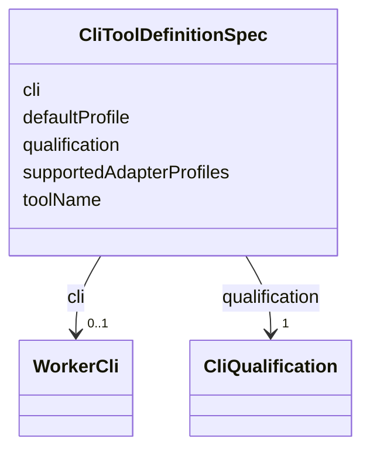

---
search:
  boost: 10.0
---

# Class: CliToolDefinitionSpec


_Specification for a CliToolDefinition contract._


<div data-search-exclude markdown="1">


URI: [jumo:CliToolDefinitionSpec](https://jumo.dev/schemas/jumo-v1/CliToolDefinitionSpec)





<!-- no inheritance hierarchy -->

## Slots

| Name | Cardinality and Range | Description | Inheritance |
| ---  | --- | --- | --- |
| [toolName](toolName.md) | 1 <br/> [String](String.md) |  | direct |
| [cli](cli.md) | 0..1 <br/> [WorkerCli](WorkerCli.md) | The WorkerCli value this tool implements | direct |
| [qualification](qualification.md) | 1 <br/> [CliQualification](CliQualification.md) |  | direct |
| [supportedAdapterProfiles](supportedAdapterProfiles.md) | * <br/> [String](String.md) |  | direct |
| [defaultProfile](defaultProfile.md) | 0..1 <br/> [String](String.md) |  | direct |


## Usages

| used by | used in | type | used |
| ---  | --- | --- | --- |
| [CliToolDefinition](CliToolDefinition.md) | [spec](spec.md) | range | [CliToolDefinitionSpec](CliToolDefinitionSpec.md) |


## Identifier and Mapping Information


### Annotations

| property | value |
| --- | --- |
| jumo.state_authority | GIT |
| jumo.model_role | VALUE_OBJECT |
| jumo.audience | MACHINE_MTLS |
| jumo.sensitivity | INTERNAL |
| jumo.boundary_eligible | True |
| jumo.schema_profiles | draft-2020-12,native-json-schema,prompted-json-validated |


### Schema Source


* from schema: https://jumo.dev/schemas/jumo-v1


## Mappings

| Mapping Type | Mapped Value |
| ---  | ---  |
| self | jumo:CliToolDefinitionSpec |
| native | jumo:CliToolDefinitionSpec |


## LinkML Source

<!-- TODO: investigate https://stackoverflow.com/questions/37606292/how-to-create-tabbed-code-blocks-in-mkdocs-or-sphinx -->

### Direct

<details>
```yaml
name: CliToolDefinitionSpec
annotations:
  jumo.state_authority:
    tag: jumo.state_authority
    value: GIT
  jumo.model_role:
    tag: jumo.model_role
    value: VALUE_OBJECT
  jumo.audience:
    tag: jumo.audience
    value: MACHINE_MTLS
  jumo.sensitivity:
    tag: jumo.sensitivity
    value: INTERNAL
  jumo.boundary_eligible:
    tag: jumo.boundary_eligible
    value: true
  jumo.schema_profiles:
    tag: jumo.schema_profiles
    value: draft-2020-12,native-json-schema,prompted-json-validated
description: Specification for a CliToolDefinition contract.
from_schema: https://jumo.dev/schemas/jumo-v1
attributes:
  toolName:
    name: toolName
    from_schema: https://jumo.dev/schemas/jumo-v1
    rank: 1000
    owner: CliToolDefinitionSpec
    domain_of:
    - CliToolDefinitionSpec
    range: string
    required: true
  cli:
    name: cli
    description: The WorkerCli value this tool implements. Without it a runtime has
      to derive the tool from the enum value by naming convention, which is the instance-naming
      the boundary forbids.
    from_schema: https://jumo.dev/schemas/jumo-v1
    rank: 1000
    owner: CliToolDefinitionSpec
    domain_of:
    - CliToolDefinitionSpec
    - WorkerSubstrateSpec
    range: WorkerCli
  qualification:
    name: qualification
    from_schema: https://jumo.dev/schemas/jumo-v1
    rank: 1000
    owner: CliToolDefinitionSpec
    domain_of:
    - CliToolDefinitionSpec
    range: CliQualification
    required: true
  supportedAdapterProfiles:
    name: supportedAdapterProfiles
    from_schema: https://jumo.dev/schemas/jumo-v1
    rank: 1000
    owner: CliToolDefinitionSpec
    domain_of:
    - CliToolDefinitionSpec
    range: string
    multivalued: true
  defaultProfile:
    name: defaultProfile
    from_schema: https://jumo.dev/schemas/jumo-v1
    rank: 1000
    owner: CliToolDefinitionSpec
    domain_of:
    - CliToolDefinitionSpec
    range: string

```
</details>

### Induced

<details>
```yaml
name: CliToolDefinitionSpec
annotations:
  jumo.state_authority:
    tag: jumo.state_authority
    value: GIT
  jumo.model_role:
    tag: jumo.model_role
    value: VALUE_OBJECT
  jumo.audience:
    tag: jumo.audience
    value: MACHINE_MTLS
  jumo.sensitivity:
    tag: jumo.sensitivity
    value: INTERNAL
  jumo.boundary_eligible:
    tag: jumo.boundary_eligible
    value: true
  jumo.schema_profiles:
    tag: jumo.schema_profiles
    value: draft-2020-12,native-json-schema,prompted-json-validated
description: Specification for a CliToolDefinition contract.
from_schema: https://jumo.dev/schemas/jumo-v1
attributes:
  toolName:
    name: toolName
    from_schema: https://jumo.dev/schemas/jumo-v1
    rank: 1000
    owner: CliToolDefinitionSpec
    domain_of:
    - CliToolDefinitionSpec
    range: string
    required: true
  cli:
    name: cli
    description: The WorkerCli value this tool implements. Without it a runtime has
      to derive the tool from the enum value by naming convention, which is the instance-naming
      the boundary forbids.
    from_schema: https://jumo.dev/schemas/jumo-v1
    rank: 1000
    owner: CliToolDefinitionSpec
    domain_of:
    - CliToolDefinitionSpec
    - WorkerSubstrateSpec
    range: WorkerCli
  qualification:
    name: qualification
    from_schema: https://jumo.dev/schemas/jumo-v1
    rank: 1000
    owner: CliToolDefinitionSpec
    domain_of:
    - CliToolDefinitionSpec
    range: CliQualification
    required: true
  supportedAdapterProfiles:
    name: supportedAdapterProfiles
    from_schema: https://jumo.dev/schemas/jumo-v1
    rank: 1000
    owner: CliToolDefinitionSpec
    domain_of:
    - CliToolDefinitionSpec
    range: string
    multivalued: true
  defaultProfile:
    name: defaultProfile
    from_schema: https://jumo.dev/schemas/jumo-v1
    rank: 1000
    owner: CliToolDefinitionSpec
    domain_of:
    - CliToolDefinitionSpec
    range: string

```
</details></div>