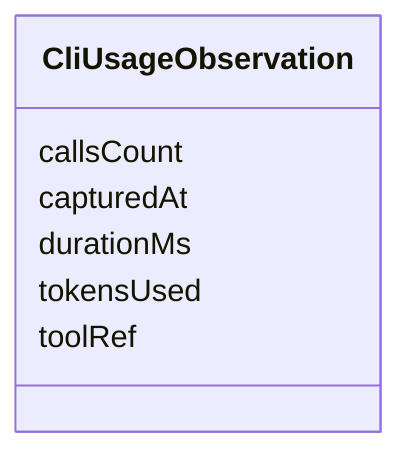

---
search:
  boost: 10.0
---

# Class: CliUsageObservation


_Observed consumption metrics from CLI tool invocations._


<div data-search-exclude markdown="1">


URI: [jumo:CliUsageObservation](https://jumo.dev/schemas/jumo-v1/CliUsageObservation)





<!-- no inheritance hierarchy -->

## Slots

| Name | Cardinality and Range | Description | Inheritance |
| ---  | --- | --- | --- |
| [toolRef](toolRef.md) | 1 <br/> [String](String.md) |  | direct |
| [tokensUsed](tokensUsed.md) | 0..1 <br/> [Integer](Integer.md) |  | direct |
| [callsCount](callsCount.md) | 0..1 <br/> [Integer](Integer.md) |  | direct |
| [durationMs](durationMs.md) | 0..1 <br/> [Integer](Integer.md) |  | direct |
| [capturedAt](capturedAt.md) | 1 <br/> [String](String.md) |  | direct |


## Identifier and Mapping Information


### Annotations

| property | value |
| --- | --- |
| jumo.state_authority | POSTGRES |
| jumo.model_role | OBSERVATION |
| jumo.audience | MACHINE_MTLS |
| jumo.sensitivity | INTERNAL |
| jumo.boundary_eligible | True |
| jumo.schema_profiles | draft-2020-12,native-json-schema,prompted-json-validated |


### Schema Source


* from schema: https://jumo.dev/schemas/jumo-v1


## Mappings

| Mapping Type | Mapped Value |
| ---  | ---  |
| self | jumo:CliUsageObservation |
| native | jumo:CliUsageObservation |


## LinkML Source

<!-- TODO: investigate https://stackoverflow.com/questions/37606292/how-to-create-tabbed-code-blocks-in-mkdocs-or-sphinx -->

### Direct

<details>
```yaml
name: CliUsageObservation
annotations:
  jumo.state_authority:
    tag: jumo.state_authority
    value: POSTGRES
  jumo.model_role:
    tag: jumo.model_role
    value: OBSERVATION
  jumo.audience:
    tag: jumo.audience
    value: MACHINE_MTLS
  jumo.sensitivity:
    tag: jumo.sensitivity
    value: INTERNAL
  jumo.boundary_eligible:
    tag: jumo.boundary_eligible
    value: true
  jumo.schema_profiles:
    tag: jumo.schema_profiles
    value: draft-2020-12,native-json-schema,prompted-json-validated
description: Observed consumption metrics from CLI tool invocations.
from_schema: https://jumo.dev/schemas/jumo-v1
attributes:
  toolRef:
    name: toolRef
    from_schema: https://jumo.dev/schemas/jumo-v1
    owner: CliUsageObservation
    domain_of:
    - CliReleaseSpec
    - CliInstallationDesiredState
    - CliInstallationObservation
    - CliInvocationRequest
    - CliUsageObservation
    range: string
    required: true
  tokensUsed:
    name: tokensUsed
    from_schema: https://jumo.dev/schemas/jumo-v1
    rank: 1000
    owner: CliUsageObservation
    domain_of:
    - CliUsageObservation
    range: integer
  callsCount:
    name: callsCount
    from_schema: https://jumo.dev/schemas/jumo-v1
    rank: 1000
    owner: CliUsageObservation
    domain_of:
    - CliUsageObservation
    range: integer
  durationMs:
    name: durationMs
    from_schema: https://jumo.dev/schemas/jumo-v1
    rank: 1000
    owner: CliUsageObservation
    domain_of:
    - CliUsageObservation
    range: integer
  capturedAt:
    name: capturedAt
    from_schema: https://jumo.dev/schemas/jumo-v1
    rank: 1000
    owner: CliUsageObservation
    domain_of:
    - CliUsageObservation
    - ProviderQuotaObservation
    - EvidenceRecord
    range: string
    required: true

```
</details>

### Induced

<details>
```yaml
name: CliUsageObservation
annotations:
  jumo.state_authority:
    tag: jumo.state_authority
    value: POSTGRES
  jumo.model_role:
    tag: jumo.model_role
    value: OBSERVATION
  jumo.audience:
    tag: jumo.audience
    value: MACHINE_MTLS
  jumo.sensitivity:
    tag: jumo.sensitivity
    value: INTERNAL
  jumo.boundary_eligible:
    tag: jumo.boundary_eligible
    value: true
  jumo.schema_profiles:
    tag: jumo.schema_profiles
    value: draft-2020-12,native-json-schema,prompted-json-validated
description: Observed consumption metrics from CLI tool invocations.
from_schema: https://jumo.dev/schemas/jumo-v1
attributes:
  toolRef:
    name: toolRef
    from_schema: https://jumo.dev/schemas/jumo-v1
    owner: CliUsageObservation
    domain_of:
    - CliReleaseSpec
    - CliInstallationDesiredState
    - CliInstallationObservation
    - CliInvocationRequest
    - CliUsageObservation
    range: string
    required: true
  tokensUsed:
    name: tokensUsed
    from_schema: https://jumo.dev/schemas/jumo-v1
    rank: 1000
    owner: CliUsageObservation
    domain_of:
    - CliUsageObservation
    range: integer
  callsCount:
    name: callsCount
    from_schema: https://jumo.dev/schemas/jumo-v1
    rank: 1000
    owner: CliUsageObservation
    domain_of:
    - CliUsageObservation
    range: integer
  durationMs:
    name: durationMs
    from_schema: https://jumo.dev/schemas/jumo-v1
    rank: 1000
    owner: CliUsageObservation
    domain_of:
    - CliUsageObservation
    range: integer
  capturedAt:
    name: capturedAt
    from_schema: https://jumo.dev/schemas/jumo-v1
    rank: 1000
    owner: CliUsageObservation
    domain_of:
    - CliUsageObservation
    - ProviderQuotaObservation
    - EvidenceRecord
    range: string
    required: true

```
</details></div>