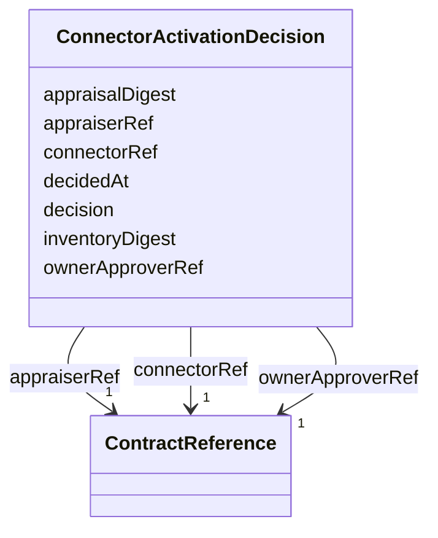

---
search:
  boost: 10.0
---

# Class: ConnectorActivationDecision


_Owner approval and activation decision activating a connector package._


<div data-search-exclude markdown="1">


URI: [jumo:ConnectorActivationDecision](https://jumo.dev/schemas/jumo-v1/ConnectorActivationDecision)





<!-- no inheritance hierarchy -->

## Slots

| Name | Cardinality and Range | Description | Inheritance |
| ---  | --- | --- | --- |
| [connectorRef](connectorRef.md) | 1 <br/> [ContractReference](ContractReference.md) |  | direct |
| [decision](decision.md) | 1 <br/> [String](String.md) |  | direct |
| [appraiserRef](appraiserRef.md) | 1 <br/> [ContractReference](ContractReference.md) |  | direct |
| [ownerApproverRef](ownerApproverRef.md) | 1 <br/> [ContractReference](ContractReference.md) |  | direct |
| [appraisalDigest](appraisalDigest.md) | 1 <br/> [String](String.md) |  | direct |
| [inventoryDigest](inventoryDigest.md) | 1 <br/> [String](String.md) |  | direct |
| [decidedAt](decidedAt.md) | 1 <br/> [String](String.md) |  | direct |


## Identifier and Mapping Information


### Annotations

| property | value |
| --- | --- |
| jumo.state_authority | POSTGRES |
| jumo.model_role | VALUE_OBJECT |
| jumo.audience | REALM_PRIVATE |
| jumo.sensitivity | INTERNAL |
| jumo.boundary_eligible | True |
| jumo.schema_profiles | draft-2020-12,native-json-schema,prompted-json-validated |


### Schema Source


* from schema: https://jumo.dev/schemas/jumo-v1


## Mappings

| Mapping Type | Mapped Value |
| ---  | ---  |
| self | jumo:ConnectorActivationDecision |
| native | jumo:ConnectorActivationDecision |


## LinkML Source

<!-- TODO: investigate https://stackoverflow.com/questions/37606292/how-to-create-tabbed-code-blocks-in-mkdocs-or-sphinx -->

### Direct

<details>
```yaml
name: ConnectorActivationDecision
annotations:
  jumo.state_authority:
    tag: jumo.state_authority
    value: POSTGRES
  jumo.model_role:
    tag: jumo.model_role
    value: VALUE_OBJECT
  jumo.audience:
    tag: jumo.audience
    value: REALM_PRIVATE
  jumo.sensitivity:
    tag: jumo.sensitivity
    value: INTERNAL
  jumo.boundary_eligible:
    tag: jumo.boundary_eligible
    value: true
  jumo.schema_profiles:
    tag: jumo.schema_profiles
    value: draft-2020-12,native-json-schema,prompted-json-validated
description: Owner approval and activation decision activating a connector package.
from_schema: https://jumo.dev/schemas/jumo-v1
attributes:
  connectorRef:
    name: connectorRef
    from_schema: https://jumo.dev/schemas/jumo-v1
    owner: ConnectorActivationDecision
    domain_of:
    - ConnectorSessionBinding
    - ConnectorTestPlan
    - ConnectorActivationDecision
    range: ContractReference
    required: true
    inlined: true
  decision:
    name: decision
    from_schema: https://jumo.dev/schemas/jumo-v1
    owner: ConnectorActivationDecision
    domain_of:
    - McpReconciliationDecision
    - ConnectorActivationDecision
    range: string
    required: true
  appraiserRef:
    name: appraiserRef
    from_schema: https://jumo.dev/schemas/jumo-v1
    rank: 1000
    owner: ConnectorActivationDecision
    domain_of:
    - ConnectorActivationDecision
    range: ContractReference
    required: true
    inlined: true
  ownerApproverRef:
    name: ownerApproverRef
    from_schema: https://jumo.dev/schemas/jumo-v1
    rank: 1000
    owner: ConnectorActivationDecision
    domain_of:
    - ConnectorActivationDecision
    range: ContractReference
    required: true
    inlined: true
  appraisalDigest:
    name: appraisalDigest
    from_schema: https://jumo.dev/schemas/jumo-v1
    rank: 1000
    owner: ConnectorActivationDecision
    domain_of:
    - ConnectorActivationDecision
    range: string
    required: true
  inventoryDigest:
    name: inventoryDigest
    from_schema: https://jumo.dev/schemas/jumo-v1
    owner: ConnectorActivationDecision
    domain_of:
    - RemoteMcpAppraisalSpec
    - McpInventorySnapshot
    - ConnectorActivationDecision
    range: string
    required: true
  decidedAt:
    name: decidedAt
    from_schema: https://jumo.dev/schemas/jumo-v1
    owner: ConnectorActivationDecision
    domain_of:
    - McpReconciliationDecision
    - ConnectorActivationDecision
    range: string
    required: true

```
</details>

### Induced

<details>
```yaml
name: ConnectorActivationDecision
annotations:
  jumo.state_authority:
    tag: jumo.state_authority
    value: POSTGRES
  jumo.model_role:
    tag: jumo.model_role
    value: VALUE_OBJECT
  jumo.audience:
    tag: jumo.audience
    value: REALM_PRIVATE
  jumo.sensitivity:
    tag: jumo.sensitivity
    value: INTERNAL
  jumo.boundary_eligible:
    tag: jumo.boundary_eligible
    value: true
  jumo.schema_profiles:
    tag: jumo.schema_profiles
    value: draft-2020-12,native-json-schema,prompted-json-validated
description: Owner approval and activation decision activating a connector package.
from_schema: https://jumo.dev/schemas/jumo-v1
attributes:
  connectorRef:
    name: connectorRef
    from_schema: https://jumo.dev/schemas/jumo-v1
    owner: ConnectorActivationDecision
    domain_of:
    - ConnectorSessionBinding
    - ConnectorTestPlan
    - ConnectorActivationDecision
    range: ContractReference
    required: true
    inlined: true
  decision:
    name: decision
    from_schema: https://jumo.dev/schemas/jumo-v1
    owner: ConnectorActivationDecision
    domain_of:
    - McpReconciliationDecision
    - ConnectorActivationDecision
    range: string
    required: true
  appraiserRef:
    name: appraiserRef
    from_schema: https://jumo.dev/schemas/jumo-v1
    rank: 1000
    owner: ConnectorActivationDecision
    domain_of:
    - ConnectorActivationDecision
    range: ContractReference
    required: true
    inlined: true
  ownerApproverRef:
    name: ownerApproverRef
    from_schema: https://jumo.dev/schemas/jumo-v1
    rank: 1000
    owner: ConnectorActivationDecision
    domain_of:
    - ConnectorActivationDecision
    range: ContractReference
    required: true
    inlined: true
  appraisalDigest:
    name: appraisalDigest
    from_schema: https://jumo.dev/schemas/jumo-v1
    rank: 1000
    owner: ConnectorActivationDecision
    domain_of:
    - ConnectorActivationDecision
    range: string
    required: true
  inventoryDigest:
    name: inventoryDigest
    from_schema: https://jumo.dev/schemas/jumo-v1
    owner: ConnectorActivationDecision
    domain_of:
    - RemoteMcpAppraisalSpec
    - McpInventorySnapshot
    - ConnectorActivationDecision
    range: string
    required: true
  decidedAt:
    name: decidedAt
    from_schema: https://jumo.dev/schemas/jumo-v1
    owner: ConnectorActivationDecision
    domain_of:
    - McpReconciliationDecision
    - ConnectorActivationDecision
    range: string
    required: true

```
</details></div>