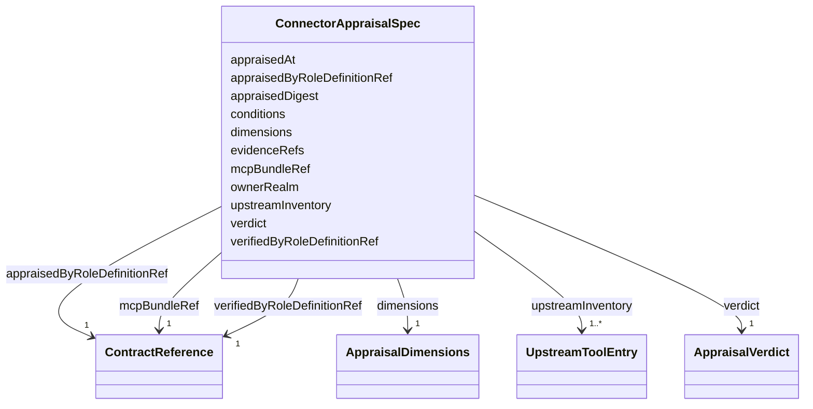

---
search:
  boost: 10.0
---

# Class: ConnectorAppraisalSpec

<div data-search-exclude markdown="1">


URI: [jumo:ConnectorAppraisalSpec](https://jumo.dev/schemas/jumo-v1/ConnectorAppraisalSpec)





<!-- no inheritance hierarchy -->

## Slots

| Name | Cardinality and Range | Description | Inheritance |
| ---  | --- | --- | --- |
| [ownerRealm](ownerRealm.md) | 1 <br/> [Identifier](Identifier.md) |  | direct |
| [mcpBundleRef](mcpBundleRef.md) | 1 <br/> [ContractReference](ContractReference.md) | The McpBundle this appraises | direct |
| [appraisedDigest](appraisedDigest.md) | 1 <br/> [String](String.md) | The exact artifact that was looked at | direct |
| [appraisedByRoleDefinitionRef](appraisedByRoleDefinitionRef.md) | 1 <br/> [ContractReference](ContractReference.md) |  | direct |
| [verifiedByRoleDefinitionRef](verifiedByRoleDefinitionRef.md) | 1 <br/> [ContractReference](ContractReference.md) | The role that checked it, which is not the one that performed it | direct |
| [appraisedAt](appraisedAt.md) | 0..1 <br/> [Datetime](Datetime.md) |  | direct |
| [verdict](verdict.md) | 1 <br/> [AppraisalVerdict](AppraisalVerdict.md) |  | direct |
| [conditions](conditions.md) | * <br/> [String](String.md) | Required and non-empty under ACCEPTED_WITH_CONDITIONS (Rego) | direct |
| [dimensions](dimensions.md) | 1 <br/> [AppraisalDimensions](AppraisalDimensions.md) |  | direct |
| [upstreamInventory](upstreamInventory.md) | 1..* <br/> [UpstreamToolEntry](UpstreamToolEntry.md) | Every tool the upstream server offered when it was looked at, exposed or not ... | direct |
| [evidenceRefs](evidenceRefs.md) | 1..* <br/> [String](String.md) |  | direct |


## Usages

| used by | used in | type | used |
| ---  | --- | --- | --- |
| [ConnectorAppraisal](ConnectorAppraisal.md) | [spec](spec.md) | range | [ConnectorAppraisalSpec](ConnectorAppraisalSpec.md) |


## Identifier and Mapping Information


### Annotations

| property | value |
| --- | --- |
| jumo.state_authority | GIT |
| jumo.model_role | VALUE_OBJECT |
| jumo.audience | REALM_PRIVATE |
| jumo.sensitivity | INTERNAL |
| jumo.boundary_eligible | True |
| jumo.schema_profiles | draft-2020-12,native-json-schema,prompted-json-validated |


### Schema Source


* from schema: https://jumo.dev/schemas/jumo-v1


## Mappings

| Mapping Type | Mapped Value |
| ---  | ---  |
| self | jumo:ConnectorAppraisalSpec |
| native | jumo:ConnectorAppraisalSpec |


## LinkML Source

<!-- TODO: investigate https://stackoverflow.com/questions/37606292/how-to-create-tabbed-code-blocks-in-mkdocs-or-sphinx -->

### Direct

<details>
```yaml
name: ConnectorAppraisalSpec
annotations:
  jumo.state_authority:
    tag: jumo.state_authority
    value: GIT
  jumo.model_role:
    tag: jumo.model_role
    value: VALUE_OBJECT
  jumo.audience:
    tag: jumo.audience
    value: REALM_PRIVATE
  jumo.sensitivity:
    tag: jumo.sensitivity
    value: INTERNAL
  jumo.boundary_eligible:
    tag: jumo.boundary_eligible
    value: true
  jumo.schema_profiles:
    tag: jumo.schema_profiles
    value: draft-2020-12,native-json-schema,prompted-json-validated
from_schema: https://jumo.dev/schemas/jumo-v1
attributes:
  ownerRealm:
    name: ownerRealm
    from_schema: https://jumo.dev/schemas/jumo-v1
    owner: ConnectorAppraisalSpec
    domain_of:
    - PrincipalSpec
    - PrincipalIdentityBindingSpec
    - ProjectSpec
    - KitBindingSpec
    - KitLockSpec
    - RoleDefinitionSpec
    - RoleAssignmentSpec
    - TeamSpecBody
    - CoordinationProfileSpec
    - RoutingEligibilitySpec
    - RoleLifecyclePolicySpec
    - OrganizationTemplateSpec
    - ChiefOfStaffProfileSpec
    - AdvisorProfileSpec
    - PersonalSpaceSpec
    - OrganizationSpecBody
    - RealmPublicationSpec
    - CapabilityProfileSpec
    - WorkerRequirementProfileSpec
    - GoldenTaskSetSpec
    - ImprovementLoopSpec
    - ControlCatalogSpec
    - ComplianceProfileSpec
    - EvidenceProfileSpec
    - ProcessSpecBody
    - ChangeProposalRef
    - ForgeProjectionRef
    - ProcessRunRef
    - ApprovalSignal
    - ExecutionCellProvisioningRef
    - ExecutionMachineSpec
    - MachineHostDefinitionSpec
    - McpRegistrySourceBindingSpec
    - ConnectorDefinitionSpec
    - ConnectorAppraisalSpec
    - McpBundleSpec
    - RemoteMcpServiceSpec
    - RemoteMcpAppraisalSpec
    - ExecutionCellSpec
    - ProviderSessionBinding
    - RoutingDecision
    - WorkerInvocation
    - EvidenceRecord
    - InvocationAuthorizationReceipt
    - SecretBindingSpec
    - FederatedPeerSpec
    - FederationProfileSpec
    - WorkerSubstrateSpec
    - McpInventorySnapshot
    - ConnectorIntegrationSpec
    - OAuthClientBindingSpec
    - InterfaceSurfaceSpec
    - VocabularySetSpec
    - ProjectionSpecBody
    range: Identifier
    required: true
  mcpBundleRef:
    name: mcpBundleRef
    description: The McpBundle this appraises. Refused across Realms (Rego).
    from_schema: https://jumo.dev/schemas/jumo-v1
    owner: ConnectorAppraisalSpec
    domain_of:
    - ConnectorDefinitionSpec
    - ConnectorAppraisalSpec
    range: ContractReference
    required: true
    inlined: true
  appraisedDigest:
    name: appraisedDigest
    description: The exact artifact that was looked at. When the bundle digest moves,
      this appraisal stops being accepted, so an upstream version bump cannot inherit
      the prior review.
    from_schema: https://jumo.dev/schemas/jumo-v1
    rank: 1000
    owner: ConnectorAppraisalSpec
    domain_of:
    - ConnectorAppraisalSpec
    range: string
    required: true
    pattern: ^sha256:[0-9a-f]{64}$
  appraisedByRoleDefinitionRef:
    name: appraisedByRoleDefinitionRef
    from_schema: https://jumo.dev/schemas/jumo-v1
    rank: 1000
    owner: ConnectorAppraisalSpec
    domain_of:
    - ConnectorAppraisalSpec
    range: ContractReference
    required: true
    inlined: true
  verifiedByRoleDefinitionRef:
    name: verifiedByRoleDefinitionRef
    description: The role that checked it, which is not the one that performed it.
    from_schema: https://jumo.dev/schemas/jumo-v1
    rank: 1000
    owner: ConnectorAppraisalSpec
    domain_of:
    - ConnectorAppraisalSpec
    - RemoteMcpAppraisalSpec
    range: ContractReference
    required: true
    inlined: true
  appraisedAt:
    name: appraisedAt
    from_schema: https://jumo.dev/schemas/jumo-v1
    rank: 1000
    owner: ConnectorAppraisalSpec
    domain_of:
    - ConnectorAppraisalSpec
    range: datetime
  verdict:
    name: verdict
    from_schema: https://jumo.dev/schemas/jumo-v1
    rank: 1000
    owner: ConnectorAppraisalSpec
    domain_of:
    - ConnectorAppraisalSpec
    - RemoteMcpAppraisalSpec
    - EntitlementUseContext
    range: AppraisalVerdict
    required: true
  conditions:
    name: conditions
    description: Required and non-empty under ACCEPTED_WITH_CONDITIONS (Rego).
    from_schema: https://jumo.dev/schemas/jumo-v1
    rank: 1000
    owner: ConnectorAppraisalSpec
    domain_of:
    - ConnectorAppraisalSpec
    range: string
    multivalued: true
    pattern: ^.{10,}$
  dimensions:
    name: dimensions
    from_schema: https://jumo.dev/schemas/jumo-v1
    owner: ConnectorAppraisalSpec
    domain_of:
    - GoldenTaskCase
    - ConnectorAppraisalSpec
    range: AppraisalDimensions
    required: true
    inlined: true
  upstreamInventory:
    name: upstreamInventory
    description: Every tool the upstream server offered when it was looked at, exposed
      or not -- enumerating what was held back is the point of the whole document.
    from_schema: https://jumo.dev/schemas/jumo-v1
    rank: 1000
    owner: ConnectorAppraisalSpec
    domain_of:
    - ConnectorAppraisalSpec
    range: UpstreamToolEntry
    required: true
    multivalued: true
    inlined: true
    inlined_as_list: true
    minimum_cardinality: 1
  evidenceRefs:
    name: evidenceRefs
    from_schema: https://jumo.dev/schemas/jumo-v1
    owner: ConnectorAppraisalSpec
    domain_of:
    - KitReleaseCertificationSpec
    - WorkOrderSpec
    - AttentionItemSpec
    - ControlAssessment
    - ConnectorAppraisalSpec
    - RemoteMcpAppraisalSpec
    range: string
    required: true
    multivalued: true
    pattern: ^.{1,}$
    minimum_cardinality: 1

```
</details>

### Induced

<details>
```yaml
name: ConnectorAppraisalSpec
annotations:
  jumo.state_authority:
    tag: jumo.state_authority
    value: GIT
  jumo.model_role:
    tag: jumo.model_role
    value: VALUE_OBJECT
  jumo.audience:
    tag: jumo.audience
    value: REALM_PRIVATE
  jumo.sensitivity:
    tag: jumo.sensitivity
    value: INTERNAL
  jumo.boundary_eligible:
    tag: jumo.boundary_eligible
    value: true
  jumo.schema_profiles:
    tag: jumo.schema_profiles
    value: draft-2020-12,native-json-schema,prompted-json-validated
from_schema: https://jumo.dev/schemas/jumo-v1
attributes:
  ownerRealm:
    name: ownerRealm
    from_schema: https://jumo.dev/schemas/jumo-v1
    owner: ConnectorAppraisalSpec
    domain_of:
    - PrincipalSpec
    - PrincipalIdentityBindingSpec
    - ProjectSpec
    - KitBindingSpec
    - KitLockSpec
    - RoleDefinitionSpec
    - RoleAssignmentSpec
    - TeamSpecBody
    - CoordinationProfileSpec
    - RoutingEligibilitySpec
    - RoleLifecyclePolicySpec
    - OrganizationTemplateSpec
    - ChiefOfStaffProfileSpec
    - AdvisorProfileSpec
    - PersonalSpaceSpec
    - OrganizationSpecBody
    - RealmPublicationSpec
    - CapabilityProfileSpec
    - WorkerRequirementProfileSpec
    - GoldenTaskSetSpec
    - ImprovementLoopSpec
    - ControlCatalogSpec
    - ComplianceProfileSpec
    - EvidenceProfileSpec
    - ProcessSpecBody
    - ChangeProposalRef
    - ForgeProjectionRef
    - ProcessRunRef
    - ApprovalSignal
    - ExecutionCellProvisioningRef
    - ExecutionMachineSpec
    - MachineHostDefinitionSpec
    - McpRegistrySourceBindingSpec
    - ConnectorDefinitionSpec
    - ConnectorAppraisalSpec
    - McpBundleSpec
    - RemoteMcpServiceSpec
    - RemoteMcpAppraisalSpec
    - ExecutionCellSpec
    - ProviderSessionBinding
    - RoutingDecision
    - WorkerInvocation
    - EvidenceRecord
    - InvocationAuthorizationReceipt
    - SecretBindingSpec
    - FederatedPeerSpec
    - FederationProfileSpec
    - WorkerSubstrateSpec
    - McpInventorySnapshot
    - ConnectorIntegrationSpec
    - OAuthClientBindingSpec
    - InterfaceSurfaceSpec
    - VocabularySetSpec
    - ProjectionSpecBody
    range: Identifier
    required: true
  mcpBundleRef:
    name: mcpBundleRef
    description: The McpBundle this appraises. Refused across Realms (Rego).
    from_schema: https://jumo.dev/schemas/jumo-v1
    owner: ConnectorAppraisalSpec
    domain_of:
    - ConnectorDefinitionSpec
    - ConnectorAppraisalSpec
    range: ContractReference
    required: true
    inlined: true
  appraisedDigest:
    name: appraisedDigest
    description: The exact artifact that was looked at. When the bundle digest moves,
      this appraisal stops being accepted, so an upstream version bump cannot inherit
      the prior review.
    from_schema: https://jumo.dev/schemas/jumo-v1
    rank: 1000
    owner: ConnectorAppraisalSpec
    domain_of:
    - ConnectorAppraisalSpec
    range: string
    required: true
    pattern: ^sha256:[0-9a-f]{64}$
  appraisedByRoleDefinitionRef:
    name: appraisedByRoleDefinitionRef
    from_schema: https://jumo.dev/schemas/jumo-v1
    rank: 1000
    owner: ConnectorAppraisalSpec
    domain_of:
    - ConnectorAppraisalSpec
    range: ContractReference
    required: true
    inlined: true
  verifiedByRoleDefinitionRef:
    name: verifiedByRoleDefinitionRef
    description: The role that checked it, which is not the one that performed it.
    from_schema: https://jumo.dev/schemas/jumo-v1
    rank: 1000
    owner: ConnectorAppraisalSpec
    domain_of:
    - ConnectorAppraisalSpec
    - RemoteMcpAppraisalSpec
    range: ContractReference
    required: true
    inlined: true
  appraisedAt:
    name: appraisedAt
    from_schema: https://jumo.dev/schemas/jumo-v1
    rank: 1000
    owner: ConnectorAppraisalSpec
    domain_of:
    - ConnectorAppraisalSpec
    range: datetime
  verdict:
    name: verdict
    from_schema: https://jumo.dev/schemas/jumo-v1
    rank: 1000
    owner: ConnectorAppraisalSpec
    domain_of:
    - ConnectorAppraisalSpec
    - RemoteMcpAppraisalSpec
    - EntitlementUseContext
    range: AppraisalVerdict
    required: true
  conditions:
    name: conditions
    description: Required and non-empty under ACCEPTED_WITH_CONDITIONS (Rego).
    from_schema: https://jumo.dev/schemas/jumo-v1
    rank: 1000
    owner: ConnectorAppraisalSpec
    domain_of:
    - ConnectorAppraisalSpec
    range: string
    multivalued: true
    pattern: ^.{10,}$
  dimensions:
    name: dimensions
    from_schema: https://jumo.dev/schemas/jumo-v1
    owner: ConnectorAppraisalSpec
    domain_of:
    - GoldenTaskCase
    - ConnectorAppraisalSpec
    range: AppraisalDimensions
    required: true
    inlined: true
  upstreamInventory:
    name: upstreamInventory
    description: Every tool the upstream server offered when it was looked at, exposed
      or not -- enumerating what was held back is the point of the whole document.
    from_schema: https://jumo.dev/schemas/jumo-v1
    rank: 1000
    owner: ConnectorAppraisalSpec
    domain_of:
    - ConnectorAppraisalSpec
    range: UpstreamToolEntry
    required: true
    multivalued: true
    inlined: true
    inlined_as_list: true
    minimum_cardinality: 1
  evidenceRefs:
    name: evidenceRefs
    from_schema: https://jumo.dev/schemas/jumo-v1
    owner: ConnectorAppraisalSpec
    domain_of:
    - KitReleaseCertificationSpec
    - WorkOrderSpec
    - AttentionItemSpec
    - ControlAssessment
    - ConnectorAppraisalSpec
    - RemoteMcpAppraisalSpec
    range: string
    required: true
    multivalued: true
    pattern: ^.{1,}$
    minimum_cardinality: 1

```
</details></div>