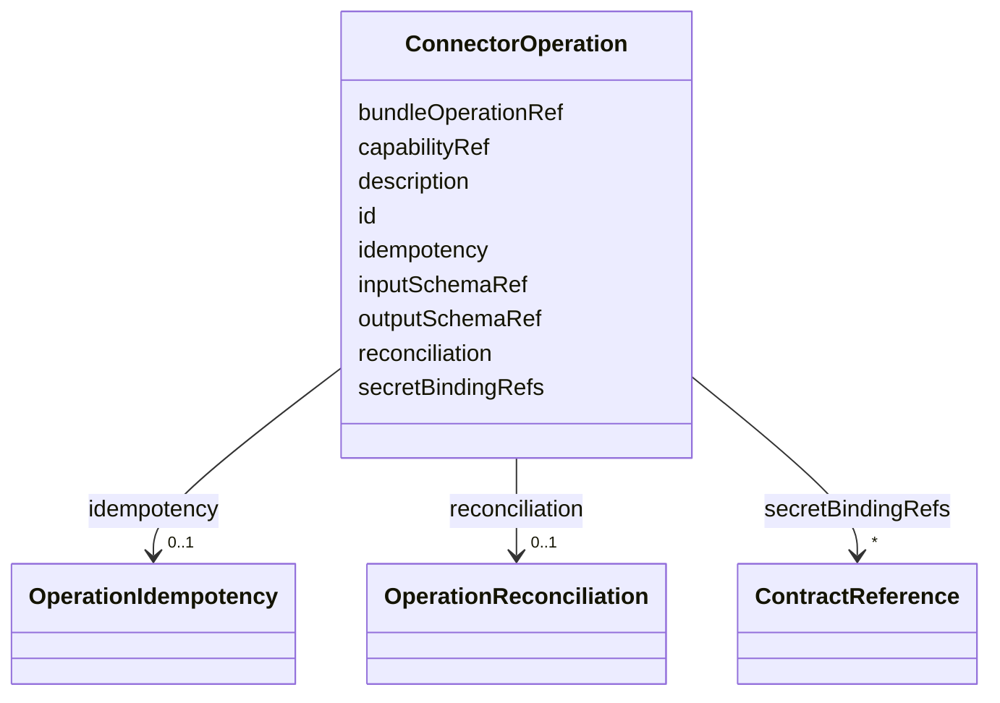

---
search:
  boost: 10.0
---

# Class: ConnectorOperation

<div data-search-exclude markdown="1">


URI: [jumo:ConnectorOperation](https://jumo.dev/schemas/jumo-v1/ConnectorOperation)





<!-- no inheritance hierarchy -->

## Slots

| Name | Cardinality and Range | Description | Inheritance |
| ---  | --- | --- | --- |
| [id](id.md) | 1 <br/> [Identifier](Identifier.md) |  | direct |
| [capabilityRef](capabilityRef.md) | 1 <br/> [CapabilityName](CapabilityName.md) |  | direct |
| [description](description.md) | 0..1 <br/> [String](String.md) |  | direct |
| [bundleOperationRef](bundleOperationRef.md) | 0..1 <br/> [Identifier](Identifier.md) |  | direct |
| [inputSchemaRef](inputSchemaRef.md) | 0..1 <br/> [String](String.md) |  | direct |
| [outputSchemaRef](outputSchemaRef.md) | 0..1 <br/> [String](String.md) |  | direct |
| [idempotency](idempotency.md) | 0..1 <br/> [OperationIdempotency](OperationIdempotency.md) |  | direct |
| [reconciliation](reconciliation.md) | 0..1 <br/> [OperationReconciliation](OperationReconciliation.md) |  | direct |
| [secretBindingRefs](secretBindingRefs.md) | * <br/> [ContractReference](ContractReference.md) |  | direct |


## Usages

| used by | used in | type | used |
| ---  | --- | --- | --- |
| [ConnectorDefinitionSpec](ConnectorDefinitionSpec.md) | [operations](operations.md) | range | [ConnectorOperation](ConnectorOperation.md) |


## Identifier and Mapping Information


### Annotations

| property | value |
| --- | --- |
| jumo.state_authority | GIT |
| jumo.model_role | VALUE_OBJECT |
| jumo.audience | REALM_PRIVATE |
| jumo.sensitivity | INTERNAL |
| jumo.boundary_eligible | True |
| jumo.schema_profiles | draft-2020-12,native-json-schema,prompted-json-validated |


### Schema Source


* from schema: https://jumo.dev/schemas/jumo-v1


## Mappings

| Mapping Type | Mapped Value |
| ---  | ---  |
| self | jumo:ConnectorOperation |
| native | jumo:ConnectorOperation |


## LinkML Source

<!-- TODO: investigate https://stackoverflow.com/questions/37606292/how-to-create-tabbed-code-blocks-in-mkdocs-or-sphinx -->

### Direct

<details>
```yaml
name: ConnectorOperation
annotations:
  jumo.state_authority:
    tag: jumo.state_authority
    value: GIT
  jumo.model_role:
    tag: jumo.model_role
    value: VALUE_OBJECT
  jumo.audience:
    tag: jumo.audience
    value: REALM_PRIVATE
  jumo.sensitivity:
    tag: jumo.sensitivity
    value: INTERNAL
  jumo.boundary_eligible:
    tag: jumo.boundary_eligible
    value: true
  jumo.schema_profiles:
    tag: jumo.schema_profiles
    value: draft-2020-12,native-json-schema,prompted-json-validated
from_schema: https://jumo.dev/schemas/jumo-v1
attributes:
  id:
    name: id
    from_schema: https://jumo.dev/schemas/jumo-v1
    owner: ConnectorOperation
    domain_of:
    - ContractReference
    - Metadata
    - LayerOverride
    - Principle
    - Milestone
    - RepositoryBinding
    - KitProfile
    - KitModule
    - DispositionRule
    - SelfDescriptionSubject
    - AgentCardSkill
    - AcceptanceCriterion
    - EngagementStage
    - GoldenTaskCase
    - AssistedJourneyStep
    - PolicyRule
    - AttentionDecisionOption
    - ProcessStep
    - ProcessFlow
    - ChangeProposalRef
    - ForgeProjectionRef
    - ProcessRunRef
    - ApprovalSignal
    - ExecutionCellProvisioningRef
    - ConnectorOperation
    - McpBundleOperation
    - ProviderSessionBinding
    - RoutingDecision
    - WorkerInvocation
    - EvidenceRecord
    - Surface
    - ProjectionSection
    range: Identifier
    required: true
  capabilityRef:
    name: capabilityRef
    from_schema: https://jumo.dev/schemas/jumo-v1
    owner: ConnectorOperation
    domain_of:
    - ImprovementTarget
    - AttentionDecisionOption
    - ProcessStep
    - ConnectorOperation
    - McpBundleOperation
    - SurfaceWritePath
    range: CapabilityName
    required: true
  description:
    name: description
    from_schema: https://jumo.dev/schemas/jumo-v1
    owner: ConnectorOperation
    domain_of:
    - PromptVariable
    - AssistedJourneySpec
    - AssistedJourneyStep
    - ActionCapability
    - MachineAdminPlaybookSpec
    - ConnectorOperation
    - McpBundleOperation
    - McpToolDescriptor
    - ConnectorIntegrationSpec
    - ApiResponseBinding
    range: string
    pattern: ^.{10,}$
  bundleOperationRef:
    name: bundleOperationRef
    from_schema: https://jumo.dev/schemas/jumo-v1
    rank: 1000
    owner: ConnectorOperation
    domain_of:
    - ConnectorOperation
    range: Identifier
  inputSchemaRef:
    name: inputSchemaRef
    from_schema: https://jumo.dev/schemas/jumo-v1
    rank: 1000
    owner: ConnectorOperation
    domain_of:
    - ConnectorOperation
    - McpBundleOperation
    range: string
  outputSchemaRef:
    name: outputSchemaRef
    from_schema: https://jumo.dev/schemas/jumo-v1
    rank: 1000
    owner: ConnectorOperation
    domain_of:
    - ConnectorOperation
    - McpBundleOperation
    range: string
  idempotency:
    name: idempotency
    from_schema: https://jumo.dev/schemas/jumo-v1
    rank: 1000
    owner: ConnectorOperation
    domain_of:
    - ConnectorOperation
    - McpBundleOperation
    range: OperationIdempotency
  reconciliation:
    name: reconciliation
    from_schema: https://jumo.dev/schemas/jumo-v1
    rank: 1000
    owner: ConnectorOperation
    domain_of:
    - ConnectorOperation
    - McpBundleOperation
    range: OperationReconciliation
  secretBindingRefs:
    name: secretBindingRefs
    from_schema: https://jumo.dev/schemas/jumo-v1
    rank: 1000
    owner: ConnectorOperation
    domain_of:
    - ConnectorOperation
    - McpBundleOperation
    range: ContractReference
    multivalued: true
    inlined: true
    inlined_as_list: true

```
</details>

### Induced

<details>
```yaml
name: ConnectorOperation
annotations:
  jumo.state_authority:
    tag: jumo.state_authority
    value: GIT
  jumo.model_role:
    tag: jumo.model_role
    value: VALUE_OBJECT
  jumo.audience:
    tag: jumo.audience
    value: REALM_PRIVATE
  jumo.sensitivity:
    tag: jumo.sensitivity
    value: INTERNAL
  jumo.boundary_eligible:
    tag: jumo.boundary_eligible
    value: true
  jumo.schema_profiles:
    tag: jumo.schema_profiles
    value: draft-2020-12,native-json-schema,prompted-json-validated
from_schema: https://jumo.dev/schemas/jumo-v1
attributes:
  id:
    name: id
    from_schema: https://jumo.dev/schemas/jumo-v1
    owner: ConnectorOperation
    domain_of:
    - ContractReference
    - Metadata
    - LayerOverride
    - Principle
    - Milestone
    - RepositoryBinding
    - KitProfile
    - KitModule
    - DispositionRule
    - SelfDescriptionSubject
    - AgentCardSkill
    - AcceptanceCriterion
    - EngagementStage
    - GoldenTaskCase
    - AssistedJourneyStep
    - PolicyRule
    - AttentionDecisionOption
    - ProcessStep
    - ProcessFlow
    - ChangeProposalRef
    - ForgeProjectionRef
    - ProcessRunRef
    - ApprovalSignal
    - ExecutionCellProvisioningRef
    - ConnectorOperation
    - McpBundleOperation
    - ProviderSessionBinding
    - RoutingDecision
    - WorkerInvocation
    - EvidenceRecord
    - Surface
    - ProjectionSection
    range: Identifier
    required: true
  capabilityRef:
    name: capabilityRef
    from_schema: https://jumo.dev/schemas/jumo-v1
    owner: ConnectorOperation
    domain_of:
    - ImprovementTarget
    - AttentionDecisionOption
    - ProcessStep
    - ConnectorOperation
    - McpBundleOperation
    - SurfaceWritePath
    range: CapabilityName
    required: true
  description:
    name: description
    from_schema: https://jumo.dev/schemas/jumo-v1
    owner: ConnectorOperation
    domain_of:
    - PromptVariable
    - AssistedJourneySpec
    - AssistedJourneyStep
    - ActionCapability
    - MachineAdminPlaybookSpec
    - ConnectorOperation
    - McpBundleOperation
    - McpToolDescriptor
    - ConnectorIntegrationSpec
    - ApiResponseBinding
    range: string
    pattern: ^.{10,}$
  bundleOperationRef:
    name: bundleOperationRef
    from_schema: https://jumo.dev/schemas/jumo-v1
    rank: 1000
    owner: ConnectorOperation
    domain_of:
    - ConnectorOperation
    range: Identifier
  inputSchemaRef:
    name: inputSchemaRef
    from_schema: https://jumo.dev/schemas/jumo-v1
    rank: 1000
    owner: ConnectorOperation
    domain_of:
    - ConnectorOperation
    - McpBundleOperation
    range: string
  outputSchemaRef:
    name: outputSchemaRef
    from_schema: https://jumo.dev/schemas/jumo-v1
    rank: 1000
    owner: ConnectorOperation
    domain_of:
    - ConnectorOperation
    - McpBundleOperation
    range: string
  idempotency:
    name: idempotency
    from_schema: https://jumo.dev/schemas/jumo-v1
    rank: 1000
    owner: ConnectorOperation
    domain_of:
    - ConnectorOperation
    - McpBundleOperation
    range: OperationIdempotency
  reconciliation:
    name: reconciliation
    from_schema: https://jumo.dev/schemas/jumo-v1
    rank: 1000
    owner: ConnectorOperation
    domain_of:
    - ConnectorOperation
    - McpBundleOperation
    range: OperationReconciliation
  secretBindingRefs:
    name: secretBindingRefs
    from_schema: https://jumo.dev/schemas/jumo-v1
    rank: 1000
    owner: ConnectorOperation
    domain_of:
    - ConnectorOperation
    - McpBundleOperation
    range: ContractReference
    multivalued: true
    inlined: true
    inlined_as_list: true

```
</details></div>