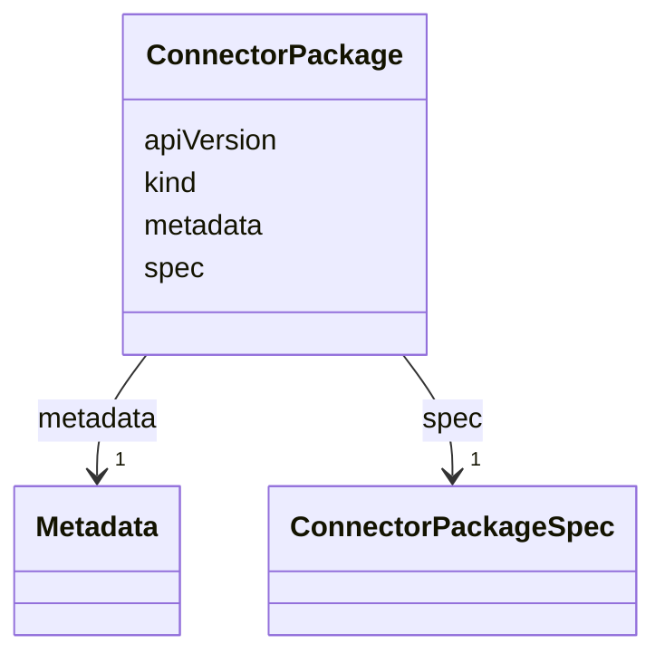

---
search:
  boost: 10.0
---

# Class: ConnectorPackage


_Platform-only Git contract manifest defining a complete connector package under .jumo/connector-packages/<id>/. Publication in the Platform corpus is a technical-reuse fact and confers no Realm consent, secret or activation authority (ADR-0050 decision 8)._


<div data-search-exclude markdown="1">


URI: [jumo:ConnectorPackage](https://jumo.dev/schemas/jumo-v1/ConnectorPackage)





<!-- no inheritance hierarchy -->

## Slots

| Name | Cardinality and Range | Description | Inheritance |
| ---  | --- | --- | --- |
| [apiVersion](apiVersion.md) | 1 <br/> [String](String.md) |  | direct |
| [kind](kind.md) | 1 <br/> [String](String.md) |  | direct |
| [metadata](metadata.md) | 1 <br/> [Metadata](Metadata.md) |  | direct |
| [spec](spec.md) | 1 <br/> [ConnectorPackageSpec](ConnectorPackageSpec.md) |  | direct |


## Identifier and Mapping Information


### Annotations

| property | value |
| --- | --- |
| jumo.state_authority | GIT |
| jumo.model_role | CONTRACT |
| jumo.audience | INTERNAL_WORKER |
| jumo.sensitivity | INTERNAL |
| jumo.boundary_eligible | True |
| jumo.schema_profiles | draft-2020-12,native-json-schema,prompted-json-validated |
| jumo.composition | SEALED |


### Schema Source


* from schema: https://jumo.dev/schemas/jumo-v1


## Mappings

| Mapping Type | Mapped Value |
| ---  | ---  |
| self | jumo:ConnectorPackage |
| native | jumo:ConnectorPackage |


## LinkML Source

<!-- TODO: investigate https://stackoverflow.com/questions/37606292/how-to-create-tabbed-code-blocks-in-mkdocs-or-sphinx -->

### Direct

<details>
```yaml
name: ConnectorPackage
annotations:
  jumo.state_authority:
    tag: jumo.state_authority
    value: GIT
  jumo.model_role:
    tag: jumo.model_role
    value: CONTRACT
  jumo.audience:
    tag: jumo.audience
    value: INTERNAL_WORKER
  jumo.sensitivity:
    tag: jumo.sensitivity
    value: INTERNAL
  jumo.boundary_eligible:
    tag: jumo.boundary_eligible
    value: true
  jumo.schema_profiles:
    tag: jumo.schema_profiles
    value: draft-2020-12,native-json-schema,prompted-json-validated
  jumo.composition:
    tag: jumo.composition
    value: SEALED
description: Platform-only Git contract manifest defining a complete connector package
  under .jumo/connector-packages/<id>/. Publication in the Platform corpus is a technical-reuse
  fact and confers no Realm consent, secret or activation authority (ADR-0050 decision
  8).
from_schema: https://jumo.dev/schemas/jumo-v1
attributes:
  apiVersion:
    name: apiVersion
    from_schema: https://jumo.dev/schemas/jumo-v1
    owner: ConnectorPackage
    domain_of:
    - Principal
    - PrincipalIdentityBinding
    - PrincipleSet
    - Project
    - RealmTemplate
    - JumoKit
    - KitBinding
    - KitLock
    - KitReleaseCertification
    - OfferingSpec
    - RoleDefinition
    - AgentDefinition
    - RoleAssignment
    - TeamSpec
    - CoordinationProfile
    - RoutingEligibility
    - RoleLifecyclePolicy
    - OrganizationTemplate
    - ChiefOfStaffProfile
    - AdvisorProfile
    - PersonalSpace
    - Preferences
    - SelfDescription
    - OrganizationSpec
    - Organization
    - OrganizationAccessBinding
    - OrganizationEnrollmentPolicy
    - OrganizationAuditRetentionPolicy
    - OrganizationRetentionHold
    - OrganizationPublicationPolicy
    - RealmPublication
    - WorkOrder
    - SolicitationContract
    - EngagementMethod
    - Practice
    - CapabilityProfile
    - WorkerRequirementProfile
    - GoldenTaskSet
    - PromptTemplate
    - ResourceBudget
    - AssistedJourney
    - JourneyVerificationSpec
    - DocumentTemplate
    - ActionCapabilitySet
    - PolicySet
    - ImprovementLoop
    - ImprovementRecommendation
    - AttentionItem
    - ControlCatalog
    - ComplianceProfile
    - EvidenceProfile
    - ProcessSpec
    - ExecutionMachine
    - MachineHostDefinition
    - MachineAdminPlaybook
    - CliToolDefinition
    - CliRelease
    - McpRegistrySource
    - McpRegistrySourceBinding
    - ConnectorDefinition
    - ConnectorAppraisal
    - McpBundle
    - RemoteMcpService
    - RemoteMcpAppraisal
    - ExecutionCell
    - SecretBinding
    - FederatedPeer
    - FederationProfile
    - ProviderAccount
    - ProviderPlatform
    - WorkerSubstrate
    - ConnectorIntegration
    - ConnectorPackage
    - ConnectorPackageCertification
    - OAuthClientBinding
    - InterfaceSurface
    - ThemePack
    - VocabularySet
    - ApiSurface
    - ProjectionSpec
    range: string
    required: true
    equals_string: jumo.dev/v1
  kind:
    name: kind
    from_schema: https://jumo.dev/schemas/jumo-v1
    owner: ConnectorPackage
    domain_of:
    - ContractReference
    - Principal
    - PrincipalIdentityBinding
    - PrincipleSet
    - Project
    - RealmTemplate
    - JumoKit
    - KitBinding
    - KitLock
    - KitReleaseCertification
    - OfferingSpec
    - RoleDefinition
    - AgentDefinition
    - RoleAssignment
    - RoleBearer
    - TeamSpec
    - CoordinationProfile
    - RoutingEligibility
    - RoleLifecyclePolicy
    - OrganizationTemplate
    - ChiefOfStaffProfile
    - AdvisorProfile
    - PersonalSpace
    - Preferences
    - SelfDescription
    - SelfDescriptionSubject
    - OrganizationSpec
    - Organization
    - OrganizationAccessBinding
    - OrganizationEnrollmentPolicy
    - OrganizationAuditRetentionPolicy
    - OrganizationRetentionHold
    - OrganizationPublicationPolicy
    - RealmPublication
    - WorkOrder
    - SolicitationContract
    - EngagementMethod
    - Practice
    - CapabilityProfile
    - WorkerRequirementProfile
    - GoldenTaskSet
    - PromptTemplate
    - ResourceBudget
    - AssistedJourney
    - JourneyVerificationSpec
    - AssistedJourneyReferenceCheck
    - DocumentTemplate
    - ActionCapabilitySet
    - PolicySet
    - ImprovementLoop
    - ImprovementRecommendation
    - AttentionItem
    - ControlCatalog
    - ComplianceProfile
    - EvidenceProfile
    - ProcessSpec
    - ProcessStep
    - ExecutionMachine
    - MachineHostDefinition
    - MachineAdminPlaybook
    - MachineRuntimeInstallation
    - CliToolDefinition
    - CliRelease
    - ProviderQuotaObservation
    - McpRegistrySource
    - McpRegistrySourceBinding
    - ConnectorDefinition
    - ConnectorAppraisal
    - McpBundle
    - RemoteMcpService
    - RemoteMcpAppraisal
    - ExecutionCell
    - SecretBinding
    - FederatedPeer
    - FederationProfile
    - ProviderAccount
    - ProviderPlatform
    - ProviderQuotaWindow
    - WorkerSubstrate
    - ConnectorIntegration
    - ConnectorPackage
    - ConnectorPackageCertification
    - OAuthClientBinding
    - InterfaceSurface
    - ThemePack
    - VocabularySet
    - ApiSurface
    - ProjectionSpec
    range: string
    required: true
    equals_string: ConnectorPackage
  metadata:
    name: metadata
    from_schema: https://jumo.dev/schemas/jumo-v1
    owner: ConnectorPackage
    domain_of:
    - Principal
    - PrincipalIdentityBinding
    - PrincipleSet
    - Project
    - RealmTemplate
    - JumoKit
    - KitBinding
    - KitLock
    - KitReleaseCertification
    - OfferingSpec
    - RoleDefinition
    - AgentDefinition
    - RoleAssignment
    - TeamSpec
    - CoordinationProfile
    - RoutingEligibility
    - RoleLifecyclePolicy
    - OrganizationTemplate
    - ChiefOfStaffProfile
    - AdvisorProfile
    - PersonalSpace
    - Preferences
    - SelfDescription
    - OrganizationSpec
    - Organization
    - OrganizationAccessBinding
    - OrganizationEnrollmentPolicy
    - OrganizationAuditRetentionPolicy
    - OrganizationRetentionHold
    - OrganizationPublicationPolicy
    - RealmPublication
    - WorkOrder
    - SolicitationContract
    - EngagementMethod
    - Practice
    - CapabilityProfile
    - WorkerRequirementProfile
    - GoldenTaskSet
    - PromptTemplate
    - ResourceBudget
    - AssistedJourney
    - JourneyVerificationSpec
    - DocumentTemplate
    - ActionCapabilitySet
    - PolicySet
    - ImprovementLoop
    - ImprovementRecommendation
    - AttentionItem
    - ControlCatalog
    - ComplianceProfile
    - EvidenceProfile
    - ProcessSpec
    - ExecutionMachine
    - MachineHostDefinition
    - MachineAdminPlaybook
    - CliToolDefinition
    - CliRelease
    - McpRegistrySource
    - McpRegistrySourceBinding
    - ConnectorDefinition
    - ConnectorAppraisal
    - McpBundle
    - RemoteMcpService
    - RemoteMcpAppraisal
    - ExecutionCell
    - SecretBinding
    - FederatedPeer
    - FederationProfile
    - ProviderAccount
    - ProviderPlatform
    - WorkerSubstrate
    - ConnectorIntegration
    - ConnectorPackage
    - ConnectorPackageCertification
    - OAuthClientBinding
    - InterfaceSurface
    - ThemePack
    - VocabularySet
    - ApiSurface
    - ProjectionSpec
    range: Metadata
    required: true
    inlined: true
  spec:
    name: spec
    from_schema: https://jumo.dev/schemas/jumo-v1
    owner: ConnectorPackage
    domain_of:
    - Principal
    - PrincipalIdentityBinding
    - PrincipleSet
    - Project
    - RealmTemplate
    - JumoKit
    - KitBinding
    - KitLock
    - KitReleaseCertification
    - OfferingSpec
    - RoleDefinition
    - AgentDefinition
    - RoleAssignment
    - TeamSpec
    - CoordinationProfile
    - RoutingEligibility
    - RoleLifecyclePolicy
    - OrganizationTemplate
    - ChiefOfStaffProfile
    - AdvisorProfile
    - PersonalSpace
    - Preferences
    - SelfDescription
    - OrganizationSpec
    - Organization
    - OrganizationAccessBinding
    - OrganizationEnrollmentPolicy
    - OrganizationAuditRetentionPolicy
    - OrganizationRetentionHold
    - OrganizationPublicationPolicy
    - RealmPublication
    - WorkOrder
    - SolicitationContract
    - EngagementMethod
    - Practice
    - CapabilityProfile
    - WorkerRequirementProfile
    - GoldenTaskSet
    - PromptTemplate
    - ResourceBudget
    - AssistedJourney
    - DocumentTemplate
    - ActionCapabilitySet
    - PolicySet
    - ImprovementLoop
    - ImprovementRecommendation
    - AttentionItem
    - ControlCatalog
    - ComplianceProfile
    - EvidenceProfile
    - ProcessSpec
    - ExecutionMachine
    - MachineHostDefinition
    - MachineAdminPlaybook
    - CliToolDefinition
    - CliRelease
    - McpRegistrySource
    - McpRegistrySourceBinding
    - ConnectorDefinition
    - ConnectorAppraisal
    - McpBundle
    - RemoteMcpService
    - RemoteMcpAppraisal
    - ExecutionCell
    - SecretBinding
    - FederatedPeer
    - FederationProfile
    - ProviderAccount
    - ProviderPlatform
    - WorkerSubstrate
    - ConnectorIntegration
    - ConnectorPackage
    - ConnectorPackageCertification
    - OAuthClientBinding
    - InterfaceSurface
    - ThemePack
    - VocabularySet
    - ApiSurface
    - ProjectionSpec
    range: ConnectorPackageSpec
    required: true
    inlined: true

```
</details>

### Induced

<details>
```yaml
name: ConnectorPackage
annotations:
  jumo.state_authority:
    tag: jumo.state_authority
    value: GIT
  jumo.model_role:
    tag: jumo.model_role
    value: CONTRACT
  jumo.audience:
    tag: jumo.audience
    value: INTERNAL_WORKER
  jumo.sensitivity:
    tag: jumo.sensitivity
    value: INTERNAL
  jumo.boundary_eligible:
    tag: jumo.boundary_eligible
    value: true
  jumo.schema_profiles:
    tag: jumo.schema_profiles
    value: draft-2020-12,native-json-schema,prompted-json-validated
  jumo.composition:
    tag: jumo.composition
    value: SEALED
description: Platform-only Git contract manifest defining a complete connector package
  under .jumo/connector-packages/<id>/. Publication in the Platform corpus is a technical-reuse
  fact and confers no Realm consent, secret or activation authority (ADR-0050 decision
  8).
from_schema: https://jumo.dev/schemas/jumo-v1
attributes:
  apiVersion:
    name: apiVersion
    from_schema: https://jumo.dev/schemas/jumo-v1
    owner: ConnectorPackage
    domain_of:
    - Principal
    - PrincipalIdentityBinding
    - PrincipleSet
    - Project
    - RealmTemplate
    - JumoKit
    - KitBinding
    - KitLock
    - KitReleaseCertification
    - OfferingSpec
    - RoleDefinition
    - AgentDefinition
    - RoleAssignment
    - TeamSpec
    - CoordinationProfile
    - RoutingEligibility
    - RoleLifecyclePolicy
    - OrganizationTemplate
    - ChiefOfStaffProfile
    - AdvisorProfile
    - PersonalSpace
    - Preferences
    - SelfDescription
    - OrganizationSpec
    - Organization
    - OrganizationAccessBinding
    - OrganizationEnrollmentPolicy
    - OrganizationAuditRetentionPolicy
    - OrganizationRetentionHold
    - OrganizationPublicationPolicy
    - RealmPublication
    - WorkOrder
    - SolicitationContract
    - EngagementMethod
    - Practice
    - CapabilityProfile
    - WorkerRequirementProfile
    - GoldenTaskSet
    - PromptTemplate
    - ResourceBudget
    - AssistedJourney
    - JourneyVerificationSpec
    - DocumentTemplate
    - ActionCapabilitySet
    - PolicySet
    - ImprovementLoop
    - ImprovementRecommendation
    - AttentionItem
    - ControlCatalog
    - ComplianceProfile
    - EvidenceProfile
    - ProcessSpec
    - ExecutionMachine
    - MachineHostDefinition
    - MachineAdminPlaybook
    - CliToolDefinition
    - CliRelease
    - McpRegistrySource
    - McpRegistrySourceBinding
    - ConnectorDefinition
    - ConnectorAppraisal
    - McpBundle
    - RemoteMcpService
    - RemoteMcpAppraisal
    - ExecutionCell
    - SecretBinding
    - FederatedPeer
    - FederationProfile
    - ProviderAccount
    - ProviderPlatform
    - WorkerSubstrate
    - ConnectorIntegration
    - ConnectorPackage
    - ConnectorPackageCertification
    - OAuthClientBinding
    - InterfaceSurface
    - ThemePack
    - VocabularySet
    - ApiSurface
    - ProjectionSpec
    range: string
    required: true
    equals_string: jumo.dev/v1
  kind:
    name: kind
    from_schema: https://jumo.dev/schemas/jumo-v1
    owner: ConnectorPackage
    domain_of:
    - ContractReference
    - Principal
    - PrincipalIdentityBinding
    - PrincipleSet
    - Project
    - RealmTemplate
    - JumoKit
    - KitBinding
    - KitLock
    - KitReleaseCertification
    - OfferingSpec
    - RoleDefinition
    - AgentDefinition
    - RoleAssignment
    - RoleBearer
    - TeamSpec
    - CoordinationProfile
    - RoutingEligibility
    - RoleLifecyclePolicy
    - OrganizationTemplate
    - ChiefOfStaffProfile
    - AdvisorProfile
    - PersonalSpace
    - Preferences
    - SelfDescription
    - SelfDescriptionSubject
    - OrganizationSpec
    - Organization
    - OrganizationAccessBinding
    - OrganizationEnrollmentPolicy
    - OrganizationAuditRetentionPolicy
    - OrganizationRetentionHold
    - OrganizationPublicationPolicy
    - RealmPublication
    - WorkOrder
    - SolicitationContract
    - EngagementMethod
    - Practice
    - CapabilityProfile
    - WorkerRequirementProfile
    - GoldenTaskSet
    - PromptTemplate
    - ResourceBudget
    - AssistedJourney
    - JourneyVerificationSpec
    - AssistedJourneyReferenceCheck
    - DocumentTemplate
    - ActionCapabilitySet
    - PolicySet
    - ImprovementLoop
    - ImprovementRecommendation
    - AttentionItem
    - ControlCatalog
    - ComplianceProfile
    - EvidenceProfile
    - ProcessSpec
    - ProcessStep
    - ExecutionMachine
    - MachineHostDefinition
    - MachineAdminPlaybook
    - MachineRuntimeInstallation
    - CliToolDefinition
    - CliRelease
    - ProviderQuotaObservation
    - McpRegistrySource
    - McpRegistrySourceBinding
    - ConnectorDefinition
    - ConnectorAppraisal
    - McpBundle
    - RemoteMcpService
    - RemoteMcpAppraisal
    - ExecutionCell
    - SecretBinding
    - FederatedPeer
    - FederationProfile
    - ProviderAccount
    - ProviderPlatform
    - ProviderQuotaWindow
    - WorkerSubstrate
    - ConnectorIntegration
    - ConnectorPackage
    - ConnectorPackageCertification
    - OAuthClientBinding
    - InterfaceSurface
    - ThemePack
    - VocabularySet
    - ApiSurface
    - ProjectionSpec
    range: string
    required: true
    equals_string: ConnectorPackage
  metadata:
    name: metadata
    from_schema: https://jumo.dev/schemas/jumo-v1
    owner: ConnectorPackage
    domain_of:
    - Principal
    - PrincipalIdentityBinding
    - PrincipleSet
    - Project
    - RealmTemplate
    - JumoKit
    - KitBinding
    - KitLock
    - KitReleaseCertification
    - OfferingSpec
    - RoleDefinition
    - AgentDefinition
    - RoleAssignment
    - TeamSpec
    - CoordinationProfile
    - RoutingEligibility
    - RoleLifecyclePolicy
    - OrganizationTemplate
    - ChiefOfStaffProfile
    - AdvisorProfile
    - PersonalSpace
    - Preferences
    - SelfDescription
    - OrganizationSpec
    - Organization
    - OrganizationAccessBinding
    - OrganizationEnrollmentPolicy
    - OrganizationAuditRetentionPolicy
    - OrganizationRetentionHold
    - OrganizationPublicationPolicy
    - RealmPublication
    - WorkOrder
    - SolicitationContract
    - EngagementMethod
    - Practice
    - CapabilityProfile
    - WorkerRequirementProfile
    - GoldenTaskSet
    - PromptTemplate
    - ResourceBudget
    - AssistedJourney
    - JourneyVerificationSpec
    - DocumentTemplate
    - ActionCapabilitySet
    - PolicySet
    - ImprovementLoop
    - ImprovementRecommendation
    - AttentionItem
    - ControlCatalog
    - ComplianceProfile
    - EvidenceProfile
    - ProcessSpec
    - ExecutionMachine
    - MachineHostDefinition
    - MachineAdminPlaybook
    - CliToolDefinition
    - CliRelease
    - McpRegistrySource
    - McpRegistrySourceBinding
    - ConnectorDefinition
    - ConnectorAppraisal
    - McpBundle
    - RemoteMcpService
    - RemoteMcpAppraisal
    - ExecutionCell
    - SecretBinding
    - FederatedPeer
    - FederationProfile
    - ProviderAccount
    - ProviderPlatform
    - WorkerSubstrate
    - ConnectorIntegration
    - ConnectorPackage
    - ConnectorPackageCertification
    - OAuthClientBinding
    - InterfaceSurface
    - ThemePack
    - VocabularySet
    - ApiSurface
    - ProjectionSpec
    range: Metadata
    required: true
    inlined: true
  spec:
    name: spec
    from_schema: https://jumo.dev/schemas/jumo-v1
    owner: ConnectorPackage
    domain_of:
    - Principal
    - PrincipalIdentityBinding
    - PrincipleSet
    - Project
    - RealmTemplate
    - JumoKit
    - KitBinding
    - KitLock
    - KitReleaseCertification
    - OfferingSpec
    - RoleDefinition
    - AgentDefinition
    - RoleAssignment
    - TeamSpec
    - CoordinationProfile
    - RoutingEligibility
    - RoleLifecyclePolicy
    - OrganizationTemplate
    - ChiefOfStaffProfile
    - AdvisorProfile
    - PersonalSpace
    - Preferences
    - SelfDescription
    - OrganizationSpec
    - Organization
    - OrganizationAccessBinding
    - OrganizationEnrollmentPolicy
    - OrganizationAuditRetentionPolicy
    - OrganizationRetentionHold
    - OrganizationPublicationPolicy
    - RealmPublication
    - WorkOrder
    - SolicitationContract
    - EngagementMethod
    - Practice
    - CapabilityProfile
    - WorkerRequirementProfile
    - GoldenTaskSet
    - PromptTemplate
    - ResourceBudget
    - AssistedJourney
    - DocumentTemplate
    - ActionCapabilitySet
    - PolicySet
    - ImprovementLoop
    - ImprovementRecommendation
    - AttentionItem
    - ControlCatalog
    - ComplianceProfile
    - EvidenceProfile
    - ProcessSpec
    - ExecutionMachine
    - MachineHostDefinition
    - MachineAdminPlaybook
    - CliToolDefinition
    - CliRelease
    - McpRegistrySource
    - McpRegistrySourceBinding
    - ConnectorDefinition
    - ConnectorAppraisal
    - McpBundle
    - RemoteMcpService
    - RemoteMcpAppraisal
    - ExecutionCell
    - SecretBinding
    - FederatedPeer
    - FederationProfile
    - ProviderAccount
    - ProviderPlatform
    - WorkerSubstrate
    - ConnectorIntegration
    - ConnectorPackage
    - ConnectorPackageCertification
    - OAuthClientBinding
    - InterfaceSurface
    - ThemePack
    - VocabularySet
    - ApiSurface
    - ProjectionSpec
    range: ConnectorPackageSpec
    required: true
    inlined: true

```
</details></div>