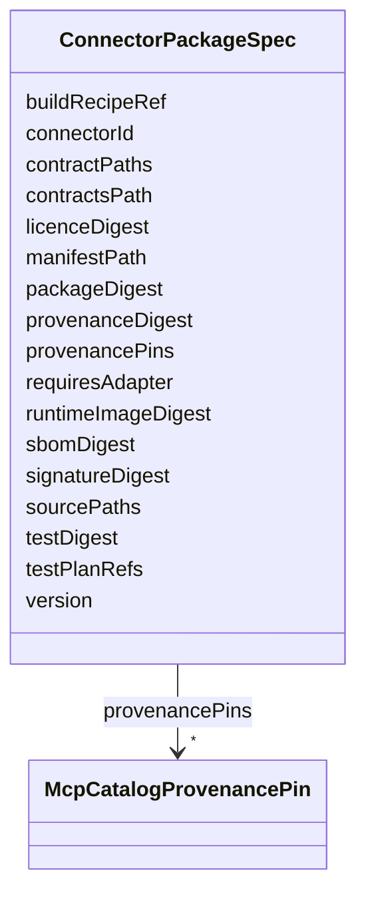

---
search:
  boost: 10.0
---

# Class: ConnectorPackageSpec


_Specification for a ConnectorPackage manifest._


<div data-search-exclude markdown="1">


URI: [jumo:ConnectorPackageSpec](https://jumo.dev/schemas/jumo-v1/ConnectorPackageSpec)





<!-- no inheritance hierarchy -->

## Slots

| Name | Cardinality and Range | Description | Inheritance |
| ---  | --- | --- | --- |
| [connectorId](connectorId.md) | 1 <br/> [Identifier](Identifier.md) |  | direct |
| [version](version.md) | 1 <br/> [String](String.md) |  | direct |
| [packageDigest](packageDigest.md) | 1 <br/> [String](String.md) |  | direct |
| [manifestPath](manifestPath.md) | 0..1 <br/> [String](String.md) |  | direct |
| [contractsPath](contractsPath.md) | 0..1 <br/> [String](String.md) |  | direct |
| [runtimeImageDigest](runtimeImageDigest.md) | 0..1 <br/> [String](String.md) |  | direct |
| [sbomDigest](sbomDigest.md) | 0..1 <br/> [String](String.md) |  | direct |
| [provenanceDigest](provenanceDigest.md) | 0..1 <br/> [String](String.md) |  | direct |
| [signatureDigest](signatureDigest.md) | 0..1 <br/> [String](String.md) |  | direct |
| [licenceDigest](licenceDigest.md) | 0..1 <br/> [String](String.md) |  | direct |
| [testDigest](testDigest.md) | 0..1 <br/> [String](String.md) |  | direct |
| [provenancePins](provenancePins.md) | * <br/> [McpCatalogProvenancePin](McpCatalogProvenancePin.md) |  | direct |
| [sourcePaths](sourcePaths.md) | * <br/> [String](String.md) |  | direct |
| [contractPaths](contractPaths.md) | * <br/> [String](String.md) |  | direct |
| [testPlanRefs](testPlanRefs.md) | * <br/> [String](String.md) |  | direct |
| [buildRecipeRef](buildRecipeRef.md) | 0..1 <br/> [String](String.md) |  | direct |
| [requiresAdapter](requiresAdapter.md) | 0..1 <br/> [Boolean](Boolean.md) |  | direct |


## Usages

| used by | used in | type | used |
| ---  | --- | --- | --- |
| [ConnectorPackage](ConnectorPackage.md) | [spec](spec.md) | range | [ConnectorPackageSpec](ConnectorPackageSpec.md) |


## Identifier and Mapping Information


### Annotations

| property | value |
| --- | --- |
| jumo.state_authority | GIT |
| jumo.model_role | VALUE_OBJECT |
| jumo.audience | INTERNAL_WORKER |
| jumo.sensitivity | INTERNAL |
| jumo.boundary_eligible | True |
| jumo.schema_profiles | draft-2020-12,native-json-schema,prompted-json-validated |


### Schema Source


* from schema: https://jumo.dev/schemas/jumo-v1


## Mappings

| Mapping Type | Mapped Value |
| ---  | ---  |
| self | jumo:ConnectorPackageSpec |
| native | jumo:ConnectorPackageSpec |


## LinkML Source

<!-- TODO: investigate https://stackoverflow.com/questions/37606292/how-to-create-tabbed-code-blocks-in-mkdocs-or-sphinx -->

### Direct

<details>
```yaml
name: ConnectorPackageSpec
annotations:
  jumo.state_authority:
    tag: jumo.state_authority
    value: GIT
  jumo.model_role:
    tag: jumo.model_role
    value: VALUE_OBJECT
  jumo.audience:
    tag: jumo.audience
    value: INTERNAL_WORKER
  jumo.sensitivity:
    tag: jumo.sensitivity
    value: INTERNAL
  jumo.boundary_eligible:
    tag: jumo.boundary_eligible
    value: true
  jumo.schema_profiles:
    tag: jumo.schema_profiles
    value: draft-2020-12,native-json-schema,prompted-json-validated
description: Specification for a ConnectorPackage manifest.
from_schema: https://jumo.dev/schemas/jumo-v1
attributes:
  connectorId:
    name: connectorId
    from_schema: https://jumo.dev/schemas/jumo-v1
    rank: 1000
    owner: ConnectorPackageSpec
    domain_of:
    - ConnectorPackageSpec
    range: Identifier
    required: true
  version:
    name: version
    from_schema: https://jumo.dev/schemas/jumo-v1
    owner: ConnectorPackageSpec
    domain_of:
    - CliReleaseSpec
    - McpCatalogVersion
    - FederationProfileSpec
    - ConnectorPackageSpec
    range: string
    required: true
  packageDigest:
    name: packageDigest
    from_schema: https://jumo.dev/schemas/jumo-v1
    rank: 1000
    owner: ConnectorPackageSpec
    domain_of:
    - ConnectorPackageSpec
    - ConnectorPackageCertificationSpec
    range: string
    required: true
  manifestPath:
    name: manifestPath
    from_schema: https://jumo.dev/schemas/jumo-v1
    rank: 1000
    owner: ConnectorPackageSpec
    domain_of:
    - ConnectorPackageSpec
    range: string
  contractsPath:
    name: contractsPath
    from_schema: https://jumo.dev/schemas/jumo-v1
    rank: 1000
    owner: ConnectorPackageSpec
    domain_of:
    - ConnectorPackageSpec
    range: string
  runtimeImageDigest:
    name: runtimeImageDigest
    from_schema: https://jumo.dev/schemas/jumo-v1
    rank: 1000
    owner: ConnectorPackageSpec
    domain_of:
    - ConnectorPackageSpec
    range: string
  sbomDigest:
    name: sbomDigest
    from_schema: https://jumo.dev/schemas/jumo-v1
    owner: ConnectorPackageSpec
    domain_of:
    - CliReleaseSpec
    - ConnectorPackageSpec
    - ConnectorPackageCertificationSpec
    range: string
  provenanceDigest:
    name: provenanceDigest
    from_schema: https://jumo.dev/schemas/jumo-v1
    owner: ConnectorPackageSpec
    domain_of:
    - CliReleaseSpec
    - ConnectorPackageSpec
    - ConnectorPackageCertificationSpec
    range: string
  signatureDigest:
    name: signatureDigest
    from_schema: https://jumo.dev/schemas/jumo-v1
    owner: ConnectorPackageSpec
    domain_of:
    - CliReleaseSpec
    - ConnectorPackageSpec
    - ConnectorPackageCertificationSpec
    range: string
  licenceDigest:
    name: licenceDigest
    from_schema: https://jumo.dev/schemas/jumo-v1
    rank: 1000
    owner: ConnectorPackageSpec
    domain_of:
    - ConnectorPackageSpec
    - ConnectorPackageCertificationSpec
    range: string
  testDigest:
    name: testDigest
    from_schema: https://jumo.dev/schemas/jumo-v1
    rank: 1000
    owner: ConnectorPackageSpec
    domain_of:
    - ConnectorPackageSpec
    - ConnectorPackageCertificationSpec
    range: string
  provenancePins:
    name: provenancePins
    from_schema: https://jumo.dev/schemas/jumo-v1
    rank: 1000
    owner: ConnectorPackageSpec
    domain_of:
    - ConnectorPackageSpec
    range: McpCatalogProvenancePin
    multivalued: true
    inlined: true
    inlined_as_list: true
  sourcePaths:
    name: sourcePaths
    from_schema: https://jumo.dev/schemas/jumo-v1
    rank: 1000
    owner: ConnectorPackageSpec
    domain_of:
    - ConnectorPackageSpec
    range: string
    multivalued: true
  contractPaths:
    name: contractPaths
    from_schema: https://jumo.dev/schemas/jumo-v1
    rank: 1000
    owner: ConnectorPackageSpec
    domain_of:
    - ConnectorPackageSpec
    range: string
    multivalued: true
  testPlanRefs:
    name: testPlanRefs
    from_schema: https://jumo.dev/schemas/jumo-v1
    rank: 1000
    owner: ConnectorPackageSpec
    domain_of:
    - ConnectorPackageSpec
    range: string
    multivalued: true
  buildRecipeRef:
    name: buildRecipeRef
    from_schema: https://jumo.dev/schemas/jumo-v1
    rank: 1000
    owner: ConnectorPackageSpec
    domain_of:
    - ConnectorPackageSpec
    range: string
  requiresAdapter:
    name: requiresAdapter
    from_schema: https://jumo.dev/schemas/jumo-v1
    rank: 1000
    owner: ConnectorPackageSpec
    domain_of:
    - ConnectorPackageSpec
    range: boolean

```
</details>

### Induced

<details>
```yaml
name: ConnectorPackageSpec
annotations:
  jumo.state_authority:
    tag: jumo.state_authority
    value: GIT
  jumo.model_role:
    tag: jumo.model_role
    value: VALUE_OBJECT
  jumo.audience:
    tag: jumo.audience
    value: INTERNAL_WORKER
  jumo.sensitivity:
    tag: jumo.sensitivity
    value: INTERNAL
  jumo.boundary_eligible:
    tag: jumo.boundary_eligible
    value: true
  jumo.schema_profiles:
    tag: jumo.schema_profiles
    value: draft-2020-12,native-json-schema,prompted-json-validated
description: Specification for a ConnectorPackage manifest.
from_schema: https://jumo.dev/schemas/jumo-v1
attributes:
  connectorId:
    name: connectorId
    from_schema: https://jumo.dev/schemas/jumo-v1
    rank: 1000
    owner: ConnectorPackageSpec
    domain_of:
    - ConnectorPackageSpec
    range: Identifier
    required: true
  version:
    name: version
    from_schema: https://jumo.dev/schemas/jumo-v1
    owner: ConnectorPackageSpec
    domain_of:
    - CliReleaseSpec
    - McpCatalogVersion
    - FederationProfileSpec
    - ConnectorPackageSpec
    range: string
    required: true
  packageDigest:
    name: packageDigest
    from_schema: https://jumo.dev/schemas/jumo-v1
    rank: 1000
    owner: ConnectorPackageSpec
    domain_of:
    - ConnectorPackageSpec
    - ConnectorPackageCertificationSpec
    range: string
    required: true
  manifestPath:
    name: manifestPath
    from_schema: https://jumo.dev/schemas/jumo-v1
    rank: 1000
    owner: ConnectorPackageSpec
    domain_of:
    - ConnectorPackageSpec
    range: string
  contractsPath:
    name: contractsPath
    from_schema: https://jumo.dev/schemas/jumo-v1
    rank: 1000
    owner: ConnectorPackageSpec
    domain_of:
    - ConnectorPackageSpec
    range: string
  runtimeImageDigest:
    name: runtimeImageDigest
    from_schema: https://jumo.dev/schemas/jumo-v1
    rank: 1000
    owner: ConnectorPackageSpec
    domain_of:
    - ConnectorPackageSpec
    range: string
  sbomDigest:
    name: sbomDigest
    from_schema: https://jumo.dev/schemas/jumo-v1
    owner: ConnectorPackageSpec
    domain_of:
    - CliReleaseSpec
    - ConnectorPackageSpec
    - ConnectorPackageCertificationSpec
    range: string
  provenanceDigest:
    name: provenanceDigest
    from_schema: https://jumo.dev/schemas/jumo-v1
    owner: ConnectorPackageSpec
    domain_of:
    - CliReleaseSpec
    - ConnectorPackageSpec
    - ConnectorPackageCertificationSpec
    range: string
  signatureDigest:
    name: signatureDigest
    from_schema: https://jumo.dev/schemas/jumo-v1
    owner: ConnectorPackageSpec
    domain_of:
    - CliReleaseSpec
    - ConnectorPackageSpec
    - ConnectorPackageCertificationSpec
    range: string
  licenceDigest:
    name: licenceDigest
    from_schema: https://jumo.dev/schemas/jumo-v1
    rank: 1000
    owner: ConnectorPackageSpec
    domain_of:
    - ConnectorPackageSpec
    - ConnectorPackageCertificationSpec
    range: string
  testDigest:
    name: testDigest
    from_schema: https://jumo.dev/schemas/jumo-v1
    rank: 1000
    owner: ConnectorPackageSpec
    domain_of:
    - ConnectorPackageSpec
    - ConnectorPackageCertificationSpec
    range: string
  provenancePins:
    name: provenancePins
    from_schema: https://jumo.dev/schemas/jumo-v1
    rank: 1000
    owner: ConnectorPackageSpec
    domain_of:
    - ConnectorPackageSpec
    range: McpCatalogProvenancePin
    multivalued: true
    inlined: true
    inlined_as_list: true
  sourcePaths:
    name: sourcePaths
    from_schema: https://jumo.dev/schemas/jumo-v1
    rank: 1000
    owner: ConnectorPackageSpec
    domain_of:
    - ConnectorPackageSpec
    range: string
    multivalued: true
  contractPaths:
    name: contractPaths
    from_schema: https://jumo.dev/schemas/jumo-v1
    rank: 1000
    owner: ConnectorPackageSpec
    domain_of:
    - ConnectorPackageSpec
    range: string
    multivalued: true
  testPlanRefs:
    name: testPlanRefs
    from_schema: https://jumo.dev/schemas/jumo-v1
    rank: 1000
    owner: ConnectorPackageSpec
    domain_of:
    - ConnectorPackageSpec
    range: string
    multivalued: true
  buildRecipeRef:
    name: buildRecipeRef
    from_schema: https://jumo.dev/schemas/jumo-v1
    rank: 1000
    owner: ConnectorPackageSpec
    domain_of:
    - ConnectorPackageSpec
    range: string
  requiresAdapter:
    name: requiresAdapter
    from_schema: https://jumo.dev/schemas/jumo-v1
    rank: 1000
    owner: ConnectorPackageSpec
    domain_of:
    - ConnectorPackageSpec
    range: boolean

```
</details></div>