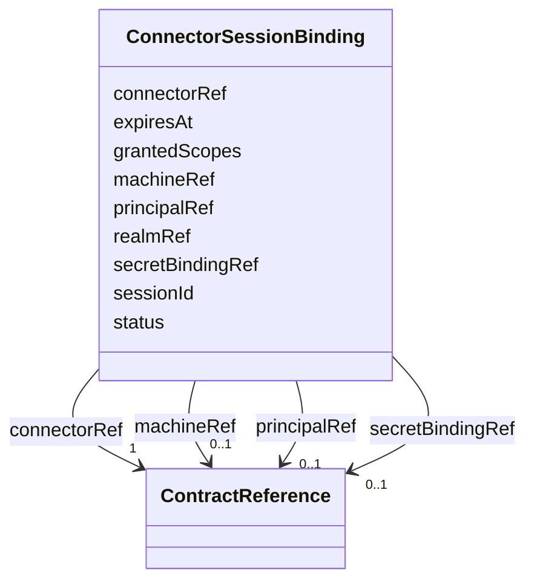

---
search:
  boost: 10.0
---

# Class: ConnectorSessionBinding


_Active OAuth or API session binding for a Principal/Realm and target machine._


<div data-search-exclude markdown="1">


URI: [jumo:ConnectorSessionBinding](https://jumo.dev/schemas/jumo-v1/ConnectorSessionBinding)





<!-- no inheritance hierarchy -->

## Slots

| Name | Cardinality and Range | Description | Inheritance |
| ---  | --- | --- | --- |
| [sessionId](sessionId.md) | 1 <br/> [Identifier](Identifier.md) |  | direct |
| [connectorRef](connectorRef.md) | 1 <br/> [ContractReference](ContractReference.md) |  | direct |
| [principalRef](principalRef.md) | 0..1 <br/> [ContractReference](ContractReference.md) |  | direct |
| [realmRef](realmRef.md) | 1 <br/> [String](String.md) |  | direct |
| [machineRef](machineRef.md) | 0..1 <br/> [ContractReference](ContractReference.md) |  | direct |
| [secretBindingRef](secretBindingRef.md) | 0..1 <br/> [ContractReference](ContractReference.md) |  | direct |
| [grantedScopes](grantedScopes.md) | * <br/> [String](String.md) |  | direct |
| [status](status.md) | 1 <br/> [String](String.md) |  | direct |
| [expiresAt](expiresAt.md) | 0..1 <br/> [String](String.md) |  | direct |


## Identifier and Mapping Information


### Annotations

| property | value |
| --- | --- |
| jumo.state_authority | POSTGRES |
| jumo.model_role | VALUE_OBJECT |
| jumo.audience | REALM_PRIVATE |
| jumo.sensitivity | INTERNAL |
| jumo.boundary_eligible | True |
| jumo.schema_profiles | draft-2020-12,native-json-schema,prompted-json-validated |


### Schema Source


* from schema: https://jumo.dev/schemas/jumo-v1


## Mappings

| Mapping Type | Mapped Value |
| ---  | ---  |
| self | jumo:ConnectorSessionBinding |
| native | jumo:ConnectorSessionBinding |


## LinkML Source

<!-- TODO: investigate https://stackoverflow.com/questions/37606292/how-to-create-tabbed-code-blocks-in-mkdocs-or-sphinx -->

### Direct

<details>
```yaml
name: ConnectorSessionBinding
annotations:
  jumo.state_authority:
    tag: jumo.state_authority
    value: POSTGRES
  jumo.model_role:
    tag: jumo.model_role
    value: VALUE_OBJECT
  jumo.audience:
    tag: jumo.audience
    value: REALM_PRIVATE
  jumo.sensitivity:
    tag: jumo.sensitivity
    value: INTERNAL
  jumo.boundary_eligible:
    tag: jumo.boundary_eligible
    value: true
  jumo.schema_profiles:
    tag: jumo.schema_profiles
    value: draft-2020-12,native-json-schema,prompted-json-validated
description: Active OAuth or API session binding for a Principal/Realm and target
  machine.
from_schema: https://jumo.dev/schemas/jumo-v1
attributes:
  sessionId:
    name: sessionId
    from_schema: https://jumo.dev/schemas/jumo-v1
    rank: 1000
    owner: ConnectorSessionBinding
    domain_of:
    - ConnectorSessionBinding
    range: Identifier
    required: true
  connectorRef:
    name: connectorRef
    from_schema: https://jumo.dev/schemas/jumo-v1
    rank: 1000
    owner: ConnectorSessionBinding
    domain_of:
    - ConnectorSessionBinding
    - ConnectorTestPlan
    - ConnectorActivationDecision
    range: ContractReference
    required: true
    inlined: true
  principalRef:
    name: principalRef
    from_schema: https://jumo.dev/schemas/jumo-v1
    owner: ConnectorSessionBinding
    domain_of:
    - PrincipalIdentityBindingSpec
    - RoleBearer
    - ConnectorSessionBinding
    range: ContractReference
    inlined: true
  realmRef:
    name: realmRef
    from_schema: https://jumo.dev/schemas/jumo-v1
    owner: ConnectorSessionBinding
    domain_of:
    - AttentionTarget
    - ConnectorSessionBinding
    range: string
    required: true
  machineRef:
    name: machineRef
    from_schema: https://jumo.dev/schemas/jumo-v1
    owner: ConnectorSessionBinding
    domain_of:
    - CliInstallationDesiredState
    - CliInstallationObservation
    - CliInvocationRequest
    - ConnectorSessionBinding
    range: ContractReference
    inlined: true
  secretBindingRef:
    name: secretBindingRef
    from_schema: https://jumo.dev/schemas/jumo-v1
    owner: ConnectorSessionBinding
    domain_of:
    - McpRegistrySourceSpec
    - ProviderAccountSpec
    - WorkerModelAccess
    - ConnectorSessionBinding
    range: ContractReference
    inlined: true
  grantedScopes:
    name: grantedScopes
    from_schema: https://jumo.dev/schemas/jumo-v1
    rank: 1000
    owner: ConnectorSessionBinding
    domain_of:
    - ConnectorSessionBinding
    range: string
    multivalued: true
  status:
    name: status
    from_schema: https://jumo.dev/schemas/jumo-v1
    owner: ConnectorSessionBinding
    domain_of:
    - DocumentFrontMatter
    - ComplianceProfileSpec
    - ControlAssessment
    - MachineHealthObservation
    - MachineEnrollmentResult
    - MachineAdminResult
    - WorkloadCommandResult
    - MachineRuntimeInstallation
    - ExecutionCellLease
    - CliInstallationObservation
    - CliInvocationResult
    - ProviderQuotaObservation
    - ProviderSessionBinding
    - WorkerInvocation
    - ConnectorSessionBinding
    - ConnectorTestResult
    - ApiProblem
    range: string
    required: true
  expiresAt:
    name: expiresAt
    from_schema: https://jumo.dev/schemas/jumo-v1
    owner: ConnectorSessionBinding
    domain_of:
    - OrganizationRetentionHoldSpec
    - MachineEnrollmentChallenge
    - MachineAdminCommand
    - WorkloadCommand
    - ExecutionCellLease
    - ProviderSessionBinding
    - InvocationAuthorizationReceipt
    - ConnectorSessionBinding
    - EffectTestAuthorization
    range: string

```
</details>

### Induced

<details>
```yaml
name: ConnectorSessionBinding
annotations:
  jumo.state_authority:
    tag: jumo.state_authority
    value: POSTGRES
  jumo.model_role:
    tag: jumo.model_role
    value: VALUE_OBJECT
  jumo.audience:
    tag: jumo.audience
    value: REALM_PRIVATE
  jumo.sensitivity:
    tag: jumo.sensitivity
    value: INTERNAL
  jumo.boundary_eligible:
    tag: jumo.boundary_eligible
    value: true
  jumo.schema_profiles:
    tag: jumo.schema_profiles
    value: draft-2020-12,native-json-schema,prompted-json-validated
description: Active OAuth or API session binding for a Principal/Realm and target
  machine.
from_schema: https://jumo.dev/schemas/jumo-v1
attributes:
  sessionId:
    name: sessionId
    from_schema: https://jumo.dev/schemas/jumo-v1
    rank: 1000
    owner: ConnectorSessionBinding
    domain_of:
    - ConnectorSessionBinding
    range: Identifier
    required: true
  connectorRef:
    name: connectorRef
    from_schema: https://jumo.dev/schemas/jumo-v1
    rank: 1000
    owner: ConnectorSessionBinding
    domain_of:
    - ConnectorSessionBinding
    - ConnectorTestPlan
    - ConnectorActivationDecision
    range: ContractReference
    required: true
    inlined: true
  principalRef:
    name: principalRef
    from_schema: https://jumo.dev/schemas/jumo-v1
    owner: ConnectorSessionBinding
    domain_of:
    - PrincipalIdentityBindingSpec
    - RoleBearer
    - ConnectorSessionBinding
    range: ContractReference
    inlined: true
  realmRef:
    name: realmRef
    from_schema: https://jumo.dev/schemas/jumo-v1
    owner: ConnectorSessionBinding
    domain_of:
    - AttentionTarget
    - ConnectorSessionBinding
    range: string
    required: true
  machineRef:
    name: machineRef
    from_schema: https://jumo.dev/schemas/jumo-v1
    owner: ConnectorSessionBinding
    domain_of:
    - CliInstallationDesiredState
    - CliInstallationObservation
    - CliInvocationRequest
    - ConnectorSessionBinding
    range: ContractReference
    inlined: true
  secretBindingRef:
    name: secretBindingRef
    from_schema: https://jumo.dev/schemas/jumo-v1
    owner: ConnectorSessionBinding
    domain_of:
    - McpRegistrySourceSpec
    - ProviderAccountSpec
    - WorkerModelAccess
    - ConnectorSessionBinding
    range: ContractReference
    inlined: true
  grantedScopes:
    name: grantedScopes
    from_schema: https://jumo.dev/schemas/jumo-v1
    rank: 1000
    owner: ConnectorSessionBinding
    domain_of:
    - ConnectorSessionBinding
    range: string
    multivalued: true
  status:
    name: status
    from_schema: https://jumo.dev/schemas/jumo-v1
    owner: ConnectorSessionBinding
    domain_of:
    - DocumentFrontMatter
    - ComplianceProfileSpec
    - ControlAssessment
    - MachineHealthObservation
    - MachineEnrollmentResult
    - MachineAdminResult
    - WorkloadCommandResult
    - MachineRuntimeInstallation
    - ExecutionCellLease
    - CliInstallationObservation
    - CliInvocationResult
    - ProviderQuotaObservation
    - ProviderSessionBinding
    - WorkerInvocation
    - ConnectorSessionBinding
    - ConnectorTestResult
    - ApiProblem
    range: string
    required: true
  expiresAt:
    name: expiresAt
    from_schema: https://jumo.dev/schemas/jumo-v1
    owner: ConnectorSessionBinding
    domain_of:
    - OrganizationRetentionHoldSpec
    - MachineEnrollmentChallenge
    - MachineAdminCommand
    - WorkloadCommand
    - ExecutionCellLease
    - ProviderSessionBinding
    - InvocationAuthorizationReceipt
    - ConnectorSessionBinding
    - EffectTestAuthorization
    range: string

```
</details></div>