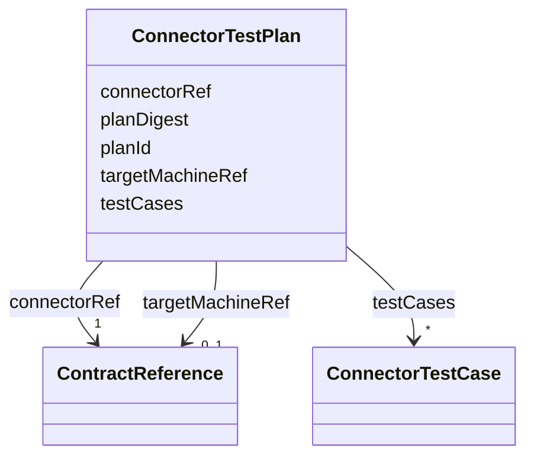

---
search:
  boost: 10.0
---

# Class: ConnectorTestPlan


_Deterministic test plan for verifying connector operations on a target machine._


<div data-search-exclude markdown="1">


URI: [jumo:ConnectorTestPlan](https://jumo.dev/schemas/jumo-v1/ConnectorTestPlan)





<!-- no inheritance hierarchy -->

## Slots

| Name | Cardinality and Range | Description | Inheritance |
| ---  | --- | --- | --- |
| [planId](planId.md) | 1 <br/> [Identifier](Identifier.md) |  | direct |
| [connectorRef](connectorRef.md) | 1 <br/> [ContractReference](ContractReference.md) |  | direct |
| [targetMachineRef](targetMachineRef.md) | 0..1 <br/> [ContractReference](ContractReference.md) |  | direct |
| [testCases](testCases.md) | * <br/> [ConnectorTestCase](ConnectorTestCase.md) |  | direct |
| [planDigest](planDigest.md) | 1 <br/> [String](String.md) |  | direct |


## Identifier and Mapping Information


### Annotations

| property | value |
| --- | --- |
| jumo.state_authority | GIT |
| jumo.model_role | VALUE_OBJECT |
| jumo.audience | REALM_PRIVATE |
| jumo.sensitivity | INTERNAL |
| jumo.boundary_eligible | True |
| jumo.schema_profiles | draft-2020-12,native-json-schema,prompted-json-validated |


### Schema Source


* from schema: https://jumo.dev/schemas/jumo-v1


## Mappings

| Mapping Type | Mapped Value |
| ---  | ---  |
| self | jumo:ConnectorTestPlan |
| native | jumo:ConnectorTestPlan |


## LinkML Source

<!-- TODO: investigate https://stackoverflow.com/questions/37606292/how-to-create-tabbed-code-blocks-in-mkdocs-or-sphinx -->

### Direct

<details>
```yaml
name: ConnectorTestPlan
annotations:
  jumo.state_authority:
    tag: jumo.state_authority
    value: GIT
  jumo.model_role:
    tag: jumo.model_role
    value: VALUE_OBJECT
  jumo.audience:
    tag: jumo.audience
    value: REALM_PRIVATE
  jumo.sensitivity:
    tag: jumo.sensitivity
    value: INTERNAL
  jumo.boundary_eligible:
    tag: jumo.boundary_eligible
    value: true
  jumo.schema_profiles:
    tag: jumo.schema_profiles
    value: draft-2020-12,native-json-schema,prompted-json-validated
description: Deterministic test plan for verifying connector operations on a target
  machine.
from_schema: https://jumo.dev/schemas/jumo-v1
attributes:
  planId:
    name: planId
    from_schema: https://jumo.dev/schemas/jumo-v1
    owner: ConnectorTestPlan
    domain_of:
    - SessionPlan
    - ConnectorTestPlan
    - ConnectorTestResult
    range: Identifier
    required: true
  connectorRef:
    name: connectorRef
    from_schema: https://jumo.dev/schemas/jumo-v1
    owner: ConnectorTestPlan
    domain_of:
    - ConnectorSessionBinding
    - ConnectorTestPlan
    - ConnectorActivationDecision
    range: ContractReference
    required: true
    inlined: true
  targetMachineRef:
    name: targetMachineRef
    from_schema: https://jumo.dev/schemas/jumo-v1
    rank: 1000
    owner: ConnectorTestPlan
    domain_of:
    - ConnectorTestPlan
    range: ContractReference
    inlined: true
  testCases:
    name: testCases
    from_schema: https://jumo.dev/schemas/jumo-v1
    rank: 1000
    owner: ConnectorTestPlan
    domain_of:
    - ConnectorTestPlan
    range: ConnectorTestCase
    multivalued: true
    inlined: true
  planDigest:
    name: planDigest
    from_schema: https://jumo.dev/schemas/jumo-v1
    rank: 1000
    owner: ConnectorTestPlan
    domain_of:
    - ConnectorTestPlan
    - EffectTestAuthorization
    range: string
    required: true

```
</details>

### Induced

<details>
```yaml
name: ConnectorTestPlan
annotations:
  jumo.state_authority:
    tag: jumo.state_authority
    value: GIT
  jumo.model_role:
    tag: jumo.model_role
    value: VALUE_OBJECT
  jumo.audience:
    tag: jumo.audience
    value: REALM_PRIVATE
  jumo.sensitivity:
    tag: jumo.sensitivity
    value: INTERNAL
  jumo.boundary_eligible:
    tag: jumo.boundary_eligible
    value: true
  jumo.schema_profiles:
    tag: jumo.schema_profiles
    value: draft-2020-12,native-json-schema,prompted-json-validated
description: Deterministic test plan for verifying connector operations on a target
  machine.
from_schema: https://jumo.dev/schemas/jumo-v1
attributes:
  planId:
    name: planId
    from_schema: https://jumo.dev/schemas/jumo-v1
    owner: ConnectorTestPlan
    domain_of:
    - SessionPlan
    - ConnectorTestPlan
    - ConnectorTestResult
    range: Identifier
    required: true
  connectorRef:
    name: connectorRef
    from_schema: https://jumo.dev/schemas/jumo-v1
    owner: ConnectorTestPlan
    domain_of:
    - ConnectorSessionBinding
    - ConnectorTestPlan
    - ConnectorActivationDecision
    range: ContractReference
    required: true
    inlined: true
  targetMachineRef:
    name: targetMachineRef
    from_schema: https://jumo.dev/schemas/jumo-v1
    rank: 1000
    owner: ConnectorTestPlan
    domain_of:
    - ConnectorTestPlan
    range: ContractReference
    inlined: true
  testCases:
    name: testCases
    from_schema: https://jumo.dev/schemas/jumo-v1
    rank: 1000
    owner: ConnectorTestPlan
    domain_of:
    - ConnectorTestPlan
    range: ConnectorTestCase
    multivalued: true
    inlined: true
  planDigest:
    name: planDigest
    from_schema: https://jumo.dev/schemas/jumo-v1
    rank: 1000
    owner: ConnectorTestPlan
    domain_of:
    - ConnectorTestPlan
    - EffectTestAuthorization
    range: string
    required: true

```
</details></div>