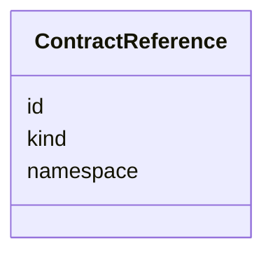

---
search:
  boost: 10.0
---

# Class: ContractReference


_Structured reference to a Git-declared contract document._


<div data-search-exclude markdown="1">


URI: [jumo:ContractReference](https://jumo.dev/schemas/jumo-v1/ContractReference)





<!-- no inheritance hierarchy -->

## Slots

| Name | Cardinality and Range | Description | Inheritance |
| ---  | --- | --- | --- |
| [kind](kind.md) | 1 <br/> [String](String.md) | Declared Git-contract kind | direct |
| [namespace](namespace.md) | 1 <br/> [Namespace](Namespace.md) | Target logical namespace | direct |
| [id](id.md) | 1 <br/> [Identifier](Identifier.md) | Target contract identifier | direct |


## Usages

| used by | used in | type | used |
| ---  | --- | --- | --- |
| [PrincipalSpec](PrincipalSpec.md) | [personalSpaceRef](personalSpaceRef.md) | range | [ContractReference](ContractReference.md) |
| [PrincipalIdentityBindingSpec](PrincipalIdentityBindingSpec.md) | [principalRef](principalRef.md) | range | [ContractReference](ContractReference.md) |
| [ProjectPersonalSpaceBinding](ProjectPersonalSpaceBinding.md) | [personalSpaceRef](personalSpaceRef.md) | range | [ContractReference](ContractReference.md) |
| [RealmTemplateSpec](RealmTemplateSpec.md) | [policySetRefs](policySetRefs.md) | range | [ContractReference](ContractReference.md) |
| [RealmTemplateSpec](RealmTemplateSpec.md) | [principleSetRefs](principleSetRefs.md) | range | [ContractReference](ContractReference.md) |
| [RealmTemplateSpec](RealmTemplateSpec.md) | [kitBindingRefs](kitBindingRefs.md) | range | [ContractReference](ContractReference.md) |
| [RealmChiefOfStaffRef](RealmChiefOfStaffRef.md) | [roleDefinitionRef](roleDefinitionRef.md) | range | [ContractReference](ContractReference.md) |
| [RealmChiefOfStaffRef](RealmChiefOfStaffRef.md) | [chiefOfStaffProfileRef](chiefOfStaffProfileRef.md) | range | [ContractReference](ContractReference.md) |
| [KitLockSpec](KitLockSpec.md) | [kitBindingRef](kitBindingRef.md) | range | [ContractReference](ContractReference.md) |
| [KitLockSpec](KitLockSpec.md) | [kitReleaseCertificationRef](kitReleaseCertificationRef.md) | range | [ContractReference](ContractReference.md) |
| [RoleAssignmentSpec](RoleAssignmentSpec.md) | [roleDefinitionRef](roleDefinitionRef.md) | range | [ContractReference](ContractReference.md) |
| [RoleBearer](RoleBearer.md) | [principalRef](principalRef.md) | range | [ContractReference](ContractReference.md) |
| [RoleBearer](RoleBearer.md) | [agentDefinitionRef](agentDefinitionRef.md) | range | [ContractReference](ContractReference.md) |
| [RoleBearer](RoleBearer.md) | [defaultWorkerRequirementProfileRef](defaultWorkerRequirementProfileRef.md) | range | [ContractReference](ContractReference.md) |
| [RoleBearer](RoleBearer.md) | [federatedPeerRef](federatedPeerRef.md) | range | [ContractReference](ContractReference.md) |
| [TeamCoordination](TeamCoordination.md) | [leadRoleDefinitionRef](leadRoleDefinitionRef.md) | range | [ContractReference](ContractReference.md) |
| [TeamMember](TeamMember.md) | [roleDefinitionRef](roleDefinitionRef.md) | range | [ContractReference](ContractReference.md) |
| [TeamMember](TeamMember.md) | [teamSpecRef](teamSpecRef.md) | range | [ContractReference](ContractReference.md) |
| [RoutingEligibilitySpec](RoutingEligibilitySpec.md) | [projectRef](projectRef.md) | range | [ContractReference](ContractReference.md) |
| [RoutingEligibilitySpec](RoutingEligibilitySpec.md) | [eligibleRoleDefinitionRefs](eligibleRoleDefinitionRefs.md) | range | [ContractReference](ContractReference.md) |
| [RoutingEligibilitySpec](RoutingEligibilitySpec.md) | [eligibleTeamSpecRefs](eligibleTeamSpecRefs.md) | range | [ContractReference](ContractReference.md) |
| [OrganizationTemplateSpec](OrganizationTemplateSpec.md) | [roleLifecyclePolicyRef](roleLifecyclePolicyRef.md) | range | [ContractReference](ContractReference.md) |
| [ChiefOfStaffProfileSpec](ChiefOfStaffProfileSpec.md) | [roleDefinitionRef](roleDefinitionRef.md) | range | [ContractReference](ContractReference.md) |
| [ChiefOfStaffProfileSpec](ChiefOfStaffProfileSpec.md) | [intakeProcessSpecRef](intakeProcessSpecRef.md) | range | [ContractReference](ContractReference.md) |
| [ChiefOfStaffProfileSpec](ChiefOfStaffProfileSpec.md) | [directWorkProcessSpecRef](directWorkProcessSpecRef.md) | range | [ContractReference](ContractReference.md) |
| [ChiefOfStaffProfileSpec](ChiefOfStaffProfileSpec.md) | [statusPracticeRef](statusPracticeRef.md) | range | [ContractReference](ContractReference.md) |
| [AdvisorProfileSpec](AdvisorProfileSpec.md) | [roleDefinitionRef](roleDefinitionRef.md) | range | [ContractReference](ContractReference.md) |
| [AdvisorProfileSpec](AdvisorProfileSpec.md) | [practiceRefs](practiceRefs.md) | range | [ContractReference](ContractReference.md) |
| [AdvisorDialogueOption](AdvisorDialogueOption.md) | [capabilityProfileRef](capabilityProfileRef.md) | range | [ContractReference](ContractReference.md) |
| [AdvisorDialogueOption](AdvisorDialogueOption.md) | [engagementMethodRef](engagementMethodRef.md) | range | [ContractReference](ContractReference.md) |
| [DispositionMatch](DispositionMatch.md) | [addressedRoleRefs](addressedRoleRefs.md) | range | [ContractReference](ContractReference.md) |
| [DispositionMatch](DispositionMatch.md) | [addressedTeamRefs](addressedTeamRefs.md) | range | [ContractReference](ContractReference.md) |
| [PersonalSpaceSpec](PersonalSpaceSpec.md) | [preferencesRef](preferencesRef.md) | range | [ContractReference](ContractReference.md) |
| [SelfDescriptionAnswer](SelfDescriptionAnswer.md) | [narrationPromptTemplateRef](narrationPromptTemplateRef.md) | range | [ContractReference](ContractReference.md) |
| [OrganizationSpecBody](OrganizationSpecBody.md) | [organizationTemplateRef](organizationTemplateRef.md) | range | [ContractReference](ContractReference.md) |
| [OrganizationRoleBinding](OrganizationRoleBinding.md) | [roleDefinitionRef](roleDefinitionRef.md) | range | [ContractReference](ContractReference.md) |
| [OrganizationBody](OrganizationBody.md) | [realmProvisionerProjectionSpecRef](realmProvisionerProjectionSpecRef.md) | range | [ContractReference](ContractReference.md) |
| [OrganizationAccessBindingSpec](OrganizationAccessBindingSpec.md) | [organizationRef](organizationRef.md) | range | [ContractReference](ContractReference.md) |
| [OrganizationEnrollmentPolicySpec](OrganizationEnrollmentPolicySpec.md) | [organizationRef](organizationRef.md) | range | [ContractReference](ContractReference.md) |
| [OrganizationEnrollmentPolicySpec](OrganizationEnrollmentPolicySpec.md) | [realmProvisionerProjectionSpecRef](realmProvisionerProjectionSpecRef.md) | range | [ContractReference](ContractReference.md) |
| [OrganizationAuditRetentionPolicySpec](OrganizationAuditRetentionPolicySpec.md) | [organizationRef](organizationRef.md) | range | [ContractReference](ContractReference.md) |
| [OrganizationRetentionHoldSpec](OrganizationRetentionHoldSpec.md) | [organizationRef](organizationRef.md) | range | [ContractReference](ContractReference.md) |
| [OrganizationPublicationPolicySpec](OrganizationPublicationPolicySpec.md) | [organizationRef](organizationRef.md) | range | [ContractReference](ContractReference.md) |
| [RealmPublicationSpec](RealmPublicationSpec.md) | [organizationRef](organizationRef.md) | range | [ContractReference](ContractReference.md) |
| [WorkOrderSpec](WorkOrderSpec.md) | [producerRoleDefinitionRef](producerRoleDefinitionRef.md) | range | [ContractReference](ContractReference.md) |
| [WorkOrderSpec](WorkOrderSpec.md) | [teamSpecRef](teamSpecRef.md) | range | [ContractReference](ContractReference.md) |
| [WorkOrderSpec](WorkOrderSpec.md) | [projectRef](projectRef.md) | range | [ContractReference](ContractReference.md) |
| [WorkOrderSpec](WorkOrderSpec.md) | [verifierRoleDefinitionRef](verifierRoleDefinitionRef.md) | range | [ContractReference](ContractReference.md) |
| [WorkOrderSpec](WorkOrderSpec.md) | [dependsOnWorkOrderRefs](dependsOnWorkOrderRefs.md) | range | [ContractReference](ContractReference.md) |
| [WorkOrderSpec](WorkOrderSpec.md) | [parentWorkOrderRef](parentWorkOrderRef.md) | range | [ContractReference](ContractReference.md) |
| [WorkOrderSpec](WorkOrderSpec.md) | [resourceBudgetRef](resourceBudgetRef.md) | range | [ContractReference](ContractReference.md) |
| [EngagementMethodSpec](EngagementMethodSpec.md) | [agentDefinitionRef](agentDefinitionRef.md) | range | [ContractReference](ContractReference.md) |
| [EngagementMethodSpec](EngagementMethodSpec.md) | [workerRequirementProfileRef](workerRequirementProfileRef.md) | range | [ContractReference](ContractReference.md) |
| [EngagementMethodSpec](EngagementMethodSpec.md) | [resourceBudgetRef](resourceBudgetRef.md) | range | [ContractReference](ContractReference.md) |
| [EngagementStage](EngagementStage.md) | [promptTemplateRef](promptTemplateRef.md) | range | [ContractReference](ContractReference.md) |
| [PracticeSpec](PracticeSpec.md) | [processSpecRef](processSpecRef.md) | range | [ContractReference](ContractReference.md) |
| [PracticeSpec](PracticeSpec.md) | [resourceBudgetRef](resourceBudgetRef.md) | range | [ContractReference](ContractReference.md) |
| [CapabilityProfileSpec](CapabilityProfileSpec.md) | [workerRequirementProfileRef](workerRequirementProfileRef.md) | range | [ContractReference](ContractReference.md) |
| [WorkerQualityRequirement](WorkerQualityRequirement.md) | [goldenTaskSetRefs](goldenTaskSetRefs.md) | range | [ContractReference](ContractReference.md) |
| [GoldenTaskSetSpec](GoldenTaskSetSpec.md) | [workerRequirementProfileRef](workerRequirementProfileRef.md) | range | [ContractReference](ContractReference.md) |
| [PromptTemplateSpec](PromptTemplateSpec.md) | [agentDefinitionRef](agentDefinitionRef.md) | range | [ContractReference](ContractReference.md) |
| [PromptTemplateSpec](PromptTemplateSpec.md) | [workerRequirementProfileRef](workerRequirementProfileRef.md) | range | [ContractReference](ContractReference.md) |
| [PromptTemplateSpec](PromptTemplateSpec.md) | [resourceBudgetRef](resourceBudgetRef.md) | range | [ContractReference](ContractReference.md) |
| [AssistedJourneySpec](AssistedJourneySpec.md) | [resourceBudgetRef](resourceBudgetRef.md) | range | [ContractReference](ContractReference.md) |
| [AssistedJourneyEmission](AssistedJourneyEmission.md) | [documentTemplateRef](documentTemplateRef.md) | range | [ContractReference](ContractReference.md) |
| [AssistedJourneyStep](AssistedJourneyStep.md) | [projectionSpecRef](projectionSpecRef.md) | range | [ContractReference](ContractReference.md) |
| [AssistedJourneyStep](AssistedJourneyStep.md) | [processSpecRef](processSpecRef.md) | range | [ContractReference](ContractReference.md) |
| [AssistedJourneyStep](AssistedJourneyStep.md) | [promptTemplateRef](promptTemplateRef.md) | range | [ContractReference](ContractReference.md) |
| [AssistedJourneyStep](AssistedJourneyStep.md) | [subAssistedJourneyRef](subAssistedJourneyRef.md) | range | [ContractReference](ContractReference.md) |
| [AssistedJourneyStep](AssistedJourneyStep.md) | [verificationSpecRef](verificationSpecRef.md) | range | [ContractReference](ContractReference.md) |
| [ImprovementLoopSpec](ImprovementLoopSpec.md) | [projectRef](projectRef.md) | range | [ContractReference](ContractReference.md) |
| [ImprovementLoopSpec](ImprovementLoopSpec.md) | [synthesisPracticeRef](synthesisPracticeRef.md) | range | [ContractReference](ContractReference.md) |
| [ImprovementLoopSpec](ImprovementLoopSpec.md) | [assessmentProcessSpecRef](assessmentProcessSpecRef.md) | range | [ContractReference](ContractReference.md) |
| [ImprovementRecommendationSpec](ImprovementRecommendationSpec.md) | [improvementLoopRef](improvementLoopRef.md) | range | [ContractReference](ContractReference.md) |
| [ComplianceProfileSpec](ComplianceProfileSpec.md) | [controlCatalogRef](controlCatalogRef.md) | range | [ContractReference](ContractReference.md) |
| [ProcessingRegisterEntry](ProcessingRegisterEntry.md) | [dpiaEvidenceProfileRef](dpiaEvidenceProfileRef.md) | range | [ContractReference](ContractReference.md) |
| [ProcessSpecBody](ProcessSpecBody.md) | [projectRef](projectRef.md) | range | [ContractReference](ContractReference.md) |
| [ProcessSpecBody](ProcessSpecBody.md) | [resourceBudgetRef](resourceBudgetRef.md) | range | [ContractReference](ContractReference.md) |
| [ProcessStep](ProcessStep.md) | [subprocessReleaseRef](subprocessReleaseRef.md) | range | [ContractReference](ContractReference.md) |
| [ChangeProposalRef](ChangeProposalRef.md) | [projectRef](projectRef.md) | range | [ContractReference](ContractReference.md) |
| [ForgeProjectionRef](ForgeProjectionRef.md) | [projectRef](projectRef.md) | range | [ContractReference](ContractReference.md) |
| [ProcessRunRef](ProcessRunRef.md) | [projectRef](projectRef.md) | range | [ContractReference](ContractReference.md) |
| [ApprovalSignal](ApprovalSignal.md) | [projectRef](projectRef.md) | range | [ContractReference](ContractReference.md) |
| [ExecutionCellProvisioningRef](ExecutionCellProvisioningRef.md) | [projectRef](projectRef.md) | range | [ContractReference](ContractReference.md) |
| [ProcessStageWorkerRequirement](ProcessStageWorkerRequirement.md) | [workerRequirementProfileRef](workerRequirementProfileRef.md) | range | [ContractReference](ContractReference.md) |
| [ExecutionMachineSpec](ExecutionMachineSpec.md) | [hostDefinitionRef](hostDefinitionRef.md) | range | [ContractReference](ContractReference.md) |
| [ExecutionMachineSpec](ExecutionMachineSpec.md) | [installedCliRefs](installedCliRefs.md) | range | [ContractReference](ContractReference.md) |
| [ExecutionMachineSpec](ExecutionMachineSpec.md) | [installedConnectorRefs](installedConnectorRefs.md) | range | [ContractReference](ContractReference.md) |
| [MachineAdminRequest](MachineAdminRequest.md) | [playbookRef](playbookRef.md) | range | [ContractReference](ContractReference.md) |
| [MachineAdminCommand](MachineAdminCommand.md) | [playbookRef](playbookRef.md) | range | [ContractReference](ContractReference.md) |
| [MachineRuntimeInstallation](MachineRuntimeInstallation.md) | [runtimeRef](runtimeRef.md) | range | [ContractReference](ContractReference.md) |
| [CliReleaseSpec](CliReleaseSpec.md) | [toolRef](toolRef.md) | range | [ContractReference](ContractReference.md) |
| [CliInstallationDesiredState](CliInstallationDesiredState.md) | [machineRef](machineRef.md) | range | [ContractReference](ContractReference.md) |
| [CliInstallationDesiredState](CliInstallationDesiredState.md) | [toolRef](toolRef.md) | range | [ContractReference](ContractReference.md) |
| [CliInstallationDesiredState](CliInstallationDesiredState.md) | [releaseRef](releaseRef.md) | range | [ContractReference](ContractReference.md) |
| [CliInstallationObservation](CliInstallationObservation.md) | [machineRef](machineRef.md) | range | [ContractReference](ContractReference.md) |
| [CliInstallationObservation](CliInstallationObservation.md) | [toolRef](toolRef.md) | range | [ContractReference](ContractReference.md) |
| [CliInstallationObservation](CliInstallationObservation.md) | [installedReleaseRef](installedReleaseRef.md) | range | [ContractReference](ContractReference.md) |
| [CliInvocationRequest](CliInvocationRequest.md) | [machineRef](machineRef.md) | range | [ContractReference](ContractReference.md) |
| [CliInvocationRequest](CliInvocationRequest.md) | [toolRef](toolRef.md) | range | [ContractReference](ContractReference.md) |
| [CliInvocationRequest](CliInvocationRequest.md) | [releaseRef](releaseRef.md) | range | [ContractReference](ContractReference.md) |
| [CliUsageObservation](CliUsageObservation.md) | [toolRef](toolRef.md) | range | [ContractReference](ContractReference.md) |
| [McpRegistrySourceSpec](McpRegistrySourceSpec.md) | [workOrderRef](workOrderRef.md) | range | [ContractReference](ContractReference.md) |
| [McpRegistrySourceSpec](McpRegistrySourceSpec.md) | [roleDefinitionRef](roleDefinitionRef.md) | range | [ContractReference](ContractReference.md) |
| [McpRegistrySourceSpec](McpRegistrySourceSpec.md) | [secretBindingRef](secretBindingRef.md) | range | [ContractReference](ContractReference.md) |
| [McpRegistrySourceSpec](McpRegistrySourceSpec.md) | [termsApprovalRef](termsApprovalRef.md) | range | [ContractReference](ContractReference.md) |
| [McpRegistrySourceBindingSpec](McpRegistrySourceBindingSpec.md) | [mcpRegistrySourceRef](mcpRegistrySourceRef.md) | range | [ContractReference](ContractReference.md) |
| [McpRegistrySourceBindingSpec](McpRegistrySourceBindingSpec.md) | [executionMachineRef](executionMachineRef.md) | range | [ContractReference](ContractReference.md) |
| [McpRegistrySourceBindingSpec](McpRegistrySourceBindingSpec.md) | [workOrderRef](workOrderRef.md) | range | [ContractReference](ContractReference.md) |
| [McpRegistrySourceBindingSpec](McpRegistrySourceBindingSpec.md) | [roleDefinitionRef](roleDefinitionRef.md) | range | [ContractReference](ContractReference.md) |
| [ConnectorDefinitionSpec](ConnectorDefinitionSpec.md) | [mcpBundleRef](mcpBundleRef.md) | range | [ContractReference](ContractReference.md) |
| [ConnectorDefinitionSpec](ConnectorDefinitionSpec.md) | [remoteMcpServiceRef](remoteMcpServiceRef.md) | range | [ContractReference](ContractReference.md) |
| [ConnectorDefinitionSpec](ConnectorDefinitionSpec.md) | [connectorPackageRef](connectorPackageRef.md) | range | [ContractReference](ContractReference.md) |
| [ConnectorOperation](ConnectorOperation.md) | [secretBindingRefs](secretBindingRefs.md) | range | [ContractReference](ContractReference.md) |
| [ConnectorIntentProposal](ConnectorIntentProposal.md) | [selectedConnectorDefinitionRefs](selectedConnectorDefinitionRefs.md) | range | [ContractReference](ContractReference.md) |
| [ConnectorIntentRationale](ConnectorIntentRationale.md) | [connectorDefinitionRef](connectorDefinitionRef.md) | range | [ContractReference](ContractReference.md) |
| [ConnectorAppraisalSpec](ConnectorAppraisalSpec.md) | [mcpBundleRef](mcpBundleRef.md) | range | [ContractReference](ContractReference.md) |
| [ConnectorAppraisalSpec](ConnectorAppraisalSpec.md) | [appraisedByRoleDefinitionRef](appraisedByRoleDefinitionRef.md) | range | [ContractReference](ContractReference.md) |
| [ConnectorAppraisalSpec](ConnectorAppraisalSpec.md) | [verifiedByRoleDefinitionRef](verifiedByRoleDefinitionRef.md) | range | [ContractReference](ContractReference.md) |
| [McpBundleSpec](McpBundleSpec.md) | [connectorPackageRef](connectorPackageRef.md) | range | [ContractReference](ContractReference.md) |
| [RemoteMcpServiceSpec](RemoteMcpServiceSpec.md) | [oauthSecretBindingRef](oauthSecretBindingRef.md) | range | [ContractReference](ContractReference.md) |
| [RemoteMcpServiceSpec](RemoteMcpServiceSpec.md) | [remoteMcpAppraisalRef](remoteMcpAppraisalRef.md) | range | [ContractReference](ContractReference.md) |
| [RemoteMcpAppraisalSpec](RemoteMcpAppraisalSpec.md) | [remoteMcpServiceRef](remoteMcpServiceRef.md) | range | [ContractReference](ContractReference.md) |
| [RemoteMcpAppraisalSpec](RemoteMcpAppraisalSpec.md) | [verifiedByRoleDefinitionRef](verifiedByRoleDefinitionRef.md) | range | [ContractReference](ContractReference.md) |
| [ExecutionCellSpec](ExecutionCellSpec.md) | [connectorDefinitionRefs](connectorDefinitionRefs.md) | range | [ContractReference](ContractReference.md) |
| [ExecutionCellSpec](ExecutionCellSpec.md) | [mountedPersonalSpaceRefs](mountedPersonalSpaceRefs.md) | range | [ContractReference](ContractReference.md) |
| [SecretBindingSpec](SecretBindingSpec.md) | [allowedMcpBundleRefs](allowedMcpBundleRefs.md) | range | [ContractReference](ContractReference.md) |
| [SecretBindingSpec](SecretBindingSpec.md) | [allowedRemoteMcpServiceRefs](allowedRemoteMcpServiceRefs.md) | range | [ContractReference](ContractReference.md) |
| [SecretBindingSpec](SecretBindingSpec.md) | [allowedConnectorDefinitionRefs](allowedConnectorDefinitionRefs.md) | range | [ContractReference](ContractReference.md) |
| [SecretBindingSpec](SecretBindingSpec.md) | [allowedWorkerSubstrateRefs](allowedWorkerSubstrateRefs.md) | range | [ContractReference](ContractReference.md) |
| [FederatedPeerSpec](FederatedPeerSpec.md) | [federationProfileRefs](federationProfileRefs.md) | range | [ContractReference](ContractReference.md) |
| [ProviderAccountSpec](ProviderAccountSpec.md) | [secretBindingRef](secretBindingRef.md) | range | [ContractReference](ContractReference.md) |
| [ProviderAccountSpec](ProviderAccountSpec.md) | [alternativeProviderAccountRefs](alternativeProviderAccountRefs.md) | range | [ContractReference](ContractReference.md) |
| [ProviderRouting](ProviderRouting.md) | [platformRef](platformRef.md) | range | [ContractReference](ContractReference.md) |
| [WorkerSubstrateSpec](WorkerSubstrateSpec.md) | [executionMachineRef](executionMachineRef.md) | range | [ContractReference](ContractReference.md) |
| [WorkerModelAccess](WorkerModelAccess.md) | [providerAccountRef](providerAccountRef.md) | range | [ContractReference](ContractReference.md) |
| [WorkerModelAccess](WorkerModelAccess.md) | [secretBindingRef](secretBindingRef.md) | range | [ContractReference](ContractReference.md) |
| [WorkerGrantedOperation](WorkerGrantedOperation.md) | [connectorDefinitionRef](connectorDefinitionRef.md) | range | [ContractReference](ContractReference.md) |
| [ConnectorPackageCertificationSpec](ConnectorPackageCertificationSpec.md) | [connectorPackageRef](connectorPackageRef.md) | range | [ContractReference](ContractReference.md) |


## Identifier and Mapping Information


### Annotations

| property | value |
| --- | --- |
| jumo.state_authority | GIT |
| jumo.model_role | CONTRACT |
| jumo.audience | REALM_PRIVATE |
| jumo.sensitivity | INTERNAL |
| jumo.boundary_eligible | True |
| jumo.schema_profiles | draft-2020-12,native-json-schema,prompted-json-validated |
| jumo.composition | ADDITIVE |


### Schema Source


* from schema: https://jumo.dev/schemas/jumo-v1


## Mappings

| Mapping Type | Mapped Value |
| ---  | ---  |
| self | jumo:ContractReference |
| native | jumo:ContractReference |


## LinkML Source

<!-- TODO: investigate https://stackoverflow.com/questions/37606292/how-to-create-tabbed-code-blocks-in-mkdocs-or-sphinx -->

### Direct

<details>
```yaml
name: ContractReference
annotations:
  jumo.state_authority:
    tag: jumo.state_authority
    value: GIT
  jumo.model_role:
    tag: jumo.model_role
    value: CONTRACT
  jumo.audience:
    tag: jumo.audience
    value: REALM_PRIVATE
  jumo.sensitivity:
    tag: jumo.sensitivity
    value: INTERNAL
  jumo.boundary_eligible:
    tag: jumo.boundary_eligible
    value: true
  jumo.schema_profiles:
    tag: jumo.schema_profiles
    value: draft-2020-12,native-json-schema,prompted-json-validated
  jumo.composition:
    tag: jumo.composition
    value: ADDITIVE
description: Structured reference to a Git-declared contract document.
from_schema: https://jumo.dev/schemas/jumo-v1
attributes:
  kind:
    name: kind
    description: Declared Git-contract kind.
    from_schema: https://jumo.dev/schemas/jumo-v1
    rank: 1000
    owner: ContractReference
    domain_of:
    - ContractReference
    - Principal
    - PrincipalIdentityBinding
    - PrincipleSet
    - Project
    - RealmTemplate
    - JumoKit
    - KitBinding
    - KitLock
    - KitReleaseCertification
    - OfferingSpec
    - RoleDefinition
    - AgentDefinition
    - RoleAssignment
    - RoleBearer
    - TeamSpec
    - CoordinationProfile
    - RoutingEligibility
    - RoleLifecyclePolicy
    - OrganizationTemplate
    - ChiefOfStaffProfile
    - AdvisorProfile
    - PersonalSpace
    - Preferences
    - SelfDescription
    - SelfDescriptionSubject
    - OrganizationSpec
    - Organization
    - OrganizationAccessBinding
    - OrganizationEnrollmentPolicy
    - OrganizationAuditRetentionPolicy
    - OrganizationRetentionHold
    - OrganizationPublicationPolicy
    - RealmPublication
    - WorkOrder
    - SolicitationContract
    - EngagementMethod
    - Practice
    - CapabilityProfile
    - WorkerRequirementProfile
    - GoldenTaskSet
    - PromptTemplate
    - ResourceBudget
    - AssistedJourney
    - JourneyVerificationSpec
    - AssistedJourneyReferenceCheck
    - DocumentTemplate
    - ActionCapabilitySet
    - PolicySet
    - ImprovementLoop
    - ImprovementRecommendation
    - AttentionItem
    - ControlCatalog
    - ComplianceProfile
    - EvidenceProfile
    - ProcessSpec
    - ProcessStep
    - ExecutionMachine
    - MachineHostDefinition
    - MachineAdminPlaybook
    - MachineRuntimeInstallation
    - CliToolDefinition
    - CliRelease
    - ProviderQuotaObservation
    - McpRegistrySource
    - McpRegistrySourceBinding
    - ConnectorDefinition
    - ConnectorAppraisal
    - McpBundle
    - RemoteMcpService
    - RemoteMcpAppraisal
    - ExecutionCell
    - SecretBinding
    - FederatedPeer
    - FederationProfile
    - ProviderAccount
    - ProviderPlatform
    - ProviderQuotaWindow
    - WorkerSubstrate
    - ConnectorIntegration
    - ConnectorPackage
    - ConnectorPackageCertification
    - OAuthClientBinding
    - InterfaceSurface
    - ThemePack
    - VocabularySet
    - ApiSurface
    - ProjectionSpec
    range: string
    required: true
    pattern: ^[A-Z][A-Za-z0-9]+$
  namespace:
    name: namespace
    description: Target logical namespace.
    from_schema: https://jumo.dev/schemas/jumo-v1
    rank: 1000
    owner: ContractReference
    domain_of:
    - ContractReference
    - Metadata
    - FederationProfileSpec
    range: Namespace
    required: true
  id:
    name: id
    description: Target contract identifier.
    from_schema: https://jumo.dev/schemas/jumo-v1
    rank: 1000
    owner: ContractReference
    domain_of:
    - ContractReference
    - Metadata
    - LayerOverride
    - Principle
    - Milestone
    - RepositoryBinding
    - KitProfile
    - KitModule
    - DispositionRule
    - SelfDescriptionSubject
    - AgentCardSkill
    - AcceptanceCriterion
    - EngagementStage
    - GoldenTaskCase
    - AssistedJourneyStep
    - PolicyRule
    - AttentionDecisionOption
    - ProcessStep
    - ProcessFlow
    - ChangeProposalRef
    - ForgeProjectionRef
    - ProcessRunRef
    - ApprovalSignal
    - ExecutionCellProvisioningRef
    - ConnectorOperation
    - McpBundleOperation
    - ProviderSessionBinding
    - RoutingDecision
    - WorkerInvocation
    - EvidenceRecord
    - Surface
    - ProjectionSection
    range: Identifier
    required: true

```
</details>

### Induced

<details>
```yaml
name: ContractReference
annotations:
  jumo.state_authority:
    tag: jumo.state_authority
    value: GIT
  jumo.model_role:
    tag: jumo.model_role
    value: CONTRACT
  jumo.audience:
    tag: jumo.audience
    value: REALM_PRIVATE
  jumo.sensitivity:
    tag: jumo.sensitivity
    value: INTERNAL
  jumo.boundary_eligible:
    tag: jumo.boundary_eligible
    value: true
  jumo.schema_profiles:
    tag: jumo.schema_profiles
    value: draft-2020-12,native-json-schema,prompted-json-validated
  jumo.composition:
    tag: jumo.composition
    value: ADDITIVE
description: Structured reference to a Git-declared contract document.
from_schema: https://jumo.dev/schemas/jumo-v1
attributes:
  kind:
    name: kind
    description: Declared Git-contract kind.
    from_schema: https://jumo.dev/schemas/jumo-v1
    rank: 1000
    owner: ContractReference
    domain_of:
    - ContractReference
    - Principal
    - PrincipalIdentityBinding
    - PrincipleSet
    - Project
    - RealmTemplate
    - JumoKit
    - KitBinding
    - KitLock
    - KitReleaseCertification
    - OfferingSpec
    - RoleDefinition
    - AgentDefinition
    - RoleAssignment
    - RoleBearer
    - TeamSpec
    - CoordinationProfile
    - RoutingEligibility
    - RoleLifecyclePolicy
    - OrganizationTemplate
    - ChiefOfStaffProfile
    - AdvisorProfile
    - PersonalSpace
    - Preferences
    - SelfDescription
    - SelfDescriptionSubject
    - OrganizationSpec
    - Organization
    - OrganizationAccessBinding
    - OrganizationEnrollmentPolicy
    - OrganizationAuditRetentionPolicy
    - OrganizationRetentionHold
    - OrganizationPublicationPolicy
    - RealmPublication
    - WorkOrder
    - SolicitationContract
    - EngagementMethod
    - Practice
    - CapabilityProfile
    - WorkerRequirementProfile
    - GoldenTaskSet
    - PromptTemplate
    - ResourceBudget
    - AssistedJourney
    - JourneyVerificationSpec
    - AssistedJourneyReferenceCheck
    - DocumentTemplate
    - ActionCapabilitySet
    - PolicySet
    - ImprovementLoop
    - ImprovementRecommendation
    - AttentionItem
    - ControlCatalog
    - ComplianceProfile
    - EvidenceProfile
    - ProcessSpec
    - ProcessStep
    - ExecutionMachine
    - MachineHostDefinition
    - MachineAdminPlaybook
    - MachineRuntimeInstallation
    - CliToolDefinition
    - CliRelease
    - ProviderQuotaObservation
    - McpRegistrySource
    - McpRegistrySourceBinding
    - ConnectorDefinition
    - ConnectorAppraisal
    - McpBundle
    - RemoteMcpService
    - RemoteMcpAppraisal
    - ExecutionCell
    - SecretBinding
    - FederatedPeer
    - FederationProfile
    - ProviderAccount
    - ProviderPlatform
    - ProviderQuotaWindow
    - WorkerSubstrate
    - ConnectorIntegration
    - ConnectorPackage
    - ConnectorPackageCertification
    - OAuthClientBinding
    - InterfaceSurface
    - ThemePack
    - VocabularySet
    - ApiSurface
    - ProjectionSpec
    range: string
    required: true
    pattern: ^[A-Z][A-Za-z0-9]+$
  namespace:
    name: namespace
    description: Target logical namespace.
    from_schema: https://jumo.dev/schemas/jumo-v1
    rank: 1000
    owner: ContractReference
    domain_of:
    - ContractReference
    - Metadata
    - FederationProfileSpec
    range: Namespace
    required: true
  id:
    name: id
    description: Target contract identifier.
    from_schema: https://jumo.dev/schemas/jumo-v1
    rank: 1000
    owner: ContractReference
    domain_of:
    - ContractReference
    - Metadata
    - LayerOverride
    - Principle
    - Milestone
    - RepositoryBinding
    - KitProfile
    - KitModule
    - DispositionRule
    - SelfDescriptionSubject
    - AgentCardSkill
    - AcceptanceCriterion
    - EngagementStage
    - GoldenTaskCase
    - AssistedJourneyStep
    - PolicyRule
    - AttentionDecisionOption
    - ProcessStep
    - ProcessFlow
    - ChangeProposalRef
    - ForgeProjectionRef
    - ProcessRunRef
    - ApprovalSignal
    - ExecutionCellProvisioningRef
    - ConnectorOperation
    - McpBundleOperation
    - ProviderSessionBinding
    - RoutingDecision
    - WorkerInvocation
    - EvidenceRecord
    - Surface
    - ProjectionSection
    range: Identifier
    required: true

```
</details></div>