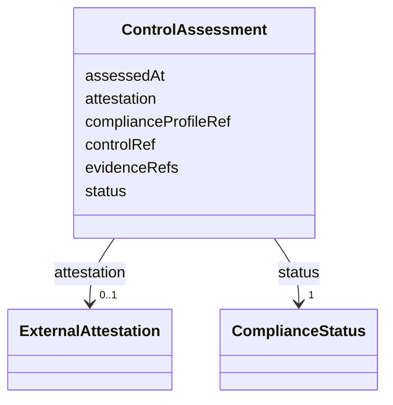

---
search:
  boost: 10.0
---

# Class: ControlAssessment


_Recognized result of assessing a Control against a ComplianceProfile, with observed evidence. Runtime-only (PostgreSQL), not a Git contract kind -- no apiVersion/kind wrapper. No CERTIFIED or CONFORMANT status without external attestation, evaluator identity, and a validity period (enforced in Rego)._


<div data-search-exclude markdown="1">


URI: [jumo:ControlAssessment](https://jumo.dev/schemas/jumo-v1/ControlAssessment)





<!-- no inheritance hierarchy -->

## Slots

| Name | Cardinality and Range | Description | Inheritance |
| ---  | --- | --- | --- |
| [controlRef](controlRef.md) | 1 <br/> [Identifier](Identifier.md) |  | direct |
| [complianceProfileRef](complianceProfileRef.md) | 1 <br/> [Identifier](Identifier.md) |  | direct |
| [status](status.md) | 1 <br/> [ComplianceStatus](ComplianceStatus.md) |  | direct |
| [evidenceRefs](evidenceRefs.md) | * <br/> [String](String.md) |  | direct |
| [attestation](attestation.md) | 0..1 <br/> [ExternalAttestation](ExternalAttestation.md) | Required when status is EXTERNALLY_ATTESTED (Rego) | direct |
| [assessedAt](assessedAt.md) | 0..1 <br/> [Datetime](Datetime.md) |  | direct |


## Identifier and Mapping Information


### Annotations

| property | value |
| --- | --- |
| jumo.state_authority | GIT |
| jumo.model_role | VALUE_OBJECT |
| jumo.audience | POLICY |
| jumo.sensitivity | INTERNAL |
| jumo.boundary_eligible | True |
| jumo.schema_profiles | draft-2020-12,native-json-schema,prompted-json-validated |


### Schema Source


* from schema: https://jumo.dev/schemas/jumo-v1


## Mappings

| Mapping Type | Mapped Value |
| ---  | ---  |
| self | jumo:ControlAssessment |
| native | jumo:ControlAssessment |


## LinkML Source

<!-- TODO: investigate https://stackoverflow.com/questions/37606292/how-to-create-tabbed-code-blocks-in-mkdocs-or-sphinx -->

### Direct

<details>
```yaml
name: ControlAssessment
annotations:
  jumo.state_authority:
    tag: jumo.state_authority
    value: GIT
  jumo.model_role:
    tag: jumo.model_role
    value: VALUE_OBJECT
  jumo.audience:
    tag: jumo.audience
    value: POLICY
  jumo.sensitivity:
    tag: jumo.sensitivity
    value: INTERNAL
  jumo.boundary_eligible:
    tag: jumo.boundary_eligible
    value: true
  jumo.schema_profiles:
    tag: jumo.schema_profiles
    value: draft-2020-12,native-json-schema,prompted-json-validated
description: Recognized result of assessing a Control against a ComplianceProfile,
  with observed evidence. Runtime-only (PostgreSQL), not a Git contract kind -- no
  apiVersion/kind wrapper. No CERTIFIED or CONFORMANT status without external attestation,
  evaluator identity, and a validity period (enforced in Rego).
from_schema: https://jumo.dev/schemas/jumo-v1
attributes:
  controlRef:
    name: controlRef
    from_schema: https://jumo.dev/schemas/jumo-v1
    owner: ControlAssessment
    domain_of:
    - ComplianceMapping
    - ControlAssessment
    range: Identifier
    required: true
  complianceProfileRef:
    name: complianceProfileRef
    from_schema: https://jumo.dev/schemas/jumo-v1
    rank: 1000
    owner: ControlAssessment
    domain_of:
    - ControlAssessment
    range: Identifier
    required: true
  status:
    name: status
    from_schema: https://jumo.dev/schemas/jumo-v1
    owner: ControlAssessment
    domain_of:
    - DocumentFrontMatter
    - ComplianceProfileSpec
    - ControlAssessment
    - MachineHealthObservation
    - MachineEnrollmentResult
    - MachineAdminResult
    - WorkloadCommandResult
    - MachineRuntimeInstallation
    - ExecutionCellLease
    - CliInstallationObservation
    - CliInvocationResult
    - ProviderQuotaObservation
    - ProviderSessionBinding
    - WorkerInvocation
    - ConnectorSessionBinding
    - ConnectorTestResult
    - ApiProblem
    range: ComplianceStatus
    required: true
  evidenceRefs:
    name: evidenceRefs
    from_schema: https://jumo.dev/schemas/jumo-v1
    owner: ControlAssessment
    domain_of:
    - KitReleaseCertificationSpec
    - WorkOrderSpec
    - AttentionItemSpec
    - ControlAssessment
    - ConnectorAppraisalSpec
    - RemoteMcpAppraisalSpec
    range: string
    multivalued: true
  attestation:
    name: attestation
    description: Required when status is EXTERNALLY_ATTESTED (Rego).
    from_schema: https://jumo.dev/schemas/jumo-v1
    rank: 1000
    owner: ControlAssessment
    domain_of:
    - ControlAssessment
    range: ExternalAttestation
    inlined: true
  assessedAt:
    name: assessedAt
    from_schema: https://jumo.dev/schemas/jumo-v1
    owner: ControlAssessment
    domain_of:
    - DataProtectionImpactAssessment
    - ControlAssessment
    - McpCatalogAssessment
    range: datetime

```
</details>

### Induced

<details>
```yaml
name: ControlAssessment
annotations:
  jumo.state_authority:
    tag: jumo.state_authority
    value: GIT
  jumo.model_role:
    tag: jumo.model_role
    value: VALUE_OBJECT
  jumo.audience:
    tag: jumo.audience
    value: POLICY
  jumo.sensitivity:
    tag: jumo.sensitivity
    value: INTERNAL
  jumo.boundary_eligible:
    tag: jumo.boundary_eligible
    value: true
  jumo.schema_profiles:
    tag: jumo.schema_profiles
    value: draft-2020-12,native-json-schema,prompted-json-validated
description: Recognized result of assessing a Control against a ComplianceProfile,
  with observed evidence. Runtime-only (PostgreSQL), not a Git contract kind -- no
  apiVersion/kind wrapper. No CERTIFIED or CONFORMANT status without external attestation,
  evaluator identity, and a validity period (enforced in Rego).
from_schema: https://jumo.dev/schemas/jumo-v1
attributes:
  controlRef:
    name: controlRef
    from_schema: https://jumo.dev/schemas/jumo-v1
    owner: ControlAssessment
    domain_of:
    - ComplianceMapping
    - ControlAssessment
    range: Identifier
    required: true
  complianceProfileRef:
    name: complianceProfileRef
    from_schema: https://jumo.dev/schemas/jumo-v1
    rank: 1000
    owner: ControlAssessment
    domain_of:
    - ControlAssessment
    range: Identifier
    required: true
  status:
    name: status
    from_schema: https://jumo.dev/schemas/jumo-v1
    owner: ControlAssessment
    domain_of:
    - DocumentFrontMatter
    - ComplianceProfileSpec
    - ControlAssessment
    - MachineHealthObservation
    - MachineEnrollmentResult
    - MachineAdminResult
    - WorkloadCommandResult
    - MachineRuntimeInstallation
    - ExecutionCellLease
    - CliInstallationObservation
    - CliInvocationResult
    - ProviderQuotaObservation
    - ProviderSessionBinding
    - WorkerInvocation
    - ConnectorSessionBinding
    - ConnectorTestResult
    - ApiProblem
    range: ComplianceStatus
    required: true
  evidenceRefs:
    name: evidenceRefs
    from_schema: https://jumo.dev/schemas/jumo-v1
    owner: ControlAssessment
    domain_of:
    - KitReleaseCertificationSpec
    - WorkOrderSpec
    - AttentionItemSpec
    - ControlAssessment
    - ConnectorAppraisalSpec
    - RemoteMcpAppraisalSpec
    range: string
    multivalued: true
  attestation:
    name: attestation
    description: Required when status is EXTERNALLY_ATTESTED (Rego).
    from_schema: https://jumo.dev/schemas/jumo-v1
    rank: 1000
    owner: ControlAssessment
    domain_of:
    - ControlAssessment
    range: ExternalAttestation
    inlined: true
  assessedAt:
    name: assessedAt
    from_schema: https://jumo.dev/schemas/jumo-v1
    owner: ControlAssessment
    domain_of:
    - DataProtectionImpactAssessment
    - ControlAssessment
    - McpCatalogAssessment
    range: datetime

```
</details></div>