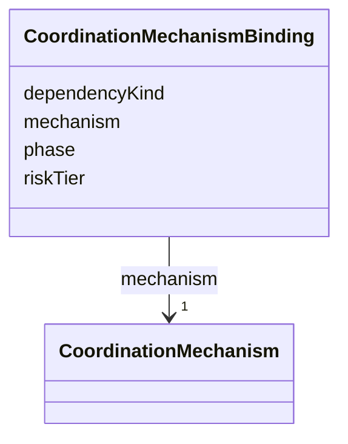

---
search:
  boost: 10.0
---

# Class: CoordinationMechanismBinding


_One coordination mechanism scoped to the dependency it actually governs, replacing a single team-wide mode (docs/concepts/positionnement-conceptuel.md#coordination-des-dependances). Shared by TeamSpec and CoordinationProfile so a team's inline coordination and a reusable named profile speak the same vocabulary._


<div data-search-exclude markdown="1">


URI: [jumo:CoordinationMechanismBinding](https://jumo.dev/schemas/jumo-v1/CoordinationMechanismBinding)





<!-- no inheritance hierarchy -->

## Slots

| Name | Cardinality and Range | Description | Inheritance |
| ---  | --- | --- | --- |
| [mechanism](mechanism.md) | 1 <br/> [CoordinationMechanism](CoordinationMechanism.md) |  | direct |
| [dependencyKind](dependencyKind.md) | 0..1 <br/> [String](String.md) | Open vocabulary naming the managed dependency (e | direct |
| [phase](phase.md) | 0..1 <br/> [String](String.md) | Open vocabulary naming the work phase this binding applies to | direct |
| [riskTier](riskTier.md) | 0..1 <br/> [String](String.md) | Open vocabulary; aligns with ActionCapabilitySet's riskTier where relevant | direct |


## Usages

| used by | used in | type | used |
| ---  | --- | --- | --- |
| [TeamCoordination](TeamCoordination.md) | [mechanisms](mechanisms.md) | range | [CoordinationMechanismBinding](CoordinationMechanismBinding.md) |
| [CoordinationProfileSpec](CoordinationProfileSpec.md) | [mechanisms](mechanisms.md) | range | [CoordinationMechanismBinding](CoordinationMechanismBinding.md) |


## Identifier and Mapping Information


### Annotations

| property | value |
| --- | --- |
| jumo.state_authority | NONE |
| jumo.model_role | VALUE_OBJECT |
| jumo.audience | REALM_PRIVATE |
| jumo.sensitivity | INTERNAL |
| jumo.boundary_eligible | True |
| jumo.schema_profiles | draft-2020-12,native-json-schema,prompted-json-validated |


### Schema Source


* from schema: https://jumo.dev/schemas/jumo-v1


## Mappings

| Mapping Type | Mapped Value |
| ---  | ---  |
| self | jumo:CoordinationMechanismBinding |
| native | jumo:CoordinationMechanismBinding |


## LinkML Source

<!-- TODO: investigate https://stackoverflow.com/questions/37606292/how-to-create-tabbed-code-blocks-in-mkdocs-or-sphinx -->

### Direct

<details>
```yaml
name: CoordinationMechanismBinding
annotations:
  jumo.state_authority:
    tag: jumo.state_authority
    value: NONE
  jumo.model_role:
    tag: jumo.model_role
    value: VALUE_OBJECT
  jumo.audience:
    tag: jumo.audience
    value: REALM_PRIVATE
  jumo.sensitivity:
    tag: jumo.sensitivity
    value: INTERNAL
  jumo.boundary_eligible:
    tag: jumo.boundary_eligible
    value: true
  jumo.schema_profiles:
    tag: jumo.schema_profiles
    value: draft-2020-12,native-json-schema,prompted-json-validated
description: One coordination mechanism scoped to the dependency it actually governs,
  replacing a single team-wide mode (docs/concepts/positionnement-conceptuel.md#coordination-des-dependances).
  Shared by TeamSpec and CoordinationProfile so a team's inline coordination and a
  reusable named profile speak the same vocabulary.
from_schema: https://jumo.dev/schemas/jumo-v1
attributes:
  mechanism:
    name: mechanism
    from_schema: https://jumo.dev/schemas/jumo-v1
    rank: 1000
    owner: CoordinationMechanismBinding
    domain_of:
    - CoordinationMechanismBinding
    range: CoordinationMechanism
    required: true
  dependencyKind:
    name: dependencyKind
    description: 'Open vocabulary naming the managed dependency (e.g. resource-sharing,
      prerequisite, simultaneity, decomposition -- Malone & Crowston''s categories).
      Not an enum: the catalog of dependency kinds is expected to grow with experience,
      and closing it here would recreate the single-mode rigidity this redesign removes.'
    from_schema: https://jumo.dev/schemas/jumo-v1
    rank: 1000
    owner: CoordinationMechanismBinding
    domain_of:
    - CoordinationMechanismBinding
    range: string
  phase:
    name: phase
    description: Open vocabulary naming the work phase this binding applies to.
    from_schema: https://jumo.dev/schemas/jumo-v1
    rank: 1000
    owner: CoordinationMechanismBinding
    domain_of:
    - CoordinationMechanismBinding
    range: string
  riskTier:
    name: riskTier
    description: Open vocabulary; aligns with ActionCapabilitySet's riskTier where
      relevant.
    from_schema: https://jumo.dev/schemas/jumo-v1
    rank: 1000
    owner: CoordinationMechanismBinding
    domain_of:
    - CoordinationMechanismBinding
    - ActionCapability
    range: string

```
</details>

### Induced

<details>
```yaml
name: CoordinationMechanismBinding
annotations:
  jumo.state_authority:
    tag: jumo.state_authority
    value: NONE
  jumo.model_role:
    tag: jumo.model_role
    value: VALUE_OBJECT
  jumo.audience:
    tag: jumo.audience
    value: REALM_PRIVATE
  jumo.sensitivity:
    tag: jumo.sensitivity
    value: INTERNAL
  jumo.boundary_eligible:
    tag: jumo.boundary_eligible
    value: true
  jumo.schema_profiles:
    tag: jumo.schema_profiles
    value: draft-2020-12,native-json-schema,prompted-json-validated
description: One coordination mechanism scoped to the dependency it actually governs,
  replacing a single team-wide mode (docs/concepts/positionnement-conceptuel.md#coordination-des-dependances).
  Shared by TeamSpec and CoordinationProfile so a team's inline coordination and a
  reusable named profile speak the same vocabulary.
from_schema: https://jumo.dev/schemas/jumo-v1
attributes:
  mechanism:
    name: mechanism
    from_schema: https://jumo.dev/schemas/jumo-v1
    rank: 1000
    owner: CoordinationMechanismBinding
    domain_of:
    - CoordinationMechanismBinding
    range: CoordinationMechanism
    required: true
  dependencyKind:
    name: dependencyKind
    description: 'Open vocabulary naming the managed dependency (e.g. resource-sharing,
      prerequisite, simultaneity, decomposition -- Malone & Crowston''s categories).
      Not an enum: the catalog of dependency kinds is expected to grow with experience,
      and closing it here would recreate the single-mode rigidity this redesign removes.'
    from_schema: https://jumo.dev/schemas/jumo-v1
    rank: 1000
    owner: CoordinationMechanismBinding
    domain_of:
    - CoordinationMechanismBinding
    range: string
  phase:
    name: phase
    description: Open vocabulary naming the work phase this binding applies to.
    from_schema: https://jumo.dev/schemas/jumo-v1
    rank: 1000
    owner: CoordinationMechanismBinding
    domain_of:
    - CoordinationMechanismBinding
    range: string
  riskTier:
    name: riskTier
    description: Open vocabulary; aligns with ActionCapabilitySet's riskTier where
      relevant.
    from_schema: https://jumo.dev/schemas/jumo-v1
    rank: 1000
    owner: CoordinationMechanismBinding
    domain_of:
    - CoordinationMechanismBinding
    - ActionCapability
    range: string

```
</details></div>