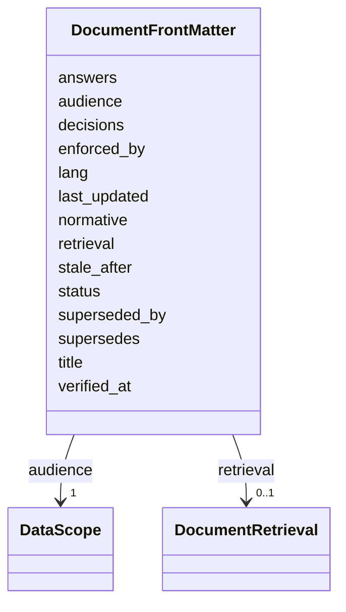

---
search:
  boost: 10.0
---

# Class: DocumentFrontMatter


_Metadata every governed Markdown document declares, so a retriever can carry a passage's authority and audience along with its text. An ungoverned RAG loses both at chunk time: explanatory prose comes back looking like a rule, and a Realm-private paragraph comes back to whoever asked. Those are the documentary forms of privilege escalation, and this schema is where they are refused (ADR-0014)._


<div data-search-exclude markdown="1">


URI: [jumo:DocumentFrontMatter](https://jumo.dev/schemas/jumo-v1/DocumentFrontMatter)





<!-- no inheritance hierarchy -->

## Slots

| Name | Cardinality and Range | Description | Inheritance |
| ---  | --- | --- | --- |
| [title](title.md) | 1 <br/> [String](String.md) |  | direct |
| [lang](lang.md) | 0..1 <br/> [String](String.md) | ISO 639-1 code of the document's prose | direct |
| [normative](normative.md) | 1 <br/> [Boolean](Boolean.md) | Whether this document states rules | direct |
| [audience](audience.md) | 1 <br/> [DataScope](DataScope.md) | Widest scope a retrieval may serve this document to | direct |
| [retrieval](retrieval.md) | 0..1 <br/> [DocumentRetrieval](DocumentRetrieval.md) |  | direct |
| [answers](answers.md) | * <br/> [String](String.md) | Questions this document answers, in the words a person would use | direct |
| [status](status.md) | 0..1 <br/> [String](String.md) |  | direct |
| [supersedes](supersedes.md) | * <br/> [String](String.md) |  | direct |
| [superseded_by](superseded_by.md) | * <br/> [String](String.md) |  | direct |
| [decisions](decisions.md) | * <br/> [Integer](Integer.md) | Canonical decision numbers (docs/00-canonical-decisions | direct |
| [verified_at](verified_at.md) | 0..1 <br/> [Date](Date.md) |  | direct |
| [stale_after](stale_after.md) | 0..1 <br/> [Duration](Duration.md) |  | direct |
| [enforced_by](enforced_by.md) | 0..1 <br/> [String](String.md) | Comma-separated paths that mechanically enforce this document's rules | direct |
| [last_updated](last_updated.md) | 0..1 <br/> [Date](Date.md) |  | direct |


## Identifier and Mapping Information


### Annotations

| property | value |
| --- | --- |
| jumo.state_authority | GIT |
| jumo.model_role | VALUE_OBJECT |
| jumo.audience | REALM_PRIVATE |
| jumo.sensitivity | INTERNAL |
| jumo.boundary_eligible | True |
| jumo.schema_profiles | draft-2020-12,native-json-schema,prompted-json-validated |


### Schema Source


* from schema: https://jumo.dev/schemas/jumo-v1


## Mappings

| Mapping Type | Mapped Value |
| ---  | ---  |
| self | jumo:DocumentFrontMatter |
| native | jumo:DocumentFrontMatter |


## LinkML Source

<!-- TODO: investigate https://stackoverflow.com/questions/37606292/how-to-create-tabbed-code-blocks-in-mkdocs-or-sphinx -->

### Direct

<details>
```yaml
name: DocumentFrontMatter
annotations:
  jumo.state_authority:
    tag: jumo.state_authority
    value: GIT
  jumo.model_role:
    tag: jumo.model_role
    value: VALUE_OBJECT
  jumo.audience:
    tag: jumo.audience
    value: REALM_PRIVATE
  jumo.sensitivity:
    tag: jumo.sensitivity
    value: INTERNAL
  jumo.boundary_eligible:
    tag: jumo.boundary_eligible
    value: true
  jumo.schema_profiles:
    tag: jumo.schema_profiles
    value: draft-2020-12,native-json-schema,prompted-json-validated
description: 'Metadata every governed Markdown document declares, so a retriever can
  carry a passage''s authority and audience along with its text. An ungoverned RAG
  loses both at chunk time: explanatory prose comes back looking like a rule, and
  a Realm-private paragraph comes back to whoever asked. Those are the documentary
  forms of privilege escalation, and this schema is where they are refused (ADR-0014).'
from_schema: https://jumo.dev/schemas/jumo-v1
attributes:
  title:
    name: title
    from_schema: https://jumo.dev/schemas/jumo-v1
    rank: 1000
    owner: DocumentFrontMatter
    domain_of:
    - DocumentFrontMatter
    - WorkOrderSpecification
    - Control
    - ApiProblem
    range: string
    required: true
    pattern: ^.{3,}$
  lang:
    name: lang
    description: ISO 639-1 code of the document's prose. Defaults to English; a non-normative
      document may declare fr for explanatory text (docs/concepts/positionnement-conceptuel.md).
    from_schema: https://jumo.dev/schemas/jumo-v1
    rank: 1000
    ifabsent: string(en)
    owner: DocumentFrontMatter
    domain_of:
    - DocumentFrontMatter
    range: string
    pattern: ^[a-z]{2}$
  normative:
    name: normative
    description: 'Whether this document states rules. Travels with every chunk: a
      retriever may quote a false document as explanation and never as authority (ADR-0005
      applied to retrieval).'
    from_schema: https://jumo.dev/schemas/jumo-v1
    rank: 1000
    owner: DocumentFrontMatter
    domain_of:
    - DocumentFrontMatter
    range: boolean
    required: true
  audience:
    name: audience
    description: Widest scope a retrieval may serve this document to. Required with
      no default, because a default here would silently publish.
    from_schema: https://jumo.dev/schemas/jumo-v1
    rank: 1000
    owner: DocumentFrontMatter
    domain_of:
    - DocumentFrontMatter
    - OfferingSpecBody
    - SelfDescriptionAnswer
    - Surface
    - ApiOperation
    - ApiSurfaceSpec
    range: DataScope
    required: true
  retrieval:
    name: retrieval
    from_schema: https://jumo.dev/schemas/jumo-v1
    rank: 1000
    ifabsent: SEMANTIC_SECTIONS
    owner: DocumentFrontMatter
    domain_of:
    - DocumentFrontMatter
    range: DocumentRetrieval
  answers:
    name: answers
    description: Questions this document answers, in the words a person would use.
    from_schema: https://jumo.dev/schemas/jumo-v1
    rank: 1000
    owner: DocumentFrontMatter
    domain_of:
    - DocumentFrontMatter
    - SelfDescriptionSpec
    range: string
    multivalued: true
    pattern: ^.{10,}$
  status:
    name: status
    from_schema: https://jumo.dev/schemas/jumo-v1
    rank: 1000
    owner: DocumentFrontMatter
    domain_of:
    - DocumentFrontMatter
    - ComplianceProfileSpec
    - ControlAssessment
    - MachineHealthObservation
    - MachineEnrollmentResult
    - MachineAdminResult
    - WorkloadCommandResult
    - MachineRuntimeInstallation
    - ExecutionCellLease
    - CliInstallationObservation
    - CliInvocationResult
    - ProviderQuotaObservation
    - ProviderSessionBinding
    - WorkerInvocation
    - ConnectorSessionBinding
    - ConnectorTestResult
    - ApiProblem
    range: string
    pattern: ^.{3,}$
  supersedes:
    name: supersedes
    from_schema: https://jumo.dev/schemas/jumo-v1
    rank: 1000
    owner: DocumentFrontMatter
    domain_of:
    - DocumentFrontMatter
    range: string
    multivalued: true
    pattern: ^ADR-[0-9]{4}$
  superseded_by:
    name: superseded_by
    from_schema: https://jumo.dev/schemas/jumo-v1
    rank: 1000
    owner: DocumentFrontMatter
    domain_of:
    - DocumentFrontMatter
    range: string
    multivalued: true
    pattern: ^ADR-[0-9]{4}$
  decisions:
    name: decisions
    description: Canonical decision numbers (docs/00-canonical-decisions.md) this
      ADR backs.
    from_schema: https://jumo.dev/schemas/jumo-v1
    rank: 1000
    owner: DocumentFrontMatter
    domain_of:
    - DocumentFrontMatter
    range: integer
    multivalued: true
  verified_at:
    name: verified_at
    from_schema: https://jumo.dev/schemas/jumo-v1
    rank: 1000
    owner: DocumentFrontMatter
    domain_of:
    - DocumentFrontMatter
    range: date
  stale_after:
    name: stale_after
    from_schema: https://jumo.dev/schemas/jumo-v1
    rank: 1000
    owner: DocumentFrontMatter
    domain_of:
    - DocumentFrontMatter
    range: Duration
  enforced_by:
    name: enforced_by
    description: Comma-separated paths that mechanically enforce this document's rules.
      Checked for existence by scripts/check-corpus-budget.py.
    from_schema: https://jumo.dev/schemas/jumo-v1
    rank: 1000
    owner: DocumentFrontMatter
    domain_of:
    - DocumentFrontMatter
    range: string
    pattern: ^.{3,}$
  last_updated:
    name: last_updated
    from_schema: https://jumo.dev/schemas/jumo-v1
    rank: 1000
    owner: DocumentFrontMatter
    domain_of:
    - DocumentFrontMatter
    range: date

```
</details>

### Induced

<details>
```yaml
name: DocumentFrontMatter
annotations:
  jumo.state_authority:
    tag: jumo.state_authority
    value: GIT
  jumo.model_role:
    tag: jumo.model_role
    value: VALUE_OBJECT
  jumo.audience:
    tag: jumo.audience
    value: REALM_PRIVATE
  jumo.sensitivity:
    tag: jumo.sensitivity
    value: INTERNAL
  jumo.boundary_eligible:
    tag: jumo.boundary_eligible
    value: true
  jumo.schema_profiles:
    tag: jumo.schema_profiles
    value: draft-2020-12,native-json-schema,prompted-json-validated
description: 'Metadata every governed Markdown document declares, so a retriever can
  carry a passage''s authority and audience along with its text. An ungoverned RAG
  loses both at chunk time: explanatory prose comes back looking like a rule, and
  a Realm-private paragraph comes back to whoever asked. Those are the documentary
  forms of privilege escalation, and this schema is where they are refused (ADR-0014).'
from_schema: https://jumo.dev/schemas/jumo-v1
attributes:
  title:
    name: title
    from_schema: https://jumo.dev/schemas/jumo-v1
    rank: 1000
    owner: DocumentFrontMatter
    domain_of:
    - DocumentFrontMatter
    - WorkOrderSpecification
    - Control
    - ApiProblem
    range: string
    required: true
    pattern: ^.{3,}$
  lang:
    name: lang
    description: ISO 639-1 code of the document's prose. Defaults to English; a non-normative
      document may declare fr for explanatory text (docs/concepts/positionnement-conceptuel.md).
    from_schema: https://jumo.dev/schemas/jumo-v1
    rank: 1000
    ifabsent: string(en)
    owner: DocumentFrontMatter
    domain_of:
    - DocumentFrontMatter
    range: string
    pattern: ^[a-z]{2}$
  normative:
    name: normative
    description: 'Whether this document states rules. Travels with every chunk: a
      retriever may quote a false document as explanation and never as authority (ADR-0005
      applied to retrieval).'
    from_schema: https://jumo.dev/schemas/jumo-v1
    rank: 1000
    owner: DocumentFrontMatter
    domain_of:
    - DocumentFrontMatter
    range: boolean
    required: true
  audience:
    name: audience
    description: Widest scope a retrieval may serve this document to. Required with
      no default, because a default here would silently publish.
    from_schema: https://jumo.dev/schemas/jumo-v1
    rank: 1000
    owner: DocumentFrontMatter
    domain_of:
    - DocumentFrontMatter
    - OfferingSpecBody
    - SelfDescriptionAnswer
    - Surface
    - ApiOperation
    - ApiSurfaceSpec
    range: DataScope
    required: true
  retrieval:
    name: retrieval
    from_schema: https://jumo.dev/schemas/jumo-v1
    rank: 1000
    ifabsent: SEMANTIC_SECTIONS
    owner: DocumentFrontMatter
    domain_of:
    - DocumentFrontMatter
    range: DocumentRetrieval
  answers:
    name: answers
    description: Questions this document answers, in the words a person would use.
    from_schema: https://jumo.dev/schemas/jumo-v1
    rank: 1000
    owner: DocumentFrontMatter
    domain_of:
    - DocumentFrontMatter
    - SelfDescriptionSpec
    range: string
    multivalued: true
    pattern: ^.{10,}$
  status:
    name: status
    from_schema: https://jumo.dev/schemas/jumo-v1
    rank: 1000
    owner: DocumentFrontMatter
    domain_of:
    - DocumentFrontMatter
    - ComplianceProfileSpec
    - ControlAssessment
    - MachineHealthObservation
    - MachineEnrollmentResult
    - MachineAdminResult
    - WorkloadCommandResult
    - MachineRuntimeInstallation
    - ExecutionCellLease
    - CliInstallationObservation
    - CliInvocationResult
    - ProviderQuotaObservation
    - ProviderSessionBinding
    - WorkerInvocation
    - ConnectorSessionBinding
    - ConnectorTestResult
    - ApiProblem
    range: string
    pattern: ^.{3,}$
  supersedes:
    name: supersedes
    from_schema: https://jumo.dev/schemas/jumo-v1
    rank: 1000
    owner: DocumentFrontMatter
    domain_of:
    - DocumentFrontMatter
    range: string
    multivalued: true
    pattern: ^ADR-[0-9]{4}$
  superseded_by:
    name: superseded_by
    from_schema: https://jumo.dev/schemas/jumo-v1
    rank: 1000
    owner: DocumentFrontMatter
    domain_of:
    - DocumentFrontMatter
    range: string
    multivalued: true
    pattern: ^ADR-[0-9]{4}$
  decisions:
    name: decisions
    description: Canonical decision numbers (docs/00-canonical-decisions.md) this
      ADR backs.
    from_schema: https://jumo.dev/schemas/jumo-v1
    rank: 1000
    owner: DocumentFrontMatter
    domain_of:
    - DocumentFrontMatter
    range: integer
    multivalued: true
  verified_at:
    name: verified_at
    from_schema: https://jumo.dev/schemas/jumo-v1
    rank: 1000
    owner: DocumentFrontMatter
    domain_of:
    - DocumentFrontMatter
    range: date
  stale_after:
    name: stale_after
    from_schema: https://jumo.dev/schemas/jumo-v1
    rank: 1000
    owner: DocumentFrontMatter
    domain_of:
    - DocumentFrontMatter
    range: Duration
  enforced_by:
    name: enforced_by
    description: Comma-separated paths that mechanically enforce this document's rules.
      Checked for existence by scripts/check-corpus-budget.py.
    from_schema: https://jumo.dev/schemas/jumo-v1
    rank: 1000
    owner: DocumentFrontMatter
    domain_of:
    - DocumentFrontMatter
    range: string
    pattern: ^.{3,}$
  last_updated:
    name: last_updated
    from_schema: https://jumo.dev/schemas/jumo-v1
    rank: 1000
    owner: DocumentFrontMatter
    domain_of:
    - DocumentFrontMatter
    range: date

```
</details></div>