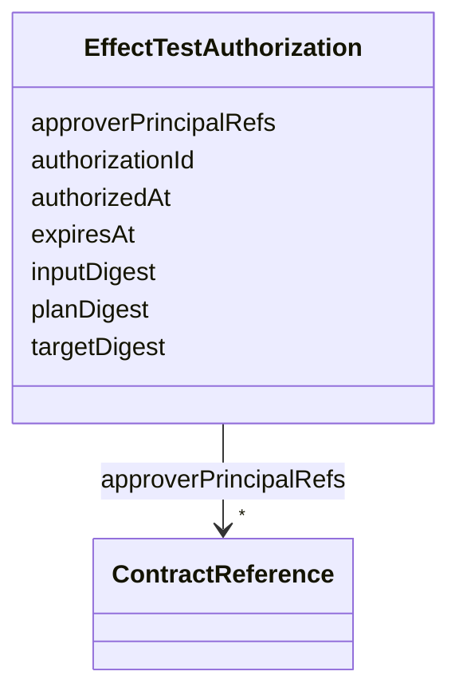

---
search:
  boost: 10.0
---

# Class: EffectTestAuthorization


_Dual-consent authorization record for executing irreversible effect tests._


<div data-search-exclude markdown="1">


URI: [jumo:EffectTestAuthorization](https://jumo.dev/schemas/jumo-v1/EffectTestAuthorization)





<!-- no inheritance hierarchy -->

## Slots

| Name | Cardinality and Range | Description | Inheritance |
| ---  | --- | --- | --- |
| [authorizationId](authorizationId.md) | 1 <br/> [Identifier](Identifier.md) |  | direct |
| [planDigest](planDigest.md) | 1 <br/> [String](String.md) |  | direct |
| [inputDigest](inputDigest.md) | 1 <br/> [String](String.md) |  | direct |
| [targetDigest](targetDigest.md) | 1 <br/> [String](String.md) |  | direct |
| [approverPrincipalRefs](approverPrincipalRefs.md) | * <br/> [ContractReference](ContractReference.md) |  | direct |
| [authorizedAt](authorizedAt.md) | 1 <br/> [String](String.md) |  | direct |
| [expiresAt](expiresAt.md) | 1 <br/> [String](String.md) |  | direct |


## Identifier and Mapping Information


### Annotations

| property | value |
| --- | --- |
| jumo.state_authority | POSTGRES |
| jumo.model_role | VALUE_OBJECT |
| jumo.audience | REALM_PRIVATE |
| jumo.sensitivity | INTERNAL |
| jumo.boundary_eligible | True |
| jumo.schema_profiles | draft-2020-12,native-json-schema,prompted-json-validated |


### Schema Source


* from schema: https://jumo.dev/schemas/jumo-v1


## Mappings

| Mapping Type | Mapped Value |
| ---  | ---  |
| self | jumo:EffectTestAuthorization |
| native | jumo:EffectTestAuthorization |


## LinkML Source

<!-- TODO: investigate https://stackoverflow.com/questions/37606292/how-to-create-tabbed-code-blocks-in-mkdocs-or-sphinx -->

### Direct

<details>
```yaml
name: EffectTestAuthorization
annotations:
  jumo.state_authority:
    tag: jumo.state_authority
    value: POSTGRES
  jumo.model_role:
    tag: jumo.model_role
    value: VALUE_OBJECT
  jumo.audience:
    tag: jumo.audience
    value: REALM_PRIVATE
  jumo.sensitivity:
    tag: jumo.sensitivity
    value: INTERNAL
  jumo.boundary_eligible:
    tag: jumo.boundary_eligible
    value: true
  jumo.schema_profiles:
    tag: jumo.schema_profiles
    value: draft-2020-12,native-json-schema,prompted-json-validated
description: Dual-consent authorization record for executing irreversible effect tests.
from_schema: https://jumo.dev/schemas/jumo-v1
attributes:
  authorizationId:
    name: authorizationId
    from_schema: https://jumo.dev/schemas/jumo-v1
    rank: 1000
    owner: EffectTestAuthorization
    domain_of:
    - EffectTestAuthorization
    range: Identifier
    required: true
  planDigest:
    name: planDigest
    from_schema: https://jumo.dev/schemas/jumo-v1
    owner: EffectTestAuthorization
    domain_of:
    - ConnectorTestPlan
    - EffectTestAuthorization
    range: string
    required: true
  inputDigest:
    name: inputDigest
    from_schema: https://jumo.dev/schemas/jumo-v1
    rank: 1000
    owner: EffectTestAuthorization
    domain_of:
    - EffectTestAuthorization
    range: string
    required: true
  targetDigest:
    name: targetDigest
    from_schema: https://jumo.dev/schemas/jumo-v1
    rank: 1000
    owner: EffectTestAuthorization
    domain_of:
    - EffectTestAuthorization
    range: string
    required: true
  approverPrincipalRefs:
    name: approverPrincipalRefs
    from_schema: https://jumo.dev/schemas/jumo-v1
    rank: 1000
    owner: EffectTestAuthorization
    domain_of:
    - EffectTestAuthorization
    range: ContractReference
    multivalued: true
    inlined: true
    inlined_as_list: true
  authorizedAt:
    name: authorizedAt
    from_schema: https://jumo.dev/schemas/jumo-v1
    rank: 1000
    owner: EffectTestAuthorization
    domain_of:
    - EffectTestAuthorization
    range: string
    required: true
  expiresAt:
    name: expiresAt
    from_schema: https://jumo.dev/schemas/jumo-v1
    owner: EffectTestAuthorization
    domain_of:
    - OrganizationRetentionHoldSpec
    - MachineEnrollmentChallenge
    - MachineAdminCommand
    - WorkloadCommand
    - ExecutionCellLease
    - ProviderSessionBinding
    - InvocationAuthorizationReceipt
    - McpInvocationAuthorizationReceipt
    - ConnectorSessionBinding
    - EffectTestAuthorization
    range: string
    required: true

```
</details>

### Induced

<details>
```yaml
name: EffectTestAuthorization
annotations:
  jumo.state_authority:
    tag: jumo.state_authority
    value: POSTGRES
  jumo.model_role:
    tag: jumo.model_role
    value: VALUE_OBJECT
  jumo.audience:
    tag: jumo.audience
    value: REALM_PRIVATE
  jumo.sensitivity:
    tag: jumo.sensitivity
    value: INTERNAL
  jumo.boundary_eligible:
    tag: jumo.boundary_eligible
    value: true
  jumo.schema_profiles:
    tag: jumo.schema_profiles
    value: draft-2020-12,native-json-schema,prompted-json-validated
description: Dual-consent authorization record for executing irreversible effect tests.
from_schema: https://jumo.dev/schemas/jumo-v1
attributes:
  authorizationId:
    name: authorizationId
    from_schema: https://jumo.dev/schemas/jumo-v1
    rank: 1000
    owner: EffectTestAuthorization
    domain_of:
    - EffectTestAuthorization
    range: Identifier
    required: true
  planDigest:
    name: planDigest
    from_schema: https://jumo.dev/schemas/jumo-v1
    owner: EffectTestAuthorization
    domain_of:
    - ConnectorTestPlan
    - EffectTestAuthorization
    range: string
    required: true
  inputDigest:
    name: inputDigest
    from_schema: https://jumo.dev/schemas/jumo-v1
    rank: 1000
    owner: EffectTestAuthorization
    domain_of:
    - EffectTestAuthorization
    range: string
    required: true
  targetDigest:
    name: targetDigest
    from_schema: https://jumo.dev/schemas/jumo-v1
    rank: 1000
    owner: EffectTestAuthorization
    domain_of:
    - EffectTestAuthorization
    range: string
    required: true
  approverPrincipalRefs:
    name: approverPrincipalRefs
    from_schema: https://jumo.dev/schemas/jumo-v1
    rank: 1000
    owner: EffectTestAuthorization
    domain_of:
    - EffectTestAuthorization
    range: ContractReference
    multivalued: true
    inlined: true
    inlined_as_list: true
  authorizedAt:
    name: authorizedAt
    from_schema: https://jumo.dev/schemas/jumo-v1
    rank: 1000
    owner: EffectTestAuthorization
    domain_of:
    - EffectTestAuthorization
    range: string
    required: true
  expiresAt:
    name: expiresAt
    from_schema: https://jumo.dev/schemas/jumo-v1
    owner: EffectTestAuthorization
    domain_of:
    - OrganizationRetentionHoldSpec
    - MachineEnrollmentChallenge
    - MachineAdminCommand
    - WorkloadCommand
    - ExecutionCellLease
    - ProviderSessionBinding
    - InvocationAuthorizationReceipt
    - McpInvocationAuthorizationReceipt
    - ConnectorSessionBinding
    - EffectTestAuthorization
    range: string
    required: true

```
</details></div>