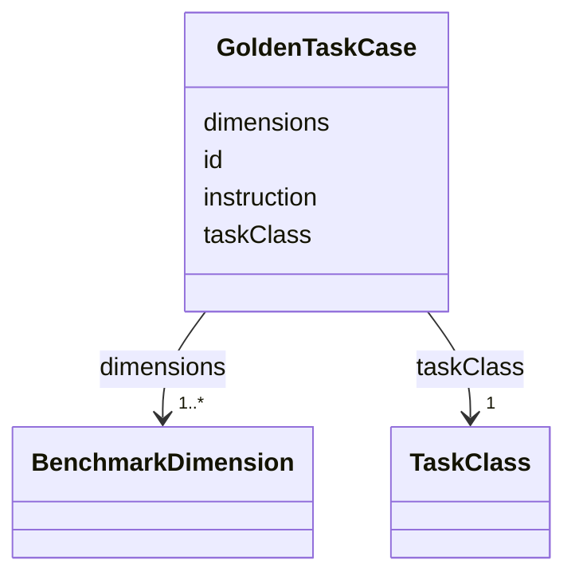

---
search:
  boost: 10.0
---

# Class: GoldenTaskCase

<div data-search-exclude markdown="1">


URI: [jumo:GoldenTaskCase](https://jumo.dev/schemas/jumo-v1/GoldenTaskCase)





<!-- no inheritance hierarchy -->

## Slots

| Name | Cardinality and Range | Description | Inheritance |
| ---  | --- | --- | --- |
| [id](id.md) | 1 <br/> [Identifier](Identifier.md) |  | direct |
| [taskClass](taskClass.md) | 1 <br/> [TaskClass](TaskClass.md) |  | direct |
| [instruction](instruction.md) | 1 <br/> [String](String.md) |  | direct |
| [dimensions](dimensions.md) | 1..* <br/> [BenchmarkDimension](BenchmarkDimension.md) |  | direct |


## Usages

| used by | used in | type | used |
| ---  | --- | --- | --- |
| [GoldenTaskSetSpec](GoldenTaskSetSpec.md) | [cases](cases.md) | range | [GoldenTaskCase](GoldenTaskCase.md) |


## Identifier and Mapping Information


### Annotations

| property | value |
| --- | --- |
| jumo.state_authority | GIT |
| jumo.model_role | VALUE_OBJECT |
| jumo.audience | REALM_PRIVATE |
| jumo.sensitivity | INTERNAL |
| jumo.boundary_eligible | True |
| jumo.schema_profiles | draft-2020-12,native-json-schema,prompted-json-validated |


### Schema Source


* from schema: https://jumo.dev/schemas/jumo-v1


## Mappings

| Mapping Type | Mapped Value |
| ---  | ---  |
| self | jumo:GoldenTaskCase |
| native | jumo:GoldenTaskCase |


## LinkML Source

<!-- TODO: investigate https://stackoverflow.com/questions/37606292/how-to-create-tabbed-code-blocks-in-mkdocs-or-sphinx -->

### Direct

<details>
```yaml
name: GoldenTaskCase
annotations:
  jumo.state_authority:
    tag: jumo.state_authority
    value: GIT
  jumo.model_role:
    tag: jumo.model_role
    value: VALUE_OBJECT
  jumo.audience:
    tag: jumo.audience
    value: REALM_PRIVATE
  jumo.sensitivity:
    tag: jumo.sensitivity
    value: INTERNAL
  jumo.boundary_eligible:
    tag: jumo.boundary_eligible
    value: true
  jumo.schema_profiles:
    tag: jumo.schema_profiles
    value: draft-2020-12,native-json-schema,prompted-json-validated
from_schema: https://jumo.dev/schemas/jumo-v1
attributes:
  id:
    name: id
    from_schema: https://jumo.dev/schemas/jumo-v1
    owner: GoldenTaskCase
    domain_of:
    - ContractReference
    - Metadata
    - LayerOverride
    - Principle
    - Milestone
    - RepositoryBinding
    - KitProfile
    - KitModule
    - DispositionRule
    - SelfDescriptionSubject
    - AgentCardSkill
    - AcceptanceCriterion
    - EngagementStage
    - GoldenTaskCase
    - AssistedJourneyStep
    - PolicyRule
    - AttentionDecisionOption
    - ProcessStep
    - ProcessFlow
    - ChangeProposalRef
    - ForgeProjectionRef
    - ProcessRunRef
    - ApprovalSignal
    - ExecutionCellProvisioningRef
    - ConnectorOperation
    - McpBundleOperation
    - ProviderSessionBinding
    - RoutingDecision
    - WorkerInvocation
    - EvidenceRecord
    - Surface
    - ProjectionSection
    range: Identifier
    required: true
  taskClass:
    name: taskClass
    from_schema: https://jumo.dev/schemas/jumo-v1
    rank: 1000
    owner: GoldenTaskCase
    domain_of:
    - GoldenTaskCase
    range: TaskClass
    required: true
  instruction:
    name: instruction
    from_schema: https://jumo.dev/schemas/jumo-v1
    rank: 1000
    owner: GoldenTaskCase
    domain_of:
    - GoldenTaskCase
    range: string
    required: true
    pattern: ^.{20,}$
  dimensions:
    name: dimensions
    from_schema: https://jumo.dev/schemas/jumo-v1
    rank: 1000
    owner: GoldenTaskCase
    domain_of:
    - GoldenTaskCase
    - ConnectorAppraisalSpec
    range: BenchmarkDimension
    required: true
    multivalued: true
    minimum_cardinality: 1

```
</details>

### Induced

<details>
```yaml
name: GoldenTaskCase
annotations:
  jumo.state_authority:
    tag: jumo.state_authority
    value: GIT
  jumo.model_role:
    tag: jumo.model_role
    value: VALUE_OBJECT
  jumo.audience:
    tag: jumo.audience
    value: REALM_PRIVATE
  jumo.sensitivity:
    tag: jumo.sensitivity
    value: INTERNAL
  jumo.boundary_eligible:
    tag: jumo.boundary_eligible
    value: true
  jumo.schema_profiles:
    tag: jumo.schema_profiles
    value: draft-2020-12,native-json-schema,prompted-json-validated
from_schema: https://jumo.dev/schemas/jumo-v1
attributes:
  id:
    name: id
    from_schema: https://jumo.dev/schemas/jumo-v1
    owner: GoldenTaskCase
    domain_of:
    - ContractReference
    - Metadata
    - LayerOverride
    - Principle
    - Milestone
    - RepositoryBinding
    - KitProfile
    - KitModule
    - DispositionRule
    - SelfDescriptionSubject
    - AgentCardSkill
    - AcceptanceCriterion
    - EngagementStage
    - GoldenTaskCase
    - AssistedJourneyStep
    - PolicyRule
    - AttentionDecisionOption
    - ProcessStep
    - ProcessFlow
    - ChangeProposalRef
    - ForgeProjectionRef
    - ProcessRunRef
    - ApprovalSignal
    - ExecutionCellProvisioningRef
    - ConnectorOperation
    - McpBundleOperation
    - ProviderSessionBinding
    - RoutingDecision
    - WorkerInvocation
    - EvidenceRecord
    - Surface
    - ProjectionSection
    range: Identifier
    required: true
  taskClass:
    name: taskClass
    from_schema: https://jumo.dev/schemas/jumo-v1
    rank: 1000
    owner: GoldenTaskCase
    domain_of:
    - GoldenTaskCase
    range: TaskClass
    required: true
  instruction:
    name: instruction
    from_schema: https://jumo.dev/schemas/jumo-v1
    rank: 1000
    owner: GoldenTaskCase
    domain_of:
    - GoldenTaskCase
    range: string
    required: true
    pattern: ^.{20,}$
  dimensions:
    name: dimensions
    from_schema: https://jumo.dev/schemas/jumo-v1
    rank: 1000
    owner: GoldenTaskCase
    domain_of:
    - GoldenTaskCase
    - ConnectorAppraisalSpec
    range: BenchmarkDimension
    required: true
    multivalued: true
    minimum_cardinality: 1

```
</details></div>