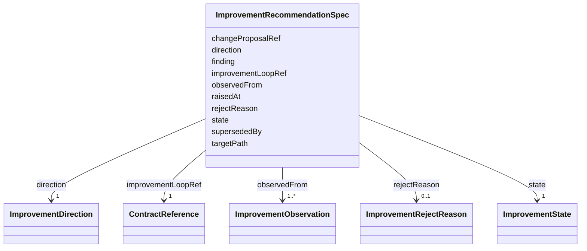

---
search:
  boost: 10.0
---

# Class: ImprovementRecommendationSpec

<div data-search-exclude markdown="1">


URI: [jumo:ImprovementRecommendationSpec](https://jumo.dev/schemas/jumo-v1/ImprovementRecommendationSpec)





<!-- no inheritance hierarchy -->

## Slots

| Name | Cardinality and Range | Description | Inheritance |
| ---  | --- | --- | --- |
| [improvementLoopRef](improvementLoopRef.md) | 1 <br/> [ContractReference](ContractReference.md) |  | direct |
| [finding](finding.md) | 1 <br/> [String](String.md) |  | direct |
| [observedFrom](observedFrom.md) | 1..* <br/> [ImprovementObservation](ImprovementObservation.md) |  | direct |
| [targetPath](targetPath.md) | 1 <br/> [String](String.md) |  | direct |
| [direction](direction.md) | 1 <br/> [ImprovementDirection](ImprovementDirection.md) |  | direct |
| [state](state.md) | 1 <br/> [ImprovementState](ImprovementState.md) |  | direct |
| [rejectReason](rejectReason.md) | 0..1 <br/> [ImprovementRejectReason](ImprovementRejectReason.md) |  | direct |
| [changeProposalRef](changeProposalRef.md) | 0..1 <br/> [String](String.md) |  | direct |
| [raisedAt](raisedAt.md) | 1 <br/> [Datetime](Datetime.md) |  | direct |
| [supersededBy](supersededBy.md) | 0..1 <br/> [Identifier](Identifier.md) |  | direct |


## Usages

| used by | used in | type | used |
| ---  | --- | --- | --- |
| [ImprovementRecommendation](ImprovementRecommendation.md) | [spec](spec.md) | range | [ImprovementRecommendationSpec](ImprovementRecommendationSpec.md) |


## Identifier and Mapping Information


### Annotations

| property | value |
| --- | --- |
| jumo.state_authority | GIT |
| jumo.model_role | VALUE_OBJECT |
| jumo.audience | REALM_PRIVATE |
| jumo.sensitivity | INTERNAL |
| jumo.boundary_eligible | True |
| jumo.schema_profiles | draft-2020-12,native-json-schema,prompted-json-validated |


### Schema Source


* from schema: https://jumo.dev/schemas/jumo-v1


## Mappings

| Mapping Type | Mapped Value |
| ---  | ---  |
| self | jumo:ImprovementRecommendationSpec |
| native | jumo:ImprovementRecommendationSpec |


## LinkML Source

<!-- TODO: investigate https://stackoverflow.com/questions/37606292/how-to-create-tabbed-code-blocks-in-mkdocs-or-sphinx -->

### Direct

<details>
```yaml
name: ImprovementRecommendationSpec
annotations:
  jumo.state_authority:
    tag: jumo.state_authority
    value: GIT
  jumo.model_role:
    tag: jumo.model_role
    value: VALUE_OBJECT
  jumo.audience:
    tag: jumo.audience
    value: REALM_PRIVATE
  jumo.sensitivity:
    tag: jumo.sensitivity
    value: INTERNAL
  jumo.boundary_eligible:
    tag: jumo.boundary_eligible
    value: true
  jumo.schema_profiles:
    tag: jumo.schema_profiles
    value: draft-2020-12,native-json-schema,prompted-json-validated
from_schema: https://jumo.dev/schemas/jumo-v1
attributes:
  improvementLoopRef:
    name: improvementLoopRef
    from_schema: https://jumo.dev/schemas/jumo-v1
    rank: 1000
    owner: ImprovementRecommendationSpec
    domain_of:
    - ImprovementRecommendationSpec
    range: ContractReference
    required: true
    inlined: true
  finding:
    name: finding
    from_schema: https://jumo.dev/schemas/jumo-v1
    rank: 1000
    owner: ImprovementRecommendationSpec
    domain_of:
    - ImprovementRecommendationSpec
    - AppraisalDimension
    range: string
    required: true
    pattern: ^.{20,}$
  observedFrom:
    name: observedFrom
    from_schema: https://jumo.dev/schemas/jumo-v1
    rank: 1000
    owner: ImprovementRecommendationSpec
    domain_of:
    - ImprovementRecommendationSpec
    range: ImprovementObservation
    required: true
    multivalued: true
    inlined: true
    inlined_as_list: true
    minimum_cardinality: 1
  targetPath:
    name: targetPath
    from_schema: https://jumo.dev/schemas/jumo-v1
    owner: ImprovementRecommendationSpec
    domain_of:
    - RenderedKitFile
    - RenderedKitAsset
    - ImprovementRecommendationSpec
    range: string
    required: true
    pattern: ^[A-Za-z0-9._-]+(/[A-Za-z0-9._-]+)*$
  direction:
    name: direction
    from_schema: https://jumo.dev/schemas/jumo-v1
    rank: 1000
    owner: ImprovementRecommendationSpec
    domain_of:
    - ImprovementRecommendationSpec
    - FederationMessage
    range: ImprovementDirection
    required: true
  state:
    name: state
    from_schema: https://jumo.dev/schemas/jumo-v1
    owner: ImprovementRecommendationSpec
    domain_of:
    - OfferingSpecBody
    - WorkOrderSpec
    - ImprovementRecommendationSpec
    - ChangeSetProjection
    range: ImprovementState
    required: true
  rejectReason:
    name: rejectReason
    from_schema: https://jumo.dev/schemas/jumo-v1
    rank: 1000
    owner: ImprovementRecommendationSpec
    domain_of:
    - ImprovementRecommendationSpec
    range: ImprovementRejectReason
  changeProposalRef:
    name: changeProposalRef
    from_schema: https://jumo.dev/schemas/jumo-v1
    rank: 1000
    owner: ImprovementRecommendationSpec
    domain_of:
    - ImprovementRecommendationSpec
    range: string
    pattern: ^.{1,}$
  raisedAt:
    name: raisedAt
    from_schema: https://jumo.dev/schemas/jumo-v1
    rank: 1000
    owner: ImprovementRecommendationSpec
    domain_of:
    - ImprovementRecommendationSpec
    range: datetime
    required: true
  supersededBy:
    name: supersededBy
    from_schema: https://jumo.dev/schemas/jumo-v1
    rank: 1000
    owner: ImprovementRecommendationSpec
    domain_of:
    - ImprovementRecommendationSpec
    range: Identifier

```
</details>

### Induced

<details>
```yaml
name: ImprovementRecommendationSpec
annotations:
  jumo.state_authority:
    tag: jumo.state_authority
    value: GIT
  jumo.model_role:
    tag: jumo.model_role
    value: VALUE_OBJECT
  jumo.audience:
    tag: jumo.audience
    value: REALM_PRIVATE
  jumo.sensitivity:
    tag: jumo.sensitivity
    value: INTERNAL
  jumo.boundary_eligible:
    tag: jumo.boundary_eligible
    value: true
  jumo.schema_profiles:
    tag: jumo.schema_profiles
    value: draft-2020-12,native-json-schema,prompted-json-validated
from_schema: https://jumo.dev/schemas/jumo-v1
attributes:
  improvementLoopRef:
    name: improvementLoopRef
    from_schema: https://jumo.dev/schemas/jumo-v1
    rank: 1000
    owner: ImprovementRecommendationSpec
    domain_of:
    - ImprovementRecommendationSpec
    range: ContractReference
    required: true
    inlined: true
  finding:
    name: finding
    from_schema: https://jumo.dev/schemas/jumo-v1
    rank: 1000
    owner: ImprovementRecommendationSpec
    domain_of:
    - ImprovementRecommendationSpec
    - AppraisalDimension
    range: string
    required: true
    pattern: ^.{20,}$
  observedFrom:
    name: observedFrom
    from_schema: https://jumo.dev/schemas/jumo-v1
    rank: 1000
    owner: ImprovementRecommendationSpec
    domain_of:
    - ImprovementRecommendationSpec
    range: ImprovementObservation
    required: true
    multivalued: true
    inlined: true
    inlined_as_list: true
    minimum_cardinality: 1
  targetPath:
    name: targetPath
    from_schema: https://jumo.dev/schemas/jumo-v1
    owner: ImprovementRecommendationSpec
    domain_of:
    - RenderedKitFile
    - RenderedKitAsset
    - ImprovementRecommendationSpec
    range: string
    required: true
    pattern: ^[A-Za-z0-9._-]+(/[A-Za-z0-9._-]+)*$
  direction:
    name: direction
    from_schema: https://jumo.dev/schemas/jumo-v1
    rank: 1000
    owner: ImprovementRecommendationSpec
    domain_of:
    - ImprovementRecommendationSpec
    - FederationMessage
    range: ImprovementDirection
    required: true
  state:
    name: state
    from_schema: https://jumo.dev/schemas/jumo-v1
    owner: ImprovementRecommendationSpec
    domain_of:
    - OfferingSpecBody
    - WorkOrderSpec
    - ImprovementRecommendationSpec
    - ChangeSetProjection
    range: ImprovementState
    required: true
  rejectReason:
    name: rejectReason
    from_schema: https://jumo.dev/schemas/jumo-v1
    rank: 1000
    owner: ImprovementRecommendationSpec
    domain_of:
    - ImprovementRecommendationSpec
    range: ImprovementRejectReason
  changeProposalRef:
    name: changeProposalRef
    from_schema: https://jumo.dev/schemas/jumo-v1
    rank: 1000
    owner: ImprovementRecommendationSpec
    domain_of:
    - ImprovementRecommendationSpec
    range: string
    pattern: ^.{1,}$
  raisedAt:
    name: raisedAt
    from_schema: https://jumo.dev/schemas/jumo-v1
    rank: 1000
    owner: ImprovementRecommendationSpec
    domain_of:
    - ImprovementRecommendationSpec
    range: datetime
    required: true
  supersededBy:
    name: supersededBy
    from_schema: https://jumo.dev/schemas/jumo-v1
    rank: 1000
    owner: ImprovementRecommendationSpec
    domain_of:
    - ImprovementRecommendationSpec
    range: Identifier

```
</details></div>