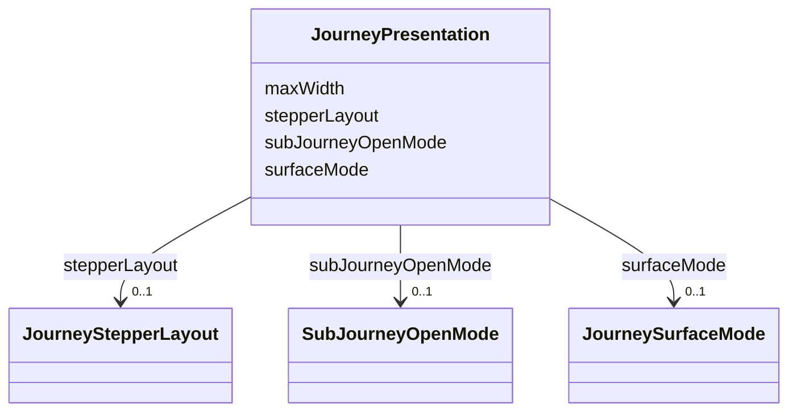

---
search:
  boost: 10.0
---

# Class: JourneyPresentation


_Decorative and layout-only: how a journey or step is drawn, never what it may do. Carries no capability, no policy, no budget and no workflow field, on the same terms as ThemePack. Declared on the journey and overridable per step; an absent field at step level falls back to the journey's._


<div data-search-exclude markdown="1">


URI: [jumo:JourneyPresentation](https://jumo.dev/schemas/jumo-v1/JourneyPresentation)





<!-- no inheritance hierarchy -->

## Slots

| Name | Cardinality and Range | Description | Inheritance |
| ---  | --- | --- | --- |
| [surfaceMode](surfaceMode.md) | 0..1 <br/> [JourneySurfaceMode](JourneySurfaceMode.md) | Whether the journey or step mounts as a page, a modal dialog, or inline withi... | direct |
| [stepperLayout](stepperLayout.md) | 0..1 <br/> [JourneyStepperLayout](JourneyStepperLayout.md) | Whether the step list renders as a vertical rail or a horizontal slide group | direct |
| [subJourneyOpenMode](subJourneyOpenMode.md) | 0..1 <br/> [SubJourneyOpenMode](SubJourneyOpenMode.md) | How a SUB_JOURNEY step opens its child run; meaningless on any other stepKind | direct |
| [maxWidth](maxWidth.md) | 0..1 <br/> [Integer](Integer.md) | Maximum content width in pixels for the surface | direct |


## Usages

| used by | used in | type | used |
| ---  | --- | --- | --- |
| [AssistedJourneySpec](AssistedJourneySpec.md) | [presentation](presentation.md) | range | [JourneyPresentation](JourneyPresentation.md) |
| [AssistedJourneyStep](AssistedJourneyStep.md) | [presentationOverride](presentationOverride.md) | range | [JourneyPresentation](JourneyPresentation.md) |


## Identifier and Mapping Information


### Annotations

| property | value |
| --- | --- |
| jumo.state_authority | GIT |
| jumo.model_role | VALUE_OBJECT |
| jumo.audience | REALM_PRIVATE |
| jumo.sensitivity | PUBLIC |
| jumo.boundary_eligible | True |
| jumo.schema_profiles | draft-2020-12,native-json-schema,prompted-json-validated |


### Schema Source


* from schema: https://jumo.dev/schemas/jumo-v1


## Mappings

| Mapping Type | Mapped Value |
| ---  | ---  |
| self | jumo:JourneyPresentation |
| native | jumo:JourneyPresentation |


## LinkML Source

<!-- TODO: investigate https://stackoverflow.com/questions/37606292/how-to-create-tabbed-code-blocks-in-mkdocs-or-sphinx -->

### Direct

<details>
```yaml
name: JourneyPresentation
annotations:
  jumo.state_authority:
    tag: jumo.state_authority
    value: GIT
  jumo.model_role:
    tag: jumo.model_role
    value: VALUE_OBJECT
  jumo.audience:
    tag: jumo.audience
    value: REALM_PRIVATE
  jumo.sensitivity:
    tag: jumo.sensitivity
    value: PUBLIC
  jumo.boundary_eligible:
    tag: jumo.boundary_eligible
    value: true
  jumo.schema_profiles:
    tag: jumo.schema_profiles
    value: draft-2020-12,native-json-schema,prompted-json-validated
description: 'Decorative and layout-only: how a journey or step is drawn, never what
  it may do. Carries no capability, no policy, no budget and no workflow field, on
  the same terms as ThemePack. Declared on the journey and overridable per step; an
  absent field at step level falls back to the journey''s.'
from_schema: https://jumo.dev/schemas/jumo-v1
attributes:
  surfaceMode:
    name: surfaceMode
    description: Whether the journey or step mounts as a page, a modal dialog, or
      inline within its host container.
    from_schema: https://jumo.dev/schemas/jumo-v1
    rank: 1000
    owner: JourneyPresentation
    domain_of:
    - JourneyPresentation
    range: JourneySurfaceMode
  stepperLayout:
    name: stepperLayout
    description: Whether the step list renders as a vertical rail or a horizontal
      slide group.
    from_schema: https://jumo.dev/schemas/jumo-v1
    rank: 1000
    owner: JourneyPresentation
    domain_of:
    - JourneyPresentation
    range: JourneyStepperLayout
  subJourneyOpenMode:
    name: subJourneyOpenMode
    description: How a SUB_JOURNEY step opens its child run; meaningless on any other
      stepKind.
    from_schema: https://jumo.dev/schemas/jumo-v1
    rank: 1000
    owner: JourneyPresentation
    domain_of:
    - JourneyPresentation
    range: SubJourneyOpenMode
  maxWidth:
    name: maxWidth
    description: Maximum content width in pixels for the surface. Absent means no
      constraint.
    from_schema: https://jumo.dev/schemas/jumo-v1
    rank: 1000
    owner: JourneyPresentation
    domain_of:
    - JourneyPresentation
    range: integer

```
</details>

### Induced

<details>
```yaml
name: JourneyPresentation
annotations:
  jumo.state_authority:
    tag: jumo.state_authority
    value: GIT
  jumo.model_role:
    tag: jumo.model_role
    value: VALUE_OBJECT
  jumo.audience:
    tag: jumo.audience
    value: REALM_PRIVATE
  jumo.sensitivity:
    tag: jumo.sensitivity
    value: PUBLIC
  jumo.boundary_eligible:
    tag: jumo.boundary_eligible
    value: true
  jumo.schema_profiles:
    tag: jumo.schema_profiles
    value: draft-2020-12,native-json-schema,prompted-json-validated
description: 'Decorative and layout-only: how a journey or step is drawn, never what
  it may do. Carries no capability, no policy, no budget and no workflow field, on
  the same terms as ThemePack. Declared on the journey and overridable per step; an
  absent field at step level falls back to the journey''s.'
from_schema: https://jumo.dev/schemas/jumo-v1
attributes:
  surfaceMode:
    name: surfaceMode
    description: Whether the journey or step mounts as a page, a modal dialog, or
      inline within its host container.
    from_schema: https://jumo.dev/schemas/jumo-v1
    rank: 1000
    owner: JourneyPresentation
    domain_of:
    - JourneyPresentation
    range: JourneySurfaceMode
  stepperLayout:
    name: stepperLayout
    description: Whether the step list renders as a vertical rail or a horizontal
      slide group.
    from_schema: https://jumo.dev/schemas/jumo-v1
    rank: 1000
    owner: JourneyPresentation
    domain_of:
    - JourneyPresentation
    range: JourneyStepperLayout
  subJourneyOpenMode:
    name: subJourneyOpenMode
    description: How a SUB_JOURNEY step opens its child run; meaningless on any other
      stepKind.
    from_schema: https://jumo.dev/schemas/jumo-v1
    rank: 1000
    owner: JourneyPresentation
    domain_of:
    - JourneyPresentation
    range: SubJourneyOpenMode
  maxWidth:
    name: maxWidth
    description: Maximum content width in pixels for the surface. Absent means no
      constraint.
    from_schema: https://jumo.dev/schemas/jumo-v1
    rank: 1000
    owner: JourneyPresentation
    domain_of:
    - JourneyPresentation
    range: integer

```
</details></div>