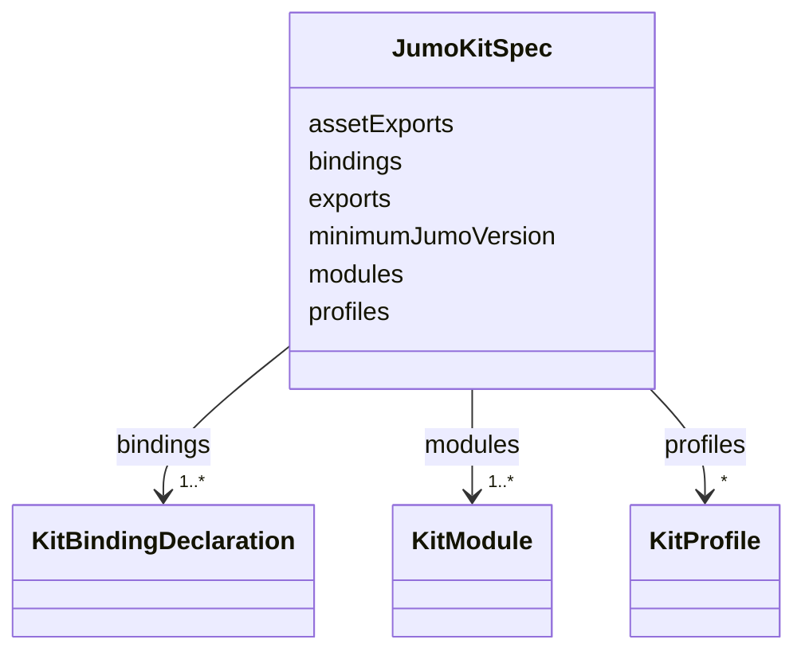

---
search:
  boost: 10.0
---

# Class: JumoKitSpec

<div data-search-exclude markdown="1">


URI: [jumo:JumoKitSpec](https://jumo.dev/schemas/jumo-v1/JumoKitSpec)





<!-- no inheritance hierarchy -->

## Slots

| Name | Cardinality and Range | Description | Inheritance |
| ---  | --- | --- | --- |
| [minimumJumoVersion](minimumJumoVersion.md) | 1 <br/> [String](String.md) |  | direct |
| [bindings](bindings.md) | 1..* <br/> [KitBindingDeclaration](KitBindingDeclaration.md) | Open string-keyed map in the source schema, modeled as a list of key/type pai... | direct |
| [exports](exports.md) | 1..* <br/> [String](String.md) |  | direct |
| [assetExports](assetExports.md) | * <br/> [String](String.md) | Optional binary assets (images) and i18n bundles (json) the kit distributes, ... | direct |
| [profiles](profiles.md) | * <br/> [KitProfile](KitProfile.md) |  | direct |
| [modules](modules.md) | 1..* <br/> [KitModule](KitModule.md) |  | direct |


## Usages

| used by | used in | type | used |
| ---  | --- | --- | --- |
| [JumoKit](JumoKit.md) | [spec](spec.md) | range | [JumoKitSpec](JumoKitSpec.md) |


## Identifier and Mapping Information


### Annotations

| property | value |
| --- | --- |
| jumo.state_authority | GIT |
| jumo.model_role | VALUE_OBJECT |
| jumo.audience | REALM_PRIVATE |
| jumo.sensitivity | INTERNAL |
| jumo.boundary_eligible | True |
| jumo.schema_profiles | draft-2020-12,native-json-schema,prompted-json-validated |


### Schema Source


* from schema: https://jumo.dev/schemas/jumo-v1


## Mappings

| Mapping Type | Mapped Value |
| ---  | ---  |
| self | jumo:JumoKitSpec |
| native | jumo:JumoKitSpec |


## LinkML Source

<!-- TODO: investigate https://stackoverflow.com/questions/37606292/how-to-create-tabbed-code-blocks-in-mkdocs-or-sphinx -->

### Direct

<details>
```yaml
name: JumoKitSpec
annotations:
  jumo.state_authority:
    tag: jumo.state_authority
    value: GIT
  jumo.model_role:
    tag: jumo.model_role
    value: VALUE_OBJECT
  jumo.audience:
    tag: jumo.audience
    value: REALM_PRIVATE
  jumo.sensitivity:
    tag: jumo.sensitivity
    value: INTERNAL
  jumo.boundary_eligible:
    tag: jumo.boundary_eligible
    value: true
  jumo.schema_profiles:
    tag: jumo.schema_profiles
    value: draft-2020-12,native-json-schema,prompted-json-validated
from_schema: https://jumo.dev/schemas/jumo-v1
attributes:
  minimumJumoVersion:
    name: minimumJumoVersion
    from_schema: https://jumo.dev/schemas/jumo-v1
    owner: JumoKitSpec
    domain_of:
    - ProjectCompatibility
    - JumoKitSpec
    range: string
    required: true
    pattern: ^\d+\.\d+\.\d+$
  bindings:
    name: bindings
    description: Open string-keyed map in the source schema, modeled as a list of
      key/type pairs (see ThemePack for the same pattern).
    from_schema: https://jumo.dev/schemas/jumo-v1
    rank: 1000
    owner: JumoKitSpec
    domain_of:
    - JumoKitSpec
    range: KitBindingDeclaration
    required: true
    multivalued: true
    inlined: true
    inlined_as_list: true
    minimum_cardinality: 1
  exports:
    name: exports
    from_schema: https://jumo.dev/schemas/jumo-v1
    rank: 1000
    owner: JumoKitSpec
    domain_of:
    - JumoKitSpec
    - KitProfile
    range: string
    required: true
    multivalued: true
    pattern: ^\.jumo/[A-Za-z0-9._/-]+\.yml$
    minimum_cardinality: 1
  assetExports:
    name: assetExports
    description: 'Optional binary assets (images) and i18n bundles (json) the kit
      distributes, distinct from `exports` because these are opaque content, not corpus-governed
      YAML documents -- no LinkML class validates their bytes, only their provenance
      (KitLockSpec.renderedAssets digest). Images and i18n bundles share this one
      tree rather than splitting into two export lists: both are inert content a journey
      (AssistedJourneyStep.image/heroImage) or the frontend i18n loader references
      by rendered path, never executed.'
    from_schema: https://jumo.dev/schemas/jumo-v1
    rank: 1000
    owner: JumoKitSpec
    domain_of:
    - JumoKitSpec
    range: string
    multivalued: true
    pattern: ^\.jumo/assets/[A-Za-z0-9._/-]+\.(png|jpg|jpeg|svg|webp|json)$
  profiles:
    name: profiles
    from_schema: https://jumo.dev/schemas/jumo-v1
    rank: 1000
    owner: JumoKitSpec
    domain_of:
    - JumoKitSpec
    - KitBindingSpec
    - OrganizationTemplateSpec
    range: KitProfile
    multivalued: true
    inlined: true
    inlined_as_list: true
  modules:
    name: modules
    from_schema: https://jumo.dev/schemas/jumo-v1
    rank: 1000
    owner: JumoKitSpec
    domain_of:
    - JumoKitSpec
    range: KitModule
    required: true
    multivalued: true
    inlined: true
    inlined_as_list: true

```
</details>

### Induced

<details>
```yaml
name: JumoKitSpec
annotations:
  jumo.state_authority:
    tag: jumo.state_authority
    value: GIT
  jumo.model_role:
    tag: jumo.model_role
    value: VALUE_OBJECT
  jumo.audience:
    tag: jumo.audience
    value: REALM_PRIVATE
  jumo.sensitivity:
    tag: jumo.sensitivity
    value: INTERNAL
  jumo.boundary_eligible:
    tag: jumo.boundary_eligible
    value: true
  jumo.schema_profiles:
    tag: jumo.schema_profiles
    value: draft-2020-12,native-json-schema,prompted-json-validated
from_schema: https://jumo.dev/schemas/jumo-v1
attributes:
  minimumJumoVersion:
    name: minimumJumoVersion
    from_schema: https://jumo.dev/schemas/jumo-v1
    owner: JumoKitSpec
    domain_of:
    - ProjectCompatibility
    - JumoKitSpec
    range: string
    required: true
    pattern: ^\d+\.\d+\.\d+$
  bindings:
    name: bindings
    description: Open string-keyed map in the source schema, modeled as a list of
      key/type pairs (see ThemePack for the same pattern).
    from_schema: https://jumo.dev/schemas/jumo-v1
    rank: 1000
    owner: JumoKitSpec
    domain_of:
    - JumoKitSpec
    range: KitBindingDeclaration
    required: true
    multivalued: true
    inlined: true
    inlined_as_list: true
    minimum_cardinality: 1
  exports:
    name: exports
    from_schema: https://jumo.dev/schemas/jumo-v1
    rank: 1000
    owner: JumoKitSpec
    domain_of:
    - JumoKitSpec
    - KitProfile
    range: string
    required: true
    multivalued: true
    pattern: ^\.jumo/[A-Za-z0-9._/-]+\.yml$
    minimum_cardinality: 1
  assetExports:
    name: assetExports
    description: 'Optional binary assets (images) and i18n bundles (json) the kit
      distributes, distinct from `exports` because these are opaque content, not corpus-governed
      YAML documents -- no LinkML class validates their bytes, only their provenance
      (KitLockSpec.renderedAssets digest). Images and i18n bundles share this one
      tree rather than splitting into two export lists: both are inert content a journey
      (AssistedJourneyStep.image/heroImage) or the frontend i18n loader references
      by rendered path, never executed.'
    from_schema: https://jumo.dev/schemas/jumo-v1
    rank: 1000
    owner: JumoKitSpec
    domain_of:
    - JumoKitSpec
    range: string
    multivalued: true
    pattern: ^\.jumo/assets/[A-Za-z0-9._/-]+\.(png|jpg|jpeg|svg|webp|json)$
  profiles:
    name: profiles
    from_schema: https://jumo.dev/schemas/jumo-v1
    rank: 1000
    owner: JumoKitSpec
    domain_of:
    - JumoKitSpec
    - KitBindingSpec
    - OrganizationTemplateSpec
    range: KitProfile
    multivalued: true
    inlined: true
    inlined_as_list: true
  modules:
    name: modules
    from_schema: https://jumo.dev/schemas/jumo-v1
    rank: 1000
    owner: JumoKitSpec
    domain_of:
    - JumoKitSpec
    range: KitModule
    required: true
    multivalued: true
    inlined: true
    inlined_as_list: true

```
</details></div>