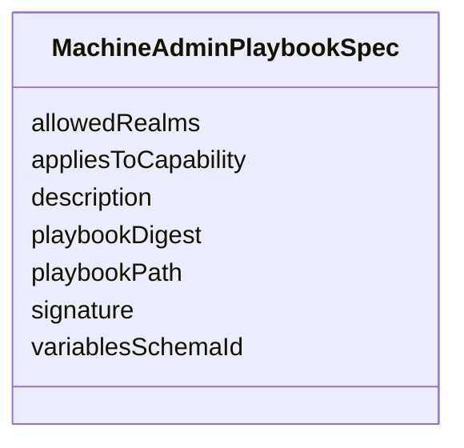

---
search:
  boost: 10.0
---

# Class: MachineAdminPlaybookSpec


_Specification of an allowlisted machine admin playbook._


<div data-search-exclude markdown="1">


URI: [jumo:MachineAdminPlaybookSpec](https://jumo.dev/schemas/jumo-v1/MachineAdminPlaybookSpec)





<!-- no inheritance hierarchy -->

## Slots

| Name | Cardinality and Range | Description | Inheritance |
| ---  | --- | --- | --- |
| [playbookPath](playbookPath.md) | 1 <br/> [String](String.md) |  | direct |
| [playbookDigest](playbookDigest.md) | 1 <br/> [String](String.md) |  | direct |
| [signature](signature.md) | 0..1 <br/> [String](String.md) |  | direct |
| [variablesSchemaId](variablesSchemaId.md) | 0..1 <br/> [String](String.md) |  | direct |
| [allowedRealms](allowedRealms.md) | * <br/> [Identifier](Identifier.md) |  | direct |
| [description](description.md) | 0..1 <br/> [String](String.md) |  | direct |
| [appliesToCapability](appliesToCapability.md) | 0..1 <br/> [CapabilityName](CapabilityName.md) | The capability this playbook implements | direct |


## Usages

| used by | used in | type | used |
| ---  | --- | --- | --- |
| [MachineAdminPlaybook](MachineAdminPlaybook.md) | [spec](spec.md) | range | [MachineAdminPlaybookSpec](MachineAdminPlaybookSpec.md) |


## Identifier and Mapping Information


### Annotations

| property | value |
| --- | --- |
| jumo.state_authority | GIT |
| jumo.model_role | VALUE_OBJECT |
| jumo.audience | MACHINE_MTLS |
| jumo.sensitivity | INTERNAL |
| jumo.boundary_eligible | True |
| jumo.schema_profiles | draft-2020-12,native-json-schema,prompted-json-validated |


### Schema Source


* from schema: https://jumo.dev/schemas/jumo-v1


## Mappings

| Mapping Type | Mapped Value |
| ---  | ---  |
| self | jumo:MachineAdminPlaybookSpec |
| native | jumo:MachineAdminPlaybookSpec |


## LinkML Source

<!-- TODO: investigate https://stackoverflow.com/questions/37606292/how-to-create-tabbed-code-blocks-in-mkdocs-or-sphinx -->

### Direct

<details>
```yaml
name: MachineAdminPlaybookSpec
annotations:
  jumo.state_authority:
    tag: jumo.state_authority
    value: GIT
  jumo.model_role:
    tag: jumo.model_role
    value: VALUE_OBJECT
  jumo.audience:
    tag: jumo.audience
    value: MACHINE_MTLS
  jumo.sensitivity:
    tag: jumo.sensitivity
    value: INTERNAL
  jumo.boundary_eligible:
    tag: jumo.boundary_eligible
    value: true
  jumo.schema_profiles:
    tag: jumo.schema_profiles
    value: draft-2020-12,native-json-schema,prompted-json-validated
description: Specification of an allowlisted machine admin playbook.
from_schema: https://jumo.dev/schemas/jumo-v1
attributes:
  playbookPath:
    name: playbookPath
    from_schema: https://jumo.dev/schemas/jumo-v1
    rank: 1000
    owner: MachineAdminPlaybookSpec
    domain_of:
    - MachineAdminPlaybookSpec
    range: string
    required: true
  playbookDigest:
    name: playbookDigest
    from_schema: https://jumo.dev/schemas/jumo-v1
    rank: 1000
    owner: MachineAdminPlaybookSpec
    domain_of:
    - MachineAdminPlaybookSpec
    - MachineAdminCommand
    range: string
    required: true
  signature:
    name: signature
    from_schema: https://jumo.dev/schemas/jumo-v1
    rank: 1000
    owner: MachineAdminPlaybookSpec
    domain_of:
    - MachineAdminPlaybookSpec
    - InvocationAuthorizationReceipt
    range: string
  variablesSchemaId:
    name: variablesSchemaId
    from_schema: https://jumo.dev/schemas/jumo-v1
    rank: 1000
    owner: MachineAdminPlaybookSpec
    domain_of:
    - MachineAdminPlaybookSpec
    range: string
  allowedRealms:
    name: allowedRealms
    from_schema: https://jumo.dev/schemas/jumo-v1
    rank: 1000
    owner: MachineAdminPlaybookSpec
    domain_of:
    - MachineAdminPlaybookSpec
    range: Identifier
    multivalued: true
  description:
    name: description
    from_schema: https://jumo.dev/schemas/jumo-v1
    owner: MachineAdminPlaybookSpec
    domain_of:
    - PromptVariable
    - AssistedJourneySpec
    - AssistedJourneyStep
    - ActionCapability
    - MachineAdminPlaybookSpec
    - ConnectorOperation
    - McpBundleOperation
    - McpToolDescriptor
    - PlannedOperation
    - ConnectorIntegrationSpec
    - ApiResponseBinding
    range: string
  appliesToCapability:
    name: appliesToCapability
    description: The capability this playbook implements. The platform resolves which
      playbook to dispatch by scanning for the one declaring the capability a ProcessStep
      names (capabilityRef), instead of naming the playbook instance by id -- a sealed
      capability name is platform vocabulary, never an instance identifier (canonical
      decision 15). At most one playbook may claim a given capability (Rego).
    from_schema: https://jumo.dev/schemas/jumo-v1
    rank: 1000
    owner: MachineAdminPlaybookSpec
    domain_of:
    - MachineAdminPlaybookSpec
    range: CapabilityName

```
</details>

### Induced

<details>
```yaml
name: MachineAdminPlaybookSpec
annotations:
  jumo.state_authority:
    tag: jumo.state_authority
    value: GIT
  jumo.model_role:
    tag: jumo.model_role
    value: VALUE_OBJECT
  jumo.audience:
    tag: jumo.audience
    value: MACHINE_MTLS
  jumo.sensitivity:
    tag: jumo.sensitivity
    value: INTERNAL
  jumo.boundary_eligible:
    tag: jumo.boundary_eligible
    value: true
  jumo.schema_profiles:
    tag: jumo.schema_profiles
    value: draft-2020-12,native-json-schema,prompted-json-validated
description: Specification of an allowlisted machine admin playbook.
from_schema: https://jumo.dev/schemas/jumo-v1
attributes:
  playbookPath:
    name: playbookPath
    from_schema: https://jumo.dev/schemas/jumo-v1
    rank: 1000
    owner: MachineAdminPlaybookSpec
    domain_of:
    - MachineAdminPlaybookSpec
    range: string
    required: true
  playbookDigest:
    name: playbookDigest
    from_schema: https://jumo.dev/schemas/jumo-v1
    rank: 1000
    owner: MachineAdminPlaybookSpec
    domain_of:
    - MachineAdminPlaybookSpec
    - MachineAdminCommand
    range: string
    required: true
  signature:
    name: signature
    from_schema: https://jumo.dev/schemas/jumo-v1
    rank: 1000
    owner: MachineAdminPlaybookSpec
    domain_of:
    - MachineAdminPlaybookSpec
    - InvocationAuthorizationReceipt
    range: string
  variablesSchemaId:
    name: variablesSchemaId
    from_schema: https://jumo.dev/schemas/jumo-v1
    rank: 1000
    owner: MachineAdminPlaybookSpec
    domain_of:
    - MachineAdminPlaybookSpec
    range: string
  allowedRealms:
    name: allowedRealms
    from_schema: https://jumo.dev/schemas/jumo-v1
    rank: 1000
    owner: MachineAdminPlaybookSpec
    domain_of:
    - MachineAdminPlaybookSpec
    range: Identifier
    multivalued: true
  description:
    name: description
    from_schema: https://jumo.dev/schemas/jumo-v1
    owner: MachineAdminPlaybookSpec
    domain_of:
    - PromptVariable
    - AssistedJourneySpec
    - AssistedJourneyStep
    - ActionCapability
    - MachineAdminPlaybookSpec
    - ConnectorOperation
    - McpBundleOperation
    - McpToolDescriptor
    - PlannedOperation
    - ConnectorIntegrationSpec
    - ApiResponseBinding
    range: string
  appliesToCapability:
    name: appliesToCapability
    description: The capability this playbook implements. The platform resolves which
      playbook to dispatch by scanning for the one declaring the capability a ProcessStep
      names (capabilityRef), instead of naming the playbook instance by id -- a sealed
      capability name is platform vocabulary, never an instance identifier (canonical
      decision 15). At most one playbook may claim a given capability (Rego).
    from_schema: https://jumo.dev/schemas/jumo-v1
    rank: 1000
    owner: MachineAdminPlaybookSpec
    domain_of:
    - MachineAdminPlaybookSpec
    range: CapabilityName

```
</details></div>