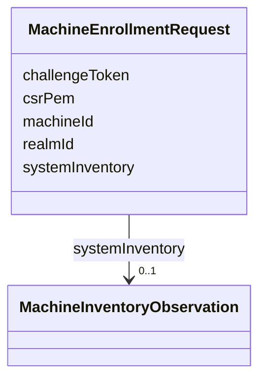

---
search:
  boost: 10.0
---

# Class: MachineEnrollmentRequest


_BYOVM one-shot machine enrollment request carrying CSR and system inventory._


<div data-search-exclude markdown="1">


URI: [jumo:MachineEnrollmentRequest](https://jumo.dev/schemas/jumo-v1/MachineEnrollmentRequest)





<!-- no inheritance hierarchy -->

## Slots

| Name | Cardinality and Range | Description | Inheritance |
| ---  | --- | --- | --- |
| [machineId](machineId.md) | 1 <br/> [Identifier](Identifier.md) |  | direct |
| [realmId](realmId.md) | 1 <br/> [Identifier](Identifier.md) |  | direct |
| [challengeToken](challengeToken.md) | 1 <br/> [String](String.md) |  | direct |
| [csrPem](csrPem.md) | 1 <br/> [String](String.md) |  | direct |
| [systemInventory](systemInventory.md) | 0..1 <br/> [MachineInventoryObservation](MachineInventoryObservation.md) |  | direct |


## Identifier and Mapping Information


### Annotations

| property | value |
| --- | --- |
| jumo.state_authority | POSTGRES |
| jumo.model_role | COMMAND |
| jumo.audience | MACHINE_MTLS |
| jumo.sensitivity | INTERNAL |
| jumo.boundary_eligible | True |
| jumo.schema_profiles | draft-2020-12,native-json-schema,prompted-json-validated |


### Schema Source


* from schema: https://jumo.dev/schemas/jumo-v1


## Mappings

| Mapping Type | Mapped Value |
| ---  | ---  |
| self | jumo:MachineEnrollmentRequest |
| native | jumo:MachineEnrollmentRequest |


## LinkML Source

<!-- TODO: investigate https://stackoverflow.com/questions/37606292/how-to-create-tabbed-code-blocks-in-mkdocs-or-sphinx -->

### Direct

<details>
```yaml
name: MachineEnrollmentRequest
annotations:
  jumo.state_authority:
    tag: jumo.state_authority
    value: POSTGRES
  jumo.model_role:
    tag: jumo.model_role
    value: COMMAND
  jumo.audience:
    tag: jumo.audience
    value: MACHINE_MTLS
  jumo.sensitivity:
    tag: jumo.sensitivity
    value: INTERNAL
  jumo.boundary_eligible:
    tag: jumo.boundary_eligible
    value: true
  jumo.schema_profiles:
    tag: jumo.schema_profiles
    value: draft-2020-12,native-json-schema,prompted-json-validated
description: BYOVM one-shot machine enrollment request carrying CSR and system inventory.
from_schema: https://jumo.dev/schemas/jumo-v1
attributes:
  machineId:
    name: machineId
    from_schema: https://jumo.dev/schemas/jumo-v1
    owner: MachineEnrollmentRequest
    domain_of:
    - MachineHealthObservation
    - MachineEnrollmentRequest
    - MachineEnrollmentChallenge
    - MachineEnrollmentResult
    - MachineAdminRequest
    - MachineAdminCommand
    - MachineAdminResult
    - WorkloadCommand
    - WorkloadCommandResult
    - MachineRuntimeInstallation
    - ExecutionCellLease
    range: Identifier
    required: true
  realmId:
    name: realmId
    from_schema: https://jumo.dev/schemas/jumo-v1
    owner: MachineEnrollmentRequest
    domain_of:
    - AttentionSource
    - MachineEnrollmentRequest
    - MachineEnrollmentChallenge
    - SessionPlan
    - ApiProblem
    - PolicyInput
    - ChangeSetProjection
    range: Identifier
    required: true
  challengeToken:
    name: challengeToken
    from_schema: https://jumo.dev/schemas/jumo-v1
    rank: 1000
    owner: MachineEnrollmentRequest
    domain_of:
    - MachineEnrollmentRequest
    range: string
    required: true
  csrPem:
    name: csrPem
    from_schema: https://jumo.dev/schemas/jumo-v1
    rank: 1000
    owner: MachineEnrollmentRequest
    domain_of:
    - MachineEnrollmentRequest
    range: string
    required: true
  systemInventory:
    name: systemInventory
    from_schema: https://jumo.dev/schemas/jumo-v1
    rank: 1000
    owner: MachineEnrollmentRequest
    domain_of:
    - MachineEnrollmentRequest
    range: MachineInventoryObservation
    inlined: true

```
</details>

### Induced

<details>
```yaml
name: MachineEnrollmentRequest
annotations:
  jumo.state_authority:
    tag: jumo.state_authority
    value: POSTGRES
  jumo.model_role:
    tag: jumo.model_role
    value: COMMAND
  jumo.audience:
    tag: jumo.audience
    value: MACHINE_MTLS
  jumo.sensitivity:
    tag: jumo.sensitivity
    value: INTERNAL
  jumo.boundary_eligible:
    tag: jumo.boundary_eligible
    value: true
  jumo.schema_profiles:
    tag: jumo.schema_profiles
    value: draft-2020-12,native-json-schema,prompted-json-validated
description: BYOVM one-shot machine enrollment request carrying CSR and system inventory.
from_schema: https://jumo.dev/schemas/jumo-v1
attributes:
  machineId:
    name: machineId
    from_schema: https://jumo.dev/schemas/jumo-v1
    owner: MachineEnrollmentRequest
    domain_of:
    - MachineHealthObservation
    - MachineEnrollmentRequest
    - MachineEnrollmentChallenge
    - MachineEnrollmentResult
    - MachineAdminRequest
    - MachineAdminCommand
    - MachineAdminResult
    - WorkloadCommand
    - WorkloadCommandResult
    - MachineRuntimeInstallation
    - ExecutionCellLease
    range: Identifier
    required: true
  realmId:
    name: realmId
    from_schema: https://jumo.dev/schemas/jumo-v1
    owner: MachineEnrollmentRequest
    domain_of:
    - AttentionSource
    - MachineEnrollmentRequest
    - MachineEnrollmentChallenge
    - SessionPlan
    - ApiProblem
    - PolicyInput
    - ChangeSetProjection
    range: Identifier
    required: true
  challengeToken:
    name: challengeToken
    from_schema: https://jumo.dev/schemas/jumo-v1
    rank: 1000
    owner: MachineEnrollmentRequest
    domain_of:
    - MachineEnrollmentRequest
    range: string
    required: true
  csrPem:
    name: csrPem
    from_schema: https://jumo.dev/schemas/jumo-v1
    rank: 1000
    owner: MachineEnrollmentRequest
    domain_of:
    - MachineEnrollmentRequest
    range: string
    required: true
  systemInventory:
    name: systemInventory
    from_schema: https://jumo.dev/schemas/jumo-v1
    rank: 1000
    owner: MachineEnrollmentRequest
    domain_of:
    - MachineEnrollmentRequest
    range: MachineInventoryObservation
    inlined: true

```
</details></div>