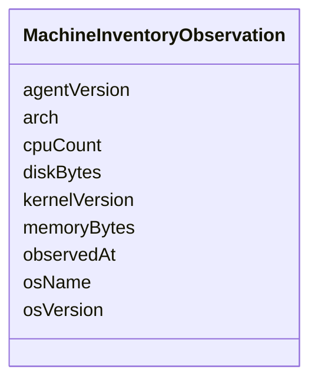

---
search:
  boost: 10.0
---

# Class: MachineInventoryObservation


_Observed hardware and OS characteristics of an enrolled machine._


<div data-search-exclude markdown="1">


URI: [jumo:MachineInventoryObservation](https://jumo.dev/schemas/jumo-v1/MachineInventoryObservation)





<!-- no inheritance hierarchy -->

## Slots

| Name | Cardinality and Range | Description | Inheritance |
| ---  | --- | --- | --- |
| [osName](osName.md) | 0..1 <br/> [String](String.md) |  | direct |
| [osVersion](osVersion.md) | 0..1 <br/> [String](String.md) |  | direct |
| [arch](arch.md) | 0..1 <br/> [String](String.md) |  | direct |
| [kernelVersion](kernelVersion.md) | 0..1 <br/> [String](String.md) |  | direct |
| [cpuCount](cpuCount.md) | 0..1 <br/> [Integer](Integer.md) |  | direct |
| [memoryBytes](memoryBytes.md) | 0..1 <br/> [Integer](Integer.md) |  | direct |
| [diskBytes](diskBytes.md) | 0..1 <br/> [Integer](Integer.md) |  | direct |
| [agentVersion](agentVersion.md) | 0..1 <br/> [String](String.md) |  | direct |
| [observedAt](observedAt.md) | 0..1 <br/> [String](String.md) |  | direct |


## Usages

| used by | used in | type | used |
| ---  | --- | --- | --- |
| [MachineEnrollmentRequest](MachineEnrollmentRequest.md) | [systemInventory](systemInventory.md) | range | [MachineInventoryObservation](MachineInventoryObservation.md) |


## Identifier and Mapping Information


### Annotations

| property | value |
| --- | --- |
| jumo.state_authority | POSTGRES |
| jumo.model_role | OBSERVATION |
| jumo.audience | MACHINE_MTLS |
| jumo.sensitivity | INTERNAL |
| jumo.boundary_eligible | True |
| jumo.schema_profiles | draft-2020-12,native-json-schema,prompted-json-validated |


### Schema Source


* from schema: https://jumo.dev/schemas/jumo-v1


## Mappings

| Mapping Type | Mapped Value |
| ---  | ---  |
| self | jumo:MachineInventoryObservation |
| native | jumo:MachineInventoryObservation |


## LinkML Source

<!-- TODO: investigate https://stackoverflow.com/questions/37606292/how-to-create-tabbed-code-blocks-in-mkdocs-or-sphinx -->

### Direct

<details>
```yaml
name: MachineInventoryObservation
annotations:
  jumo.state_authority:
    tag: jumo.state_authority
    value: POSTGRES
  jumo.model_role:
    tag: jumo.model_role
    value: OBSERVATION
  jumo.audience:
    tag: jumo.audience
    value: MACHINE_MTLS
  jumo.sensitivity:
    tag: jumo.sensitivity
    value: INTERNAL
  jumo.boundary_eligible:
    tag: jumo.boundary_eligible
    value: true
  jumo.schema_profiles:
    tag: jumo.schema_profiles
    value: draft-2020-12,native-json-schema,prompted-json-validated
description: Observed hardware and OS characteristics of an enrolled machine.
from_schema: https://jumo.dev/schemas/jumo-v1
attributes:
  osName:
    name: osName
    from_schema: https://jumo.dev/schemas/jumo-v1
    rank: 1000
    owner: MachineInventoryObservation
    domain_of:
    - MachineInventoryObservation
    range: string
  osVersion:
    name: osVersion
    from_schema: https://jumo.dev/schemas/jumo-v1
    rank: 1000
    owner: MachineInventoryObservation
    domain_of:
    - MachineInventoryObservation
    range: string
  arch:
    name: arch
    from_schema: https://jumo.dev/schemas/jumo-v1
    rank: 1000
    owner: MachineInventoryObservation
    domain_of:
    - MachineInventoryObservation
    range: string
  kernelVersion:
    name: kernelVersion
    from_schema: https://jumo.dev/schemas/jumo-v1
    rank: 1000
    owner: MachineInventoryObservation
    domain_of:
    - MachineInventoryObservation
    range: string
  cpuCount:
    name: cpuCount
    from_schema: https://jumo.dev/schemas/jumo-v1
    rank: 1000
    owner: MachineInventoryObservation
    domain_of:
    - MachineInventoryObservation
    range: integer
  memoryBytes:
    name: memoryBytes
    from_schema: https://jumo.dev/schemas/jumo-v1
    owner: MachineInventoryObservation
    domain_of:
    - MachineHostDefinitionSpec
    - MachineInventoryObservation
    range: integer
  diskBytes:
    name: diskBytes
    from_schema: https://jumo.dev/schemas/jumo-v1
    rank: 1000
    owner: MachineInventoryObservation
    domain_of:
    - MachineInventoryObservation
    range: integer
  agentVersion:
    name: agentVersion
    from_schema: https://jumo.dev/schemas/jumo-v1
    rank: 1000
    owner: MachineInventoryObservation
    domain_of:
    - MachineInventoryObservation
    range: string
  observedAt:
    name: observedAt
    from_schema: https://jumo.dev/schemas/jumo-v1
    owner: MachineInventoryObservation
    domain_of:
    - RealmEnforcement
    - MachineInventoryObservation
    - CliInstallationObservation
    - McpCatalogProvenancePin
    - McpCatalogFieldCandidate
    - RemoteMcpAppraisalSpec
    - ChangeSetProjection
    range: string

```
</details>

### Induced

<details>
```yaml
name: MachineInventoryObservation
annotations:
  jumo.state_authority:
    tag: jumo.state_authority
    value: POSTGRES
  jumo.model_role:
    tag: jumo.model_role
    value: OBSERVATION
  jumo.audience:
    tag: jumo.audience
    value: MACHINE_MTLS
  jumo.sensitivity:
    tag: jumo.sensitivity
    value: INTERNAL
  jumo.boundary_eligible:
    tag: jumo.boundary_eligible
    value: true
  jumo.schema_profiles:
    tag: jumo.schema_profiles
    value: draft-2020-12,native-json-schema,prompted-json-validated
description: Observed hardware and OS characteristics of an enrolled machine.
from_schema: https://jumo.dev/schemas/jumo-v1
attributes:
  osName:
    name: osName
    from_schema: https://jumo.dev/schemas/jumo-v1
    rank: 1000
    owner: MachineInventoryObservation
    domain_of:
    - MachineInventoryObservation
    range: string
  osVersion:
    name: osVersion
    from_schema: https://jumo.dev/schemas/jumo-v1
    rank: 1000
    owner: MachineInventoryObservation
    domain_of:
    - MachineInventoryObservation
    range: string
  arch:
    name: arch
    from_schema: https://jumo.dev/schemas/jumo-v1
    rank: 1000
    owner: MachineInventoryObservation
    domain_of:
    - MachineInventoryObservation
    range: string
  kernelVersion:
    name: kernelVersion
    from_schema: https://jumo.dev/schemas/jumo-v1
    rank: 1000
    owner: MachineInventoryObservation
    domain_of:
    - MachineInventoryObservation
    range: string
  cpuCount:
    name: cpuCount
    from_schema: https://jumo.dev/schemas/jumo-v1
    rank: 1000
    owner: MachineInventoryObservation
    domain_of:
    - MachineInventoryObservation
    range: integer
  memoryBytes:
    name: memoryBytes
    from_schema: https://jumo.dev/schemas/jumo-v1
    owner: MachineInventoryObservation
    domain_of:
    - MachineHostDefinitionSpec
    - MachineInventoryObservation
    range: integer
  diskBytes:
    name: diskBytes
    from_schema: https://jumo.dev/schemas/jumo-v1
    rank: 1000
    owner: MachineInventoryObservation
    domain_of:
    - MachineInventoryObservation
    range: integer
  agentVersion:
    name: agentVersion
    from_schema: https://jumo.dev/schemas/jumo-v1
    rank: 1000
    owner: MachineInventoryObservation
    domain_of:
    - MachineInventoryObservation
    range: string
  observedAt:
    name: observedAt
    from_schema: https://jumo.dev/schemas/jumo-v1
    owner: MachineInventoryObservation
    domain_of:
    - RealmEnforcement
    - MachineInventoryObservation
    - CliInstallationObservation
    - McpCatalogProvenancePin
    - McpCatalogFieldCandidate
    - RemoteMcpAppraisalSpec
    - ChangeSetProjection
    range: string

```
</details></div>