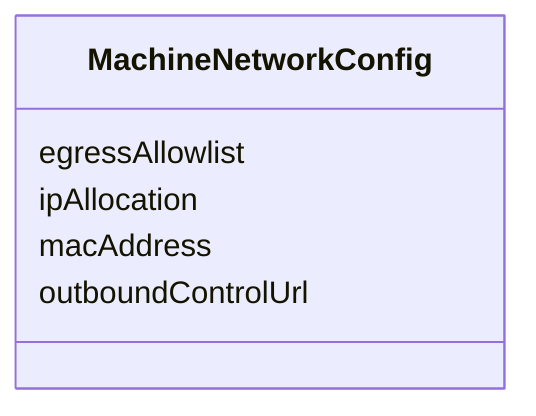

---
search:
  boost: 10.0
---

# Class: MachineNetworkConfig


_Network configuration for an ExecutionMachine._


<div data-search-exclude markdown="1">


URI: [jumo:MachineNetworkConfig](https://jumo.dev/schemas/jumo-v1/MachineNetworkConfig)





<!-- no inheritance hierarchy -->

## Slots

| Name | Cardinality and Range | Description | Inheritance |
| ---  | --- | --- | --- |
| [ipAllocation](ipAllocation.md) | 0..1 <br/> [String](String.md) |  | direct |
| [macAddress](macAddress.md) | 0..1 <br/> [String](String.md) |  | direct |
| [outboundControlUrl](outboundControlUrl.md) | 0..1 <br/> [String](String.md) |  | direct |
| [egressAllowlist](egressAllowlist.md) | * <br/> [String](String.md) |  | direct |


## Usages

| used by | used in | type | used |
| ---  | --- | --- | --- |
| [ExecutionMachineSpec](ExecutionMachineSpec.md) | [network](network.md) | range | [MachineNetworkConfig](MachineNetworkConfig.md) |


## Identifier and Mapping Information


### Annotations

| property | value |
| --- | --- |
| jumo.state_authority | GIT |
| jumo.model_role | VALUE_OBJECT |
| jumo.audience | MACHINE_MTLS |
| jumo.sensitivity | INTERNAL |
| jumo.boundary_eligible | True |
| jumo.schema_profiles | draft-2020-12,native-json-schema,prompted-json-validated |


### Schema Source


* from schema: https://jumo.dev/schemas/jumo-v1


## Mappings

| Mapping Type | Mapped Value |
| ---  | ---  |
| self | jumo:MachineNetworkConfig |
| native | jumo:MachineNetworkConfig |


## LinkML Source

<!-- TODO: investigate https://stackoverflow.com/questions/37606292/how-to-create-tabbed-code-blocks-in-mkdocs-or-sphinx -->

### Direct

<details>
```yaml
name: MachineNetworkConfig
annotations:
  jumo.state_authority:
    tag: jumo.state_authority
    value: GIT
  jumo.model_role:
    tag: jumo.model_role
    value: VALUE_OBJECT
  jumo.audience:
    tag: jumo.audience
    value: MACHINE_MTLS
  jumo.sensitivity:
    tag: jumo.sensitivity
    value: INTERNAL
  jumo.boundary_eligible:
    tag: jumo.boundary_eligible
    value: true
  jumo.schema_profiles:
    tag: jumo.schema_profiles
    value: draft-2020-12,native-json-schema,prompted-json-validated
description: Network configuration for an ExecutionMachine.
from_schema: https://jumo.dev/schemas/jumo-v1
attributes:
  ipAllocation:
    name: ipAllocation
    from_schema: https://jumo.dev/schemas/jumo-v1
    rank: 1000
    owner: MachineNetworkConfig
    domain_of:
    - MachineNetworkConfig
    range: string
  macAddress:
    name: macAddress
    from_schema: https://jumo.dev/schemas/jumo-v1
    rank: 1000
    owner: MachineNetworkConfig
    domain_of:
    - MachineNetworkConfig
    range: string
  outboundControlUrl:
    name: outboundControlUrl
    from_schema: https://jumo.dev/schemas/jumo-v1
    rank: 1000
    owner: MachineNetworkConfig
    domain_of:
    - MachineNetworkConfig
    range: string
  egressAllowlist:
    name: egressAllowlist
    from_schema: https://jumo.dev/schemas/jumo-v1
    rank: 1000
    owner: MachineNetworkConfig
    domain_of:
    - MachineNetworkConfig
    range: string
    multivalued: true

```
</details>

### Induced

<details>
```yaml
name: MachineNetworkConfig
annotations:
  jumo.state_authority:
    tag: jumo.state_authority
    value: GIT
  jumo.model_role:
    tag: jumo.model_role
    value: VALUE_OBJECT
  jumo.audience:
    tag: jumo.audience
    value: MACHINE_MTLS
  jumo.sensitivity:
    tag: jumo.sensitivity
    value: INTERNAL
  jumo.boundary_eligible:
    tag: jumo.boundary_eligible
    value: true
  jumo.schema_profiles:
    tag: jumo.schema_profiles
    value: draft-2020-12,native-json-schema,prompted-json-validated
description: Network configuration for an ExecutionMachine.
from_schema: https://jumo.dev/schemas/jumo-v1
attributes:
  ipAllocation:
    name: ipAllocation
    from_schema: https://jumo.dev/schemas/jumo-v1
    rank: 1000
    owner: MachineNetworkConfig
    domain_of:
    - MachineNetworkConfig
    range: string
  macAddress:
    name: macAddress
    from_schema: https://jumo.dev/schemas/jumo-v1
    rank: 1000
    owner: MachineNetworkConfig
    domain_of:
    - MachineNetworkConfig
    range: string
  outboundControlUrl:
    name: outboundControlUrl
    from_schema: https://jumo.dev/schemas/jumo-v1
    rank: 1000
    owner: MachineNetworkConfig
    domain_of:
    - MachineNetworkConfig
    range: string
  egressAllowlist:
    name: egressAllowlist
    from_schema: https://jumo.dev/schemas/jumo-v1
    rank: 1000
    owner: MachineNetworkConfig
    domain_of:
    - MachineNetworkConfig
    range: string
    multivalued: true

```
</details></div>