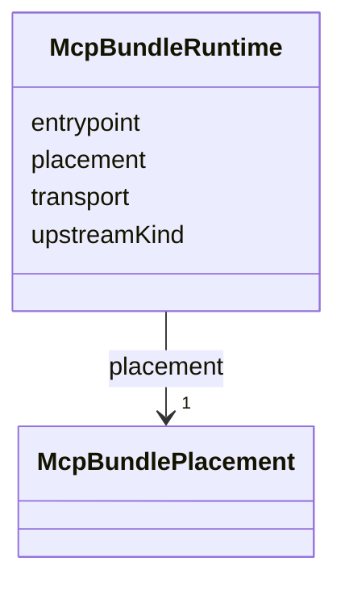

---
search:
  boost: 10.0
---

# Class: McpBundleRuntime


_An McpBundle's single upstream branch is always OCI_STDIO with a pinned artifact (McpBundleSpec.artifact); the STREAMABLE_HTTP branch has no bundle and is reached only through ConnectorDefinitionSpec.remoteMcpServiceRef and RemoteMcpServiceSpec.transport MCP_STREAMABLE_HTTP (ADR-0050 decisions 6-7)._


<div data-search-exclude markdown="1">


URI: [jumo:McpBundleRuntime](https://jumo.dev/schemas/jumo-v1/McpBundleRuntime)





<!-- no inheritance hierarchy -->

## Slots

| Name | Cardinality and Range | Description | Inheritance |
| ---  | --- | --- | --- |
| [transport](transport.md) | 1 <br/> [String](String.md) |  | direct |
| [upstreamKind](upstreamKind.md) | 0..1 <br/> [String](String.md) | Not schema-required -- the pinned jumo-core sibling source only gains this fi... | direct |
| [placement](placement.md) | 1 <br/> [McpBundlePlacement](McpBundlePlacement.md) | v2 admits only EXECUTION_CELL; CLIENT_CELL and REMOTE remain declarable at th... | direct |
| [entrypoint](entrypoint.md) | 0..1 <br/> [String](String.md) |  | direct |


## Usages

| used by | used in | type | used |
| ---  | --- | --- | --- |
| [McpBundleSpec](McpBundleSpec.md) | [runtime](runtime.md) | range | [McpBundleRuntime](McpBundleRuntime.md) |


## Identifier and Mapping Information


### Annotations

| property | value |
| --- | --- |
| jumo.state_authority | GIT |
| jumo.model_role | VALUE_OBJECT |
| jumo.audience | REALM_PRIVATE |
| jumo.sensitivity | INTERNAL |
| jumo.boundary_eligible | True |
| jumo.schema_profiles | draft-2020-12,native-json-schema,prompted-json-validated |


### Schema Source


* from schema: https://jumo.dev/schemas/jumo-v1


## Mappings

| Mapping Type | Mapped Value |
| ---  | ---  |
| self | jumo:McpBundleRuntime |
| native | jumo:McpBundleRuntime |


## LinkML Source

<!-- TODO: investigate https://stackoverflow.com/questions/37606292/how-to-create-tabbed-code-blocks-in-mkdocs-or-sphinx -->

### Direct

<details>
```yaml
name: McpBundleRuntime
annotations:
  jumo.state_authority:
    tag: jumo.state_authority
    value: GIT
  jumo.model_role:
    tag: jumo.model_role
    value: VALUE_OBJECT
  jumo.audience:
    tag: jumo.audience
    value: REALM_PRIVATE
  jumo.sensitivity:
    tag: jumo.sensitivity
    value: INTERNAL
  jumo.boundary_eligible:
    tag: jumo.boundary_eligible
    value: true
  jumo.schema_profiles:
    tag: jumo.schema_profiles
    value: draft-2020-12,native-json-schema,prompted-json-validated
description: An McpBundle's single upstream branch is always OCI_STDIO with a pinned
  artifact (McpBundleSpec.artifact); the STREAMABLE_HTTP branch has no bundle and
  is reached only through ConnectorDefinitionSpec.remoteMcpServiceRef and RemoteMcpServiceSpec.transport
  MCP_STREAMABLE_HTTP (ADR-0050 decisions 6-7).
from_schema: https://jumo.dev/schemas/jumo-v1
attributes:
  transport:
    name: transport
    from_schema: https://jumo.dev/schemas/jumo-v1
    owner: McpBundleRuntime
    domain_of:
    - ConnectorDefinitionSpec
    - McpBundleRuntime
    - RemoteMcpServiceSpec
    - ExecutionCellSpec
    - FederatedPeerSpec
    - McpServerDescriptor
    range: string
    required: true
    equals_string: MCP
  upstreamKind:
    name: upstreamKind
    description: Not schema-required -- the pinned jumo-core sibling source only gains
      this field at its own pace; enforced unconditionally in Rego instead (corpus.bundle.upstream-kind-required),
      which reads the live composed corpus rather than a stale lock.
    from_schema: https://jumo.dev/schemas/jumo-v1
    rank: 1000
    owner: McpBundleRuntime
    domain_of:
    - McpBundleRuntime
    range: string
    equals_string: OCI_STDIO
  placement:
    name: placement
    description: v2 admits only EXECUTION_CELL; CLIENT_CELL and REMOTE remain declarable
      at the schema level but are refused by corpus.bundle.execution-cell-only-placement
      (Rego, not schema) for the same reason.
    from_schema: https://jumo.dev/schemas/jumo-v1
    owner: McpBundleRuntime
    domain_of:
    - ConnectorDefinitionSpec
    - McpBundleRuntime
    - ExecutionCellSpec
    range: McpBundlePlacement
    required: true
  entrypoint:
    name: entrypoint
    from_schema: https://jumo.dev/schemas/jumo-v1
    owner: McpBundleRuntime
    domain_of:
    - KitModule
    - McpBundleRuntime
    range: string
    pattern: ^.{1,}$

```
</details>

### Induced

<details>
```yaml
name: McpBundleRuntime
annotations:
  jumo.state_authority:
    tag: jumo.state_authority
    value: GIT
  jumo.model_role:
    tag: jumo.model_role
    value: VALUE_OBJECT
  jumo.audience:
    tag: jumo.audience
    value: REALM_PRIVATE
  jumo.sensitivity:
    tag: jumo.sensitivity
    value: INTERNAL
  jumo.boundary_eligible:
    tag: jumo.boundary_eligible
    value: true
  jumo.schema_profiles:
    tag: jumo.schema_profiles
    value: draft-2020-12,native-json-schema,prompted-json-validated
description: An McpBundle's single upstream branch is always OCI_STDIO with a pinned
  artifact (McpBundleSpec.artifact); the STREAMABLE_HTTP branch has no bundle and
  is reached only through ConnectorDefinitionSpec.remoteMcpServiceRef and RemoteMcpServiceSpec.transport
  MCP_STREAMABLE_HTTP (ADR-0050 decisions 6-7).
from_schema: https://jumo.dev/schemas/jumo-v1
attributes:
  transport:
    name: transport
    from_schema: https://jumo.dev/schemas/jumo-v1
    owner: McpBundleRuntime
    domain_of:
    - ConnectorDefinitionSpec
    - McpBundleRuntime
    - RemoteMcpServiceSpec
    - ExecutionCellSpec
    - FederatedPeerSpec
    - McpServerDescriptor
    range: string
    required: true
    equals_string: MCP
  upstreamKind:
    name: upstreamKind
    description: Not schema-required -- the pinned jumo-core sibling source only gains
      this field at its own pace; enforced unconditionally in Rego instead (corpus.bundle.upstream-kind-required),
      which reads the live composed corpus rather than a stale lock.
    from_schema: https://jumo.dev/schemas/jumo-v1
    rank: 1000
    owner: McpBundleRuntime
    domain_of:
    - McpBundleRuntime
    range: string
    equals_string: OCI_STDIO
  placement:
    name: placement
    description: v2 admits only EXECUTION_CELL; CLIENT_CELL and REMOTE remain declarable
      at the schema level but are refused by corpus.bundle.execution-cell-only-placement
      (Rego, not schema) for the same reason.
    from_schema: https://jumo.dev/schemas/jumo-v1
    owner: McpBundleRuntime
    domain_of:
    - ConnectorDefinitionSpec
    - McpBundleRuntime
    - ExecutionCellSpec
    range: McpBundlePlacement
    required: true
  entrypoint:
    name: entrypoint
    from_schema: https://jumo.dev/schemas/jumo-v1
    owner: McpBundleRuntime
    domain_of:
    - KitModule
    - McpBundleRuntime
    range: string
    pattern: ^.{1,}$

```
</details></div>