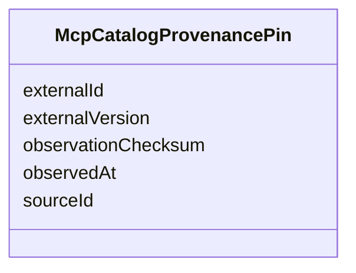

---
search:
  boost: 10.0
---

# Class: McpCatalogProvenancePin


_Immutable source observation pin carried into generated connector material; it is evidence, never authority._


<div data-search-exclude markdown="1">


URI: [jumo:McpCatalogProvenancePin](https://jumo.dev/schemas/jumo-v1/McpCatalogProvenancePin)





<!-- no inheritance hierarchy -->

## Slots

| Name | Cardinality and Range | Description | Inheritance |
| ---  | --- | --- | --- |
| [sourceId](sourceId.md) | 1 <br/> [Identifier](Identifier.md) |  | direct |
| [externalId](externalId.md) | 1 <br/> [String](String.md) |  | direct |
| [externalVersion](externalVersion.md) | 0..1 <br/> [String](String.md) |  | direct |
| [observationChecksum](observationChecksum.md) | 1 <br/> [String](String.md) |  | direct |
| [observedAt](observedAt.md) | 1 <br/> [Datetime](Datetime.md) |  | direct |


## Usages

| used by | used in | type | used |
| ---  | --- | --- | --- |
| [ConnectorPackageSpec](ConnectorPackageSpec.md) | [provenancePins](provenancePins.md) | range | [McpCatalogProvenancePin](McpCatalogProvenancePin.md) |


## Identifier and Mapping Information


### Annotations

| property | value |
| --- | --- |
| jumo.state_authority | GIT |
| jumo.model_role | VALUE_OBJECT |
| jumo.audience | REALM_PRIVATE |
| jumo.sensitivity | INTERNAL |
| jumo.boundary_eligible | True |
| jumo.schema_profiles | draft-2020-12,native-json-schema,prompted-json-validated |


### Schema Source


* from schema: https://jumo.dev/schemas/jumo-v1


## Mappings

| Mapping Type | Mapped Value |
| ---  | ---  |
| self | jumo:McpCatalogProvenancePin |
| native | jumo:McpCatalogProvenancePin |


## LinkML Source

<!-- TODO: investigate https://stackoverflow.com/questions/37606292/how-to-create-tabbed-code-blocks-in-mkdocs-or-sphinx -->

### Direct

<details>
```yaml
name: McpCatalogProvenancePin
annotations:
  jumo.state_authority:
    tag: jumo.state_authority
    value: GIT
  jumo.model_role:
    tag: jumo.model_role
    value: VALUE_OBJECT
  jumo.audience:
    tag: jumo.audience
    value: REALM_PRIVATE
  jumo.sensitivity:
    tag: jumo.sensitivity
    value: INTERNAL
  jumo.boundary_eligible:
    tag: jumo.boundary_eligible
    value: true
  jumo.schema_profiles:
    tag: jumo.schema_profiles
    value: draft-2020-12,native-json-schema,prompted-json-validated
description: Immutable source observation pin carried into generated connector material;
  it is evidence, never authority.
from_schema: https://jumo.dev/schemas/jumo-v1
attributes:
  sourceId:
    name: sourceId
    from_schema: https://jumo.dev/schemas/jumo-v1
    rank: 1000
    owner: McpCatalogProvenancePin
    domain_of:
    - McpCatalogProvenancePin
    - McpCatalogIdentity
    - McpCatalogFieldCandidate
    - McpRegistrySyncStatus
    range: Identifier
    required: true
  externalId:
    name: externalId
    from_schema: https://jumo.dev/schemas/jumo-v1
    rank: 1000
    owner: McpCatalogProvenancePin
    domain_of:
    - McpCatalogProvenancePin
    - ChangeSetProjection
    range: string
    required: true
  externalVersion:
    name: externalVersion
    from_schema: https://jumo.dev/schemas/jumo-v1
    rank: 1000
    owner: McpCatalogProvenancePin
    domain_of:
    - McpCatalogProvenancePin
    range: string
  observationChecksum:
    name: observationChecksum
    from_schema: https://jumo.dev/schemas/jumo-v1
    rank: 1000
    owner: McpCatalogProvenancePin
    domain_of:
    - McpCatalogProvenancePin
    - McpCatalogVersion
    - McpCatalogFieldCandidate
    range: string
    required: true
    pattern: ^sha256:[0-9a-f]{64}$
  observedAt:
    name: observedAt
    from_schema: https://jumo.dev/schemas/jumo-v1
    owner: McpCatalogProvenancePin
    domain_of:
    - RealmEnforcement
    - MachineInventoryObservation
    - CliInstallationObservation
    - McpCatalogProvenancePin
    - McpCatalogFieldCandidate
    - RemoteMcpAppraisalSpec
    - ChangeSetProjection
    range: datetime
    required: true

```
</details>

### Induced

<details>
```yaml
name: McpCatalogProvenancePin
annotations:
  jumo.state_authority:
    tag: jumo.state_authority
    value: GIT
  jumo.model_role:
    tag: jumo.model_role
    value: VALUE_OBJECT
  jumo.audience:
    tag: jumo.audience
    value: REALM_PRIVATE
  jumo.sensitivity:
    tag: jumo.sensitivity
    value: INTERNAL
  jumo.boundary_eligible:
    tag: jumo.boundary_eligible
    value: true
  jumo.schema_profiles:
    tag: jumo.schema_profiles
    value: draft-2020-12,native-json-schema,prompted-json-validated
description: Immutable source observation pin carried into generated connector material;
  it is evidence, never authority.
from_schema: https://jumo.dev/schemas/jumo-v1
attributes:
  sourceId:
    name: sourceId
    from_schema: https://jumo.dev/schemas/jumo-v1
    rank: 1000
    owner: McpCatalogProvenancePin
    domain_of:
    - McpCatalogProvenancePin
    - McpCatalogIdentity
    - McpCatalogFieldCandidate
    - McpRegistrySyncStatus
    range: Identifier
    required: true
  externalId:
    name: externalId
    from_schema: https://jumo.dev/schemas/jumo-v1
    rank: 1000
    owner: McpCatalogProvenancePin
    domain_of:
    - McpCatalogProvenancePin
    - ChangeSetProjection
    range: string
    required: true
  externalVersion:
    name: externalVersion
    from_schema: https://jumo.dev/schemas/jumo-v1
    rank: 1000
    owner: McpCatalogProvenancePin
    domain_of:
    - McpCatalogProvenancePin
    range: string
  observationChecksum:
    name: observationChecksum
    from_schema: https://jumo.dev/schemas/jumo-v1
    rank: 1000
    owner: McpCatalogProvenancePin
    domain_of:
    - McpCatalogProvenancePin
    - McpCatalogVersion
    - McpCatalogFieldCandidate
    range: string
    required: true
    pattern: ^sha256:[0-9a-f]{64}$
  observedAt:
    name: observedAt
    from_schema: https://jumo.dev/schemas/jumo-v1
    owner: McpCatalogProvenancePin
    domain_of:
    - RealmEnforcement
    - MachineInventoryObservation
    - CliInstallationObservation
    - McpCatalogProvenancePin
    - McpCatalogFieldCandidate
    - RemoteMcpAppraisalSpec
    - ChangeSetProjection
    range: datetime
    required: true

```
</details></div>