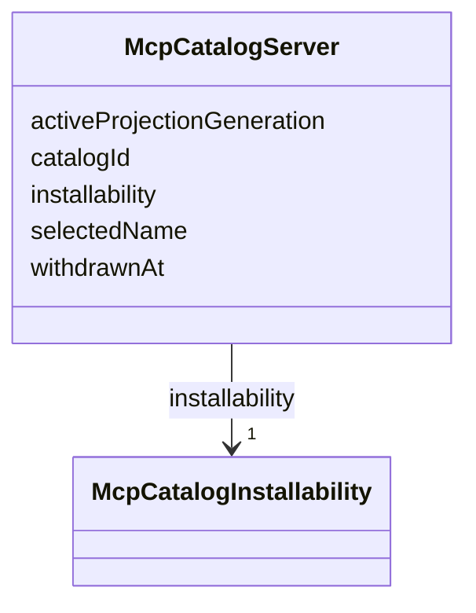

---
search:
  boost: 10.0
---

# Class: McpCatalogServer


_Recognized PostgreSQL projection of sourced catalog observations. Catalog state never grants a Realm capability._


<div data-search-exclude markdown="1">


URI: [jumo:McpCatalogServer](https://jumo.dev/schemas/jumo-v1/McpCatalogServer)





<!-- no inheritance hierarchy -->

## Slots

| Name | Cardinality and Range | Description | Inheritance |
| ---  | --- | --- | --- |
| [catalogId](catalogId.md) | 1 <br/> [Identifier](Identifier.md) |  | direct |
| [activeProjectionGeneration](activeProjectionGeneration.md) | 1 <br/> [Identifier](Identifier.md) |  | direct |
| [selectedName](selectedName.md) | 0..1 <br/> [String](String.md) |  | direct |
| [installability](installability.md) | 1 <br/> [McpCatalogInstallability](McpCatalogInstallability.md) |  | direct |
| [withdrawnAt](withdrawnAt.md) | 0..1 <br/> [Datetime](Datetime.md) |  | direct |


## Identifier and Mapping Information


### Annotations

| property | value |
| --- | --- |
| jumo.state_authority | POSTGRES |
| jumo.model_role | PROJECTION |
| jumo.audience | REALM_PRIVATE |
| jumo.sensitivity | INTERNAL |
| jumo.boundary_eligible | True |
| jumo.schema_profiles | draft-2020-12,native-json-schema,prompted-json-validated |


### Schema Source


* from schema: https://jumo.dev/schemas/jumo-v1


## Mappings

| Mapping Type | Mapped Value |
| ---  | ---  |
| self | jumo:McpCatalogServer |
| native | jumo:McpCatalogServer |


## LinkML Source

<!-- TODO: investigate https://stackoverflow.com/questions/37606292/how-to-create-tabbed-code-blocks-in-mkdocs-or-sphinx -->

### Direct

<details>
```yaml
name: McpCatalogServer
annotations:
  jumo.state_authority:
    tag: jumo.state_authority
    value: POSTGRES
  jumo.model_role:
    tag: jumo.model_role
    value: PROJECTION
  jumo.audience:
    tag: jumo.audience
    value: REALM_PRIVATE
  jumo.sensitivity:
    tag: jumo.sensitivity
    value: INTERNAL
  jumo.boundary_eligible:
    tag: jumo.boundary_eligible
    value: true
  jumo.schema_profiles:
    tag: jumo.schema_profiles
    value: draft-2020-12,native-json-schema,prompted-json-validated
description: Recognized PostgreSQL projection of sourced catalog observations. Catalog
  state never grants a Realm capability.
from_schema: https://jumo.dev/schemas/jumo-v1
attributes:
  catalogId:
    name: catalogId
    from_schema: https://jumo.dev/schemas/jumo-v1
    rank: 1000
    owner: McpCatalogServer
    domain_of:
    - McpCatalogServer
    - McpCatalogVersion
    - McpCatalogIdentity
    - McpCatalogAssessment
    - McpCatalogFieldCandidate
    - McpCatalogFieldSelection
    range: Identifier
    required: true
  activeProjectionGeneration:
    name: activeProjectionGeneration
    from_schema: https://jumo.dev/schemas/jumo-v1
    rank: 1000
    owner: McpCatalogServer
    domain_of:
    - McpCatalogServer
    - McpRegistrySyncStatus
    range: Identifier
    required: true
  selectedName:
    name: selectedName
    from_schema: https://jumo.dev/schemas/jumo-v1
    rank: 1000
    owner: McpCatalogServer
    domain_of:
    - McpCatalogServer
    range: string
  installability:
    name: installability
    from_schema: https://jumo.dev/schemas/jumo-v1
    rank: 1000
    owner: McpCatalogServer
    domain_of:
    - McpCatalogServer
    - McpCatalogVersion
    range: McpCatalogInstallability
    required: true
  withdrawnAt:
    name: withdrawnAt
    from_schema: https://jumo.dev/schemas/jumo-v1
    rank: 1000
    owner: McpCatalogServer
    domain_of:
    - McpCatalogServer
    range: datetime

```
</details>

### Induced

<details>
```yaml
name: McpCatalogServer
annotations:
  jumo.state_authority:
    tag: jumo.state_authority
    value: POSTGRES
  jumo.model_role:
    tag: jumo.model_role
    value: PROJECTION
  jumo.audience:
    tag: jumo.audience
    value: REALM_PRIVATE
  jumo.sensitivity:
    tag: jumo.sensitivity
    value: INTERNAL
  jumo.boundary_eligible:
    tag: jumo.boundary_eligible
    value: true
  jumo.schema_profiles:
    tag: jumo.schema_profiles
    value: draft-2020-12,native-json-schema,prompted-json-validated
description: Recognized PostgreSQL projection of sourced catalog observations. Catalog
  state never grants a Realm capability.
from_schema: https://jumo.dev/schemas/jumo-v1
attributes:
  catalogId:
    name: catalogId
    from_schema: https://jumo.dev/schemas/jumo-v1
    rank: 1000
    owner: McpCatalogServer
    domain_of:
    - McpCatalogServer
    - McpCatalogVersion
    - McpCatalogIdentity
    - McpCatalogAssessment
    - McpCatalogFieldCandidate
    - McpCatalogFieldSelection
    range: Identifier
    required: true
  activeProjectionGeneration:
    name: activeProjectionGeneration
    from_schema: https://jumo.dev/schemas/jumo-v1
    rank: 1000
    owner: McpCatalogServer
    domain_of:
    - McpCatalogServer
    - McpRegistrySyncStatus
    range: Identifier
    required: true
  selectedName:
    name: selectedName
    from_schema: https://jumo.dev/schemas/jumo-v1
    rank: 1000
    owner: McpCatalogServer
    domain_of:
    - McpCatalogServer
    range: string
  installability:
    name: installability
    from_schema: https://jumo.dev/schemas/jumo-v1
    rank: 1000
    owner: McpCatalogServer
    domain_of:
    - McpCatalogServer
    - McpCatalogVersion
    range: McpCatalogInstallability
    required: true
  withdrawnAt:
    name: withdrawnAt
    from_schema: https://jumo.dev/schemas/jumo-v1
    rank: 1000
    owner: McpCatalogServer
    domain_of:
    - McpCatalogServer
    range: datetime

```
</details></div>