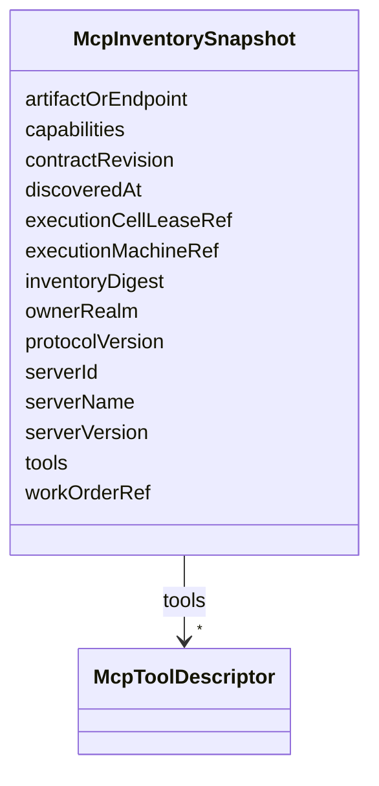

---
search:
  boost: 10.0
---

# Class: McpInventorySnapshot


_PostgreSQL event recording an MCP inventory discovered under an exact Realm lease; it is not a Git contract._


<div data-search-exclude markdown="1">


URI: [jumo:McpInventorySnapshot](https://jumo.dev/schemas/jumo-v1/McpInventorySnapshot)





<!-- no inheritance hierarchy -->

## Slots

| Name | Cardinality and Range | Description | Inheritance |
| ---  | --- | --- | --- |
| [serverId](serverId.md) | 1 <br/> [String](String.md) |  | direct |
| [ownerRealm](ownerRealm.md) | 0..1 <br/> [Identifier](Identifier.md) |  | direct |
| [workOrderRef](workOrderRef.md) | 0..1 <br/> [Identifier](Identifier.md) |  | direct |
| [executionCellLeaseRef](executionCellLeaseRef.md) | 0..1 <br/> [Identifier](Identifier.md) |  | direct |
| [executionMachineRef](executionMachineRef.md) | 0..1 <br/> [Identifier](Identifier.md) |  | direct |
| [contractRevision](contractRevision.md) | 0..1 <br/> [String](String.md) |  | direct |
| [artifactOrEndpoint](artifactOrEndpoint.md) | 0..1 <br/> [String](String.md) |  | direct |
| [serverName](serverName.md) | 0..1 <br/> [String](String.md) |  | direct |
| [serverVersion](serverVersion.md) | 0..1 <br/> [String](String.md) |  | direct |
| [protocolVersion](protocolVersion.md) | 0..1 <br/> [String](String.md) |  | direct |
| [capabilities](capabilities.md) | * <br/> [String](String.md) |  | direct |
| [tools](tools.md) | * <br/> [McpToolDescriptor](McpToolDescriptor.md) |  | direct |
| [inventoryDigest](inventoryDigest.md) | 1 <br/> [String](String.md) |  | direct |
| [discoveredAt](discoveredAt.md) | 1 <br/> [String](String.md) |  | direct |


## Identifier and Mapping Information


### Annotations

| property | value |
| --- | --- |
| jumo.state_authority | POSTGRES |
| jumo.model_role | EVENT |
| jumo.audience | REALM_PRIVATE |
| jumo.sensitivity | INTERNAL |
| jumo.boundary_eligible | True |
| jumo.schema_profiles | draft-2020-12,native-json-schema,prompted-json-validated |


### Schema Source


* from schema: https://jumo.dev/schemas/jumo-v1


## Mappings

| Mapping Type | Mapped Value |
| ---  | ---  |
| self | jumo:McpInventorySnapshot |
| native | jumo:McpInventorySnapshot |


## LinkML Source

<!-- TODO: investigate https://stackoverflow.com/questions/37606292/how-to-create-tabbed-code-blocks-in-mkdocs-or-sphinx -->

### Direct

<details>
```yaml
name: McpInventorySnapshot
annotations:
  jumo.state_authority:
    tag: jumo.state_authority
    value: POSTGRES
  jumo.model_role:
    tag: jumo.model_role
    value: EVENT
  jumo.audience:
    tag: jumo.audience
    value: REALM_PRIVATE
  jumo.sensitivity:
    tag: jumo.sensitivity
    value: INTERNAL
  jumo.boundary_eligible:
    tag: jumo.boundary_eligible
    value: true
  jumo.schema_profiles:
    tag: jumo.schema_profiles
    value: draft-2020-12,native-json-schema,prompted-json-validated
description: PostgreSQL event recording an MCP inventory discovered under an exact
  Realm lease; it is not a Git contract.
from_schema: https://jumo.dev/schemas/jumo-v1
attributes:
  serverId:
    name: serverId
    from_schema: https://jumo.dev/schemas/jumo-v1
    rank: 1000
    owner: McpInventorySnapshot
    domain_of:
    - McpInventorySnapshot
    range: string
    required: true
  ownerRealm:
    name: ownerRealm
    from_schema: https://jumo.dev/schemas/jumo-v1
    owner: McpInventorySnapshot
    domain_of:
    - PrincipalSpec
    - PrincipalIdentityBindingSpec
    - ProjectSpec
    - KitBindingSpec
    - KitLockSpec
    - RoleDefinitionSpec
    - RoleAssignmentSpec
    - TeamSpecBody
    - CoordinationProfileSpec
    - RoutingEligibilitySpec
    - RoleLifecyclePolicySpec
    - OrganizationTemplateSpec
    - ChiefOfStaffProfileSpec
    - AdvisorProfileSpec
    - PersonalSpaceSpec
    - OrganizationSpecBody
    - RealmPublicationSpec
    - CapabilityProfileSpec
    - WorkerRequirementProfileSpec
    - GoldenTaskSetSpec
    - ImprovementLoopSpec
    - ControlCatalogSpec
    - ComplianceProfileSpec
    - EvidenceProfileSpec
    - ProcessSpecBody
    - ChangeProposalRef
    - ForgeProjectionRef
    - ProcessRunRef
    - ApprovalSignal
    - ExecutionCellProvisioningRef
    - ExecutionMachineSpec
    - MachineHostDefinitionSpec
    - McpRegistrySourceBindingSpec
    - ConnectorDefinitionSpec
    - ConnectorAppraisalSpec
    - McpBundleSpec
    - RemoteMcpServiceSpec
    - RemoteMcpAppraisalSpec
    - ExecutionCellSpec
    - ProviderSessionBinding
    - RoutingDecision
    - WorkerInvocation
    - EvidenceRecord
    - InvocationAuthorizationReceipt
    - SecretBindingSpec
    - FederatedPeerSpec
    - FederationProfileSpec
    - WorkerSubstrateSpec
    - McpInventorySnapshot
    - ConnectorIntegrationSpec
    - OAuthClientBindingSpec
    - InterfaceSurfaceSpec
    - VocabularySetSpec
    - ProjectionSpecBody
    range: Identifier
  workOrderRef:
    name: workOrderRef
    from_schema: https://jumo.dev/schemas/jumo-v1
    owner: McpInventorySnapshot
    domain_of:
    - McpRegistrySourceSpec
    - McpRegistrySourceBindingSpec
    - McpInventorySnapshot
    range: Identifier
  executionCellLeaseRef:
    name: executionCellLeaseRef
    from_schema: https://jumo.dev/schemas/jumo-v1
    owner: McpInventorySnapshot
    domain_of:
    - InvocationAuthorizationReceipt
    - McpInventorySnapshot
    range: Identifier
  executionMachineRef:
    name: executionMachineRef
    from_schema: https://jumo.dev/schemas/jumo-v1
    owner: McpInventorySnapshot
    domain_of:
    - McpRegistrySourceBindingSpec
    - ProviderSessionBinding
    - WorkerSubstrateSpec
    - McpInventorySnapshot
    range: Identifier
  contractRevision:
    name: contractRevision
    from_schema: https://jumo.dev/schemas/jumo-v1
    owner: McpInventorySnapshot
    domain_of:
    - WorkOrderSpec
    - MachineAdminCommand
    - WorkloadCommand
    - McpInventorySnapshot
    range: string
  artifactOrEndpoint:
    name: artifactOrEndpoint
    from_schema: https://jumo.dev/schemas/jumo-v1
    rank: 1000
    owner: McpInventorySnapshot
    domain_of:
    - McpInventorySnapshot
    range: string
  serverName:
    name: serverName
    from_schema: https://jumo.dev/schemas/jumo-v1
    rank: 1000
    owner: McpInventorySnapshot
    domain_of:
    - McpInventorySnapshot
    range: string
  serverVersion:
    name: serverVersion
    from_schema: https://jumo.dev/schemas/jumo-v1
    rank: 1000
    owner: McpInventorySnapshot
    domain_of:
    - McpInventorySnapshot
    range: string
  protocolVersion:
    name: protocolVersion
    from_schema: https://jumo.dev/schemas/jumo-v1
    owner: McpInventorySnapshot
    domain_of:
    - AgentCard
    - McpProtocolProfile
    - McpInventorySnapshot
    range: string
  capabilities:
    name: capabilities
    from_schema: https://jumo.dev/schemas/jumo-v1
    owner: McpInventorySnapshot
    domain_of:
    - ActionCapabilitySetSpec
    - McpProtocolProfile
    - McpInventorySnapshot
    range: string
    multivalued: true
  tools:
    name: tools
    from_schema: https://jumo.dev/schemas/jumo-v1
    rank: 1000
    owner: McpInventorySnapshot
    domain_of:
    - McpInventorySnapshot
    range: McpToolDescriptor
    multivalued: true
    inlined: true
  inventoryDigest:
    name: inventoryDigest
    from_schema: https://jumo.dev/schemas/jumo-v1
    owner: McpInventorySnapshot
    domain_of:
    - RemoteMcpAppraisalSpec
    - McpInventorySnapshot
    - ConnectorActivationDecision
    range: string
    required: true
  discoveredAt:
    name: discoveredAt
    from_schema: https://jumo.dev/schemas/jumo-v1
    rank: 1000
    owner: McpInventorySnapshot
    domain_of:
    - McpInventorySnapshot
    range: string
    required: true

```
</details>

### Induced

<details>
```yaml
name: McpInventorySnapshot
annotations:
  jumo.state_authority:
    tag: jumo.state_authority
    value: POSTGRES
  jumo.model_role:
    tag: jumo.model_role
    value: EVENT
  jumo.audience:
    tag: jumo.audience
    value: REALM_PRIVATE
  jumo.sensitivity:
    tag: jumo.sensitivity
    value: INTERNAL
  jumo.boundary_eligible:
    tag: jumo.boundary_eligible
    value: true
  jumo.schema_profiles:
    tag: jumo.schema_profiles
    value: draft-2020-12,native-json-schema,prompted-json-validated
description: PostgreSQL event recording an MCP inventory discovered under an exact
  Realm lease; it is not a Git contract.
from_schema: https://jumo.dev/schemas/jumo-v1
attributes:
  serverId:
    name: serverId
    from_schema: https://jumo.dev/schemas/jumo-v1
    rank: 1000
    owner: McpInventorySnapshot
    domain_of:
    - McpInventorySnapshot
    range: string
    required: true
  ownerRealm:
    name: ownerRealm
    from_schema: https://jumo.dev/schemas/jumo-v1
    owner: McpInventorySnapshot
    domain_of:
    - PrincipalSpec
    - PrincipalIdentityBindingSpec
    - ProjectSpec
    - KitBindingSpec
    - KitLockSpec
    - RoleDefinitionSpec
    - RoleAssignmentSpec
    - TeamSpecBody
    - CoordinationProfileSpec
    - RoutingEligibilitySpec
    - RoleLifecyclePolicySpec
    - OrganizationTemplateSpec
    - ChiefOfStaffProfileSpec
    - AdvisorProfileSpec
    - PersonalSpaceSpec
    - OrganizationSpecBody
    - RealmPublicationSpec
    - CapabilityProfileSpec
    - WorkerRequirementProfileSpec
    - GoldenTaskSetSpec
    - ImprovementLoopSpec
    - ControlCatalogSpec
    - ComplianceProfileSpec
    - EvidenceProfileSpec
    - ProcessSpecBody
    - ChangeProposalRef
    - ForgeProjectionRef
    - ProcessRunRef
    - ApprovalSignal
    - ExecutionCellProvisioningRef
    - ExecutionMachineSpec
    - MachineHostDefinitionSpec
    - McpRegistrySourceBindingSpec
    - ConnectorDefinitionSpec
    - ConnectorAppraisalSpec
    - McpBundleSpec
    - RemoteMcpServiceSpec
    - RemoteMcpAppraisalSpec
    - ExecutionCellSpec
    - ProviderSessionBinding
    - RoutingDecision
    - WorkerInvocation
    - EvidenceRecord
    - InvocationAuthorizationReceipt
    - SecretBindingSpec
    - FederatedPeerSpec
    - FederationProfileSpec
    - WorkerSubstrateSpec
    - McpInventorySnapshot
    - ConnectorIntegrationSpec
    - OAuthClientBindingSpec
    - InterfaceSurfaceSpec
    - VocabularySetSpec
    - ProjectionSpecBody
    range: Identifier
  workOrderRef:
    name: workOrderRef
    from_schema: https://jumo.dev/schemas/jumo-v1
    owner: McpInventorySnapshot
    domain_of:
    - McpRegistrySourceSpec
    - McpRegistrySourceBindingSpec
    - McpInventorySnapshot
    range: Identifier
  executionCellLeaseRef:
    name: executionCellLeaseRef
    from_schema: https://jumo.dev/schemas/jumo-v1
    owner: McpInventorySnapshot
    domain_of:
    - InvocationAuthorizationReceipt
    - McpInventorySnapshot
    range: Identifier
  executionMachineRef:
    name: executionMachineRef
    from_schema: https://jumo.dev/schemas/jumo-v1
    owner: McpInventorySnapshot
    domain_of:
    - McpRegistrySourceBindingSpec
    - ProviderSessionBinding
    - WorkerSubstrateSpec
    - McpInventorySnapshot
    range: Identifier
  contractRevision:
    name: contractRevision
    from_schema: https://jumo.dev/schemas/jumo-v1
    owner: McpInventorySnapshot
    domain_of:
    - WorkOrderSpec
    - MachineAdminCommand
    - WorkloadCommand
    - McpInventorySnapshot
    range: string
  artifactOrEndpoint:
    name: artifactOrEndpoint
    from_schema: https://jumo.dev/schemas/jumo-v1
    rank: 1000
    owner: McpInventorySnapshot
    domain_of:
    - McpInventorySnapshot
    range: string
  serverName:
    name: serverName
    from_schema: https://jumo.dev/schemas/jumo-v1
    rank: 1000
    owner: McpInventorySnapshot
    domain_of:
    - McpInventorySnapshot
    range: string
  serverVersion:
    name: serverVersion
    from_schema: https://jumo.dev/schemas/jumo-v1
    rank: 1000
    owner: McpInventorySnapshot
    domain_of:
    - McpInventorySnapshot
    range: string
  protocolVersion:
    name: protocolVersion
    from_schema: https://jumo.dev/schemas/jumo-v1
    owner: McpInventorySnapshot
    domain_of:
    - AgentCard
    - McpProtocolProfile
    - McpInventorySnapshot
    range: string
  capabilities:
    name: capabilities
    from_schema: https://jumo.dev/schemas/jumo-v1
    owner: McpInventorySnapshot
    domain_of:
    - ActionCapabilitySetSpec
    - McpProtocolProfile
    - McpInventorySnapshot
    range: string
    multivalued: true
  tools:
    name: tools
    from_schema: https://jumo.dev/schemas/jumo-v1
    rank: 1000
    owner: McpInventorySnapshot
    domain_of:
    - McpInventorySnapshot
    range: McpToolDescriptor
    multivalued: true
    inlined: true
  inventoryDigest:
    name: inventoryDigest
    from_schema: https://jumo.dev/schemas/jumo-v1
    owner: McpInventorySnapshot
    domain_of:
    - RemoteMcpAppraisalSpec
    - McpInventorySnapshot
    - ConnectorActivationDecision
    range: string
    required: true
  discoveredAt:
    name: discoveredAt
    from_schema: https://jumo.dev/schemas/jumo-v1
    rank: 1000
    owner: McpInventorySnapshot
    domain_of:
    - McpInventorySnapshot
    range: string
    required: true

```
</details></div>