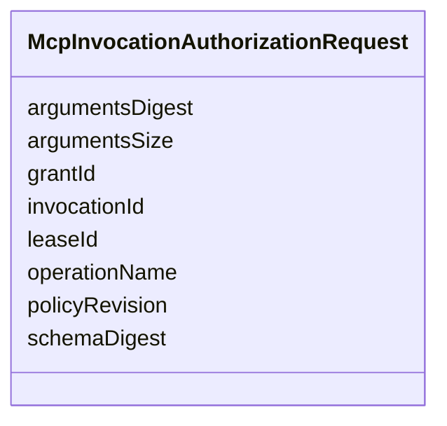

---
search:
  boost: 10.0
---

# Class: McpInvocationAuthorizationRequest


_Machine-authenticated request to authorize one planned MCP operation without persisting arguments._


<div data-search-exclude markdown="1">


URI: [jumo:McpInvocationAuthorizationRequest](https://jumo.dev/schemas/jumo-v1/McpInvocationAuthorizationRequest)





<!-- no inheritance hierarchy -->

## Slots

| Name | Cardinality and Range | Description | Inheritance |
| ---  | --- | --- | --- |
| [invocationId](invocationId.md) | 1 <br/> [Identifier](Identifier.md) |  | direct |
| [grantId](grantId.md) | 1 <br/> [Identifier](Identifier.md) |  | direct |
| [leaseId](leaseId.md) | 1 <br/> [Identifier](Identifier.md) |  | direct |
| [operationName](operationName.md) | 1 <br/> [String](String.md) |  | direct |
| [argumentsDigest](argumentsDigest.md) | 1 <br/> [String](String.md) |  | direct |
| [argumentsSize](argumentsSize.md) | 1 <br/> [Integer](Integer.md) |  | direct |
| [schemaDigest](schemaDigest.md) | 1 <br/> [String](String.md) |  | direct |
| [policyRevision](policyRevision.md) | 1 <br/> [String](String.md) |  | direct |


## Identifier and Mapping Information


### Annotations

| property | value |
| --- | --- |
| jumo.state_authority | NONE |
| jumo.model_role | COMMAND |
| jumo.audience | MACHINE_MTLS |
| jumo.sensitivity | INTERNAL |
| jumo.boundary_eligible | True |
| jumo.schema_profiles | draft-2020-12,native-json-schema,prompted-json-validated |


### Schema Source


* from schema: https://jumo.dev/schemas/jumo-v1


## Mappings

| Mapping Type | Mapped Value |
| ---  | ---  |
| self | jumo:McpInvocationAuthorizationRequest |
| native | jumo:McpInvocationAuthorizationRequest |


## LinkML Source

<!-- TODO: investigate https://stackoverflow.com/questions/37606292/how-to-create-tabbed-code-blocks-in-mkdocs-or-sphinx -->

### Direct

<details>
```yaml
name: McpInvocationAuthorizationRequest
annotations:
  jumo.state_authority:
    tag: jumo.state_authority
    value: NONE
  jumo.model_role:
    tag: jumo.model_role
    value: COMMAND
  jumo.audience:
    tag: jumo.audience
    value: MACHINE_MTLS
  jumo.sensitivity:
    tag: jumo.sensitivity
    value: INTERNAL
  jumo.boundary_eligible:
    tag: jumo.boundary_eligible
    value: true
  jumo.schema_profiles:
    tag: jumo.schema_profiles
    value: draft-2020-12,native-json-schema,prompted-json-validated
description: Machine-authenticated request to authorize one planned MCP operation
  without persisting arguments.
from_schema: https://jumo.dev/schemas/jumo-v1
attributes:
  invocationId:
    name: invocationId
    from_schema: https://jumo.dev/schemas/jumo-v1
    owner: McpInvocationAuthorizationRequest
    domain_of:
    - InvocationAuthorizationReceipt
    - McpInvocationAuthorizationRequest
    - McpInvocationAuthorizationReceipt
    - McpInvocationOutcome
    range: Identifier
    required: true
  grantId:
    name: grantId
    from_schema: https://jumo.dev/schemas/jumo-v1
    owner: McpInvocationAuthorizationRequest
    domain_of:
    - DelegatedSecretGrant
    - PlannedOperation
    - McpInvocationAuthorizationRequest
    - McpInvocationAuthorizationReceipt
    range: Identifier
    required: true
  leaseId:
    name: leaseId
    from_schema: https://jumo.dev/schemas/jumo-v1
    owner: McpInvocationAuthorizationRequest
    domain_of:
    - WorkloadCommand
    - ExecutionCellLease
    - DelegatedSecretGrant
    - CliInvocationRequest
    - SessionPlanRequest
    - SessionPlan
    - McpInvocationAuthorizationRequest
    - McpInvocationAuthorizationReceipt
    - McpInvocationOutcome
    range: Identifier
    required: true
  operationName:
    name: operationName
    from_schema: https://jumo.dev/schemas/jumo-v1
    rank: 1000
    owner: McpInvocationAuthorizationRequest
    domain_of:
    - McpInvocationAuthorizationRequest
    - McpInvocationAuthorizationReceipt
    range: string
    required: true
  argumentsDigest:
    name: argumentsDigest
    from_schema: https://jumo.dev/schemas/jumo-v1
    rank: 1000
    owner: McpInvocationAuthorizationRequest
    domain_of:
    - McpInvocationAuthorizationRequest
    - McpInvocationAuthorizationReceipt
    range: string
    required: true
  argumentsSize:
    name: argumentsSize
    from_schema: https://jumo.dev/schemas/jumo-v1
    rank: 1000
    owner: McpInvocationAuthorizationRequest
    domain_of:
    - McpInvocationAuthorizationRequest
    range: integer
    required: true
  schemaDigest:
    name: schemaDigest
    from_schema: https://jumo.dev/schemas/jumo-v1
    rank: 1000
    owner: McpInvocationAuthorizationRequest
    domain_of:
    - McpInvocationAuthorizationRequest
    - McpInvocationAuthorizationReceipt
    - SchemaBinding
    range: string
    required: true
  policyRevision:
    name: policyRevision
    from_schema: https://jumo.dev/schemas/jumo-v1
    owner: McpInvocationAuthorizationRequest
    domain_of:
    - RoutingDecision
    - McpInvocationAuthorizationRequest
    range: string
    required: true

```
</details>

### Induced

<details>
```yaml
name: McpInvocationAuthorizationRequest
annotations:
  jumo.state_authority:
    tag: jumo.state_authority
    value: NONE
  jumo.model_role:
    tag: jumo.model_role
    value: COMMAND
  jumo.audience:
    tag: jumo.audience
    value: MACHINE_MTLS
  jumo.sensitivity:
    tag: jumo.sensitivity
    value: INTERNAL
  jumo.boundary_eligible:
    tag: jumo.boundary_eligible
    value: true
  jumo.schema_profiles:
    tag: jumo.schema_profiles
    value: draft-2020-12,native-json-schema,prompted-json-validated
description: Machine-authenticated request to authorize one planned MCP operation
  without persisting arguments.
from_schema: https://jumo.dev/schemas/jumo-v1
attributes:
  invocationId:
    name: invocationId
    from_schema: https://jumo.dev/schemas/jumo-v1
    owner: McpInvocationAuthorizationRequest
    domain_of:
    - InvocationAuthorizationReceipt
    - McpInvocationAuthorizationRequest
    - McpInvocationAuthorizationReceipt
    - McpInvocationOutcome
    range: Identifier
    required: true
  grantId:
    name: grantId
    from_schema: https://jumo.dev/schemas/jumo-v1
    owner: McpInvocationAuthorizationRequest
    domain_of:
    - DelegatedSecretGrant
    - PlannedOperation
    - McpInvocationAuthorizationRequest
    - McpInvocationAuthorizationReceipt
    range: Identifier
    required: true
  leaseId:
    name: leaseId
    from_schema: https://jumo.dev/schemas/jumo-v1
    owner: McpInvocationAuthorizationRequest
    domain_of:
    - WorkloadCommand
    - ExecutionCellLease
    - DelegatedSecretGrant
    - CliInvocationRequest
    - SessionPlanRequest
    - SessionPlan
    - McpInvocationAuthorizationRequest
    - McpInvocationAuthorizationReceipt
    - McpInvocationOutcome
    range: Identifier
    required: true
  operationName:
    name: operationName
    from_schema: https://jumo.dev/schemas/jumo-v1
    rank: 1000
    owner: McpInvocationAuthorizationRequest
    domain_of:
    - McpInvocationAuthorizationRequest
    - McpInvocationAuthorizationReceipt
    range: string
    required: true
  argumentsDigest:
    name: argumentsDigest
    from_schema: https://jumo.dev/schemas/jumo-v1
    rank: 1000
    owner: McpInvocationAuthorizationRequest
    domain_of:
    - McpInvocationAuthorizationRequest
    - McpInvocationAuthorizationReceipt
    range: string
    required: true
  argumentsSize:
    name: argumentsSize
    from_schema: https://jumo.dev/schemas/jumo-v1
    rank: 1000
    owner: McpInvocationAuthorizationRequest
    domain_of:
    - McpInvocationAuthorizationRequest
    range: integer
    required: true
  schemaDigest:
    name: schemaDigest
    from_schema: https://jumo.dev/schemas/jumo-v1
    rank: 1000
    owner: McpInvocationAuthorizationRequest
    domain_of:
    - McpInvocationAuthorizationRequest
    - McpInvocationAuthorizationReceipt
    - SchemaBinding
    range: string
    required: true
  policyRevision:
    name: policyRevision
    from_schema: https://jumo.dev/schemas/jumo-v1
    owner: McpInvocationAuthorizationRequest
    domain_of:
    - RoutingDecision
    - McpInvocationAuthorizationRequest
    range: string
    required: true

```
</details></div>