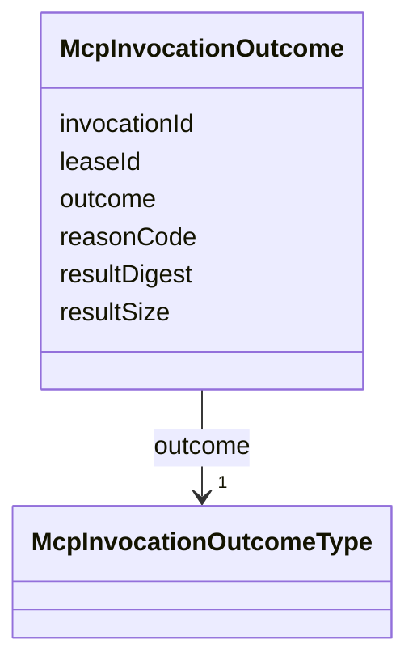

---
search:
  boost: 10.0
---

# Class: McpInvocationOutcome


_Sanitized terminal outcome for one dispatched MCP invocation._


<div data-search-exclude markdown="1">


URI: [jumo:McpInvocationOutcome](https://jumo.dev/schemas/jumo-v1/McpInvocationOutcome)





<!-- no inheritance hierarchy -->

## Slots

| Name | Cardinality and Range | Description | Inheritance |
| ---  | --- | --- | --- |
| [invocationId](invocationId.md) | 1 <br/> [Identifier](Identifier.md) |  | direct |
| [leaseId](leaseId.md) | 1 <br/> [Identifier](Identifier.md) |  | direct |
| [outcome](outcome.md) | 1 <br/> [McpInvocationOutcomeType](McpInvocationOutcomeType.md) |  | direct |
| [resultDigest](resultDigest.md) | 0..1 <br/> [String](String.md) |  | direct |
| [resultSize](resultSize.md) | 0..1 <br/> [Integer](Integer.md) |  | direct |
| [reasonCode](reasonCode.md) | 0..1 <br/> [String](String.md) |  | direct |


## Identifier and Mapping Information


### Annotations

| property | value |
| --- | --- |
| jumo.state_authority | NONE |
| jumo.model_role | EVENT |
| jumo.audience | MACHINE_MTLS |
| jumo.sensitivity | INTERNAL |
| jumo.boundary_eligible | True |
| jumo.schema_profiles | draft-2020-12,native-json-schema,prompted-json-validated |


### Schema Source


* from schema: https://jumo.dev/schemas/jumo-v1


## Mappings

| Mapping Type | Mapped Value |
| ---  | ---  |
| self | jumo:McpInvocationOutcome |
| native | jumo:McpInvocationOutcome |


## LinkML Source

<!-- TODO: investigate https://stackoverflow.com/questions/37606292/how-to-create-tabbed-code-blocks-in-mkdocs-or-sphinx -->

### Direct

<details>
```yaml
name: McpInvocationOutcome
annotations:
  jumo.state_authority:
    tag: jumo.state_authority
    value: NONE
  jumo.model_role:
    tag: jumo.model_role
    value: EVENT
  jumo.audience:
    tag: jumo.audience
    value: MACHINE_MTLS
  jumo.sensitivity:
    tag: jumo.sensitivity
    value: INTERNAL
  jumo.boundary_eligible:
    tag: jumo.boundary_eligible
    value: true
  jumo.schema_profiles:
    tag: jumo.schema_profiles
    value: draft-2020-12,native-json-schema,prompted-json-validated
description: Sanitized terminal outcome for one dispatched MCP invocation.
from_schema: https://jumo.dev/schemas/jumo-v1
attributes:
  invocationId:
    name: invocationId
    from_schema: https://jumo.dev/schemas/jumo-v1
    owner: McpInvocationOutcome
    domain_of:
    - InvocationAuthorizationReceipt
    - McpInvocationAuthorizationRequest
    - McpInvocationAuthorizationReceipt
    - McpInvocationOutcome
    range: Identifier
    required: true
  leaseId:
    name: leaseId
    from_schema: https://jumo.dev/schemas/jumo-v1
    owner: McpInvocationOutcome
    domain_of:
    - WorkloadCommand
    - ExecutionCellLease
    - DelegatedSecretGrant
    - CliInvocationRequest
    - SessionPlanRequest
    - SessionPlan
    - McpInvocationAuthorizationRequest
    - McpInvocationAuthorizationReceipt
    - McpInvocationOutcome
    range: Identifier
    required: true
  outcome:
    name: outcome
    from_schema: https://jumo.dev/schemas/jumo-v1
    owner: McpInvocationOutcome
    domain_of:
    - DispositionRule
    - McpCatalogAssessment
    - AppraisalDimension
    - McpInvocationOutcome
    range: McpInvocationOutcomeType
    required: true
  resultDigest:
    name: resultDigest
    from_schema: https://jumo.dev/schemas/jumo-v1
    rank: 1000
    owner: McpInvocationOutcome
    domain_of:
    - McpInvocationOutcome
    range: string
  resultSize:
    name: resultSize
    from_schema: https://jumo.dev/schemas/jumo-v1
    rank: 1000
    owner: McpInvocationOutcome
    domain_of:
    - McpInvocationOutcome
    range: integer
  reasonCode:
    name: reasonCode
    from_schema: https://jumo.dev/schemas/jumo-v1
    owner: McpInvocationOutcome
    domain_of:
    - PolicyRule
    - RoutingDecision
    - McpInvocationOutcome
    range: string

```
</details>

### Induced

<details>
```yaml
name: McpInvocationOutcome
annotations:
  jumo.state_authority:
    tag: jumo.state_authority
    value: NONE
  jumo.model_role:
    tag: jumo.model_role
    value: EVENT
  jumo.audience:
    tag: jumo.audience
    value: MACHINE_MTLS
  jumo.sensitivity:
    tag: jumo.sensitivity
    value: INTERNAL
  jumo.boundary_eligible:
    tag: jumo.boundary_eligible
    value: true
  jumo.schema_profiles:
    tag: jumo.schema_profiles
    value: draft-2020-12,native-json-schema,prompted-json-validated
description: Sanitized terminal outcome for one dispatched MCP invocation.
from_schema: https://jumo.dev/schemas/jumo-v1
attributes:
  invocationId:
    name: invocationId
    from_schema: https://jumo.dev/schemas/jumo-v1
    owner: McpInvocationOutcome
    domain_of:
    - InvocationAuthorizationReceipt
    - McpInvocationAuthorizationRequest
    - McpInvocationAuthorizationReceipt
    - McpInvocationOutcome
    range: Identifier
    required: true
  leaseId:
    name: leaseId
    from_schema: https://jumo.dev/schemas/jumo-v1
    owner: McpInvocationOutcome
    domain_of:
    - WorkloadCommand
    - ExecutionCellLease
    - DelegatedSecretGrant
    - CliInvocationRequest
    - SessionPlanRequest
    - SessionPlan
    - McpInvocationAuthorizationRequest
    - McpInvocationAuthorizationReceipt
    - McpInvocationOutcome
    range: Identifier
    required: true
  outcome:
    name: outcome
    from_schema: https://jumo.dev/schemas/jumo-v1
    owner: McpInvocationOutcome
    domain_of:
    - DispositionRule
    - McpCatalogAssessment
    - AppraisalDimension
    - McpInvocationOutcome
    range: McpInvocationOutcomeType
    required: true
  resultDigest:
    name: resultDigest
    from_schema: https://jumo.dev/schemas/jumo-v1
    rank: 1000
    owner: McpInvocationOutcome
    domain_of:
    - McpInvocationOutcome
    range: string
  resultSize:
    name: resultSize
    from_schema: https://jumo.dev/schemas/jumo-v1
    rank: 1000
    owner: McpInvocationOutcome
    domain_of:
    - McpInvocationOutcome
    range: integer
  reasonCode:
    name: reasonCode
    from_schema: https://jumo.dev/schemas/jumo-v1
    owner: McpInvocationOutcome
    domain_of:
    - PolicyRule
    - RoutingDecision
    - McpInvocationOutcome
    range: string

```
</details></div>