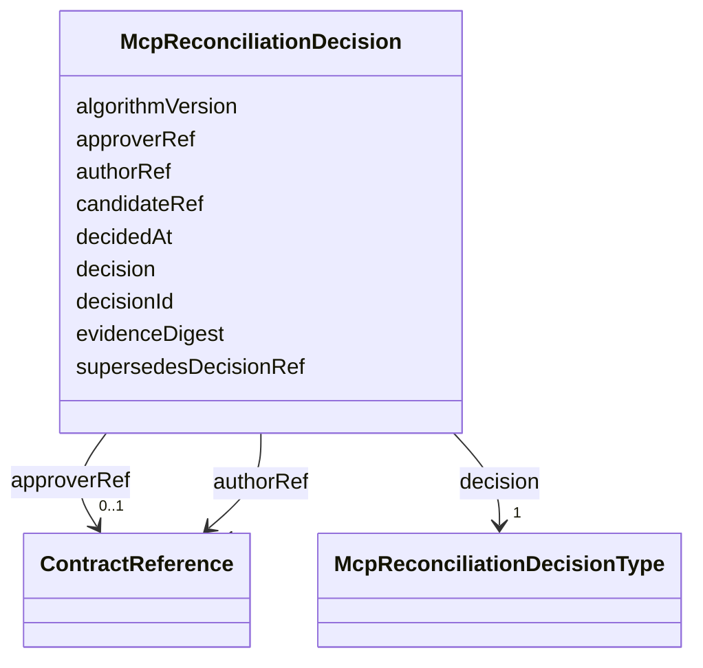

---
search:
  boost: 10.0
---

# Class: McpReconciliationDecision

<div data-search-exclude markdown="1">


URI: [jumo:McpReconciliationDecision](https://jumo.dev/schemas/jumo-v1/McpReconciliationDecision)





<!-- no inheritance hierarchy -->

## Slots

| Name | Cardinality and Range | Description | Inheritance |
| ---  | --- | --- | --- |
| [decisionId](decisionId.md) | 1 <br/> [Identifier](Identifier.md) |  | direct |
| [candidateRef](candidateRef.md) | 1 <br/> [Identifier](Identifier.md) |  | direct |
| [decision](decision.md) | 1 <br/> [McpReconciliationDecisionType](McpReconciliationDecisionType.md) |  | direct |
| [algorithmVersion](algorithmVersion.md) | 1 <br/> [String](String.md) |  | direct |
| [evidenceDigest](evidenceDigest.md) | 1 <br/> [String](String.md) |  | direct |
| [authorRef](authorRef.md) | 1 <br/> [ContractReference](ContractReference.md) |  | direct |
| [approverRef](approverRef.md) | 0..1 <br/> [ContractReference](ContractReference.md) |  | direct |
| [supersedesDecisionRef](supersedesDecisionRef.md) | 0..1 <br/> [Identifier](Identifier.md) |  | direct |
| [decidedAt](decidedAt.md) | 1 <br/> [Datetime](Datetime.md) |  | direct |


## Identifier and Mapping Information


### Annotations

| property | value |
| --- | --- |
| jumo.state_authority | POSTGRES |
| jumo.model_role | EVENT |
| jumo.audience | REALM_PRIVATE |
| jumo.sensitivity | INTERNAL |
| jumo.boundary_eligible | True |
| jumo.schema_profiles | draft-2020-12,native-json-schema,prompted-json-validated |


### Schema Source


* from schema: https://jumo.dev/schemas/jumo-v1


## Mappings

| Mapping Type | Mapped Value |
| ---  | ---  |
| self | jumo:McpReconciliationDecision |
| native | jumo:McpReconciliationDecision |


## LinkML Source

<!-- TODO: investigate https://stackoverflow.com/questions/37606292/how-to-create-tabbed-code-blocks-in-mkdocs-or-sphinx -->

### Direct

<details>
```yaml
name: McpReconciliationDecision
annotations:
  jumo.state_authority:
    tag: jumo.state_authority
    value: POSTGRES
  jumo.model_role:
    tag: jumo.model_role
    value: EVENT
  jumo.audience:
    tag: jumo.audience
    value: REALM_PRIVATE
  jumo.sensitivity:
    tag: jumo.sensitivity
    value: INTERNAL
  jumo.boundary_eligible:
    tag: jumo.boundary_eligible
    value: true
  jumo.schema_profiles:
    tag: jumo.schema_profiles
    value: draft-2020-12,native-json-schema,prompted-json-validated
from_schema: https://jumo.dev/schemas/jumo-v1
attributes:
  decisionId:
    name: decisionId
    from_schema: https://jumo.dev/schemas/jumo-v1
    rank: 1000
    owner: McpReconciliationDecision
    domain_of:
    - McpReconciliationDecision
    range: Identifier
    required: true
  candidateRef:
    name: candidateRef
    from_schema: https://jumo.dev/schemas/jumo-v1
    owner: McpReconciliationDecision
    domain_of:
    - McpCatalogFieldSelection
    - McpReconciliationDecision
    range: Identifier
    required: true
  decision:
    name: decision
    from_schema: https://jumo.dev/schemas/jumo-v1
    rank: 1000
    owner: McpReconciliationDecision
    domain_of:
    - McpReconciliationDecision
    - ConnectorActivationDecision
    range: McpReconciliationDecisionType
    required: true
  algorithmVersion:
    name: algorithmVersion
    from_schema: https://jumo.dev/schemas/jumo-v1
    owner: McpReconciliationDecision
    domain_of:
    - McpReconciliationCandidate
    - McpReconciliationDecision
    range: string
    required: true
  evidenceDigest:
    name: evidenceDigest
    from_schema: https://jumo.dev/schemas/jumo-v1
    owner: McpReconciliationDecision
    domain_of:
    - MachineAdminResult
    - WorkloadCommandResult
    - CliInvocationResult
    - McpCatalogAssessment
    - McpReconciliationCandidate
    - McpReconciliationDecision
    range: string
    required: true
  authorRef:
    name: authorRef
    from_schema: https://jumo.dev/schemas/jumo-v1
    rank: 1000
    owner: McpReconciliationDecision
    domain_of:
    - McpReconciliationDecision
    range: ContractReference
    required: true
  approverRef:
    name: approverRef
    from_schema: https://jumo.dev/schemas/jumo-v1
    rank: 1000
    owner: McpReconciliationDecision
    domain_of:
    - McpReconciliationDecision
    range: ContractReference
  supersedesDecisionRef:
    name: supersedesDecisionRef
    from_schema: https://jumo.dev/schemas/jumo-v1
    rank: 1000
    owner: McpReconciliationDecision
    domain_of:
    - McpReconciliationDecision
    range: Identifier
  decidedAt:
    name: decidedAt
    from_schema: https://jumo.dev/schemas/jumo-v1
    rank: 1000
    owner: McpReconciliationDecision
    domain_of:
    - McpReconciliationDecision
    - ConnectorActivationDecision
    range: datetime
    required: true

```
</details>

### Induced

<details>
```yaml
name: McpReconciliationDecision
annotations:
  jumo.state_authority:
    tag: jumo.state_authority
    value: POSTGRES
  jumo.model_role:
    tag: jumo.model_role
    value: EVENT
  jumo.audience:
    tag: jumo.audience
    value: REALM_PRIVATE
  jumo.sensitivity:
    tag: jumo.sensitivity
    value: INTERNAL
  jumo.boundary_eligible:
    tag: jumo.boundary_eligible
    value: true
  jumo.schema_profiles:
    tag: jumo.schema_profiles
    value: draft-2020-12,native-json-schema,prompted-json-validated
from_schema: https://jumo.dev/schemas/jumo-v1
attributes:
  decisionId:
    name: decisionId
    from_schema: https://jumo.dev/schemas/jumo-v1
    rank: 1000
    owner: McpReconciliationDecision
    domain_of:
    - McpReconciliationDecision
    range: Identifier
    required: true
  candidateRef:
    name: candidateRef
    from_schema: https://jumo.dev/schemas/jumo-v1
    owner: McpReconciliationDecision
    domain_of:
    - McpCatalogFieldSelection
    - McpReconciliationDecision
    range: Identifier
    required: true
  decision:
    name: decision
    from_schema: https://jumo.dev/schemas/jumo-v1
    rank: 1000
    owner: McpReconciliationDecision
    domain_of:
    - McpReconciliationDecision
    - ConnectorActivationDecision
    range: McpReconciliationDecisionType
    required: true
  algorithmVersion:
    name: algorithmVersion
    from_schema: https://jumo.dev/schemas/jumo-v1
    owner: McpReconciliationDecision
    domain_of:
    - McpReconciliationCandidate
    - McpReconciliationDecision
    range: string
    required: true
  evidenceDigest:
    name: evidenceDigest
    from_schema: https://jumo.dev/schemas/jumo-v1
    owner: McpReconciliationDecision
    domain_of:
    - MachineAdminResult
    - WorkloadCommandResult
    - CliInvocationResult
    - McpCatalogAssessment
    - McpReconciliationCandidate
    - McpReconciliationDecision
    range: string
    required: true
  authorRef:
    name: authorRef
    from_schema: https://jumo.dev/schemas/jumo-v1
    rank: 1000
    owner: McpReconciliationDecision
    domain_of:
    - McpReconciliationDecision
    range: ContractReference
    required: true
  approverRef:
    name: approverRef
    from_schema: https://jumo.dev/schemas/jumo-v1
    rank: 1000
    owner: McpReconciliationDecision
    domain_of:
    - McpReconciliationDecision
    range: ContractReference
  supersedesDecisionRef:
    name: supersedesDecisionRef
    from_schema: https://jumo.dev/schemas/jumo-v1
    rank: 1000
    owner: McpReconciliationDecision
    domain_of:
    - McpReconciliationDecision
    range: Identifier
  decidedAt:
    name: decidedAt
    from_schema: https://jumo.dev/schemas/jumo-v1
    rank: 1000
    owner: McpReconciliationDecision
    domain_of:
    - McpReconciliationDecision
    - ConnectorActivationDecision
    range: datetime
    required: true

```
</details></div>