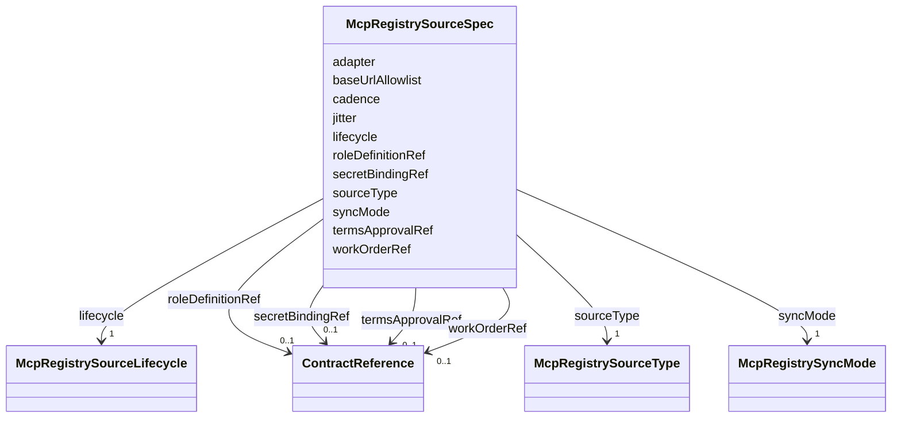

---
search:
  boost: 10.0
---

# Class: McpRegistrySourceSpec

<div data-search-exclude markdown="1">


URI: [jumo:McpRegistrySourceSpec](https://jumo.dev/schemas/jumo-v1/McpRegistrySourceSpec)





<!-- no inheritance hierarchy -->

## Slots

| Name | Cardinality and Range | Description | Inheritance |
| ---  | --- | --- | --- |
| [sourceType](sourceType.md) | 1 <br/> [McpRegistrySourceType](McpRegistrySourceType.md) |  | direct |
| [adapter](adapter.md) | 1 <br/> [String](String.md) |  | direct |
| [baseUrlAllowlist](baseUrlAllowlist.md) | 1..* <br/> [String](String.md) |  | direct |
| [syncMode](syncMode.md) | 1 <br/> [McpRegistrySyncMode](McpRegistrySyncMode.md) |  | direct |
| [cadence](cadence.md) | 1 <br/> [Duration](Duration.md) |  | direct |
| [jitter](jitter.md) | 0..1 <br/> [Duration](Duration.md) |  | direct |
| [lifecycle](lifecycle.md) | 1 <br/> [McpRegistrySourceLifecycle](McpRegistrySourceLifecycle.md) | Platform-declared default lifecycle | direct |
| [workOrderRef](workOrderRef.md) | 0..1 <br/> [ContractReference](ContractReference.md) | No longer required (decision AC1) -- attribution for a new binding belongs on... | direct |
| [roleDefinitionRef](roleDefinitionRef.md) | 0..1 <br/> [ContractReference](ContractReference.md) |  | direct |
| [secretBindingRef](secretBindingRef.md) | 0..1 <br/> [ContractReference](ContractReference.md) |  | direct |
| [termsApprovalRef](termsApprovalRef.md) | 0..1 <br/> [ContractReference](ContractReference.md) |  | direct |


## Usages

| used by | used in | type | used |
| ---  | --- | --- | --- |
| [McpRegistrySource](McpRegistrySource.md) | [spec](spec.md) | range | [McpRegistrySourceSpec](McpRegistrySourceSpec.md) |


## Identifier and Mapping Information


### Annotations

| property | value |
| --- | --- |
| jumo.state_authority | GIT |
| jumo.model_role | VALUE_OBJECT |
| jumo.audience | INTERNAL_WORKER |
| jumo.sensitivity | INTERNAL |
| jumo.boundary_eligible | True |
| jumo.schema_profiles | draft-2020-12,native-json-schema,prompted-json-validated |


### Schema Source


* from schema: https://jumo.dev/schemas/jumo-v1


## Mappings

| Mapping Type | Mapped Value |
| ---  | ---  |
| self | jumo:McpRegistrySourceSpec |
| native | jumo:McpRegistrySourceSpec |


## LinkML Source

<!-- TODO: investigate https://stackoverflow.com/questions/37606292/how-to-create-tabbed-code-blocks-in-mkdocs-or-sphinx -->

### Direct

<details>
```yaml
name: McpRegistrySourceSpec
annotations:
  jumo.state_authority:
    tag: jumo.state_authority
    value: GIT
  jumo.model_role:
    tag: jumo.model_role
    value: VALUE_OBJECT
  jumo.audience:
    tag: jumo.audience
    value: INTERNAL_WORKER
  jumo.sensitivity:
    tag: jumo.sensitivity
    value: INTERNAL
  jumo.boundary_eligible:
    tag: jumo.boundary_eligible
    value: true
  jumo.schema_profiles:
    tag: jumo.schema_profiles
    value: draft-2020-12,native-json-schema,prompted-json-validated
from_schema: https://jumo.dev/schemas/jumo-v1
attributes:
  sourceType:
    name: sourceType
    from_schema: https://jumo.dev/schemas/jumo-v1
    rank: 1000
    owner: McpRegistrySourceSpec
    domain_of:
    - McpRegistrySourceSpec
    range: McpRegistrySourceType
    required: true
  adapter:
    name: adapter
    from_schema: https://jumo.dev/schemas/jumo-v1
    rank: 1000
    owner: McpRegistrySourceSpec
    domain_of:
    - McpRegistrySourceSpec
    - ProviderSessionBinding
    - RoutingDecision
    range: string
    required: true
    pattern: ^.{3,}$
  baseUrlAllowlist:
    name: baseUrlAllowlist
    from_schema: https://jumo.dev/schemas/jumo-v1
    rank: 1000
    owner: McpRegistrySourceSpec
    domain_of:
    - McpRegistrySourceSpec
    range: string
    required: true
    multivalued: true
    pattern: ^https://.+$
    minimum_cardinality: 1
  syncMode:
    name: syncMode
    from_schema: https://jumo.dev/schemas/jumo-v1
    rank: 1000
    owner: McpRegistrySourceSpec
    domain_of:
    - McpRegistrySourceSpec
    range: McpRegistrySyncMode
    required: true
  cadence:
    name: cadence
    from_schema: https://jumo.dev/schemas/jumo-v1
    rank: 1000
    owner: McpRegistrySourceSpec
    domain_of:
    - McpRegistrySourceSpec
    range: Duration
    required: true
  jitter:
    name: jitter
    from_schema: https://jumo.dev/schemas/jumo-v1
    rank: 1000
    owner: McpRegistrySourceSpec
    domain_of:
    - McpRegistrySourceSpec
    range: Duration
  lifecycle:
    name: lifecycle
    description: Platform-declared default lifecycle. A Realm's McpRegistrySourceBinding.lifecycle
      is the live, Realm-scoped selection and may differ.
    from_schema: https://jumo.dev/schemas/jumo-v1
    owner: McpRegistrySourceSpec
    domain_of:
    - ProjectSpec
    - McpRegistrySourceSpec
    - McpRegistrySourceBindingSpec
    - McpRegistrySyncStatus
    - ConnectorDefinitionSpec
    - McpBundleSpec
    - RemoteMcpServiceSpec
    - ExecutionCellSpec
    - SecretBindingSpec
    - WorkerSubstrateSpec
    range: McpRegistrySourceLifecycle
    required: true
  workOrderRef:
    name: workOrderRef
    description: No longer required (decision AC1) -- attribution for a new binding
      belongs on McpRegistrySourceBinding.
    from_schema: https://jumo.dev/schemas/jumo-v1
    rank: 1000
    owner: McpRegistrySourceSpec
    domain_of:
    - McpRegistrySourceSpec
    - McpRegistrySourceBindingSpec
    - McpInventorySnapshot
    range: ContractReference
    inlined: true
  roleDefinitionRef:
    name: roleDefinitionRef
    from_schema: https://jumo.dev/schemas/jumo-v1
    owner: McpRegistrySourceSpec
    domain_of:
    - RealmChiefOfStaffRef
    - RoleAssignmentSpec
    - TeamMember
    - ChiefOfStaffProfileSpec
    - AdvisorProfileSpec
    - OrganizationRoleBinding
    - McpRegistrySourceSpec
    - McpRegistrySourceBindingSpec
    range: ContractReference
    inlined: true
  secretBindingRef:
    name: secretBindingRef
    from_schema: https://jumo.dev/schemas/jumo-v1
    rank: 1000
    owner: McpRegistrySourceSpec
    domain_of:
    - McpRegistrySourceSpec
    - ProviderAccountSpec
    - WorkerModelAccess
    - ConnectorSessionBinding
    range: ContractReference
    inlined: true
  termsApprovalRef:
    name: termsApprovalRef
    from_schema: https://jumo.dev/schemas/jumo-v1
    rank: 1000
    owner: McpRegistrySourceSpec
    domain_of:
    - McpRegistrySourceSpec
    range: ContractReference
    inlined: true

```
</details>

### Induced

<details>
```yaml
name: McpRegistrySourceSpec
annotations:
  jumo.state_authority:
    tag: jumo.state_authority
    value: GIT
  jumo.model_role:
    tag: jumo.model_role
    value: VALUE_OBJECT
  jumo.audience:
    tag: jumo.audience
    value: INTERNAL_WORKER
  jumo.sensitivity:
    tag: jumo.sensitivity
    value: INTERNAL
  jumo.boundary_eligible:
    tag: jumo.boundary_eligible
    value: true
  jumo.schema_profiles:
    tag: jumo.schema_profiles
    value: draft-2020-12,native-json-schema,prompted-json-validated
from_schema: https://jumo.dev/schemas/jumo-v1
attributes:
  sourceType:
    name: sourceType
    from_schema: https://jumo.dev/schemas/jumo-v1
    rank: 1000
    owner: McpRegistrySourceSpec
    domain_of:
    - McpRegistrySourceSpec
    range: McpRegistrySourceType
    required: true
  adapter:
    name: adapter
    from_schema: https://jumo.dev/schemas/jumo-v1
    rank: 1000
    owner: McpRegistrySourceSpec
    domain_of:
    - McpRegistrySourceSpec
    - ProviderSessionBinding
    - RoutingDecision
    range: string
    required: true
    pattern: ^.{3,}$
  baseUrlAllowlist:
    name: baseUrlAllowlist
    from_schema: https://jumo.dev/schemas/jumo-v1
    rank: 1000
    owner: McpRegistrySourceSpec
    domain_of:
    - McpRegistrySourceSpec
    range: string
    required: true
    multivalued: true
    pattern: ^https://.+$
    minimum_cardinality: 1
  syncMode:
    name: syncMode
    from_schema: https://jumo.dev/schemas/jumo-v1
    rank: 1000
    owner: McpRegistrySourceSpec
    domain_of:
    - McpRegistrySourceSpec
    range: McpRegistrySyncMode
    required: true
  cadence:
    name: cadence
    from_schema: https://jumo.dev/schemas/jumo-v1
    rank: 1000
    owner: McpRegistrySourceSpec
    domain_of:
    - McpRegistrySourceSpec
    range: Duration
    required: true
  jitter:
    name: jitter
    from_schema: https://jumo.dev/schemas/jumo-v1
    rank: 1000
    owner: McpRegistrySourceSpec
    domain_of:
    - McpRegistrySourceSpec
    range: Duration
  lifecycle:
    name: lifecycle
    description: Platform-declared default lifecycle. A Realm's McpRegistrySourceBinding.lifecycle
      is the live, Realm-scoped selection and may differ.
    from_schema: https://jumo.dev/schemas/jumo-v1
    owner: McpRegistrySourceSpec
    domain_of:
    - ProjectSpec
    - McpRegistrySourceSpec
    - McpRegistrySourceBindingSpec
    - McpRegistrySyncStatus
    - ConnectorDefinitionSpec
    - McpBundleSpec
    - RemoteMcpServiceSpec
    - ExecutionCellSpec
    - SecretBindingSpec
    - WorkerSubstrateSpec
    range: McpRegistrySourceLifecycle
    required: true
  workOrderRef:
    name: workOrderRef
    description: No longer required (decision AC1) -- attribution for a new binding
      belongs on McpRegistrySourceBinding.
    from_schema: https://jumo.dev/schemas/jumo-v1
    rank: 1000
    owner: McpRegistrySourceSpec
    domain_of:
    - McpRegistrySourceSpec
    - McpRegistrySourceBindingSpec
    - McpInventorySnapshot
    range: ContractReference
    inlined: true
  roleDefinitionRef:
    name: roleDefinitionRef
    from_schema: https://jumo.dev/schemas/jumo-v1
    owner: McpRegistrySourceSpec
    domain_of:
    - RealmChiefOfStaffRef
    - RoleAssignmentSpec
    - TeamMember
    - ChiefOfStaffProfileSpec
    - AdvisorProfileSpec
    - OrganizationRoleBinding
    - McpRegistrySourceSpec
    - McpRegistrySourceBindingSpec
    range: ContractReference
    inlined: true
  secretBindingRef:
    name: secretBindingRef
    from_schema: https://jumo.dev/schemas/jumo-v1
    rank: 1000
    owner: McpRegistrySourceSpec
    domain_of:
    - McpRegistrySourceSpec
    - ProviderAccountSpec
    - WorkerModelAccess
    - ConnectorSessionBinding
    range: ContractReference
    inlined: true
  termsApprovalRef:
    name: termsApprovalRef
    from_schema: https://jumo.dev/schemas/jumo-v1
    rank: 1000
    owner: McpRegistrySourceSpec
    domain_of:
    - McpRegistrySourceSpec
    range: ContractReference
    inlined: true

```
</details></div>