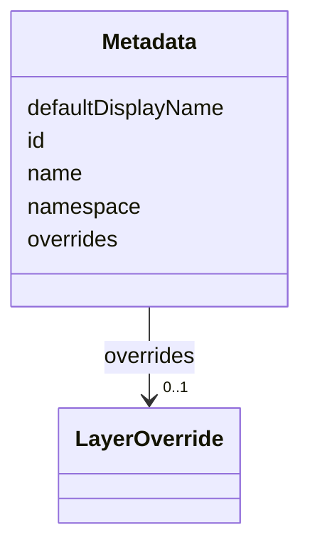

---
search:
  boost: 10.0
---

# Class: Metadata


_Shared identity block for every contract document._


<div data-search-exclude markdown="1">


URI: [jumo:Metadata](https://jumo.dev/schemas/jumo-v1/Metadata)





<!-- no inheritance hierarchy -->

## Slots

| Name | Cardinality and Range | Description | Inheritance |
| ---  | --- | --- | --- |
| [id](id.md) | 1 <br/> [Identifier](Identifier.md) |  | direct |
| [namespace](namespace.md) | 1 <br/> [Namespace](Namespace.md) |  | direct |
| [name](name.md) | 0..1 <br/> [String](String.md) |  | direct |
| [defaultDisplayName](defaultDisplayName.md) | 0..1 <br/> [String](String.md) |  | direct |
| [overrides](overrides.md) | 0..1 <br/> [LayerOverride](LayerOverride.md) |  | direct |


## Usages

| used by | used in | type | used |
| ---  | --- | --- | --- |
| [Principal](Principal.md) | [metadata](metadata.md) | range | [Metadata](Metadata.md) |
| [PrincipalIdentityBinding](PrincipalIdentityBinding.md) | [metadata](metadata.md) | range | [Metadata](Metadata.md) |
| [PrincipleSet](PrincipleSet.md) | [metadata](metadata.md) | range | [Metadata](Metadata.md) |
| [Project](Project.md) | [metadata](metadata.md) | range | [Metadata](Metadata.md) |
| [RealmTemplate](RealmTemplate.md) | [metadata](metadata.md) | range | [Metadata](Metadata.md) |
| [JumoKit](JumoKit.md) | [metadata](metadata.md) | range | [Metadata](Metadata.md) |
| [KitBinding](KitBinding.md) | [metadata](metadata.md) | range | [Metadata](Metadata.md) |
| [KitLock](KitLock.md) | [metadata](metadata.md) | range | [Metadata](Metadata.md) |
| [KitReleaseCertification](KitReleaseCertification.md) | [metadata](metadata.md) | range | [Metadata](Metadata.md) |
| [OfferingSpec](OfferingSpec.md) | [metadata](metadata.md) | range | [Metadata](Metadata.md) |
| [RoleDefinition](RoleDefinition.md) | [metadata](metadata.md) | range | [Metadata](Metadata.md) |
| [AgentDefinition](AgentDefinition.md) | [metadata](metadata.md) | range | [Metadata](Metadata.md) |
| [RoleAssignment](RoleAssignment.md) | [metadata](metadata.md) | range | [Metadata](Metadata.md) |
| [TeamSpec](TeamSpec.md) | [metadata](metadata.md) | range | [Metadata](Metadata.md) |
| [CoordinationProfile](CoordinationProfile.md) | [metadata](metadata.md) | range | [Metadata](Metadata.md) |
| [RoutingEligibility](RoutingEligibility.md) | [metadata](metadata.md) | range | [Metadata](Metadata.md) |
| [RoleLifecyclePolicy](RoleLifecyclePolicy.md) | [metadata](metadata.md) | range | [Metadata](Metadata.md) |
| [OrganizationTemplate](OrganizationTemplate.md) | [metadata](metadata.md) | range | [Metadata](Metadata.md) |
| [ChiefOfStaffProfile](ChiefOfStaffProfile.md) | [metadata](metadata.md) | range | [Metadata](Metadata.md) |
| [AdvisorProfile](AdvisorProfile.md) | [metadata](metadata.md) | range | [Metadata](Metadata.md) |
| [PersonalSpace](PersonalSpace.md) | [metadata](metadata.md) | range | [Metadata](Metadata.md) |
| [Preferences](Preferences.md) | [metadata](metadata.md) | range | [Metadata](Metadata.md) |
| [SelfDescription](SelfDescription.md) | [metadata](metadata.md) | range | [Metadata](Metadata.md) |
| [OrganizationSpec](OrganizationSpec.md) | [metadata](metadata.md) | range | [Metadata](Metadata.md) |
| [Organization](Organization.md) | [metadata](metadata.md) | range | [Metadata](Metadata.md) |
| [OrganizationAccessBinding](OrganizationAccessBinding.md) | [metadata](metadata.md) | range | [Metadata](Metadata.md) |
| [OrganizationEnrollmentPolicy](OrganizationEnrollmentPolicy.md) | [metadata](metadata.md) | range | [Metadata](Metadata.md) |
| [OrganizationAuditRetentionPolicy](OrganizationAuditRetentionPolicy.md) | [metadata](metadata.md) | range | [Metadata](Metadata.md) |
| [OrganizationRetentionHold](OrganizationRetentionHold.md) | [metadata](metadata.md) | range | [Metadata](Metadata.md) |
| [OrganizationPublicationPolicy](OrganizationPublicationPolicy.md) | [metadata](metadata.md) | range | [Metadata](Metadata.md) |
| [RealmPublication](RealmPublication.md) | [metadata](metadata.md) | range | [Metadata](Metadata.md) |
| [WorkOrder](WorkOrder.md) | [metadata](metadata.md) | range | [Metadata](Metadata.md) |
| [SolicitationContract](SolicitationContract.md) | [metadata](metadata.md) | range | [Metadata](Metadata.md) |
| [EngagementMethod](EngagementMethod.md) | [metadata](metadata.md) | range | [Metadata](Metadata.md) |
| [Practice](Practice.md) | [metadata](metadata.md) | range | [Metadata](Metadata.md) |
| [CapabilityProfile](CapabilityProfile.md) | [metadata](metadata.md) | range | [Metadata](Metadata.md) |
| [WorkerRequirementProfile](WorkerRequirementProfile.md) | [metadata](metadata.md) | range | [Metadata](Metadata.md) |
| [GoldenTaskSet](GoldenTaskSet.md) | [metadata](metadata.md) | range | [Metadata](Metadata.md) |
| [PromptTemplate](PromptTemplate.md) | [metadata](metadata.md) | range | [Metadata](Metadata.md) |
| [ResourceBudget](ResourceBudget.md) | [metadata](metadata.md) | range | [Metadata](Metadata.md) |
| [AssistedJourney](AssistedJourney.md) | [metadata](metadata.md) | range | [Metadata](Metadata.md) |
| [JourneyVerificationSpec](JourneyVerificationSpec.md) | [metadata](metadata.md) | range | [Metadata](Metadata.md) |
| [DocumentTemplate](DocumentTemplate.md) | [metadata](metadata.md) | range | [Metadata](Metadata.md) |
| [ActionCapabilitySet](ActionCapabilitySet.md) | [metadata](metadata.md) | range | [Metadata](Metadata.md) |
| [PolicySet](PolicySet.md) | [metadata](metadata.md) | range | [Metadata](Metadata.md) |
| [ImprovementLoop](ImprovementLoop.md) | [metadata](metadata.md) | range | [Metadata](Metadata.md) |
| [ImprovementRecommendation](ImprovementRecommendation.md) | [metadata](metadata.md) | range | [Metadata](Metadata.md) |
| [AttentionItem](AttentionItem.md) | [metadata](metadata.md) | range | [Metadata](Metadata.md) |
| [ControlCatalog](ControlCatalog.md) | [metadata](metadata.md) | range | [Metadata](Metadata.md) |
| [ComplianceProfile](ComplianceProfile.md) | [metadata](metadata.md) | range | [Metadata](Metadata.md) |
| [EvidenceProfile](EvidenceProfile.md) | [metadata](metadata.md) | range | [Metadata](Metadata.md) |
| [ProcessSpec](ProcessSpec.md) | [metadata](metadata.md) | range | [Metadata](Metadata.md) |
| [ExecutionMachine](ExecutionMachine.md) | [metadata](metadata.md) | range | [Metadata](Metadata.md) |
| [MachineHostDefinition](MachineHostDefinition.md) | [metadata](metadata.md) | range | [Metadata](Metadata.md) |
| [MachineAdminPlaybook](MachineAdminPlaybook.md) | [metadata](metadata.md) | range | [Metadata](Metadata.md) |
| [CliToolDefinition](CliToolDefinition.md) | [metadata](metadata.md) | range | [Metadata](Metadata.md) |
| [CliRelease](CliRelease.md) | [metadata](metadata.md) | range | [Metadata](Metadata.md) |
| [McpRegistrySource](McpRegistrySource.md) | [metadata](metadata.md) | range | [Metadata](Metadata.md) |
| [McpRegistrySourceBinding](McpRegistrySourceBinding.md) | [metadata](metadata.md) | range | [Metadata](Metadata.md) |
| [ConnectorDefinition](ConnectorDefinition.md) | [metadata](metadata.md) | range | [Metadata](Metadata.md) |
| [ConnectorAppraisal](ConnectorAppraisal.md) | [metadata](metadata.md) | range | [Metadata](Metadata.md) |
| [McpBundle](McpBundle.md) | [metadata](metadata.md) | range | [Metadata](Metadata.md) |
| [RemoteMcpService](RemoteMcpService.md) | [metadata](metadata.md) | range | [Metadata](Metadata.md) |
| [RemoteMcpAppraisal](RemoteMcpAppraisal.md) | [metadata](metadata.md) | range | [Metadata](Metadata.md) |
| [ExecutionCell](ExecutionCell.md) | [metadata](metadata.md) | range | [Metadata](Metadata.md) |
| [SecretBinding](SecretBinding.md) | [metadata](metadata.md) | range | [Metadata](Metadata.md) |
| [FederatedPeer](FederatedPeer.md) | [metadata](metadata.md) | range | [Metadata](Metadata.md) |
| [FederationProfile](FederationProfile.md) | [metadata](metadata.md) | range | [Metadata](Metadata.md) |
| [ProviderAccount](ProviderAccount.md) | [metadata](metadata.md) | range | [Metadata](Metadata.md) |
| [ProviderPlatform](ProviderPlatform.md) | [metadata](metadata.md) | range | [Metadata](Metadata.md) |
| [WorkerSubstrate](WorkerSubstrate.md) | [metadata](metadata.md) | range | [Metadata](Metadata.md) |
| [ConnectorIntegration](ConnectorIntegration.md) | [metadata](metadata.md) | range | [Metadata](Metadata.md) |
| [ConnectorPackage](ConnectorPackage.md) | [metadata](metadata.md) | range | [Metadata](Metadata.md) |
| [ConnectorPackageCertification](ConnectorPackageCertification.md) | [metadata](metadata.md) | range | [Metadata](Metadata.md) |
| [OAuthClientBinding](OAuthClientBinding.md) | [metadata](metadata.md) | range | [Metadata](Metadata.md) |
| [InterfaceSurface](InterfaceSurface.md) | [metadata](metadata.md) | range | [Metadata](Metadata.md) |
| [ThemePack](ThemePack.md) | [metadata](metadata.md) | range | [Metadata](Metadata.md) |
| [VocabularySet](VocabularySet.md) | [metadata](metadata.md) | range | [Metadata](Metadata.md) |
| [ApiSurface](ApiSurface.md) | [metadata](metadata.md) | range | [Metadata](Metadata.md) |
| [ProjectionSpec](ProjectionSpec.md) | [metadata](metadata.md) | range | [Metadata](Metadata.md) |


## Identifier and Mapping Information


### Annotations

| property | value |
| --- | --- |
| jumo.state_authority | GIT |
| jumo.model_role | VALUE_OBJECT |
| jumo.audience | REALM_PRIVATE |
| jumo.sensitivity | INTERNAL |
| jumo.boundary_eligible | True |
| jumo.schema_profiles | draft-2020-12,native-json-schema,prompted-json-validated |


### Schema Source


* from schema: https://jumo.dev/schemas/jumo-v1


## Mappings

| Mapping Type | Mapped Value |
| ---  | ---  |
| self | jumo:Metadata |
| native | jumo:Metadata |


## LinkML Source

<!-- TODO: investigate https://stackoverflow.com/questions/37606292/how-to-create-tabbed-code-blocks-in-mkdocs-or-sphinx -->

### Direct

<details>
```yaml
name: Metadata
annotations:
  jumo.state_authority:
    tag: jumo.state_authority
    value: GIT
  jumo.model_role:
    tag: jumo.model_role
    value: VALUE_OBJECT
  jumo.audience:
    tag: jumo.audience
    value: REALM_PRIVATE
  jumo.sensitivity:
    tag: jumo.sensitivity
    value: INTERNAL
  jumo.boundary_eligible:
    tag: jumo.boundary_eligible
    value: true
  jumo.schema_profiles:
    tag: jumo.schema_profiles
    value: draft-2020-12,native-json-schema,prompted-json-validated
description: Shared identity block for every contract document.
from_schema: https://jumo.dev/schemas/jumo-v1
attributes:
  id:
    name: id
    from_schema: https://jumo.dev/schemas/jumo-v1
    owner: Metadata
    domain_of:
    - ContractReference
    - Metadata
    - LayerOverride
    - Principle
    - Milestone
    - RepositoryBinding
    - KitProfile
    - KitModule
    - DispositionRule
    - SelfDescriptionSubject
    - AgentCardSkill
    - AcceptanceCriterion
    - EngagementStage
    - GoldenTaskCase
    - AssistedJourneyStep
    - PolicyRule
    - AttentionDecisionOption
    - ProcessStep
    - ProcessFlow
    - ChangeProposalRef
    - ForgeProjectionRef
    - ProcessRunRef
    - ApprovalSignal
    - ExecutionCellProvisioningRef
    - ConnectorOperation
    - McpBundleOperation
    - ProviderSessionBinding
    - RoutingDecision
    - WorkerInvocation
    - EvidenceRecord
    - Surface
    - ProjectionSection
    range: Identifier
    required: true
  namespace:
    name: namespace
    from_schema: https://jumo.dev/schemas/jumo-v1
    owner: Metadata
    domain_of:
    - ContractReference
    - Metadata
    - FederationProfileSpec
    range: Namespace
    required: true
  name:
    name: name
    from_schema: https://jumo.dev/schemas/jumo-v1
    rank: 1000
    owner: Metadata
    domain_of:
    - Metadata
    - MethodologySource
    - SelfDescriptionFact
    - AgentCardSkill
    - PromptVariable
    - AssistedJourneySpec
    - AssistedJourneyStep
    - ActionCapability
    - McpToolDescriptor
    range: string
  defaultDisplayName:
    name: defaultDisplayName
    from_schema: https://jumo.dev/schemas/jumo-v1
    rank: 1000
    owner: Metadata
    domain_of:
    - Metadata
    range: string
  overrides:
    name: overrides
    from_schema: https://jumo.dev/schemas/jumo-v1
    rank: 1000
    owner: Metadata
    domain_of:
    - Metadata
    range: LayerOverride
    inlined: true

```
</details>

### Induced

<details>
```yaml
name: Metadata
annotations:
  jumo.state_authority:
    tag: jumo.state_authority
    value: GIT
  jumo.model_role:
    tag: jumo.model_role
    value: VALUE_OBJECT
  jumo.audience:
    tag: jumo.audience
    value: REALM_PRIVATE
  jumo.sensitivity:
    tag: jumo.sensitivity
    value: INTERNAL
  jumo.boundary_eligible:
    tag: jumo.boundary_eligible
    value: true
  jumo.schema_profiles:
    tag: jumo.schema_profiles
    value: draft-2020-12,native-json-schema,prompted-json-validated
description: Shared identity block for every contract document.
from_schema: https://jumo.dev/schemas/jumo-v1
attributes:
  id:
    name: id
    from_schema: https://jumo.dev/schemas/jumo-v1
    owner: Metadata
    domain_of:
    - ContractReference
    - Metadata
    - LayerOverride
    - Principle
    - Milestone
    - RepositoryBinding
    - KitProfile
    - KitModule
    - DispositionRule
    - SelfDescriptionSubject
    - AgentCardSkill
    - AcceptanceCriterion
    - EngagementStage
    - GoldenTaskCase
    - AssistedJourneyStep
    - PolicyRule
    - AttentionDecisionOption
    - ProcessStep
    - ProcessFlow
    - ChangeProposalRef
    - ForgeProjectionRef
    - ProcessRunRef
    - ApprovalSignal
    - ExecutionCellProvisioningRef
    - ConnectorOperation
    - McpBundleOperation
    - ProviderSessionBinding
    - RoutingDecision
    - WorkerInvocation
    - EvidenceRecord
    - Surface
    - ProjectionSection
    range: Identifier
    required: true
  namespace:
    name: namespace
    from_schema: https://jumo.dev/schemas/jumo-v1
    owner: Metadata
    domain_of:
    - ContractReference
    - Metadata
    - FederationProfileSpec
    range: Namespace
    required: true
  name:
    name: name
    from_schema: https://jumo.dev/schemas/jumo-v1
    rank: 1000
    owner: Metadata
    domain_of:
    - Metadata
    - MethodologySource
    - SelfDescriptionFact
    - AgentCardSkill
    - PromptVariable
    - AssistedJourneySpec
    - AssistedJourneyStep
    - ActionCapability
    - McpToolDescriptor
    range: string
  defaultDisplayName:
    name: defaultDisplayName
    from_schema: https://jumo.dev/schemas/jumo-v1
    rank: 1000
    owner: Metadata
    domain_of:
    - Metadata
    range: string
  overrides:
    name: overrides
    from_schema: https://jumo.dev/schemas/jumo-v1
    rank: 1000
    owner: Metadata
    domain_of:
    - Metadata
    range: LayerOverride
    inlined: true

```
</details></div>